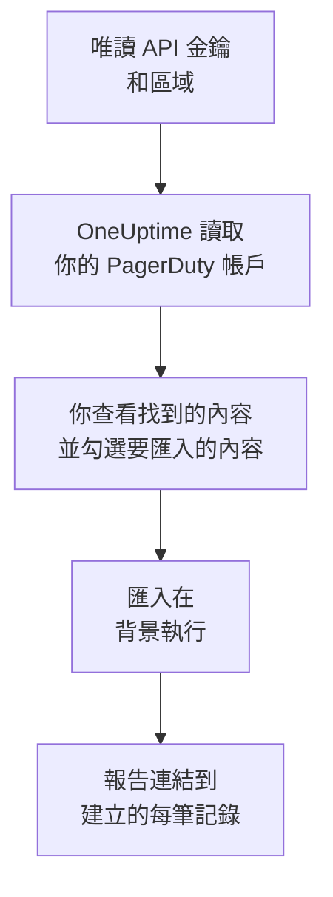

# 從 PagerDuty 移轉

**從其他工具匯入** 只需幾分鐘就能把你的 PagerDuty 設定搬到 OneUptime。使用一把唯讀的 PagerDuty API 金鑰，OneUptime 會讀取你的使用者、團隊、排程、上報策略和服務，顯示找到的內容，並建立你勾選的內容。PagerDuty 中的任何內容都不會變更。

:::cards
- [匯入你的帳戶](#匯入你的-pagerduty-帳戶): 建立金鑰、讀取你的帳戶，並勾選要匯入的內容。
- [會匯入什麼](#會匯入什麼): 每筆 PagerDuty 記錄在 OneUptime 中會變成什麼。
- [完成移轉](#完成移轉): 匯入完成後要做的事。
:::

## 運作方式

- **金鑰只使用一次。** OneUptime 讀取你的帳戶期間，金鑰會加密保存；讀取一結束，無論成功與否，金鑰都會立即刪除。它不會再次顯示，也不會寫入任何記錄檔。
- **OneUptime 只讀取。** 它只呼叫 PagerDuty 自己的 REST API：`api.pagerduty.com`，歐洲帳戶則是 `api.eu.pagerduty.com`。當 PagerDuty 要求放慢速度時，它會等待後再試。
- **在你開始匯入之前，不會建立任何內容。** 預覽會為每一項顯示：它是新的、已在 OneUptime 中（並按原樣使用）、已由先前的匯入帶入，或者無法匯入的原因。
- **再次執行絕不會重複建立。** OneUptime 會依 PagerDuty ID 記住每次匯入帶入的內容。在 PagerDuty 中新增人員或排程後再次執行，只會建立新的內容。

## 開始之前

- **一個 OneUptime 專案，以及建立所匯入內容的權限。** 專案擁有者和專案管理員可以匯入所有內容。其他角色也可以執行匯入，並匯入他們有權建立的記錄類型。其餘內容會顯示為不匯入，並附上原因。
- **一把唯讀的 PagerDuty REST API 金鑰。** PagerDuty 的管理員和帳戶擁有者可以建立。匯入絕不會寫入 PagerDuty，因此金鑰只需要讀取權限。
- **你的 PagerDuty 區域。** 如果你登入的網址以 `eu.pagerduty.com` 結尾，你的帳戶在歐洲；否則在美國。

## 匯入你的 PagerDuty 帳戶

:::steps
### 在 PagerDuty 中建立 API 金鑰
在 PagerDuty 中依序開啟 **Integrations** > **Developer Tools** > **API Access Keys**，然後選擇 **Create New API Key**。將描述填寫為 `OneUptime import`，勾選 **Read-only API Key**，選擇 **Create Key**，然後複製金鑰。

### 開啟匯入頁面
在 OneUptime 中依序開啟 **專案設定** > **從其他工具匯入**，然後選擇 **PagerDuty**。

### 連線 PagerDuty
在 **你的 PagerDuty 帳戶在哪裡？** 下選擇 **美國** 或 **歐洲**。將金鑰貼到 **PagerDuty API 金鑰** 中，然後選擇 **讀取我的 PagerDuty 帳戶**。較大的帳戶需要幾分鐘，讀取期間你可以離開頁面。

### 勾選要匯入的內容
預覽依類型分區列出找到的內容。所有將被建立的內容一開始都已勾選，但在 PagerDuty 中關閉的服務，以及不在任何團隊、排程或上報策略中的人員除外。每一項下面，OneUptime 會說明哪些內容不會原樣匯入。當勾選的項目用到了你未勾選的內容時，它會提示，**一併勾選** 可以把它們勾選起來。

### 開始匯入
如果要邀請人員，請在 **將新成員邀請到** 中選擇他們加入的團隊。然後選擇 **開始匯入**。匯入在背景執行：你可以離開頁面，報告會在那裡等你。
:::

報告會統計已建立、已邀請和未匯入的數量，並列出每一項及其對應記錄的連結，失敗的排在最前面。先前的匯入列在同一頁面的 **先前的匯入** 下。

## 會匯入什麼

| PagerDuty 中 | OneUptime 中 | 方式 |
| --- | --- | --- |
| 使用者 | 專案成員 | 依電子郵件地址比對。尚未加入專案的人會被邀請加入你選擇的團隊。 |
| 團隊 | 團隊 | 連同成員一起建立。專案中已有同名團隊時按原樣使用，其成員保持不變。 |
| 排程 | 待命排程 | 每個層都會成為一個層，人員、開始時間、輪次長度和限制保持不變，使用排程的時區，並歸排程所屬團隊擁有。層保持原有順序，因此上層仍然優先於下面的層。 |
| 上報策略 | 待命策略 | 每條上報規則都會成為一條上報規則，呼叫相同的排程和使用者，並在相同的延遲後上報。策略的重複次數成為待命策略的重複次數。 |
| 服務 | 服務 | 在服務目錄中建立，歸其團隊擁有。在 PagerDuty 中關閉的服務一開始不勾選。 |

PagerDuty 的排程仍然是一個 OneUptime 排程：它的各層之間的優先關係與 PagerDuty 相同。輪次長度不是整小時的層，匯入時輪次會取整到小時，預覽會說明這一點。

## 不會匯入什麼

- **事件、警示及其歷史。** OneUptime 從你的設定開始，而不是從過去的事件開始。
- **整合、Event Orchestrations、Incident Workflows 和狀態頁面。** 請改為將你的監測器和警示來源指向 OneUptime，請見 [完成移轉](#完成移轉)。
- **排程的覆寫，以及已經結束的層。** 匯入後，在 OneUptime 中新增你仍然需要的覆寫。
- **以班次為基礎的排程。** 匯入讀取的是 PagerDuty 分層的排程，而不是較新的以班次為基礎的排程（shift-based schedules）。如果你的帳戶有這類排程，預覽頂端會說明，呼叫其中某個排程的上報規則匯入時不含該排程。請在 OneUptime 中建立它們。
- **每個人的通知規則。** 每個人在接受邀請後，在自己的 **使用者設定** 中選擇被呼叫的方式。
- **OneUptime 中沒有完全對應項目的規則。** 以輪流方式（round robin）分派人員的上報規則，在 OneUptime 中會同時呼叫所有人，預覽會說明有哪些變化。

## 限制

一次匯入最多建立 2,000 筆記錄：最多 500 人、200 個團隊、200 個待命排程、200 個待命策略和 500 個服務。超出限制的內容會顯示為不匯入。再次執行匯入即可帶入其餘部分。

在 OneUptime Cloud 上，你的方案不包含的記錄會顯示為不匯入，並註明所需的方案。

預覽保留一天。只有讀取帳戶的人才能勾選內容並開始匯入。專案擁有者和專案管理員可以看到每次匯入的進度和報告。

## 完成移轉

:::steps
### 檢查待命排程
在 **待命** > **待命排程** 中開啟每個排程，檢查現在是誰待命、接下來是誰。

### 確保每個人都能被呼叫
被邀請的人接受邀請後，新增用來接收呼叫的電話號碼、電子郵件地址或行動應用程式。**待命** > **就緒狀態** 會顯示哪些人還聯絡不上。

### 將警示傳送到 OneUptime
將你的監測器和發出警示的工具指向 OneUptime，並呼叫自己一次進行測試。

### 在 PagerDuty 中關閉呼叫
當 OneUptime 能呼叫到正確的人後，請在 PagerDuty 中關閉通知，以免有人被重複呼叫。
:::

## 疑難排解

:::details PagerDuty 不接受 API 金鑰
請檢查你是否複製了完整的金鑰、它是否是 **API Access Keys** 中的 REST API 金鑰而不是整合金鑰，以及你是否選擇了帳戶所在的區域。然後選擇 **再試一次**。
:::

:::details 預覽中缺少某類記錄
金鑰無法讀取該類記錄，預覽頂端會說明這一點。有些類型只在包含它們的 PagerDuty 方案中提供，例如團隊。請用能讀取它們的金鑰重新讀取帳戶。
:::

:::details 有些項目無法勾選
每一項都會說明原因：專案中已有的名稱、先前的匯入已帶入的內容，或者你無權建立、或你的方案不包含的記錄。
:::

## 後續步驟

:::cards
- [待命排程](/docs/on-call/schedules): 層、限制和交接。
- [上報規則](/docs/on-call/escalation-rules): 待命策略如何呼叫人員。
- [從 Opsgenie 移轉](/docs/moving-to-oneuptime/opsgenie): 從 Opsgenie 移轉團隊。
:::
