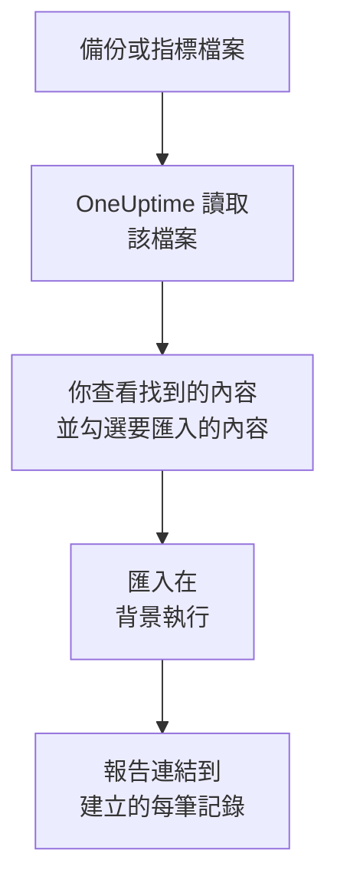

# 從 Uptime Kuma 移轉

Uptime Kuma 執行在你自己的機器上，因此 **從其他工具匯入** 透過檔案而不是金鑰來讀取它：Uptime Kuma 1 匯出的備份，或任何版本都提供的指標頁面。OneUptime 從中讀取你的監測器，顯示找到的內容，並建立你勾選的內容。Uptime Kuma 中的任何內容都不會變更。

:::cards
- [匯入你的監測器](#匯入你的-uptime-kuma-監測器): 儲存檔案，讀取它，並勾選要匯入的內容。
- [會匯入什麼](#會匯入什麼): 每個 Uptime Kuma 監測器在 OneUptime 中會變成什麼。
- [完成移轉](#完成移轉): 匯入完成後要做的事。
:::

## 運作方式

- **檔案只讀取一次。** OneUptime 在上傳時讀取檔案以找出你的監測器，從不儲存檔案。檔案中的密碼、權杖和推送金鑰絕不會被複製。
- **OneUptime 從不連線到 Uptime Kuma。** 所有內容都來自檔案。既不是 Uptime Kuma 備份也不是其指標頁面的檔案會被拒絕，並說明原因。
- **在你開始匯入之前，不會建立任何內容。** 預覽會為每一項顯示：它是新的、已在 OneUptime 中（並依原樣使用）、已由先前的匯入帶入，或者無法匯入的原因。
- **再次執行絕不會重複建立。** OneUptime 會依 Uptime Kuma ID 記住每次匯入帶入的內容。新增監測器後讀取較新的檔案，只會建立新的內容。

## 開始之前

- **一個 OneUptime 專案，以及建立所匯入內容的權限。** 專案擁有者和專案管理員可以匯入所有內容。其他角色也可以執行匯入，並匯入他們有權建立的記錄類型。其餘內容會顯示為不匯入，並附上原因。
- **一個來自 Uptime Kuma 的檔案。** 在 Uptime Kuma 1 中，JSON 備份包含每個監測器及其設定。Uptime Kuma 2 沒有備份，因此請改為儲存它的指標頁面：其中列出每個監測器的名稱、類型和位址，但不包含檢查頻率或檢查內容。
- **付款方式（OneUptime Cloud）。** 執行檢查的監測器即使在 Free 方案中也會依用量計費，因此請在匯入前於 **專案設定** > **帳單** 中新增付款方式。沒有付款方式時，這些監測器會顯示為不匯入。

## 匯入你的 Uptime Kuma 監測器

:::steps
### 在 Uptime Kuma 中儲存檔案
在 Uptime Kuma 1 中，依序進入 **Settings** > **Backup**，然後選擇 **Export**。在 Uptime Kuma 2 中，在 **Settings** > **API Keys** 下新增一個金鑰，開啟你的 Uptime Kuma 的 `/metrics`，使用者名稱留空、以該金鑰作為密碼登入，然後將頁面另存為文字檔。

### 開啟匯入頁面
在 OneUptime 中，前往 **專案設定** > **從其他工具匯入**，然後選擇 **Uptime Kuma**。

### 讀取檔案
在 **Uptime Kuma 備份或指標檔案** 下選擇 **選擇檔案**，選取你儲存的檔案，然後選擇 **讀取檔案**。OneUptime 會立即讀取並顯示找到的內容。

### 勾選要匯入的內容
預覽依類型分節列出找到的內容。所有將被建立的內容一開始都已勾選，但在 Uptime Kuma 中已暫停的監測器除外；勾選它們後會以暫停狀態匯入。每一項下方，OneUptime 會說明哪些內容不會原樣匯入。

### 開始匯入
選擇 **開始匯入**。匯入在背景執行：你可以離開頁面，報告會在那裡等你。
:::

報告會統計已建立和未匯入的數量，並列出每一項及其對應記錄的連結，失敗的排在最前面。先前的匯入列在同一頁面的 **先前的匯入** 下。

## 會匯入什麼

| 在 Uptime Kuma 中 | 在 OneUptime 中 | 方式 |
| --- | --- | --- |
| Monitors | 監測器 | 從備份匯入時，每個監測器都會變成同類型的監測器，位址、間隔、逾時以及視為正常的狀態碼都相同。從指標頁面匯入時，每個監測器都以每五分鐘檢查一次的設定匯入：請在匯入後逐一檢查。 |

- **HTTP(S) 和關鍵字監測器** 會變成網站監測器；如果它們傳送其他方法、標頭或 JSON 本文，則變成 API 監測器，關鍵字也會依原樣設定。
- **JSON 查詢監測器** 會變成不含查詢的 API 監測器：請在 OneUptime 中將查詢新增為條件。
- **Ping、連接埠和 DNS 監測器** 會變成 Ping、連接埠和 DNS 監測器。
- **推送監測器** 會變成傳入請求監測器，在間隔及其重試期間內沒有收到請求時判定為故障。每個監測器在 OneUptime 中都有新位址。
- **手動監測器** 仍然是手動監測器。**群組** 是資料夾，因此其中的監測器會分別匯入。
- **憑證到期。** 在憑證到期前發出警告的監測器，還會獲得一個以它命名的 SSL 憑證監測器。

每個監測器都由專案的探測器檢查，和你自己建立的監測器一樣。OneUptime 未提供的檢查間隔會改為最接近的可用間隔，超過一分鐘的逾時會改為一分鐘。任一項有變化時，預覽都會說明。

## 不會匯入什麼

- **可用性歷史、回應時間和事件。** OneUptime 從匯入完成時開始檢查。
- **通知。** 請依 [完成移轉](#完成移轉) 中的說明，在 OneUptime 中選擇通知誰。
- **密碼，以及可能含有機密資訊的標頭。** 需要登入的監測器，或傳送 `Authorization`、Cookie 或權杖標頭的監測器，會去掉這些內容後匯入：請用 [監測器密鑰](/docs/monitor/monitor-secrets) 新增。
- **反轉（upside down）監測器**，即檢查失敗時視為正常的監測器。OneUptime 沒有這樣運作的監測器。
- **Docker、資料庫、遊戲伺服器、MQTT 以及 OneUptime 中沒有對應項目的其他監測器。** 預覽會逐一列出。
- **狀態頁面和維護。** 請在 OneUptime 中建立你需要的狀態頁面，並在其中顯示匯入的監測器。

## 限制

一次匯入最多建立 2,000 筆記錄，其中最多 1,000 個監測器。檔案最大為 10 MB。超出限制的內容會顯示為不匯入。再次執行匯入即可帶入其餘部分。

在 OneUptime Cloud 上，執行檢查的監測器需要付款方式，方案沒有空間容納的內容會顯示為不匯入，並註明所需條件。

預覽保留一天。只有讀取檔案的人才能勾選內容並開始匯入。專案擁有者和專案管理員可以看到每次匯入的進度和報告。

## 完成移轉

:::steps
### 檢查你的監測器
在 **監測器** 下開啟每個監測器，檢查它的首批結果。心跳監測器有一個新位址：請讓呼叫它的工作改為指向該位址。

### 選擇通知誰
為監測器新增擁有者，或為它們建立的事件設定 **待命** > **待命策略** 中的待命策略，這樣發生故障時會通知到合適的人。

### 在 Uptime Kuma 中關閉檢查
當 OneUptime 檢查相同的內容後，請在 Uptime Kuma 中暫停這些檢查，以免有人收到重複通知。
:::

## 疑難排解

:::details 檔案被拒絕
OneUptime 會說明原因：檔案超過 10 MB、不是有效的 JSON，或者既不是 Uptime Kuma 備份也不是其指標頁面。請重新匯出備份，或將 `/metrics` 重新儲存為純文字，然後再次選擇。
:::

:::details 某個監測器顯示為不匯入
它會說明原因：OneUptime 沒有的監測器類型、OneUptime 無法讀取的位址，或者專案沒有空間或沒有付款方式來容納它。如果 OneUptime 已經在執行名稱、類型和位址都相同的監測器，會直接使用該監測器。
:::

:::details 有些項目無法勾選
每一項都會說明原因：專案中已有的名稱、先前的匯入已帶入的內容，或者你無權建立、或你的方案不包含的記錄。
:::

## 後續步驟

:::cards
- [網站監控](/docs/monitor/website-monitor): 網站監測器檢查什麼，以及如何檢查。
- [傳入請求監控](/docs/monitor/incoming-request-monitor): 心跳在 OneUptime 中如何運作。
- [從 UptimeRobot 移轉](/docs/moving-to-oneuptime/uptimerobot): 從 UptimeRobot 移轉你的檢查。
:::
