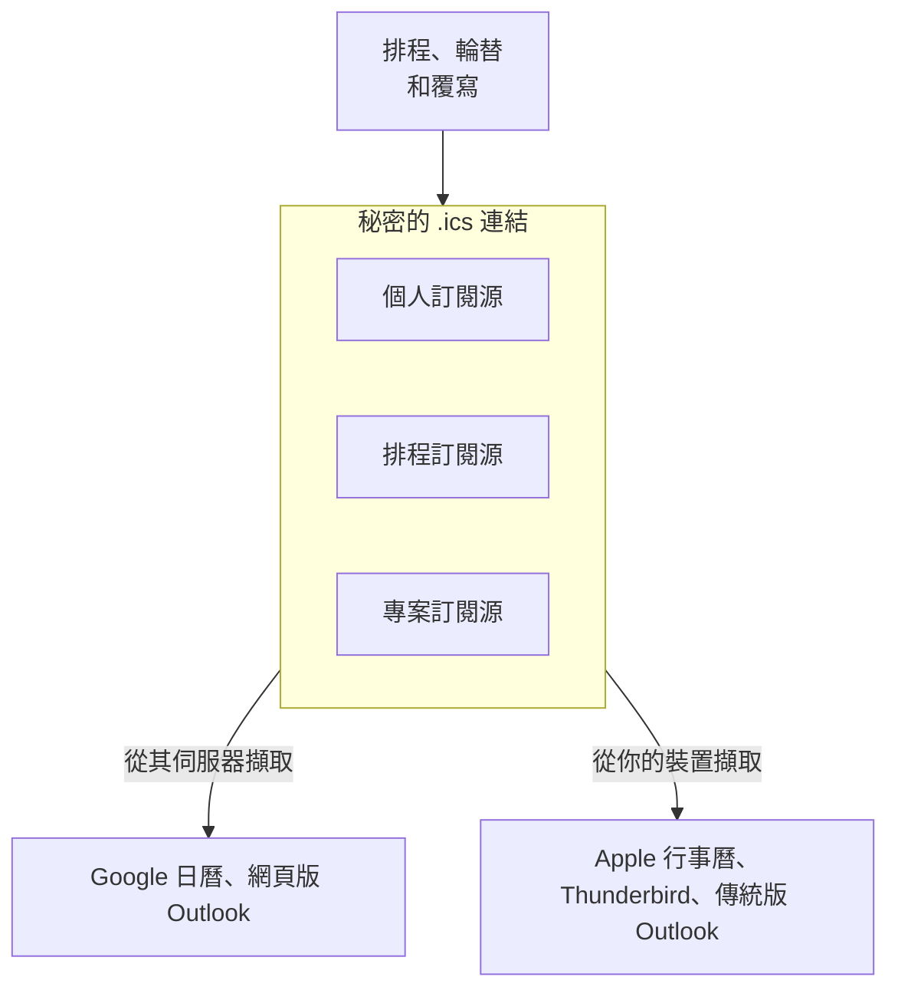

# 行事曆訂閱源

行事曆訂閱源會把你的待命班次放進你平常查看的行事曆。OneUptime 會為每個人、每個排程和每個專案發布一個秘密的 iCalendar（`.ics`）連結；Google 日曆、Outlook、Apple 行事曆、Thunderbird，以及任何能以 URL 訂閱行事曆的應用程式，都會定期擷取這個連結，並為每個班次顯示一個活動。不需要安裝任何東西，也不需要連結任何帳戶：連結就是整個整合。



> [!NOTE]
> 訂閱的行事曆是用來 **規劃** 的。行事曆應用程式會依自己的節奏重新擷取訂閱源——Google 日曆每 8 到 24 小時才擷取一次——因此班次開始前一小時做的調換，會透過 OneUptime 自己的提醒、重新指派通知和呼叫傳達給你，而不是透過行事曆。

## 你會得到什麼

- 每個班次一個活動。在個人訂閱源中標題為 `On-call · <Schedule>` （當排程正好關聯一個上報策略時，會加上 ` · <Policy>` ），在共用訂閱源中為 `<Name> · On-call · <Schedule>` 。描述中會列出誰在待命、排程及其時區、所在層、以排程時區、UTC 和你的時區表示的班次時間、透過此排程呼叫你的上報策略，以及儀表板中該排程的連結。
- 會遵循覆寫。有人幫你代班時，活動會轉給對方（加上 `(covering for <Name>)` ），並在你的行事曆應用程式中維持為同一個活動，因此會就地更新而不是重複出現。部分覆寫會把班次拆成首尾相接的幾個活動。
- 預設包含過去兩天和未來 90 天。你可以擴大到過去 60 天和未來 180 天；超過 5,000 個活動的訂閱源會被縮短，並在行事曆描述中說明。
- 活動標記為空閒（ `TRANSP:TRANSPARENT` ），因此訂閱源永遠不會占用你的空閒狀態；也沒有任何內容標記為私人，因此共用的團隊行事曆會向所有能看到它的人顯示標題。
- 時間以 UTC 傳送，由你的行事曆應用程式轉換；描述中會寫出排程時區和你的時區下的時鐘時間。在你的 **個人資料** （儀表板右上角的大頭貼）中將你自己的時區設為 **時區** ，排程的時區則在其 **層** 頁面的 **Schedule timezone** 卡片中設定。沒有時區的排程會依伺服器時區展開，與呼叫一致，活動中會說明這一點。

固定指派——在上報策略規則中直接指定的使用者或團隊——沒有開始和結束時間，不會出現在任何訂閱源中。在 OneUptime Cloud 上，訂閱源與待命排程使用相同的方案（Growth）；低於該方案的專案會得到一個空的行事曆，而不是錯誤。

## 三種連結

| 連結 | 誰建立 | 包含什麼 | 位置 |
| --- | --- | --- | --- |
| **個人訂閱源** | 每個使用者，每個專案一個 | 你在該專案所有排程中的班次，以及你幫別人代的班次（選填） | **使用者設定** > **行事曆** > **行事曆訂閱** |
| **排程訂閱源** | 能編輯該排程的人；能讀取的人可以複製連結 | 一個排程中所有人的班次，可選擇包含涵蓋空檔活動 | 排程頁面上的 **訂閱此排班** 卡片 |
| **專案訂閱源** | 能編輯待命排程的人；能讀取的人可以複製連結 | 專案中所有排程裡所有人的班次，可選擇包含涵蓋空檔活動 | **待命** > **行事曆訂閱** |

連結的形式如下：

```text
https://<your host>/api/on-call-calendar/user/<token>/shifts.ics
https://<your host>/api/on-call-calendar/schedule/<token>/schedule.ics
https://<your host>/api/on-call-calendar/project/<token>/project.ics
```

> [!WARNING]
> 路徑中 43 個字元的權杖是唯一的憑證——不涉及登入、Cookie 或 API 金鑰。請像對待密碼一樣對待這些連結。

## 你的個人訂閱源

個人訂閱源依專案區分：第二個專案會有第二個連結和第二個行事曆。

:::steps
### 開啟你的行事曆訂閱

在你想查看其班次的專案中開啟 **使用者設定** > **行事曆** > **行事曆訂閱** 。 **行事曆** 是側邊選單中的一個區段，一開始為收合狀態。

### 產生連結

點選 **產生行事曆連結** 。 **訂閱您的值班班次** 卡片現在提供單一的訂閱流程：

- **新增至您的行事曆**： **Google 日曆** 會開啟 Google 日曆，並詢問是否新增該行事曆。 **Apple 行事曆 / Outlook** 會在你的電腦或手機用來訂閱的應用程式中開啟連結的 `webcal://` 形式：Mac、iPhone 或 iPad 上是 Apple 行事曆，Windows 上是 Outlook。
- **或複製連結**： **複製連結** 會複製 `https://` 連結，供任何其他能以 URL 訂閱行事曆的應用程式使用。在你點選顯示之前，連結在頁面上是隱藏的。

### 訂閱連結

依照下方「在行事曆應用程式中訂閱」裡你所用應用程式的步驟操作。應用程式下次擷取連結時，你的班次就會顯示為活動：請參閱「行事曆多久重新整理一次」。
:::

### 訂閱源設定

在 **行事曆訂閱設定** 卡片上點選 **編輯設定** ，即可變更連結包含的內容：

| 設定 | 作用 |
| --- | --- |
| **包含我為他人代班的班次** | 預設開啟。加入你因覆寫而在本不屬於的排程中取得的班次。 |
| **過去班次天數** | 行事曆往回涵蓋的範圍（預設 2，最多 60）。 |
| **往後天數** | 行事曆往後涵蓋的範圍（預設 90，介於 7 和 180 之間）。 |

狀態列會顯示連結最後一次被擷取的時間、由哪個行事曆應用程式擷取、擷取了幾次，以及權杖的最後四個字元，方便區分不同的連結。如果兩天後仍沒有任何應用程式擷取過連結，頁面會詢問伺服器能否從網際網路存取（請參閱「疑難排解」）。

### 管理連結

| 動作 | 結果 |
| --- | --- |
| **重新產生連結** | 產生新權杖。所有訂閱舊連結的應用程式都不再更新：在 30 天內舊連結會提供空的行事曆，讓這些應用程式清空副本，之後回傳 404。請用新連結重新訂閱。 |
| **停用** | 保留連結，但在你重新啟用之前提供空的行事曆。 |
| **刪除** | 刪除連結。仍在擷取它的應用程式會收到 404，並繼續顯示最後一次擷取的內容——如果希望它們清空，請先停用。 |

### 即將到來的班次與代班

頁面還會列出你的 **Upcoming shifts** （未來 30 天）以及下文介紹的 **班次前提醒我** 卡片。你自己的每個班次都有一個 **找人代班** 連結：它會在班次所屬專案中開啟使用者覆寫，並為該班次預先填好一筆新覆寫，你作為 **誰不在崗？** ，班次時間作為 **開始** 和 **結束** （如果班次已開始，則從現在開始），因此只需填寫 **誰代班？** 。覆寫會在這段時間內把你來自所有待命策略的呼叫都送給代班的人；只存在於某個策略內部的班次，則改在該策略的使用者覆寫頁面上安排代班。你幫別人代的班次沒有 **找人代班** ：覆寫不會串連，所以代班再找人代班不會改變任何事。

同一個個人連結用 `?schedule=<id>` 篩選到某個排程後，會以 **僅此排班中我的班次** 的形式出現在每個排程的頁面上；待命橫幅和 **我的待命策略** 頁面也有一個指向上述頁面的 **將您的班次加入行事曆** 連結。

### 在行動應用程式中

在行動應用程式中： **On-Call** > **Add shifts to my calendar** （也在 **Settings** > **Calendar feed** 下），每個專案一個連結。在 iPhone 上， **Open in Calendar** 會開啟系統的訂閱畫面。Android 上無法在手機端訂閱 URL，因此該畫面提供 **Share link** 和 **Copy https link** ，並提示你在電腦上新增連結，之後它會同步到手機。應用程式的 **Your shifts** 清單來自相同的資料，也有相同的 **Get cover** 動作。

## 在行事曆應用程式中訂閱

如果你的應用程式有對應按鈕，請在 OneUptime 中使用 **Google 日曆** 或 **Apple 行事曆 / Outlook** ；其他應用程式則使用 **複製連結** 取得的 `https://` 連結。下文「https 和 webcal 連結」說明了這兩種形式。

:::tabs
@tab Google 日曆
1. 在 OneUptime 中點選 **Google 日曆** 。Google 日曆會開啟並詢問是否新增該行事曆；點選 **新增** 。
2. 或者，在網頁版 Google 日曆中，點選 **其他日曆** 旁邊的 **+** > **透過網址新增** ，貼上連結（OneUptime 中的 **複製連結** ），然後點選 **新增日曆** 。

**Google 日曆** 按鈕會開啟 Google 的透過網址新增頁面，即 `https://calendar.google.com/calendar/r?cid=` 後接經過百分比編碼的連結 `webcal://` 形式。該頁面只接受 `webcal://` 形式：如果放入 `https://` 形式，Google 會回覆 "Unable to add calendar. Check the URL."。 **透過網址新增** 兩種形式都接受。

Google **從 Google 的伺服器** 擷取訂閱源，因此 OneUptime 伺服器必須能從網際網路存取——OneUptime Cloud 一律可以；自行託管的安裝請參閱「疑難排解」。首次擷取通常在訂閱後幾分鐘內完成；之後 Google 大約每 8 到 24 小時重新整理一次，有時更久。訂閱的行事曆沒有重新整理按鈕，Google 也會忽略訂閱源中的重新整理提示。Google 讀取連結後，訂閱源頁面的狀態列會顯示 **上次擷取 …，來自 Google Calendar** 。

行事曆的名稱和時區 **只在首次訂閱時** 讀取：之後重新命名排程不會重新命名 Google 中的行事曆——如果名稱很重要，請刪除後重新新增。Google 會捨棄行事曆檔案中的提醒，因此請在 Google 的設定中為該行事曆設定預設通知，或者更好的做法是使用 OneUptime 自己的提醒。Google 會記住它無法讀取的位址：解決阻擋它的問題後，在連結結尾加上 `?nocache=1` 重新新增（OneUptime 會忽略未知的查詢參數，因此訂閱源本身不變），或者重新產生連結。Android 和 iOS 上的 Google 日曆應用程式無法以 URL 訂閱；請在電腦上新增連結，它會出現在手機上。
@tab 網頁版 Outlook
1. 開啟 **行事曆** > **新增行事曆** > **從網路訂閱** 。
2. 貼上 `https://` 連結（OneUptime 中的 **複製連結** ），為行事曆命名，然後點選 **匯入** 。

在 Outlook.com、公司或學校帳戶的網頁版 Outlook、新版 Windows 版 Outlook 和 Mac 版 Outlook 中操作都相同。Outlook **從 Microsoft 的伺服器** 擷取：Outlook.com 大約每 3 小時一次，公司和學校帳戶每 4 到 6 小時一次，有時超過一天。間隔固定，無法手動重新整理。

如果你也想在手機和網頁版 Outlook 中看到該行事曆，請在這裡訂閱，而不是在桌面應用程式中訂閱——在傳統版 Windows 版 Outlook 中建立的訂閱只會留在那台電腦上。
@tab 傳統版 Windows 版 Outlook
1. 在已安裝 Outlook 的電腦上，點選 OneUptime 中的 **Apple 行事曆 / Outlook** 。Windows 會把 `webcal://` 連結交給 Outlook，Outlook 會詢問是否新增該網際網路行事曆。沒有 Outlook 時，Windows 沒有 `webcal` 處理常式。
2. 或者，在 Outlook 中開啟 **檔案** > **帳戶設定** > **帳戶設定** > **網際網路行事曆** > **新增** ，貼上連結（OneUptime 中的 **複製連結** ），然後點選 **新增** 。

**不要** 在傳統版 Outlook 中直接開啟 `https://…/shifts.ics` 連結本身：那會匯入一份永遠不會更新的一次性快照。開啟 `webcal://` 連結，或在 **網際網路行事曆** 下新增位址，才會建立訂閱。

訂閱源會在 **傳送/接收** 時重新整理（F9，或傳送/接收群組中的間隔）。訂閱的設定中有一個 **更新限制** 核取方塊：勾選後，Outlook 重新整理的頻率不會高於發布者建議的間隔。OneUptime 建議一小時（ `X-PUBLISHED-TTL:PT1H` ），因此訂閱源大約每小時重新整理一次。沒有該提示的訂閱源在勾選此方塊時永遠不會重新整理；OneUptime 的訂閱源帶有提示，所以你可以保持勾選。傳統版 Outlook **從你的電腦** 擷取訂閱源，並驗證伺服器憑證。
@tab Apple 行事曆（macOS）
1. 在 OneUptime 中點選 **Apple 行事曆 / Outlook** ，或在行事曆中選擇 **檔案** > **新增行事曆訂閱** 並貼上連結。
2. 在訂閱面板中設定 **自動重新整理** ——每 5 分鐘、15 分鐘、每小時、每天或每週（預設每小時）——並在 **位置** 下選擇 **iCloud** ，這樣行事曆也會出現在你的 iPhone 和 iPad 上，並依該頻率持續重新整理。

macOS **從你的 Mac** 擷取訂閱源，因此只要 Mac 能存取，私人網路上的安裝也能使用。自我簽署的憑證或內部 CA 憑證必須先在 macOS 鑰匙圈中設為信任。該面板中 **移除提醒** 預設為勾選；這裡沒有影響，因為訂閱源不包含任何鬧鐘。
@tab iPhone 和 iPad
若要在裝置上訂閱，請在 OneUptime 行動應用程式中點一下 **Open in Calendar** ，或前往 **設定** > **行事曆** > **帳號** > **加入帳號** > **其他** > **加入已訂閱的行事曆** 並貼上連結。

在裝置本身建立的訂閱會依 **設定** > **行事曆** > **帳號** > **取得新資料** 重新整理——預設為 **自動** ，主要在連接 Wi-Fi 充電時擷取。若要可靠地重新整理，請在 Mac 上以 **iCloud** 為位置訂閱，或將 **取得新資料** 設為固定間隔。
@tab Thunderbird
選擇 **檔案** > **新增** > **行事曆** > **網路上** > **iCalendar (ICS)** ，貼上 `https://` 連結，然後在行事曆內容中選擇重新整理間隔：1、5、15、30 或 60 分鐘。Thunderbird **從你的電腦** 擷取，並且必須信任伺服器的憑證。
@tab Android
Google 日曆應用程式和三星行事曆都無法訂閱 URL。請在電腦上將 `https://` 連結新增到 Google 日曆（ **其他日曆** > **+** > **透過網址新增** ）；之後該行事曆會隨該 Google 帳戶中的其他內容一起同步到手機。Android 版 OneUptime 行動應用程式正是為此提供了 **Share link** 和 **Copy https link** 。
@tab 其他服務
Fastmail 大約每小時重新整理一次， **連續五次擷取失敗後會停用訂閱** ；如果發生這種情況，請在伺服器恢復正常後重新新增。Proton Calendar 每 4 到 16 小時重新整理一次，並會拒絕非常大的訂閱源——如果它回報錯誤，請調低 **往後天數** 。Confluence Team Calendars 接受排程訂閱源；會遵守其行事曆名稱 28 個字元的限制。
:::

## 行事曆多久重新整理一次

| 行事曆應用程式 | 一般重新整理間隔 | 擷取來源 | 說明 |
| --- | --- | --- | --- |
| Google 日曆（透過網址新增） | 8–24 小時，有時更久 | Google 的伺服器 | 無法手動重新整理；忽略重新整理提示；名稱和時區只在首次訂閱時讀取 |
| Outlook.com | 約 3 小時 | Microsoft 的伺服器 | 固定；可能超過 24 小時 |
| 網頁版 Outlook（公司、學校） | 約 4–6 小時 | Microsoft 的伺服器 | 固定；使用者無法調整 |
| 傳統版 Windows 版 Outlook | 傳送/接收時；開啟 **更新限制** 後約每小時 | 你的電腦 | 透過 `webcal` 連結訂閱；不會同步到手機或網頁 |
| Apple 行事曆（macOS） | 5 分鐘到每週，預設每小時 | 你的 Mac | 儲存在 iCloud 中才能同步到 iPhone 和 iPad |
| Apple 行事曆（僅 iOS） | 依 **取得新資料** ，受電量影響 | 你的手機 | 為了可靠，請在 Mac 上訂閱 |
| Thunderbird | 1–60 分鐘 | 你的電腦 | |
| Fastmail | 約每小時 | Fastmail 的伺服器 | 五次擷取失敗後停用 |
| Proton Calendar | 4–16 小時 | Proton 的伺服器 | 拒絕大型訂閱源 |

OneUptime 本身提供的是最新資料：對層、輪替、覆寫或策略關聯的修改會立即讓訂閱源失效，回應最多快取五分鐘。你看到的延遲來自行事曆應用程式，而不是伺服器。OneUptime 透過 `REFRESH-INTERVAL` 和 `X-PUBLISHED-TTL` 建議每小時重新整理；只有傳統版 Outlook 會採用該提示，而且只在開啟 **更新限制** 時——Apple 行事曆、Thunderbird 等會依你為每個行事曆設定的間隔重新整理。

## https 和 webcal 連結

兩者指向同一個訂閱源。 `webcal://` 只是把連結的協定名稱換掉，讓作業系統開啟行事曆應用程式而不是瀏覽器；接著，當伺服器提供 https 時，應用程式會透過 `https://` 擷取訂閱源，Apple 行事曆和 Google 日曆都是如此。

- **複製連結** 會提供 `https://` 形式。Google 日曆的 **透過網址新增** 、網頁版 Outlook、Thunderbird 和 Fastmail 都接受它。
- **Apple 行事曆 / Outlook** 會開啟 `webcal://` 形式：Apple 行事曆和傳統版 Windows 版 Outlook 用它訂閱。在傳統版 Outlook 中改為開啟 `https://` 形式則是一次性匯入。
- **Google 日曆** 會把 `webcal://` 形式放進 Google 的透過網址新增連結中，這是該頁面唯一接受的形式。
- OneUptime 不再提供 `webcals://` ：iOS 無法開啟它（「位址無效」），Google 也不接受。你已經用 `webcals://` 連結訂閱的行事曆會繼續有效。
- 如果你的安裝仍在一般 `http` 上執行，訂閱源會以明文傳輸（包括權杖），儀表板也會在連結旁顯示警告；在廣泛分享連結之前，請切換到 `https` 。

訂閱源 URL 從不重新導向。無論以哪種協定到達 OneUptime，它們都回傳 `200` ，因為當 TLS 在其前方終止時——在 OneUptime Cloud 上，或在你自己的負載平衡器或 CDN 之後——應用程式無法判斷行事曆應用程式使用了哪種協定，在那裡重新導向會指回同一個 URL。請在終止 TLS 的代理伺服器上把一般 `http` 轉到 `https` ，那是唯一知道協定的一個躍點。

## 提醒與重新指派通知

行事曆應用程式不會傳遞訂閱源中的鬧鐘——Google 會捨棄，Apple 預設會移除，Outlook 會將其簡化——因此 OneUptime 會傳送自己的提醒。

:::steps
1. 開啟 **使用者設定** > **行事曆** > **行事曆訂閱** 。
2. 在 **班次前提醒我** 卡片上選擇提前時間： **1 週** 、 **1 天** 、 **1 小時** 、 **15 分鐘** ，或用 **自訂** 設定 15 分鐘到 14 天之間的值。可以同時選擇多個。
3. 在 **使用者設定** > **通知設定** （待命分頁）的 **我的值班班次開始前** 下選擇提醒的送達方式。電子郵件和推播預設開啟。
:::

每則提醒每個班次只傳送一次。訊息會寫明排程、透過它呼叫的策略，以及以你的時區表示的開始時間。

- 因為覆寫設定得晚而落入你某個提前時間內的班次——例如有人在開始前 20 分鐘把班次交給你——會立即收到一則補發提醒。
- 如果你已收到提醒的班次被交給別人，你會收到 **我即將到來的值班班次被重新指派** ，這是單獨的事件類型，可以單獨設為靜音。
- 班次開始後不會再傳送提醒，也不會為沒有關聯任何上報策略的排程傳送提醒，因為這些排程無法呼叫任何人。
- 在 WhatsApp 上，提醒會透過 Meta 預先核准的待命範本送達，該範本會寫明排程和上報策略並連結到排程，但不包含開始時間，而且 WhatsApp 只以英文傳送它。重新指派通知沒有核准的 WhatsApp 範本，因此會改由你的其他管道送達。

## 排程或專案的共用連結

共用連結屬於 **專案** ，而不屬於複製它的人；它會顯示人員姓名，從不顯示電子郵件地址。把排程連結放進共用的團隊行事曆——Google、Outlook 或 Confluence——一個訂閱就能服務整個團隊。

### 排程訂閱源

在排程頁面上， **訂閱此排班** 卡片分為兩部分： **僅此排班中我的班次** （帶排程篩選的個人連結）和 **此排班中所有人的班次（團隊共用連結）** 。對排程擁有 **編輯** 權限的人可以使用 **發布共用連結** ，用 **重新產生連結** 更換連結，或用 **停用** 將其關閉；能讀取該排程的人可以複製它。卡片會顯示連結最後一次更換的時間。

### 專案訂閱源

**待命** > **行事曆訂閱** 中有 **此專案中所有人的班次（共用連結）** 卡片——一個涵蓋專案中所有排程的共用連結——提供相同的發布、重新產生和停用動作，以及指向你的個人訂閱源頁面的連結。

### 共用連結設定

在 **共用連結設定** 卡片上點選 **編輯設定** ：

| 設定 | 作用 |
| --- | --- |
| **顯示涵蓋空檔** | 預設關閉。在某層 _應當_ 涵蓋卻無人待命的地方加入 `No coverage · <Schedule>` 活動：空的層、開始日期在未來的層、無法銜接的層，或 24×7 排程中的任何空檔。上班時間排程的非上班時間永遠不會回報，並且最多產生 100 個空檔活動，從最早的開始。 |
| **顯示的最小空檔（分鐘）** | 預設 60。隱藏更短的空檔。 |
| **有人離開專案時重新產生** | 預設關閉。當有人離開其在專案中的最後一個團隊時自動重新產生連結，讓前同事的行事曆不再更新。之後其他所有人都必須重新訂閱，因此需要主動開啟。 |
| **過去班次天數** 、 **往後天數** | 與個人訂閱源相同。 |

當持有共用連結的人離開時，請更換該連結，或開啟上面的自動更換。

當某人離開其在專案中的最後一個團隊時，OneUptime 也會將其從該專案的排程層和上報規則中移除，刪除該專案中提到此人（作為被代班的人或代班人）的進行中和未來的覆寫，停用此人在該專案的個人訂閱源，並刪除其在那裡的提醒。個人連結只在其擁有者是專案成員期間顯示班次：每次擷取連結時都會檢查這一點，因此已離開的人會拿到空的行事曆，行動應用程式中即將到來的班次清單也只涵蓋其仍是成員的專案。

## 活動詳情

- 每個班次都有一個由排程和班次開始時間組成的固定識別碼，因此同一個班次在你的個人訂閱源、排程訂閱源中，以及重新產生連結之後，都是同一個活動。行事曆應用程式會就地更新它；發生變更時活動的序號會遞增。
- 取代整個班次的覆寫會保留活動並更換人員；只涵蓋班次一部分的覆寫會產生三個首尾相接的活動，例如 A 09:00–12:00、B 12:00–13:00、A 13:00–17:00。
- 當排程關聯了兩個以上的上報策略，而某個覆寫只適用於其中一個時，各策略呼叫的人不同。訂閱源會如實顯示而不是隱藏：班次保留為其他策略所呼叫之人的活動，並附上一則註明呼叫另一人的那個策略的說明，代班人則會多出一個標題為 `On-call · <Schedule> · <Policy> (covering for <Name>)` 的活動。
- 過去的班次在描述中帶有一行 "Past shifts reflect the current rotation, not who was actually paged"。
- 沒有關聯任何上報策略的排程仍會顯示，並註明它不會呼叫任何人。

## 用於規劃，而非稽核

訂閱源會依 **目前的設定** 顯示輪替，包括過去的日子：事後輸入的覆寫會改寫行事曆中的歷史。若要統計實際待命時數、進行公平性檢視和計算補償，請使用 **待命** > **報告** > **使用者待命時間** ，它是依據呼叫實際做過的事產生的。

## 安全性

- 連結中的權杖是唯一的憑證。任何拿到連結的人都能看到班次——姓名、排程、策略——直到連結被重新產生。不要把連結貼到聊天室或工單裡；團隊需要行事曆時，請分享排程或專案連結，而不是你的個人連結。
- 連結依專案區分。外洩的個人連結只會暴露一個專案的班次，而不是你所屬的所有專案。
- 重新產生連結會讓舊權杖進入 30 天的寬限期（空的行事曆，之後 404）。 **停用** 會提供空的行事曆。未知或過期的連結會回傳不帶任何提示的 404。空的行事曆會讓訂閱的應用程式清空副本；404 會讓它們保留副本，這就是停用和重新產生都提供空行事曆的原因。
- 權杖以雜湊形式儲存；設定頁面上顯示的副本以 `ENCRYPTION_SECRET` 加密。在自行託管的安裝中請把該變數設為真正的密鑰——如果它未設定，或仍是本存放庫附帶的預留值之一（ `secret` ，或 `config.example.env` 設定的 `please-change-this-to-random-value` ），伺服器會在啟動時發出警告。如果之後變更它，由於儲存的副本已無法讀取，頁面會提供 **重新產生連結** ；在你這麼做之前，訂閱源會繼續運作。
- 訂閱源回應標記為 `Cache-Control: private` ，會被排除在搜尋引擎之外（ `X-Robots-Tag: noindex` ），並依連結和用戶端位址限制速率。

OneUptime 內建的 Nginx 不會把訂閱源請求寫入記錄：

```nginx title="default.conf.template"
location ~ ^/api/on-call-calendar/(user|schedule|project)/ {
    access_log off;
    error_log /dev/null crit;
    proxy_max_temp_file_size 0;
    ...
}
```

因此權杖永遠不會與用戶端位址一起出現在記錄檔中；應用程式也從不記錄它。 `access_log off` 會去掉每個請求的記錄行， `error_log` 會去掉 Nginx 在上游擷取失敗時寫入的記錄行——沒有它，重新啟動期間每個擷取的用戶端的權杖都會被記錄——而 `proxy_max_temp_file_size 0` 可避免大型訂閱源被寫入暫存檔。

> [!WARNING]
> **你在 OneUptime 前方執行的任何代理伺服器、WAF 或 CDN 仍會在其存取記錄和錯誤記錄中記錄完整的 URI，** 除非你將其設定為不記錄——在推廣訂閱源之前請先檢查。

## 自行託管的設定

不需要開啟任何東西：訂閱源在每個安裝上都能使用。四個環境變數控制它們，在 Docker Compose 中設定在 `config.env` 裡，在 Helm 中設定在 values 的 `onCallCalendarFeed` 下（請參閱 chart 的 [設定參考](https://github.com/OneUptime/oneuptime/blob/master/HelmChart/Public/oneuptime/docs/configuration.md#on-call-calendar-feeds) ）：

| 變數 | Helm 值 | 預設值 | 效果 |
| --- | --- | --- | --- |
| `DISABLE_ON_CALL_CALENDAR_FEED` | `onCallCalendarFeed.disabled` | `false` | 緊急開關。每個訂閱源 URL 都回傳帶 `Retry-After: 3600` 的 `503` ；訂閱的應用程式會保留已有的副本並稍後重試。不會刪除任何內容。 |
| `ON_CALL_CALENDAR_FEED_RATE_LIMIT_WINDOW_SECONDS` | `onCallCalendarFeed.rateLimit.windowSeconds` | `60` | 速率限制時間窗的長度。 |
| `ON_CALL_CALENDAR_FEED_RATE_LIMIT_PER_TOKEN_PER_WINDOW` | `onCallCalendarFeed.rateLimit.perTokenPerWindow` | `60` | 每個時間窗內，一個連結從一個用戶端位址可被擷取的次數。 |
| `ON_CALL_CALENDAR_FEED_RATE_LIMIT_PER_IP_PER_WINDOW` | `onCallCalendarFeed.rateLimit.perIpPerWindow` | `3000` | 每個時間窗內，一個用戶端位址在所有連結上可擷取的次數——同一位址後整個辦公室的上限。 |

另外還需注意：

- **`HOST` 和 `HTTP_PROTOCOL`** 用於建構連結。如果 `HOST` 為空或為 `localhost` ，或 `HTTP_PROTOCOL` 為 `http` ，訂閱源頁面會顯示警告，連結在外部無法使用。如果 `HOST` 是私人位址—— `10.x` 、 `172.16–31.x` 、 `192.168.x` 、不含點的名稱（如容器名稱），或 `.internal` 、 `.local` 、 `.lan` 等網域下的名稱——頁面會提示 Google 日曆和網頁版 Outlook 無法存取該連結；同一網路中電腦上的應用程式仍可存取。
- **`TRUSTED_PROXY_HOPS`** 決定依位址限制速率時計算的是哪個位址。預設值 `1` 適用於標準的 Docker Compose 和 Helm 部署；你自己的每個會附加 `X-Forwarded-For` 的代理伺服器（CDN、WAF 或負載平衡器）都要加一，否則所有行事曆用戶端看起來都是同一個位址，共用一份額度。請參閱 chart 文件中的 [Trusted proxies](https://github.com/OneUptime/oneuptime/blob/master/HelmChart/Public/oneuptime/docs/configuration.md#trusted-proxies) 。
- **Redis** 支撐快取和速率限制器。兩者都能平穩降級：沒有 Redis 時訂閱源仍能產生，只是比較慢，速率限制器則會放行請求。
- 在 Helm chart 的分離模式（ `worker.enabled: true` ）下，訂閱源在 API 層產生，因此請依整點時大量行事曆用戶端集中擷取的情況規劃該層的規模。
- 上面所示的 Nginx 存取記錄豁免是隨附的 `packages/Nginx/default.conf.template` 的一部分；自訂範本時請保留它。

## 疑難排解

:::details Google 日曆顯示 "Unable to add calendar. Check the URL."
舊版 OneUptime 在 **Google 日曆** 按鈕中放的是連結的 `https://` 形式，而 Google 的透過網址新增頁面只接受 `webcal://` 形式。重新載入訂閱源頁面並再次點選 **Google 日曆** ，或在 **其他日曆** > **+** > **透過網址新增** 下新增連結。
:::

:::details Google 日曆顯示了行事曆，但沒有班次
先查看訂閱源頁面的狀態列。 **上次擷取 …，來自 Google Calendar** 表示 Google 已讀取連結：在瀏覽器中開啟連結，看看它回傳什麼——空的行事曆會在 `X-WR-CALDESC` 中說明原因（請參閱下方「行事曆是空的」）。

**尚未擷取** 表示 Google 無法讀取它：從你網路外的機器上執行 `curl -sI <link>` ，必須立即回傳帶 `Content-Type: text/calendar` 的 `200` 。OneUptime 前方的重新導向、登入頁面、防火牆或機器人檢查都會擋住 Google 的擷取程式；舊版 OneUptime 中，在 TLS 於 Nginx 前方終止且設定了 `PROVISION_SSL=true` 的安裝上，重新導向迴圈也會如此。一旦回傳 `200` ，請在連結結尾加上 `?nocache=1` 重新新增，讓 Google 重新讀取。
:::

:::details 沒有任何應用程式擷取過連結，或顯示「無法擷取該網址」
Google 日曆、網頁版 Outlook、Fastmail 和 Proton **從它們自己的伺服器** 擷取，因此 OneUptime 主機必須能從公用網際網路存取，並使用它們信任的憑證。位於私人網路、VPN 之後或使用內部憑證授權單位的安裝，無論你貼上什麼，它們都無法存取。

Apple 行事曆、Thunderbird 和傳統版 Outlook 從裝置擷取，因此只要裝置能開啟儀表板就能使用——如果憑證是自我簽署的，需先在該裝置上信任它。訂閱源頁面的狀態列會告訴你是否已有應用程式擷取過連結；從你的網路外部對連結執行 `curl -I` 是最快的檢查方法：

```bash
curl -I "https://<your host>/api/on-call-calendar/user/<token>/shifts.ics"
```

讓 OneUptime _存取_ 私人網路—— [私人網路存取](/docs/self-hosted/private-network-access) ——是另一回事，在這裡沒有幫助。
:::

:::details 行事曆內容過時
先看重新整理表：對 Google 來說，延遲是正常的。若要讓 Google 重新查看，請刪除後重新新增行事曆，或在連結後加上 `?nocache=1` （未知參數會被忽略，訂閱源不變，但 Google 會把它當成新的）。在傳統版 Outlook 中按 F9 並檢查 **更新限制** 設定。在 Apple 行事曆中使用 **顯示方式** > **重新整理行事曆** 。如果當天的變更很重要，請依靠 OneUptime 的提醒和重新指派通知，而不是行事曆。
:::

:::details 行事曆是空的
空的行事曆是刻意的。這表示連結已停用、是重新產生後仍在 30 天寬限期內的舊連結、專案低於包含待命排程的方案，或者你已不在該專案的任何排程中。在瀏覽器中開啟連結：行事曆描述（ `X-WR-CALDESC` ）會說明原因。若你已離開該專案，連結會一直是空的：它只在你是成員期間顯示班次。
:::

:::details 連結回傳 404
連結未知、已被刪除，或其寬限期已結束。請產生新連結並重新訂閱。
:::

:::details 連結回傳 503
要嘛設定了 `DISABLE_ON_CALL_CALENDAR_FEED` ，要嘛伺服器忙碌：同時最多只產生少數幾個訂閱源，展開耗時很長的排程會被截斷。如果存在訂閱源的先前副本，伺服器會改為提供它，並帶上 `Warning: 110` 標頭，因此 503 表示沒有可退回的內容。用戶端會保留最後一份副本，並在 `Retry-After` 的間隔後重試。Fastmail 連續五次失敗後會停用訂閱；伺服器恢復正常後請重新新增。 `oncall_calendar_render_duration_ms` 指標可以讓維運人員看到哪些訂閱源比較慢。
:::

:::details 429 或 "too many requests"
同一位址後的大量用戶端——辦公室 NAT、VPN 閘道——會共用依位址計算的額度。請調高 `ON_CALL_CALENDAR_FEED_RATE_LIMIT_PER_IP_PER_WINDOW` ，並檢查 `TRUSTED_PROXY_HOPS` ：它太低時，每個用戶端都會被算成你自己的代理伺服器，所有用戶端共用一份額度。
:::

:::details Apple 行事曆、Thunderbird 或 Outlook 中的憑證錯誤
這些應用程式會在裝置上驗證 TLS。請將你的內部 CA 匯入裝置的信任存放區——macOS 鑰匙圈、Windows 憑證存放區、Thunderbird 憑證管理員——或使用公開受信任的憑證。Google 和 Microsoft 等伺服器端擷取程式無法被設定為信任私人 CA。
:::

:::details 時間不對
檔案中的所有時間都是 UTC；行事曆應用程式會轉換為它自己的時區。如果班次看起來偏移了固定的時間，請檢查排程的時區（其 **層** 頁面上的 **Schedule timezone** ）和你自己的時區（你的 **個人資料** 中的 **時區** ）。沒有時區的排程會依伺服器時區展開，活動中會說明這一點。
:::

:::details 訂閱源顯示已被縮短
時間窗內的活動超過了 5,000 個。請調低 **往後天數** ，或訂閱 **僅此排班中我的班次** ，而不是整個專案。
:::

:::details Google 顯示舊的行事曆名稱
Google 只在首次訂閱時讀取名稱；請刪除後重新新增行事曆。
:::

:::details 設定頁面顯示連結需要重新產生
自連結建立以來 `ENCRYPTION_SECRET` 已變更，因此伺服器無法再顯示它。現有訂閱會繼續運作；重新產生會給你一個可以再次複製的連結，並在 30 天後停用舊連結。
:::

:::details 我的訂閱源中少了某個班次
只會顯示排程中的班次；在策略規則中直接指派的使用者或團隊屬於固定指派，沒有活動。別人透過覆寫接手的班次會離開你的訂閱源，因為它現在在對方的訂閱源裡。開啟 **包含我為他人代班的班次** ，即可看到你透過覆寫在本不屬於的排程中取得的班次。
:::

## 後續步驟

:::cards
- [待命排程](/docs/on-call/schedules): 設定訂閱源所顯示的輪替。
- [待命時間軸](/docs/on-call/schedule-timeline): 在儀表板中並排查看所有排程。
- [上報規則](/docs/on-call/escalation-rules): 把排程關聯到策略，讓其班次呼叫人員。
:::
