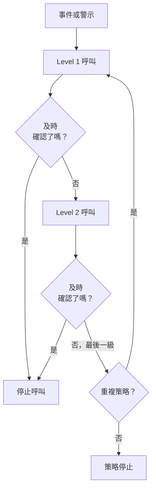
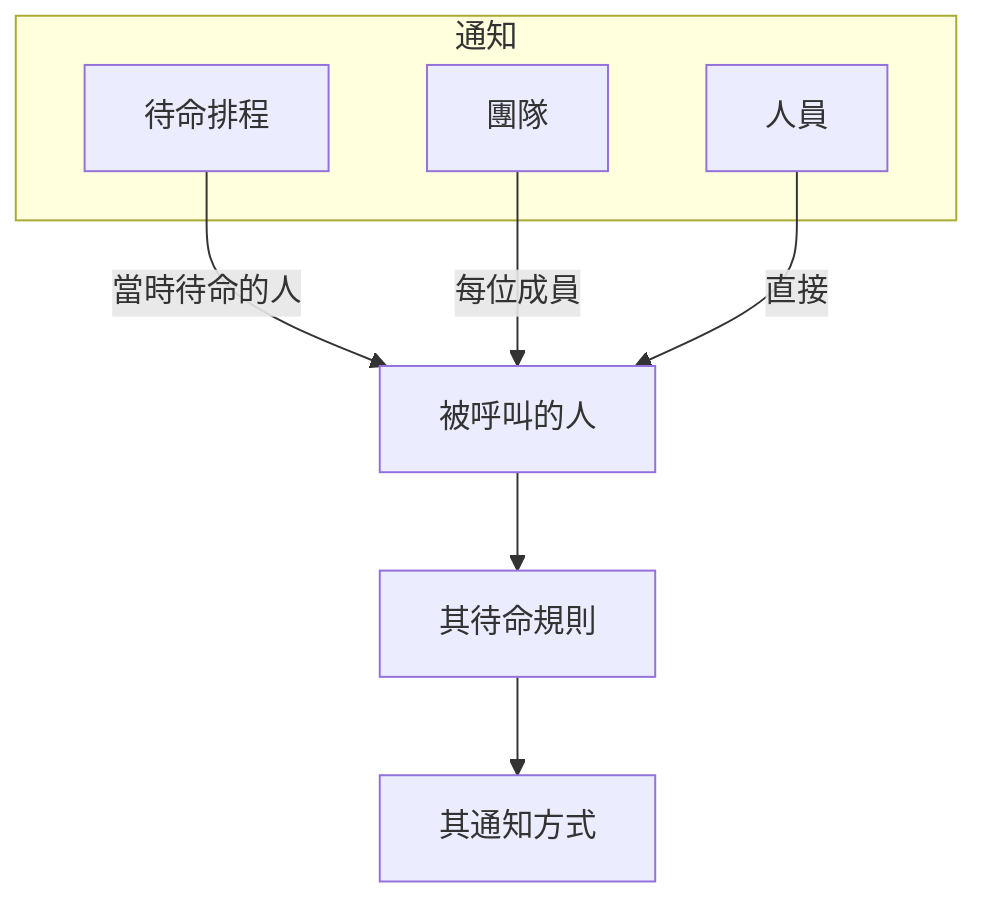

# 上報規則

待命策略會依級別呼叫人員。每條上報規則就是一個級別：呼叫誰，以及在呼叫下一級之前等待有人確認多久。策略的規則會依序列在其 **上報規則** 頁面上。



:::cards
- [首先呼叫誰](#首先呼叫誰): 建立含第一個級別的策略。
- [新增上報規則](#新增上報規則): 逐步新增下一個級別。
- [各級別如何呼叫人員](#各級別如何呼叫人員): 時間、重複，以及如何聯絡到每個人。
- [API 與 Terraform](#使用-api-或-terraform-建立規則): 以程式碼建立策略與規則。
:::

## 首先呼叫誰

在 **待命策略** 頁面建立待命策略時，表單會詢問它的 **名稱** 與 **首先通知誰？** 。這個問題使用與 **通知** 相同的選擇器：待命排程、團隊和人員，需要多少就選多少。所選對象會成為策略的第一條上報規則 **Level 1** ，在呼叫下一級之前等待確認 **30 分鐘** 。

:::steps
1. 前往 **待命** > **待命策略** ，然後點選 **建立待命策略** 。
2. 輸入 **名稱** 。
3. 在 **首先通知誰？** 下點選 **新增回應者** ，選擇首先要呼叫的待命排程、團隊和人員。
4. 點選 **建立待命策略** 。新策略隨後會在其 **上報規則** 頁面開啟，你可以在那裡新增更多級別。
:::

**首先通知誰？** 是選填的。留空時，策略會在沒有上報規則的情況下開始：在你新增規則之前，它不會呼叫任何人，其概覽也會提示這一點。描述和標籤位於 **更多欄位** 下。只有可以新增上報規則的人才會看到這個問題。

## 新增上報規則

:::steps
### 開啟策略的上報規則

開啟待命策略，在側邊選單中選擇 **上報規則** ，然後點選 **新增上報規則** 。對話方塊只有簡短的一頁。

### 選擇通知對象

在 **通知** 下點選 **新增回應者** ，搜尋並選擇此級別要呼叫的待命排程、團隊和人員，需要多少就選多少。至少新增一個。

| 回應者 | 此級別執行時呼叫誰 |
| --- | --- |
| **待命排程** | 此級別執行時在其中待命的人，而不是固定的某個人。 |
| **團隊** | 團隊的每位成員。 |
| **人員** | 直接呼叫此人。 |

### 設定等待時間

**升級延遲（分鐘）** 是在呼叫下一級之前等待確認的時間。初始值為 **30 分鐘** ，可依該級別的需要修改。

### 如有需要，為規則命名

其他所有內容都在 **更多欄位** 下，開啟之前處於收合狀態：

- **名稱**：選填。未命名的規則以其級別命名：策略的第一條規則是 **Level 1** ，第二條是 **Level 2** ，依此類推。名稱欄位會顯示規則將取得的名稱。
- **描述**：選填的備註，例如此級別呼叫誰以及原因。

收合時， **更多欄位** 的標題會列出這兩項，並顯示規則已設定的內容：描述或你自己取的名稱。

### 建立規則

點選 **Create Rule** 。規則會新增在其他規則下方，成為策略的下一個級別。
:::

## 各級別如何呼叫人員

當事件或警示到達策略時， **Level 1** 會立即呼叫其回應者。如果在等待時間內無人確認，就會呼叫 **Level 2** ，依此沿清單往下。當最後一級的等待時間過去仍無人確認時，若策略的 **重複策略** （位於規則下方）要求重複，策略會在允許的次數內從 **Level 1** 重新開始，否則停止。確認或解決事件或警示，會在任何級別停止呼叫。

以已確認或已解決狀態建立的事件、警示或片段（即事後補登的）不會執行任何策略：不會呼叫任何人，其 Feed 會記下這一點並列出這些策略。請參閱 [宣告時即已確認或已解決](/docs/incidents/declaring-incidents#宣告時即已確認或已解決) 。

若要重複策略，請在 **重複策略** 卡片上點選 **編輯** ，開啟 **Repeat if no one acknowledges** ，並設定 **Number of times to repeat** 。

### 上報概要

**上報規則** 頁面頂端的概要會顯示整個階梯：每個級別何時被呼叫、呼叫誰，以及最後一級之後會發生什麼事。若某個級別的回應者無法全部被呼叫，其卡片上會註明；點選標籤即可查看是誰以及原因。

### 如何聯絡到每個人

級別所呼叫的每個人，都依其本人的待命規則聯絡： **使用者設定** > **待命規則** ，其中為事件、事件片段、警示和警示片段各設一個分頁，每個嚴重程度一張卡片，列出嘗試哪種通知方式以及間隔多久。專案管理員可以在 **使用者** > 成員 > **待命規則** 中查看和變更成員的規則。



對某人生效的使用者覆寫，會把其呼叫改送給代班的人。

每則訊息都是服務供應商會接受的訊息，因此呼叫一定能送出。各管道能承載的內容如下：

| 管道 | 能承載的最長訊息 |
| --- | --- |
| SMS | 1,600 個字元 |
| 電話 | Twilio 4,000 個字元的通話腳本能容納的內容 |
| 推播通知 | 4 KB，其中標題、內文和資料最多占 3 KB |
| WhatsApp | 1,024 個字元 |
| Telegram | 4,096 個字元 |

更長的訊息（標題很長，或範本放入了很長的描述）會被截斷，並以一則說明全文在 OneUptime 中的提示結尾："… (truncated — see OneUptime for the full text)"。WhatsApp 訊息的措辭是固定範本，因此在那裡截斷的是最長的那些值，每個都以 "…" 結尾。訊息中的連結永遠不會被截斷。

### 呼叫未送出時

未送出的呼叫會在此人的 **待命日誌** （使用者設定）中說明原因：該列顯示 **錯誤** ，狀態訊息會說明原因。它不會再停留在 **Sending** 。訊息會說明以下之一：

- 專案餘額不足以支付，以及誰可以加值；
- 專案中該管道已關閉，以及誰可以開啟它。

專案擁有者會就此收到一封電子郵件，直到餘額加值或管道重新開啟。

在 OneUptime Cloud 上，每則簡訊、每通電話、每則 WhatsApp 和 Telegram 訊息都從 **專案設定 > 通知 > 通知設定** 上的專案餘額支付：服務供應商接受訊息時，確切費用就會從餘額扣除，不論同時送出多少則訊息。

- 若那裡開啟了 **自動儲值** ，發現餘額低於門檻的那則訊息會先儲值自動儲值所設定的金額，並向專案的卡片扣款；在同一時刻發現餘額不足的多則訊息只會扣款一次。
- 若扣款失敗（沒有付款方式或卡片遭拒），自動儲值會在一小時後再次嘗試扣款，在此之前 **通知設定** 頂端會提示這一點。手動加值或再次儲存自動儲值會立即重試。
- 在自動儲值無法扣款期間，呼叫會繼續使用剩餘餘額送出。

> [!IMPORTANT]
> 新專案中的簡訊、電話、WhatsApp 和 Telegram 預設為關閉：在 OneUptime Cloud 上，每則訊息都從專案餘額支付；自行託管的安裝則需要先設定 Twilio 帳戶或 Telegram 機器人。管道關閉期間，專案中的任何人都無法在該管道上新增通知方式。只有專案擁有者、 **Billing Admin** 或擁有 **Manage Billing** 權限的人才能開啟管道，位置在 **專案設定 > 通知 > 通知設定** 上的 **通知管道** 卡片中——專案管理員不能。在管道關閉的每個地方，其他所有人都會被確切告知誰可以開啟：在他們自己該管道的通知方式清單上方、在他們的設定檢查清單中，以及在需要該管道時他們收到的訊息中。

## 編輯、重新排序和刪除規則

每條規則的卡片上都有 **Edit rule** ，以及包含其他操作的 **⋯** 選單：

- **Edit rule** 會開啟同樣的單頁對話方塊，並依規則目前的內容填好：回應者、等待時間，以及 **更多欄位** 下的名稱和描述。新增或移除回應者，然後點選 **儲存變更** 。清空名稱會讓規則重新取得其級別的名稱。
- 規則 **⋯** 選單中的 **Move up** 和 **Move down** 會改變它的級別。以級別命名的規則會保持與其位置相符的名稱：當 **Level 3** 上移到 **Level 2** 之上時，兩者互換名稱。你自己選擇的名稱，例如 **經理** ，無論規則移到哪裡都保持不變。
- **Delete rule** 會先詢問確認，並說明該級別呼叫誰。刪除一個級別後，其下方的級別會上移，以級別命名的規則會相應重新命名。

## 使用 API 或 Terraform 建立規則

上報規則是 `/api/on-call-duty-policy-escalation-rule` 資源；規則所呼叫的人員、團隊和排程是 `/api/on-call-duty-policy-escalation-rule-user` 、 `-team` 和 `-schedule` 資源。

- 不帶 `name` 建立的規則會像在儀表板中一樣以其級別命名：成為策略第三級的規則命名為 **Level 3** 。Terraform 的上報規則資源仍然需要名稱。
- `escalateAfterInMinutes` 在儀表板之外沒有預設值。不帶它建立的規則不會等待：此級別執行後會立即呼叫下一級。請明確設定它——儀表板建議的值是 30。
- 在 `miscDataProps` 中帶 `onCallSchedules` 、 `teams` 或 `users` （ID 清單）建立的規則會取得這些回應者，儀表板的 **通知** 選擇器就是這樣傳送它們的。不帶它們建立的規則，在你透過上述資源新增回應者之前不會呼叫任何人。
- 以級別命名的規則只會在你於儀表板中移動或刪除規則時重新命名。透過 API 或 Terraform 變更 `order` 只會改變順序。
- 在 `/api/on-call-duty-policy` 建立待命策略時，在 `miscDataProps` 中帶上 `onCallSchedules` 、 `teams` 或 `users` （ID 清單），會像儀表板一樣為它建立第一條上報規則：呼叫這些對象的 **Level 1** ， `escalateAfterInMinutes` 為 30。每個 ID 都必須屬於該專案，呼叫端必須有權建立上報規則，否則不會建立策略。不帶它們建立的策略和以前一樣沒有規則；Terraform 的策略資源不會傳送它們。

```bash
curl -X POST https://oneuptime.com/api/on-call-duty-policy \
  -H "apikey: $ONEUPTIME_API_KEY" \
  -H "Content-Type: application/json" \
  -d '{
    "data": {
      "projectId": "<project-id>",
      "name": "Production on-call"
    },
    "miscDataProps": {
      "onCallSchedules": ["<schedule-id>"],
      "users": ["<user-id>"]
    }
  }'
```

## 後續步驟

:::cards
- [待命排程](/docs/on-call/schedules): 建立級別所呼叫的輪替。
- [待命時間軸](/docs/on-call/schedule-timeline): 查看所有排程中誰在待命，並找出涵蓋空檔。
- [來電原則](/docs/on-call/incoming-call-policy): 讓來電者透過電話聯絡到待命工程師。
:::
