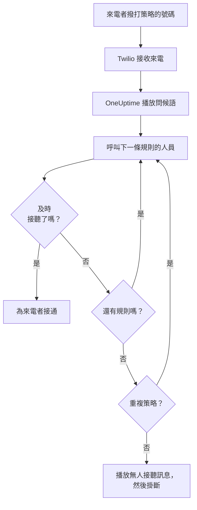
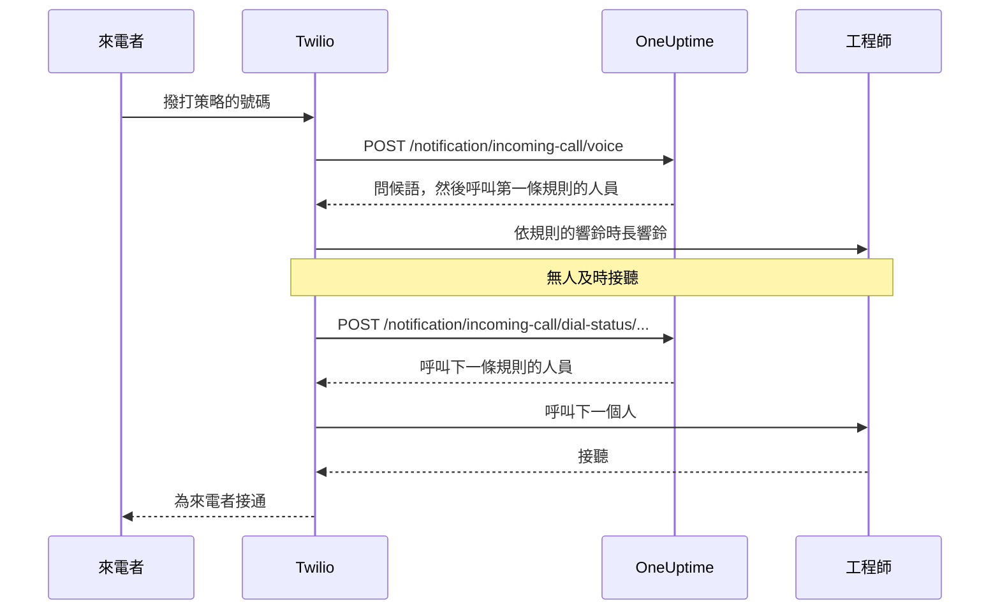

# 來電原則

來電策略為您的團隊提供一個能找到待命人員的電話號碼。有人撥打該號碼時，OneUptime 會依序呼叫策略上報規則中的人員，直到有人接聽，然後為來電者接通。號碼和通話都使用您自己的 Twilio 帳戶。

:::cards
- [設定策略](#設定策略): 從 Twilio 帳戶到一通測試電話，共七個步驟。
- [來電如何路由](#來電如何路由): 呼叫誰、響鈴多久，以及來電者會聽到什麼。
- [未接來電](#未接來電): 通知誰，以及如何在工作流程中處理。
- [疑難排解](#疑難排解): 來電從未到達，或從未接通工程師。
:::

## 開始之前

| 您需要 | 原因 |
| --- | --- |
| 一個 Twilio 帳戶，及其 Account SID 和 Auth Token | 策略的號碼和通話都使用它，Twilio 也向它計費。 |
| OneUptime Cloud 上的 **Growth** 方案 | 專案需要它才能擁有自己的 Twilio 設定。 |
| 若自行託管，需要一台 Twilio 能存取的 OneUptime 伺服器 | Twilio 會把每通來電傳送到 `https://<your host>/notification/incoming-call/voice` 。 |
| 專案中已開啟 **SMS** | 每位工程師的號碼都透過簡訊傳送的驗證碼進行驗證。 |
| 每位工程師都有已驗證的號碼 | 規則只會呼叫在專案中新增並驗證了來電號碼的人。 |

## 設定策略

:::steps
### 新增您的 Twilio 帳戶

前往 **專案設定** > **通知** > **通知設定** 。在 **Twilio 設定** 卡片中點選 **Create Twilio Config** ，然後填寫表單：

- **名稱** 和 **描述** ：帳戶的用途，例如「客服專線」。
- **Twilio 帳戶 SID** ：來自 Twilio Console。以 `AC` 開頭。
- **Twilio 驗證權杖** ：來自 Twilio Console。
- **Twilio 主要電話號碼** ：該帳戶的一個號碼，用於其傳送的簡訊和電話。
- **Twilio 次要電話號碼** ：選填。傳送給所在國家的收件者時代替主要號碼使用的號碼。
- **設為專案預設** ：專案的第一個 Twilio 設定預設開啟，這樣傳給專案成員的簡訊和電話也會透過此帳戶。如果此帳戶只用於來電，請關閉。

### 建立策略

前往 **待命** > **來電策略** ，然後點選 **建立來電策略** 。為其填寫 **名稱** ，例如「客服專線」，並可選填 **描述** 和 **標籤** 。然後從清單中開啟它。

### 選擇 Twilio 帳戶

策略的 **概覽** 中有一張含三個編號步驟的 **設定** 卡片。在第一個步驟中點選 **選擇** ，在 **Twilio 設定** 下選擇帳戶，然後點選 **儲存** 。

### 新增電話號碼

在第二個步驟中點選 **Add Phone Number** 。選擇 **Use Existing Phone Number** 以使用 Twilio 帳戶中已有的號碼，或選擇 **Reserve New Phone Number** 取得新號碼。OneUptime 會讓號碼指向自己，因此不需要在 Twilio 中做任何設定。請參閱 [電話號碼](#電話號碼) 。

### 新增上報規則

在第三個步驟中點選 **管理規則** 。依呼叫順序，為每個要呼叫的待命排程或人員新增一條規則。請參閱 [上報規則](#上報規則) 。

### 驗證每位工程師的號碼

規則可能呼叫的每個人都要新增並驗證自己的來電號碼。請參閱 [工程師的電話號碼](#工程師的電話號碼) 。

### 撥打號碼

三個步驟都完成後，卡片會變為 **Phone Numbers & Twilio Configuration** 。用任何電話撥打該號碼，然後開啟策略的 **通話日誌** ，查看呼叫了誰。
:::

## 來電如何路由

1. Twilio 將來電傳送給 OneUptime，OneUptime 朗讀策略的 **問候訊息** 。
2. OneUptime 呼叫第一條上報規則指定的人：該人員本人，或當時在該規則的待命排程中待命的人，使用者覆寫也計算在內。對方的電話會顯示策略的號碼作為來電號碼。
3. 若對方在規則的 **響鈴時長** 內接聽，就為來電者接通，通話日誌會記錄接聽者。
4. 若沒有接聽，來電者會聽到 "Connecting you to the next available engineer."，然後呼叫下一條規則的人員。
5. 最後一條規則之後，若開啟了 **若無人應答則重複策略** ，策略會依 **重複策略次數** 從第一條規則重新開始。否則來電者會聽到 **無人接聽訊息** ，通話結束。

若當下沒有人能為某條規則接聽，該規則會被略過而不呼叫任何人：其排程中無人待命、該人員在此專案中沒有已驗證的來電號碼，或已不再是專案成員。當所有規則都沒有可呼叫的人時，來電者會聽到 **無人可用訊息** 。已停用的策略會用 "Sorry, this service is currently disabled." 應答每通來電並掛斷。

OneUptime 會使用 Twilio 設定的 Auth Token 驗證每個請求上的 Twilio 簽章，並拒絕無法驗證的請求。

> [!TIP]
> 把策略的號碼儲存為手機聯絡人，例如「客服專線」，這樣轉接的來電響起時您就能認出來。

## 上報規則

上報規則決定有人撥打策略號碼時依清單由上而下呼叫誰。開啟策略，在側邊選單中選擇 **上報規則** ，然後點選 **新增上報規則** 。一條規則只有簡短的一個步驟：

- **呼叫對象** ：一個待命排程或一個人。排程會呼叫來電時在其中待命的人。人員是您專案的成員。
- **響鈴時長（秒）** ：電話響鈴多久後轉到下一條規則。初始值為 20 秒，Twilio 接受 5 到 600。
- **名稱** 和 **描述** 是選填的，位於 **更多欄位** 下。沒有名稱的規則會依其在清單中的位置顯示為 **Level 1** 、 **Level 2** 。

規則依清單由上而下呼叫，新規則新增在最後。若要變更順序，請拖曳規則左上角的控點。使用鍵盤時，將焦點移到控點上，按空白鍵，用方向鍵移動，再按一次空白鍵。

> [!WARNING]
> **注意語音信箱** ：讓 **響鈴時長** 短於對方電話把未接來電轉到語音信箱所需的時間。若語音信箱先接聽，來電者會被接通到語音信箱，通話不會轉到下一條規則。Twilio 每次響鈴都會額外加上幾秒。因此新規則從 20 秒開始。在預設值還是 30 秒時新增的規則會保留它們的 30 秒：若這些規則的來電進入了語音信箱，請調低這些規則的 **響鈴時長** 。

例如，三條規則先嘗試兩個輪替，然後呼叫負責人：

| 級別 | 呼叫對象 | 響鈴時長 |
| --- | --- | --- |
| Level 1 | 主要待命排程 | 20 秒 |
| Level 2 | 次要待命排程 | 20 秒 |
| Level 3 | 工程負責人（一個人） | 20 秒 |

## 電話號碼

一個策略可以有多個號碼，每個號碼都呼叫同一組規則。每個號碼只屬於一個策略。在策略的 **概覽** 中透過 **Add Phone Number** 新增：

:::tabs
@tab 使用已有的號碼
1. 點選 **Add Phone Number** ，然後點選 **Use Existing Phone Number** 。OneUptime 會列出策略 Twilio 帳戶中的號碼。
2. 點選號碼旁邊的 **選擇** ，然後點選 **指派號碼** 。

已把來電轉往別處的號碼會顯示 "Currently has a webhook configured"。指派後，其來電會改為傳送到 OneUptime。
@tab 預訂新號碼
1. 點選 **Add Phone Number** ，然後點選 **Reserve New Phone Number** 和 **搜尋號碼** 。
2. 選擇 **國家** 。可選填 **區碼（選填）** ，例如 415，或在 **包含（選填）** 中填寫號碼應包含的數字。點選 **搜尋** ：最多列出 10 個本地號碼。
3. 點選號碼旁邊的 **預訂** ，並以 **預訂** 確認。Twilio 會把號碼費用記入您的 Twilio 帳戶。
:::

OneUptime 會把號碼的語音 webhook 設為 `https://<your host>/notification/incoming-call/voice` ，在自行託管的安裝上由 `HOST` 和 `HTTP_PROTOCOL` 建構。若要把策略移到另一個 Twilio 帳戶，請先釋出其號碼：只有在策略沒有號碼時才能變更帳戶。

若要釋出號碼，請點選其旁邊的 **釋出** ，並以 **釋出號碼** 確認。

> [!CAUTION]
> 釋出號碼會把它歸還給 Twilio，即使是透過 **Use Existing Phone Number** 帶來的號碼，而且您可能無法再次取得它。刪除策略或其使用的 Twilio 設定也會釋出其號碼。

## 工程師的電話號碼

規則會撥打對方在此專案中為來電驗證的號碼，並略過沒有號碼的人。每個人都自行新增：

:::steps
1. 開啟 **使用者設定** > **來電策略** > **來電號碼** 。 **來電策略** 是側邊選單中的一個區段，一開始為收合狀態。
2. 在 **電話號碼 用於來電路由** 卡片中點選 **新增電話號碼 用於來電路由** ，輸入含國碼的號碼，例如 `+15551234567` 。
3. 在 **驗證碼** 中輸入 OneUptime 透過簡訊傳送到該號碼的 6 位數驗證碼，然後點選 **驗證** 。 **Send a new code** 會再傳送一個。
:::

每個人在每個專案中只能有一個已驗證的號碼。若要更換號碼，請先刪除舊號碼。這些號碼與待命呼叫使用的 **通知方式** 中的電話號碼分開。

來電號碼透過簡訊驗證，因此必須先為專案開啟 **SMS** 。專案擁有者、 **Billing Admin** 或擁有 **Manage Billing** 的人可以在 **專案設定 > 通知 > 通知設定** 上的 **通知管道** 卡片中開啟它。

## 語音訊息和策略設定

開啟策略，在側邊選單的 **進階** 下選擇 **設定** 。 **語音訊息** 卡片上的 **Edit Messages** 用於變更來電者聽到的內容； **策略設定** 卡片上的 **Edit Policy Settings** 用於變更其餘設定。

| 設定 | 作用 | 新策略的值 |
| --- | --- | --- |
| **問候訊息** | 接聽來電時、呼叫第一個人之前朗讀。 | "Please wait while we connect you to the on-call engineer." |
| **無人接聽訊息** | 所有規則都嘗試過但無人接聽時朗讀。 | "No one is available. Please try again later." |
| **無人可用訊息** | 所有規則都沒有可呼叫的人時朗讀。 | "We are sorry, but no on-call engineer is currently available. Please try again later or contact support." |
| **已啟用** | 已停用的策略會拒絕所有來電。 | 開啟 |
| **若無人應答則重複策略** | 最後一條規則之後，從第一條重新開始。 | 關閉 |
| **重複策略次數** | 重新開始的次數。 | 1 |

Twilio 以文字轉語音朗讀這些訊息，因此請依您希望聽到的樣子撰寫。

## 通話日誌

每通來電都列在策略側邊選單 **日誌** 下的 **通話日誌** 頁面中：包括 **來電者** 、 **Number Called** 、其 **狀態** 、接聽者（ **接聽者** ）、 **持續時間** ，以及開始時間（ **開始於** ）。在某通來電上點選 **View Timeline** 可查看其 **通話時間軸** ：呼叫過的每個人、使用的號碼，以及每次嘗試的結果。

| 狀態 | 發生了什麼事 |
| --- | --- |
| **Initiated** 、 **Ringing** 、 **Escalated** | 通話仍在進行：來電剛到達、電話正在響鈴，或已轉到後面的規則。 |
| **已完成** | 有人接聽，來電者已接通。 |
| **無人接聽** | 所有上報規則都已嘗試，無人接聽。來電者聽到了您的 **無人接聽訊息** 。 |
| **Caller Hung Up** | 工程師的電話正在響鈴時來電者掛斷了。 |
| **失敗** | 無人可呼叫：沒有任何上報規則有擁有已驗證來電號碼的待命使用者（來電者聽到了您的 **無人可用訊息** ），或策略已停用。 |

## 未接來電

通話在未接通任何人的情況下結束即為未接來電：其狀態為 **無人接聽** 、 **Caller Hung Up** 或 **失敗** 。

### 通知誰

來電未接時，OneUptime 會通知策略的擁有者：策略 **擁有者** 頁面上新增的使用者和團隊成員。若策略沒有擁有者，則改為通知專案擁有者。

通知會說明誰打來的電話、撥打了哪個號碼、為什麼無人接聽，以及呼叫了誰、每次嘗試的結果如何。通知中附有指向通話日誌中該通來電的連結。

擁有者預設會收到電子郵件。每個人都可以在 **使用者設定** > **通知設定** 中的 **待命** > **來電策略** > **未接來電** 下選擇其他管道（簡訊、電話、推播等）或將其關閉。

### 在工作流程中處理未接來電

來電通話日誌可用作工作流程觸發條件：

- **On Create Incoming Call Log** 會在來電到達時執行。
- **On Update Incoming Call Log** 會隨著通話進行而執行。設定 **Ended At** 的那次更新就是通話結束。

若只要處理未接來電，例如把它們發布到 Slack 或 Microsoft Teams，或建立工單：

:::steps
1. 新增 **On Update Incoming Call Log** 觸發條件。將 **Listen on** 設為 **Ended At** ，並選擇要使用的欄位，例如 **Status** 、 **Caller Phone Number** 和 **Routing Phone Number** 。
2. 新增一個 **If / Else** 步驟。用比較 **is not equal to** 和 `Completed` 檢查觸發條件的 **Status** 。
3. 把您的步驟連接到 **Yes** 連接埠。
:::

工作流程可以用 **Find One** 和 **Find Many** 讀取通話日誌，但不能建立或修改它們。

## 誰可以新增和釋出電話號碼

策略的電話號碼遵循與策略本身相同的角色：

- **查詢號碼** - 在 Twilio 中搜尋要預訂的號碼，或列出您的 Twilio 帳戶已有的號碼 - 需要讀取來電策略的權限，以及讀取通話與簡訊設定的權限，因為它會透過其中之一讀取您的 Twilio 帳戶。 **Project Owner** 、 **Project Admin** 、 **Project Member** 、 **Viewer** 、 **Settings Admin** 、 **Settings Member** 和 **Settings Viewer** 都擁有這兩項。在自訂角色中，就是 **Read Incoming Call Policy** 和 **Read Call and SMS** 。
- **預訂號碼、使用已有號碼和釋出號碼** 需要編輯來電策略的權限： **Project Owner** 、 **Project Admin** 、 **Project Member** 、 **Settings Admin** 和 **Settings Member** ，或自訂角色中的 **Edit Incoming Call Policy** 。它們會變更您可以編輯的策略的號碼：若角色僅限某些標籤，則是帶有這些標籤的策略。

團隊在這些權限之一上不帶標籤的封鎖會取消該權限。對其他人來說， **Add Phone Number** 和 **釋出** 仍留在頁面上但處於鎖定狀態，其提示會說明需要什麼。API 會用一句說明所需權限的話拒絕其請求："Looking up phone numbers needs permission to read incoming call policies and call and SMS settings." 或 "Adding or releasing a phone number needs permission to edit incoming call policies." 預訂號碼的費用記入您自己的 Twilio 帳戶，而不是您的 OneUptime 餘額，因此不需要帳務權限。

## 使用 API 或 Terraform 建立策略

| 資源 | API 路由 |
| --- | --- |
| 來電策略 | `/api/incoming-call-policy` |
| 其上報規則 | `/api/incoming-call-policy-escalation-rule` |
| 其電話號碼，唯讀 | `/api/incoming-call-policy-phone-number` |
| 通話日誌，唯讀 | `/api/incoming-call-log` |

透過 API 建立且不帶 `escalateAfterSeconds` 的規則會響鈴 20 秒，Terraform 不帶 `escalate_after_seconds` 建立的規則也一樣。

### 上報規則設定

| 設定 | API 欄位 | 儲存的內容 |
| --- | --- | --- |
| 呼叫對象 | `onCallDutyPolicyScheduleId` 或 `userId` | 二者之一，不能同時設定：呼叫其待命人員的排程，或該人員。 |
| 響鈴時長（秒） | `escalateAfterSeconds` | 電話響鈴多久後轉到下一步（預設：20；5 到 600）。 |
| 名稱和描述 | `name` 、 `description` | 選填。沒有名稱的規則會依其在清單中的位置顯示為 Level 1、Level 2 等。 |
| 順序 | `order` | 規則在清單中的位置：規則由上而下呼叫。不帶順序的新規則排在最後。 |

## 疑難排解

:::details 來電沒有到達 OneUptime
- 在 Twilio Console 中開啟該號碼： **A call comes in** 必須是 webhook `https://<your host>/notification/incoming-call/voice` ，並使用 HTTP POST。OneUptime 會在新增號碼時依 `HOST` 和 `HTTP_PROTOCOL` 設定它。若之後它們有變更，請在 Twilio 中更正 webhook。
- 自行託管的 OneUptime 必須能透過 https 從網際網路存取。Twilio Console 中該號碼的通話記錄以及 Twilio 的 **Debugger** 會顯示 OneUptime 的回應。
- `403` 回應表示請求的簽章驗證未通過。請確認 Twilio 設定中儲存的是該帳戶目前的 **Twilio 驗證權杖** ，並確認 OneUptime 前方的代理伺服器傳遞了 Twilio 呼叫時使用的主機和協定（ `X-Forwarded-Host` 和 `X-Forwarded-Proto` ）。
:::

:::details 來電已接聽，但沒有呼叫任何人
通話日誌顯示 **失敗** 。請檢查策略是否 **已啟用** 、每條規則的待命排程目前是否有人待命，以及規則呼叫的人是否在此專案的 **使用者設定** > **來電策略** > **來電號碼** 下有已驗證的號碼。規則只會呼叫專案成員。
:::

:::details 來電進入了語音信箱
若來電進入了工程師的語音信箱，請把規則的 **響鈴時長** 設為短於其電話轉入語音信箱所需的時間。語音信箱接聽也算是接聽，通話會停在那裡。
:::

:::details 無法預訂新號碼
在許多國家，Twilio 在販售本地號碼之前需要已核准的 regulatory bundle，有些號碼還要求 Twilio 餘額為正。請在 Twilio Console 中完成這些設定，或在那裡取得號碼後透過 **Use Existing Phone Number** 新增。
:::

:::details 無法變更策略的 Twilio 帳戶
只有在策略沒有電話號碼時才能變更帳戶：頁面會顯示 "Remove all phone numbers to change"。釋出號碼會把它們歸還給 Twilio，因此請先規劃好移轉。
:::

:::details 工程師號碼的驗證碼沒有收到
專案必須開啟簡訊。在 OneUptime Cloud 上，沒有自己預設 Twilio 設定的專案會用其餘額支付簡訊費用，餘額必須高於 1 USD。驗證碼可能需要一分鐘才會送達；點選 **Send a new code** 再傳送一個， **專案設定** > **通知** > **通知日誌** 會顯示它的處理情況。
:::

## 後續步驟

:::cards
- [上報規則](/docs/on-call/escalation-rules): 待命策略如何逐級呼叫人員。
- [待命排程](/docs/on-call/schedules): 建立規則所呼叫的輪替。
- [工作流程](/docs/workflows/index): 處理未接來電：發布到頻道或建立工單。
- [Twilio 簡訊與語音整合](/docs/self-hosted/twilio-integration): 為自行託管的安裝設定 Twilio。
:::
