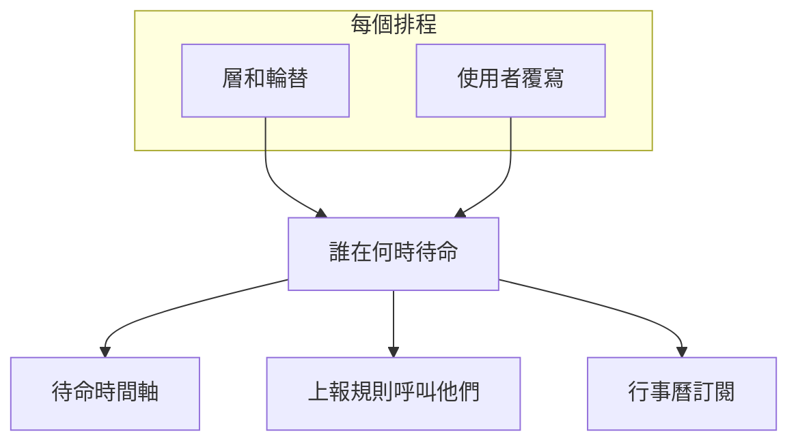

# 待命時間軸

待命時間軸會在一張依週或依月的格狀檢視中，顯示您專案的所有待命排程：每個排程一列，每天一欄。不必逐一開啟排程，就能回答「這週我的團隊或整個組織裡誰在待命？」。

時間軸上的班次正是 OneUptime 呼叫人員時使用的班次，包括使用者覆寫：時間軸、上報規則和行事曆訂閱都從同一處讀取它們。

## 開啟時間軸

- **待命** > **待命時間軸** 會顯示您可以查看的所有排程，並依所屬團隊分組。 **待命排程** 上的 **時間軸檢視** 按鈕會開啟同一頁面。
- **團隊** > 某個團隊 > **待命排程** 只會顯示該團隊擁有的排程。

當團隊列在排程的 **擁有者** 頁面上時，該團隊就擁有該排程。沒有所屬團隊的排程會歸入 **No owner team** 。關閉 **Group by team** 即可在依名稱排序的單一清單中查看所有排程。

## 解讀格狀檢視

| 格狀檢視上的元素 | 意義 |
| --- | --- |
| 色條 | 一個班次：誰在待命，從何時到何時。同一個人在所有排程中的顏色都相同。 |
| 淡色的色條 | 過去的班次。 |
| 標有 **⇄** 的色條 | 覆寫：有人在代班。其下方的細條會顯示被代班的人，並加上刪除線。 |
| 帶斜線的琥珀色區塊 | 涵蓋空檔：無人待命。此時上報到該排程的警示不會呼叫任何人。 |
| 紅線 | 現在。 |
| 排程名稱下方的一行 | 現在誰在待命，或 **No one on call now** 。 |

將指標停留在任何色條或空檔上，或用鍵盤移到其上，即可查看詳細資訊。

格狀檢視下方的 **On call this week** （月檢視中為 **On call this month** ）會列出該時間範圍內待命的所有人。將指標停留在名字上，可查看此人待命多久、涉及幾個排程。

## 變更時間範圍和時區

- 在 **Week** 和 **Month** 之間切換，用箭頭移動，用 **Today** 返回。
- 時間以您自己的時區顯示。時區按鈕會開啟 **View timeline in timezone** ，以任何其他時區顯示時間軸，而不改變任何人的待命時間：每個排程仍在其自己的時區交接。
- 時間軸涵蓋過去 180 天和未來 365 天。

> [!NOTE]
> 過去的班次會依每個排程目前的設定重新計算，因此顯示的是現在設定的輪替，可能與當時實際被呼叫的人不同。若要了解人員實際待命的時數，請使用 **待命** > **報告** > **使用者待命時間** 。

## 尋找排程或人員

- **搜尋** 會比對排程名稱、團隊名稱和待命人員。
- 團隊篩選器可將檢視縮小到一個團隊或 **My teams** ； **Schedules I'm on** 只保留您參與的排程。
- 在格狀檢視上方點選 **with no one on call now** 或 **with coverage gaps this week** （月檢視中為 **with coverage gaps this month** ），即可只查看這些排程。再點選一次即可查看全部。
- 點選格狀檢視下方的某個人或其某個色條，可醒目顯示此人的所有班次。 **Clear highlight** 會取消醒目顯示， **Clear filters** 會重設搜尋和篩選器。

## 誰能看到什麼

| 適用於 | 規則 |
| --- | --- |
| 權限 | 與 **待命排程** 相同的權限和標籤限制，再加上讀取排程層的權限。 |
| 覆寫 | 覆寫代的是誰的班次，只會向能讀取使用者覆寫的人顯示。其他人仍能看到誰會被呼叫。 |
| 排程數量 | 一次最多 250 個排程，依名稱排序。團隊的 **待命排程** 頁面會將其縮小到該團隊擁有的排程。 |
| 方案 | 在 OneUptime Cloud 上，時間軸與待命排程一樣需要 **Growth** 方案。 |

## 後續步驟

:::cards
- [待命排程](/docs/on-call/schedules): 設定誰輪流待命、層和待命時段。
- [行事曆訂閱源](/docs/on-call/calendar-feeds): 將您的班次放進 Google 日曆、Outlook 或 Apple 行事曆。
- [上報規則](/docs/on-call/escalation-rules): 決定待命策略的每個級別呼叫誰。
:::
