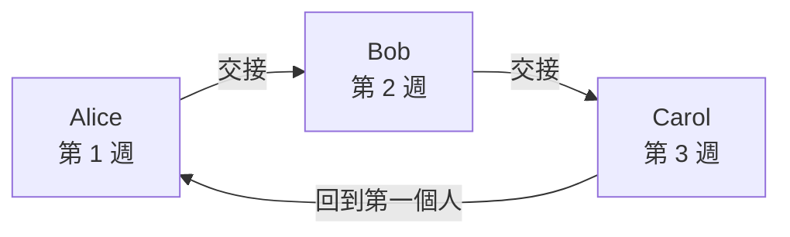
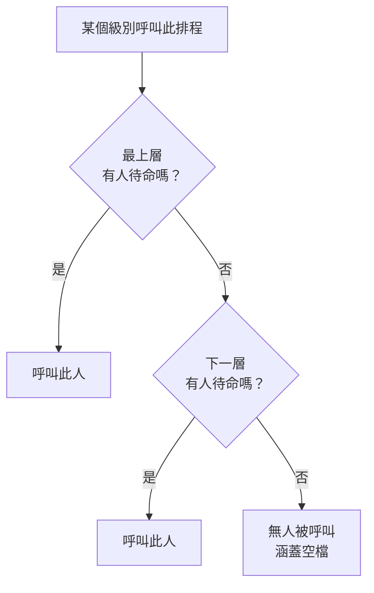

# 待命排程

待命排程決定任何時刻由誰待命。人員在排程中輪流待命：每人待命一段時間，然後由下一個人接手。將排程加入待命策略的上報規則中，當該級別執行時，策略就會呼叫排程中正在待命的人。

> [!NOTE]
> 在 OneUptime Cloud 上，待命排程屬於 **Growth** 及以上方案。Growth 試用結束或方案降級後，專案中仍保留的排程會繼續透過引用它的上報規則呼叫其中的人員。因此在低於 **Growth** 的方案中， **待命排程** 頁面會顯示方案說明，並在其下方列出仍已設定的排程，您可以在那裡刪除它們。建立或變更排程需要 **Growth** 。

:::cards
- [誰輪流待命](#誰輪流待命): 建立含第一個輪替的排程。
- [層](#層): 堆疊輪替、限制待命時段並新增後備涵蓋。
- [API 與 Terraform](#使用-api-或-terraform-建立排程): 以程式碼建立排程及其輪替。
:::

## 誰輪流待命

在 **待命排程** 頁面建立排程時，表單會詢問它的 **名稱** 與 **誰輪流待命？** 。您選擇的人會成為排程的第一層 **Layer 1** ，全天候待命。

:::steps
1. 前往 **待命** > **待命排程** ，然後點選 **建立待命排程** 。
2. 輸入 **名稱** 。
3. 在 **誰輪流待命？** 下點選 **新增使用者** ，依輪替順序選擇人員。
4. 如有需要，開啟 **更多欄位** ，修改每次待命時長、時區、描述或標籤。
5. 點選 **建立待命排程** 。新排程隨後會在其 **層** 頁面開啟，您可以在那裡變更輪替或新增更多層。
:::

人員一次一個輪流待命，排程建立後第一個人立即開始待命：



**誰輪流待命？** 是選填的。留空時，排程會在沒有層的情況下開始：在您於其 **層** 頁面新增層之前，不會有人待命。只有可以新增層的人才會看到這個問題。

其他所有內容都在 **更多欄位** 下，開啟之前處於收合狀態：

| 欄位 | 作用 |
| --- | --- |
| **每次待命時長** | **1 天** 、 **1 週** 、 **2 週** 或 **1 個月** ，未變更則為 **1 週** 。有人輪流待命時就會詢問。每人待命這麼久，然後在排程建立時的那個時刻由下一個人接手。 |
| **時區** | 交接時間和待命時段所使用的時區。初始為您的時區。 |
| **描述** | 關於排程的備註。 |
| **標籤** | 用於尋找和分組排程的標籤。 |

當有人輪流待命且 **更多欄位** 下沒有任何變更時，其收合的標題會說明將會發生什麼事：每人待命一週，然後由下一個人接手。

## 層

排程的輪替由其 **層** 頁面上的層組成。層由上往下讀取：有人待命的最上層就是呼叫的那一層，因此請把主要輪替放在頂端，把後備涵蓋放在下面。



**新增層** 會新增一個與第一層起始方式相同的層：從現在開始待命，每人一週，全天候。展開某一層即可在其中新增人員，並變更它的開始時間、交接頻率、首次交接時間以及待命時段：

| 欄位 | 設定內容 |
| --- | --- |
| **Layer name** | 該層涵蓋的內容，例如「平日主要待命」。 |
| **Rotation starts at** | 該層輪替開始的日期和時間。 |
| **Rotate every** | 待命多久交給層中的下一個人。 |
| **First hand-off time** | 第一次交接給下一個人的時間，在開始時或之後。之後的交接依每個輪替間隔進行。 |
| **Restrictions** | 該層待命的時段：依排程的時區為 **無限制** 、 **一天中的特定時間** 或 **一週中的特定時間** 。在這些時段之外，由下層接手。 |

若要變更哪一層排在前面，請在層的選單中使用 **Move layer up (higher priority)** 或 **Move layer down (lower priority)** 。

每個人在各處都保持同一種顏色，方便您一眼追蹤：在每一層、在最終排程及其覆寫中，以及在 **待命時間軸** 上。

## 使用 API 或 Terraform 建立排程

待命排程是 `/api/on-call-duty-policy-schedule` 資源；其層和層中的人員是 `/api/on-call-duty-schedule-layer` 和 `/api/on-call-duty-schedule-layer-user` 資源。

- 在 `miscDataProps` 中帶 `firstLayerUsers` （依輪替順序排列的使用者 ID 清單）建立排程，會像儀表板一樣為它建立第一層：從現在開始全天候待命的 **Layer 1** 。 `firstLayerRotation` 以 `{"_type": "Recurring", "value": {"intervalType": "Week", "intervalCount": 1}}` 這樣的輪替指定每次待命時長；未提供時為一週。每個使用者都必須是專案成員，呼叫端必須有權建立層，否則不會建立排程。
- 不帶它們建立的排程和以前一樣沒有層；Terraform 的排程資源不會傳送它們。
- 不帶 `rotation` 建立的層和以往一樣每天交接。

```bash
curl -X POST https://oneuptime.com/api/on-call-duty-policy-schedule \
  -H "apikey: $ONEUPTIME_API_KEY" \
  -H "Content-Type: application/json" \
  -d '{
    "data": {
      "projectId": "<project-id>",
      "name": "Primary on-call",
      "timezone": "Europe/Berlin"
    },
    "miscDataProps": {
      "firstLayerUsers": ["<user-id-1>", "<user-id-2>", "<user-id-3>"],
      "firstLayerRotation": {"_type": "Recurring", "value": {"intervalType": "Week", "intervalCount": 1}}
    }
  }'
```

## 後續步驟

:::cards
- [上報規則](/docs/on-call/escalation-rules): 讓待命策略的某個級別呼叫此排程。
- [待命時間軸](/docs/on-call/schedule-timeline): 並排查看所有排程及涵蓋空檔。
- [行事曆訂閱源](/docs/on-call/calendar-feeds): 將班次放進 Google 日曆、Outlook 或 Apple 行事曆。
:::
