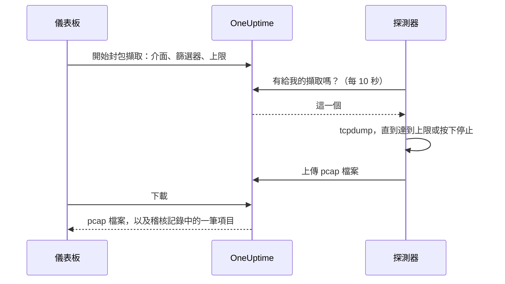

# 封包擷取

直接從儀表板擷取某個探測器看到的流量，然後在 Wireshark 中開啟檔案。探測器本來就位於你要排查的網路中：不必開啟 VPN，也不必登入跳板機。

在執行探測器的人開啟之前，每個探測器上的擷取都是關閉的，而且擷取只會在你專案自己的探測器上執行。

:::cards
- [運作方式](#運作方式): 從開始封包擷取到 Wireshark 中的檔案。
- [開啟封包擷取](#開啟封包擷取): 執行探測器的人在 Docker、Docker Compose 和 Kubernetes 中要設定什麼。
- [開始擷取](#開始擷取): 選擇介面，縮小到你需要的範圍，然後下載檔案。
- [參考](#參考): 上限、篩選器、權限、稽核記錄，以及檔案保留多久。
- [疑難排解](#疑難排解): 失敗的擷取所顯示的訊息代表什麼。
:::

## 運作方式



1. **開始。** 有權開始擷取的人選擇探測器的介面、篩選器和上限，然後按一下 **開始擷取**。OneUptime 在儲存擷取之前，會依探測器允許的範圍檢查篩選器和上限。
2. **領取。** 探測器每十秒向 OneUptime 要一次工作，就像它要監測器一樣。它領取擷取並啟動 `tcpdump`。
3. **擷取。** 擷取會在最先達到的上限停止：持續時間、封包上限或檔案大小。**停止** 會提前結束擷取，並保留已經擷取到的內容。
4. **上傳。** 探測器上傳 pcap 檔案。OneUptime 將它存為專案的私人檔案。
5. **下載。** 擷取顯示 **已完成** 和 **下載** 按鈕。檔案可以在 Wireshark、tcpdump 或任何讀取 pcap 檔案的工具中開啟。

## 開始之前

- **你專案自己的探測器。** 全域探測器承載其他專案的流量，因此從不擷取。要安裝自己的探測器，請參閱 [自訂探針](/docs/probe/custom-probe)。
- **本版本或更新版本的探測器。** 舊版探測器不會回報它們可以在哪些介面上擷取。
- **適當的權限。** 開始和停止擷取需要 **Start Packet Capture**，下載檔案需要 **Download Packet Capture**。專案擁有者和管理員兩者都有。請參閱 [權限](#權限)。
- **鏡像連接埠，用於到不了探測器的流量。** 探測器只看得到自己主機介面上的流量。要擷取其他裝置之間的流量，請將它們的交換器連接埠鏡像（SPAN）到探測器主機上的一個空閒介面。

## 開啟封包擷取

由執行探測器的人在探測器執行的地方開啟擷取：儀表板依設計無法開啟。探測器需要三樣東西：

| 設定 | 原因 |
| --- | --- |
| `PROBE_PACKET_CAPTURE_ENABLED=true` | 開啟擷取。任何其他值或不設定都會保持關閉。 |
| 主機網路 | 讓探測器看到主機自己的介面和鏡像連接埠。沒有它，探測器只看得到其容器的網路。 |
| `NET_RAW` 能力 | 讓 tcpdump 能夠擷取。Docker 預設會授予。Kubernetes 的 Pod Security restricted 標準會移除它，所以請加上。 |

:::tabs
@tab Docker
```bash
docker run --name oneuptime-probe --network host \
  --cap-add NET_RAW \
  -e PROBE_KEY=<probe-key> \
  -e PROBE_ID=<probe-id> \
  -e ONEUPTIME_URL=https://oneuptime.com \
  -e PROBE_PACKET_CAPTURE_ENABLED=true \
  -d oneuptime/probe:release
```
@tab Docker Compose
```yaml
services:
  oneuptime-probe:
    image: oneuptime/probe:release
    container_name: oneuptime-probe
    network_mode: host
    cap_add:
      - NET_RAW
    environment:
      - PROBE_KEY=<probe-key>
      - PROBE_ID=<probe-id>
      - ONEUPTIME_URL=https://oneuptime.com
      - PROBE_PACKET_CAPTURE_ENABLED=true
    restart: always
```
@tab Kubernetes
```yaml
apiVersion: apps/v1
kind: Deployment
metadata:
  name: oneuptime-probe
spec:
  selector:
    matchLabels:
      app: oneuptime-probe
  template:
    metadata:
      labels:
        app: oneuptime-probe
    spec:
      hostNetwork: true
      dnsPolicy: ClusterFirstWithHostNet
      containers:
        - name: oneuptime-probe
          image: oneuptime/probe:release
          securityContext:
            capabilities:
              add: ["NET_RAW"]
          env:
            - name: PROBE_KEY
              value: "<probe-key>"
            - name: PROBE_ID
              value: "<probe-id>"
            - name: ONEUPTIME_URL
              value: "https://oneuptime.com"
            - name: PROBE_PACKET_CAPTURE_ENABLED
              value: "true"
```
:::

探測器啟動時，其記錄會顯示 `Packet capture is on: captures of up to 30 minutes and 25 MB can be started on this probe from the dashboard.` 一分鐘之內，儀表板中該探測器的頁面就會提供 **開始封包擷取**。

要在此探測器上設定比所有探測器共同遵守的上限更低的上限，請加入以下任一變數：

| 變數 | 預設值 | 作用 |
| --- | --- | --- |
| `PROBE_PACKET_CAPTURE_MAX_DURATION_IN_SECONDS` | `1800` | 此探測器執行的最長擷取，5 到 1800 秒。 |
| `PROBE_PACKET_CAPTURE_MAX_FILE_SIZE_IN_MB` | `25` | 此探測器產生的最大擷取檔案，1 到 25 MB。 |

> [!NOTE]
> 透過 Docker Compose 或 Helm chart 自行託管 OneUptime 時附帶的探測器是全域探測器，因此從不擷取。請在你想擷取的網路中執行自訂探測器。

## 開始擷取

:::steps
### 開啟探測器或裝置

開啟 **監測器 → 設定 → 探測器** 並按一下你的探測器：它的 **封包擷取** 卡片會列出它的擷取。或者開啟一台網路裝置並前往它的 **Traffic** 頁面：在那裡開始的擷取會在裝置自己的探測器上執行，並且一開始就依裝置的位址篩選。

### 按一下開始封包擷取

在你開始之前，表單會說明擷取包含什麼：經過線路的密碼、權杖和個人資料都會進入檔案。

### 選擇介面

**所有介面 (any)** 會在探測器的每個介面上擷取。擷取鏡像流量時，請選擇交換器將流量鏡像到的那個介面。

### 選擇要擷取哪些封包

填寫 **主機或網路**、**連接埠** 和 **協定** 來縮小擷取範圍，或留空以保留所有封包。表單會顯示它們組成的篩選器，例如 `host 10.0.0.5 and tcp port 443`。按一下 **改為撰寫 BPF 篩選器** 來撰寫你自己的篩選器。

### 檢查上限

**更多欄位** 包含 **持續時間**、**封包上限** 和 **檔案大小上限 (MB)**。其摘要說明擷取何時停止：`在 1 分鐘、100,000 個封包或 10 MB 中先到者處停止。`

### 按一下開始擷取

在探測器領取之前，擷取顯示 **待處理**，之後顯示 **執行中** 以及進度。按一下 **停止** 可提前結束。
:::

當擷取顯示 **已完成** 時，按一下 **下載**，然後在 Wireshark 中開啟 `.pcap` 檔案。在 **所有介面 (any)** 上的擷取是 Linux cooked capture，Wireshark 讀取它與讀取其他擷取一樣。

## 參考

### 上限

| 上限 | 預設值 | 範圍 |
| --- | --- | --- |
| 持續時間 | 1 分鐘 | 5 秒到 30 分鐘 |
| 封包上限 | 100,000 | 1 到 1,000,000 |
| 檔案大小上限 | 10 MB | 1 到 25 MB |

- 擷取會在最先達到的上限停止。達到大小上限的檔案會在最後一個完整封包之後截斷，因此一定能開啟。
- 一個探測器同時最多執行 2 個擷取。
- 探測器在 5 分鐘內沒有領取的擷取會失敗，並說明原因。
- 探測器會再次依這些上限以及它自己更低的上限約束每個擷取。

### 篩選器

表單的欄位會組成一個 [BPF 篩選器](https://www.tcpdump.org/manpages/pcap-filter.7.html)，也就是 tcpdump 和 Wireshark 的擷取篩選語言：

| 主機或網路 | 連接埠 | 協定 | 篩選器 |
| --- | --- | --- | --- |
| `10.0.0.5` | | 任何協定 | `host 10.0.0.5` |
| `10.0.0.0/24` | `443` | TCP | `net 10.0.0.0/24 and tcp port 443` |
| | `5060` | UDP | `udp port 5060` |
| | `8000-8080` | 任何協定 | `portrange 8000-8080` |
| `10.0.0.5` | | ICMP | `host 10.0.0.5 and (icmp or icmp6)` |

你自己撰寫的篩選器是一行，最多 500 個字元，由字母、數字、空格和 `. : / ( ) [ ] ! & | < > = + - * % ^ _` 組成。OneUptime 在儲存前檢查它，tcpdump 在探測器上編譯它。探測器將它作為一個引數傳給 tcpdump，從不經過 shell。

### 權限

| 權限 | 允許 | 預設擁有者 |
| --- | --- | --- |
| **Start Packet Capture** | 開始擷取以及停止擷取 | Project Owner, Project Admin |
| **Download Packet Capture** | 下載擷取檔案 | Project Owner, Project Admin |
| **Delete Packet Capture** | 刪除擷取及其檔案 | Project Owner, Project Admin |
| **Read Packet Capture** | 查看擷取：何時執行、在哪個探測器上、使用哪個篩選器 | Project Owner, Project Admin, Project Member, Viewer |

要給團隊 **Start Packet Capture** 或 **Download Packet Capture**，請在 **設定 → 團隊** 下開啟該團隊，並在其 **權限** 頁面上加入該權限。請參閱 [權限](/docs/permissions/index)。

### 稽核記錄與隱私

- 開始擷取會在稽核記錄中記為 **Packet Capture** 的 **Create**，刪除擷取記為 **Delete**。每次下載都會記為 **Download**，包括誰下載了哪個擷取。
- 檔案是專案的私人檔案。只有擁有 **Download Packet Capture** 時使用的 **下載** 按鈕才會提供它。
- 擷取及其檔案在開始 7 天後刪除。刪除擷取會立即刪除其檔案。

## 疑難排解

:::details 「此探測器上的封包擷取已關閉」
探測器在沒有 `PROBE_PACKET_CAPTURE_ENABLED=true` 的情況下執行。請使用 [開啟封包擷取](#開啟封包擷取) 中的設定重新啟動它。
:::

:::details "The probe is not allowed to capture packets on eth0"
tcpdump 無法開啟該介面。請授予探測器的容器 `NET_RAW` 能力：Docker 使用 `--cap-add NET_RAW`，Docker Compose 使用 `cap_add`，Kubernetes 使用 `securityContext.capabilities.add`。
:::

:::details "The interface does not exist on the probe"
自探測器上次回報以來該介面已消失，或者探測器在沒有主機網路的情況下執行，只看得到其容器的介面。請使用主機網路執行它，然後重新選擇介面。
:::

:::details "tcpdump could not use the filter"
tcpdump 無法編譯該篩選器。訊息中包含 tcpdump 自己的說法，例如 `syntax error`。請對照 [pcap-filter 手冊](https://www.tcpdump.org/manpages/pcap-filter.7.html) 檢查篩選器。
:::

:::details "The probe did not pick up this capture within 5 minutes"
探測器已中斷連線，或者在擷取開始後其上的封包擷取被關閉了。請檢查探測器的 **連線狀態** 及其記錄。
:::

:::details 「沒有封包符合篩選器。」
擷取已執行，但介面上沒有任何內容符合篩選器。請檢查流量是否經過此介面：其他裝置之間的流量只有透過鏡像連接埠才能到達探測器。
:::

:::details "This probe is already running 2 packet captures"
一個探測器同時執行 2 個擷取。請等待其中一個完成，或停止一個，然後重新開始你的擷取。
:::

## 後續步驟

:::cards
- [自訂探針](/docs/probe/custom-probe): 在你想擷取的網路中安裝探測器。
- [網路設備監控](/docs/monitor/network-device-monitor): 監控你擷取其流量的裝置。
- [權限](/docs/permissions/index): 授予團隊封包擷取權限。
:::
