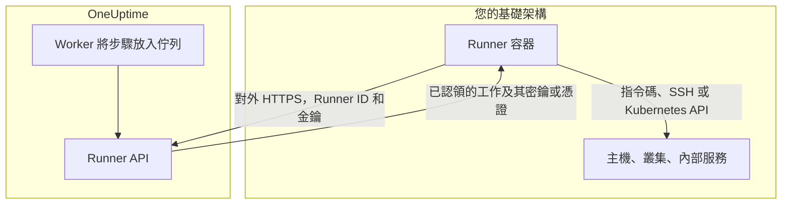
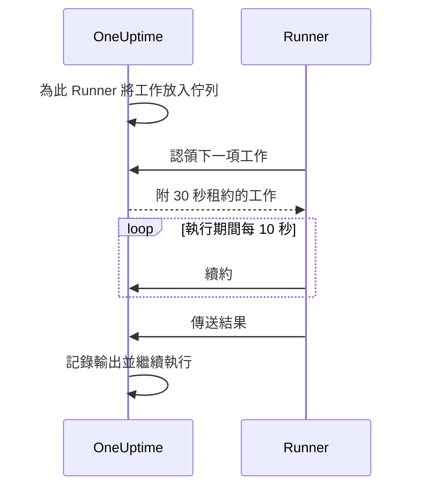

# Runbook 代理程式

**Runbook 代理程式** 在儀表板中稱為 **Runner** ，是一個小型的自行託管處理程序，它 **在您自己的基礎架構中** 執行 Runbook 的 JavaScript、Bash、SSH 和 Kubernetes 步驟。OneUptime Worker 絕不會執行您的指令碼：它把指令碼放入佇列，由步驟作者選擇的 Runner 認領每項工作、執行它並傳回結果。本頁面向安裝和維運 Runner 的人員。

:::cards
- [安裝 Runner](#安裝-runner): 五個步驟，從儀表板到已連線的容器。
- [為步驟指定 Runner](#為步驟指定-runner): 把步驟繫結到應執行它的 Runner。
- [逾時](#逾時): 認領逾時和執行逾時，以及兩者如何搭配。
- [環境變數](#環境變數): 容器啟動時讀取的內容。
:::

## 運作方式



1. 您在 OneUptime 中建立一個 Runner。OneUptime 會為它產生一個 ID 和一把秘密金鑰。
2. 您在自己基礎架構中的一台主機上執行 Runner 容器，並提供該 ID、金鑰和您的 OneUptime URL。
3. Runner 每 5 秒向 OneUptime 要求一次工作，每 60 秒回報一次自己仍在運作。
4. 撰寫 JavaScript、Bash、SSH 或 Kubernetes 步驟時，您從下拉式清單中選擇 Runner。步驟會繫結到該 Runner。
5. 步驟執行時，Worker 會把一項 `targetAgentId` 設為該 Runner 的工作放入佇列。只有該 Runner 能認領它。
6. Runner 在本機執行工作（Bash 使用 `bash -c <script>`，JavaScript 使用 `isolated-vm` 沙箱，SSH 和 Kubernetes 使用步驟的憑證建立 SSH 連線或呼叫叢集的 API 伺服器），記錄結果並傳回。Worker 以該結果繼續執行 Runbook。

Runner 只需要連到您 OneUptime 執行個體的 **對外 HTTPS** 。它不接受任何連入連線。

Runner 只持有自己的 ID 和金鑰。其他一切都隨它認領的工作一起送達：填入了指派給它的 [Runbook 密鑰](/docs/runbooks/credentials#供指令碼使用的密鑰) 的指令碼，或 SSH、Kubernetes 步驟指定的 [憑證](/docs/runbooks/credentials)。因此，任何持有 Runner 金鑰的人都能以該 Runner 的身分行事：請像對待指派給它的憑證一樣對待這把金鑰。

## 為什麼指令碼在 Runner 上執行

在 OneUptime Worker 上執行指令碼有兩個問題：

- **信任邊界。** 任何能撰寫 Runbook 的人都能在 Worker 上執行程式碼，並存取 Worker 能存取的一切。
- **可及範圍。** 大多數有用的步驟作用於 _您的_ 基礎架構（「重新啟動這個服務」「在我們的內部資料庫中查詢一筆紀錄」），而不是 OneUptime 的。

有了 Runner，這些步驟會在您掌控的主機上執行，由您決定這台主機可以做什麼。HTTP 請求和 AI 步驟仍在 Worker 上執行，因為它們不需要您網路中的任何東西。

## 開始之前

- 您基礎架構中 **一台安裝了 Docker 的主機** ，能透過 HTTPS 連到您的 OneUptime URL，並能連到步驟要操作的系統。
- **能建立 Runner 的角色。** Project Owner、Project Admin、Project Member 和 Runbook Admin 可以建立 Runner。只有 Project Owner、Project Admin 或 Runbook Admin 能看到 Runner 的金鑰，而安裝指令中包含這把金鑰。

## 安裝 Runner

### 1. 建立代理程式紀錄

前往 **運行手冊 → Runbook 代理程式** ，建立一個新的代理程式。點選 **建立Runner** ，填寫兩個步驟：

| 欄位 | 步驟 | 說明 |
| --- | --- | --- |
| **名稱** | **Runner** | 易讀的名稱，通常寫明它在哪裡執行、能連到什麼，例如 `prod-eu-west-1`。撰寫步驟時您選擇的就是這個名稱。 |
| **描述** | **Runner** | 選用。用一句話說明這台主機能連到什麼。 |
| **標籤** | **Runner** （在 **更多欄位** 下） | 選用。 |
| **執行操作手冊** | **功能** | 預設開啟。讓此 Runner 認領 Runbook 步驟。 |
| **執行 AI 程式碼修復** | **功能** | 預設關閉。讓它為 AI 程式碼修復開啟提取要求；請參閱 [Fix Tasks](/docs/ai/ai-agent)。 |
| **執行 AI 修復指令** | **功能** | 預設關閉。讓 AI 自動修復在其上執行經過原則檢查的指令。為持有 SSH 憑證的 Runner 開啟此項需要讀取 Runbook 憑證的權限；請參閱 [執行 OneUptime AI 指令的 Runner](/docs/runbooks/credentials#執行-oneuptime-ai-指令的-runner)。 |

Runner 會在下一次心跳時取得功能的變更，不需要重新啟動。

### 2. 複製安裝指令

在 Runner 所在列點選 **顯示設定說明** 。 **操作手冊代理程式設定** 對話方塊會顯示一個 `docker run` 指令，其中已包含該 Runner 的 ID 和金鑰。同樣的指令也位於 Runner 本身頁面的 **設定說明** 下。

只有 Project Owner、Project Admin 或 Runbook Admin 能讀取金鑰。其他人看到的不是指令，而是「您沒有檢視此操作手冊代理程式金鑰的權限」。

### 3. 在您基礎架構中的主機上執行

在您環境中符合以下條件的主機上執行該指令：

- 能透過 HTTPS 連到您的 OneUptime 執行個體，而且
- 能完成步驟所需的動作，例如透過 SSH 連到其他主機、呼叫叢集的 API 伺服器或與資料庫溝通。

```bash
docker run --name oneuptime-runner --restart unless-stopped \
  -e ONEUPTIME_RUNNER_ID=<runner-id> \
  -e ONEUPTIME_RUNNER_KEY=<runner-key> \
  -e ONEUPTIME_URL=https://oneuptime.yourdomain.com \
  -d oneuptime/runner:release
```

### 4. 確認代理程式已連線

回到 **運行手冊 → Runbook 代理程式** 。容器啟動後一分鐘內，Runner 的 **狀態** 應顯示為 **已連線** ，並有新的 **上次出現** 時間。在 Runner 本身的頁面上， **操作手冊代理程式狀態** 卡片會顯示它的 **操作手冊代理程式版本** 和 **主機** 。如果一直顯示 **從未連線** 或 **已中斷** ，請參閱 [疑難排解](#疑難排解)。

### 5. 讓代理程式保持最新

當代理程式執行的版本比您的 OneUptime 舊時，其頁面上的 **操作手冊代理程式版本** 旁會出現警告標記。選擇它即可查看升級方式：拉取新的映像檔，移除容器，然後重新執行第 2 步的安裝指令。由 Kubernetes 代理程式的 Chart 安裝的代理程式，則改用該 Chart 升級。

```bash
docker pull oneuptime/runner:release
docker rm -f oneuptime-runner
```

## 為步驟指定 Runner

:::steps
### 新增在 Runner 上執行的步驟

在 Runbook 的 **步驟** 中新增 JavaScript、Bash、SSH 或 Kubernetes 步驟。

### 選擇 Runner

步驟的 **Runner** 下拉式清單會列出專案中的所有 Runner 以及它們是否已連線。如果專案中還沒有 Runner，步驟會提示這一點，並引導您前往 **Runbooks › Runners** 。

### 儲存步驟

點選 **Save Steps** 。執行到達該步驟時，Worker 會為該 Runner 的 ID 放入一項工作，只有該 Runner 能認領它。
:::

Bash 以 `bash -c` 執行。JavaScript 在 Runner 上的 `isolated-vm` 沙箱中執行，無法存取檔案系統或處理程序；它可以用 `axios` 呼叫公開的 HTTP API，但無法呼叫私人網路上的位址。SSH 和 Kubernetes 步驟使用步驟指定的 [憑證](/docs/runbooks/credentials)，而該憑證必須已指派給同一個 Runner。

需要多個 Runner？分別建立，並為每個步驟指定合適的 Runner。若要備援，可以再執行一個 Runner 並把步驟分配給兩者，或者準備一個步驟指向另一個 Runner 的備用 Runbook。

## 維運說明

### 逾時

在 Runner 上執行的每個步驟都有兩種逾時：

| 逾時 | 預設值 | 控制內容 |
| --- | --- | --- |
| **Claim timeout** | 2 分鐘 | Worker 等待所選 Runner 認領工作的時間。如果 Runner 沒有及時認領，步驟會因逾時而失敗，Runbook 則繼續進行（或停止，取決於 **失敗時繼續** ）。 |
| **Execution timeout** | 30 秒 | Runner 在停止步驟之前允許其執行的時間。Bash 會收到 `SIGKILL`；JavaScript 的沙箱會被拆除。 |

兩者都可以按步驟設定。開啟 **Runbooks › 您的 Runbook › 步驟** ，展開步驟，並在其設定中填寫 **Execution timeout** 和 **Claim timeout** （以秒為單位）。留空則使用預設值。每種逾時都接受 1 秒到 1 小時；超出該範圍的值會在步驟執行時被限制在範圍內。

Worker 的總等待時間是 `claim timeout + execution timeout + a few seconds`。請選擇適合該步驟的值。

縮短 claim timeout 時要記得兩件事：

- Runner 依輪詢週期要求工作（`ONEUPTIME_RUNNER_POLL_INTERVAL_MS`，預設 5 秒）。短於一個週期的 claim timeout 可能在完全健康的 Runner 看到工作之前就已到期，此時步驟失敗時顯示的訊息與 Runner 離線時相同。
- Runner 預設一次執行一項工作（`ONEUPTIME_RUNNER_CONCURRENCY`）。當一個長步驟佔用它時，指向同一 Runner 的其他步驟會一直等到各自的 claim timeout 到期。如果您把某個 execution timeout 調高到幾分鐘，請相應調高共用該 Runner 之步驟的 claim timeout，或為它們指定另一個 Runner。

### 租約與心跳



Runner 認領工作時會取得一個短租約（預設 30 秒）。步驟執行期間，Runner 每 10 秒續約一次。如果 Runner 在指令碼執行到一半時當機或失去網路，租約就會到期，Worker 會將工作標記為 `TimedOut`，而不是一直等待。

租約到期時，Bash 子處理程序 **不會** 被自動取消（JavaScript 沙箱如果能結束，也會被允許執行完畢），但 Worker 會停止等待它們，而且在另一次認領接手之後，Runner 便無法再提交結果。如果「剛好執行一次」對您很重要，請把指令碼設計成可以安全地重新執行。

### 如果 OneUptime Worker 在步驟進行中重新啟動

一次 Runbook 執行從開始到結束都在一個 Worker 上進行，因此部署或當機可能會在步驟進行中打斷它。接下來會發生什麼事，取決於執行是否會被重新認領：

- **執行恢復。** 認領它的 Worker 會找到您的步驟已經建立的工作，並 **重新連上它** 。它會等待這項工作，而不是再傳一份指令碼副本給您的 Runner。如果 Runner 已經完成，會直接使用記錄下來的結果。每次執行中，一個步驟最多只會傳送給 Runner 一次。
- **執行不恢復。** 如果執行再也沒有被認領，清理作業會在它超過目前步驟的認領和執行時間範圍後，將其標記為 `Failed`，並附上指出該步驟的訊息。執行永遠不會卡在 `Running`。

唯一無法得知的是：Worker 消失之前，指令碼執行到了哪裡。執行到一半的步驟會被回報為失敗，並附註它可能只執行了一部分：再次執行 Runbook 之前，請先檢查目標系統。

### 沒有在線的代理程式

如果步驟執行時所選的 Runner 離線，工作會以 `Pending` 等待到 claim timeout 結束，然後步驟失敗，訊息為「No runbook agent picked up this step before the wait window expired.」在正式執行 Runbook 之前，可以在 **Runbook 代理程式** 頁面上檢查涵蓋範圍。

### 輸出上限

stdout 和 stderr 合計每個步驟上限為 **50 KB** 。更長的輸出會被截斷並加上標記。如果需要完整的記錄，請在指令碼中把它寫入記錄儲存區或物件儲存區，並用 `echo` 輸出其 URL。

### 取消

從執行頁面或 API 取消一次 Runbook 執行，會立即把它處於 `Pending`、`Claimed` 和 `Running` 的所有工作標記為 `Cancelled`。已經在執行指令碼的 Runner 會把工作做完，但伺服器不會接受結果，Runbook 中之後的步驟也不會再被送出。

### 並行

每個 Runner 預設一次執行一項工作。若要允許更多，請在容器上設定 `ONEUPTIME_RUNNER_CONCURRENCY`，但請記得，Runner 會與該主機上執行的其他一切共用這台主機。

## 環境變數

Runner 在啟動時讀取以下變數：

| 變數 | 必要 | 預設值 | 說明 |
| --- | --- | --- | --- |
| `ONEUPTIME_URL` | 是 | — | 您 OneUptime 執行個體的基礎 URL，例如 `https://oneuptime.yourdomain.com`。 |
| `ONEUPTIME_RUNNER_ID` | 是 | — | 安裝指令中的 Runner ID。 |
| `ONEUPTIME_RUNNER_KEY` | 是 | — | 安裝指令中的 Runner 秘密金鑰。 |
| `ONEUPTIME_RUNNER_POLL_INTERVAL_MS` | 否 | `5000` | Runner 要求新工作的頻率。低於 `1000` 的值會改用預設值。 |
| `ONEUPTIME_RUNNER_HEARTBEAT_INTERVAL_MS` | 否 | `60000` | Runner 回報自己仍在運作的頻率。低於 `5000` 的值會改用預設值。 |
| `ONEUPTIME_RUNNER_JOB_HEARTBEAT_INTERVAL_MS` | 否 | `10000` | Runner 為執行中的工作續約的頻率。低於 `1000` 的值會改用預設值。 |
| `ONEUPTIME_RUNNER_CONCURRENCY` | 否 | `1` | 此 Runner 上同時執行的工作數上限。 |
| `ONEUPTIME_RUNNER_ENABLE_RUNBOOKS` | 否 | — | 設為 `false` 可讓此 Runner 停止認領 Runbook 步驟，無論儀表板如何設定。它只能關閉此功能。 |
| `ONEUPTIME_RUNNER_ENABLE_CODE_FIXES` | 否 | — | 設為 `false` 可讓此 Runner 停止認領 AI 程式碼修復，無論儀表板如何設定。 |
| `ONEUPTIME_RUNNER_ENABLE_AI_COMMANDS` | 否 | — | 設為 `false` 可讓此 Runner 停止執行 AI 修復指令，無論儀表板如何設定。 |

## 輪替代理程式金鑰

如果金鑰外洩，請重設它。舊金鑰會立即失效。

:::steps
### 重設金鑰

從 **運行手冊 → Runbook 代理程式** 開啟 Runner，點選 **重設操作手冊代理程式金鑰** 並確認。在取得新金鑰之前，Runner 將無法連線。

### 以新金鑰執行容器

從 Runner 的 **設定說明** 複製新指令，移除舊容器，然後在同一台主機上執行新指令：

```bash
docker rm -f oneuptime-runner
```

### 確認它重新連線

在 **運行手冊 → Runbook 代理程式** 下，Runner 的 **狀態** 會在一分鐘內恢復為 **已連線** 。
:::

## 權限

代理程式管理位於現有的 Runbooks 權限群組中：

- `CreateRunner`、`EditRunner`、`DeleteRunner`、`ReadRunner` —— 管理代理程式紀錄。
- `RunbookAdmin`、`RunbookMember`、`RunbookViewer`（角色）—— `RunbookAdmin` 建構 Runbook、其規則以及執行它們的 Runner，並執行 Runbook。`RunbookMember` 開啟 Runbook 及其執行並執行它們（啟動執行、完成或略過其步驟、取消執行），但不建立、變更或刪除任何 Runbook 或 Runner。`RunbookViewer` 只讀取 Runbook 及其執行，不執行任何東西。`RunbookAdmin` 包含上述所有細部權限。

觸發 Runbook（從而把其步驟傳送給 Runner）需要一個執行 Runbook 的角色——`ProjectOwner`、`ProjectAdmin`、`ProjectMember`、`RunbookAdmin` 或 `RunbookMember`——或 `CreateRunbookExecution`；完成、略過或取消執行時也接受 `EditRunbookExecution`。角色只會執行其範圍所及的 Runbook。

只有 Project Owner、Project Admin 和 Runbook Admin 能讀取 Runner 的金鑰。

## 供代理程式使用的 API

供好奇的讀者參考：Runner 使用以下掛載在 `/runner-ingest` 下的端點。合併之前的路徑 `/runbook-agent-ingest` 仍會為尚未重新部署的代理程式提供服務，因此升級伺服器不會讓它們失效。它們使用 JSON 本文中的 Runner ID 和金鑰（`agentId` 和 `agentKey`），或標頭 `x-agent-id` 和 `x-agent-key` 進行驗證。

| 端點 | 用途 |
| --- | --- |
| `POST /heartbeat` | 存活訊號。更新 Runner 的上次出現時間、版本和主機資訊，並傳回專案授予它的功能。 |
| `POST /claim-next-job` | 以不可分割的方式認領指向此 Runner ID、最早的 `Pending` 工作。沒有工作時傳回 `{ job: null }`。 |
| `POST /job/:jobId/heartbeat` | 為工作續約。租約已到期或工作已結束時傳回 404。 |
| `POST /job/:jobId/result` | 提交最終結果。如果租約已經轉移，則忽略。 |
| `POST /disconnect` | 正常關閉時登出。 |

您不需要手動呼叫它們：隨附的 Runner 會呼叫。在這裡記錄它們，是為了在我們的代理程式不符合您的限制時，您可以自行建構代理程式。

## 疑難排解

:::details Runner 一直顯示從未連線或已中斷
- 用 `docker logs oneuptime-runner` 檢查容器記錄中的驗證或網路錯誤。
- 確認主機能連到您的 OneUptime URL，例如使用 `curl`。
- 確認 ID 和金鑰在複製時沒有帶到空白，並且 `ONEUPTIME_URL` 是您開啟 OneUptime 時使用的位址。

**從未連線** 表示 Runner 從未回報過。 **已中斷** 表示它回報過，但過去 5 分鐘內沒有。
:::

:::details 步驟失敗，顯示「No runbook agent picked up this step before the wait window expired.」
步驟的 Runner 沒有在其 claim timeout 內認領工作。請確認 Runner 為 **已連線** 、已為它開啟 **執行操作手冊** ，以及它沒有被長步驟佔用：除非您調高 `ONEUPTIME_RUNNER_CONCURRENCY`，否則它一次只執行一項工作。短於輪詢間隔的 claim timeout 也會以同樣方式失敗。
:::

:::details 步驟失敗，顯示「The runbook agent stopped responding while this step was running.」
Runner 認領了工作，然後停止續約：它當機了、重新啟動了或失去網路。請確認它已上線，然後在再次執行 Runbook 之前檢查目標系統。
:::

:::details Runner 記錄顯示「No capability is enabled」
此 Runner 的所有功能都已關閉。請在 OneUptime 中 Runner 的頁面上開啟 **執行操作手冊** 。它會在下一次心跳時取得此變更。
:::

## 後續步驟

:::cards
- [撰寫 Runbook](/docs/runbooks/authoring): 撰寫在您的 Runner 上執行的步驟。
- [Runbook 憑證](/docs/runbooks/credentials): 為 SSH 和 Kubernetes 步驟提供受管存取權。
- [Runbook 設定與安全](/docs/runbooks/configuration): 限制、權限和強化。
:::
