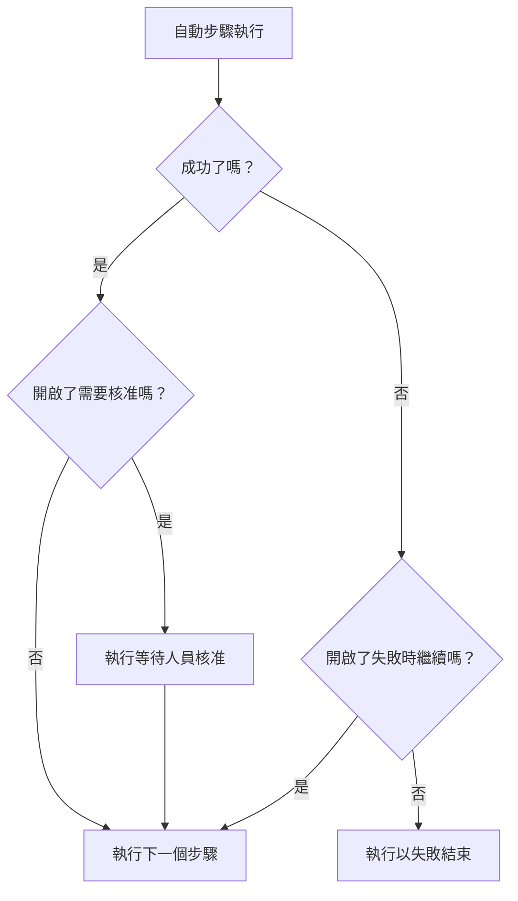

# 撰寫 Runbook

您在 Runbook 的 **步驟** 頁面上把它撰寫成一份有序的步驟清單。本頁說明如何建立 Runbook、如何設定七種步驟類型中的每一種，以及失敗和核准如何改變一次執行的流程。

:::cards
- [建立 Runbook](#建立-runbook): 從空白 Runbook 到已儲存的步驟。
- [步驟類型](#步驟類型): Manual、JavaScript、HTTP request、Bash、SSH、Kubernetes 和 AI。
- [失敗處理與核准](#失敗處理與核准): 步驟失敗或成功時會發生什麼事。
- [完整範例](#完整範例): 以五個步驟完成資料庫容錯移轉。
:::

## 開始之前

- **能撰寫 Runbook 的角色。** Project Owner、Project Admin 和 Runbook Admin 可以建立 Runbook 並儲存其步驟。使用細部權限時，您需要 **Create Runbook** 和 **Edit Runbook** 。請參閱 [權限](/docs/runbooks/configuration#權限)。
- **用於 JavaScript、Bash、SSH 和 Kubernetes 步驟的 Runner。** 這些步驟在您自己基礎架構中的 [Runner](/docs/runbooks/agents) 上執行，絕不在 OneUptime Worker 上執行。請先安裝一個。
- **用於 SSH 和 Kubernetes 步驟的憑證，以及讀取憑證的權限。** 請參閱 [Runbook 憑證](/docs/runbooks/credentials)。只有在您有權讀取 Runbook 憑證時，步驟才能指定憑證：需要 Project Owner、Project Admin 或 **Read Runbook Credential** 。Runbook Admin 不包含此權限。
- **用於 AI 步驟的 LLM 提供者。** 請參閱 [LLM 提供者](/docs/ai/llm-provider)。

## 建立 Runbook

:::steps
### 開啟運行手冊

開啟 **產品 → 運行手冊** 。Runbook 位於 **儀表板與自動化** 群組中。

### 新建 Runbook

點選 **建立操作手冊** ，輸入 **名稱** ，並可選擇輸入說明 Runbook 用途的 **描述** 。 **更多欄位** 下有預設開啟的 **已啟用** 開關和 **標籤** 。新的 Runbook 會出現在清單中：開啟它。

### 新增步驟

進入 **步驟** 。在 **Start your runbook** 下選擇第一個步驟的類型；在最後一個步驟下方， **Add another step** 提供同樣的七種類型。每個步驟開啟時都會帶有 **標題** 、 **描述** （Markdown，向應變人員顯示）以及該類型的設定。Runbook 有了一個步驟後，卡片頂端的 **新增步驟** 會新增一個 Manual 步驟。

### 調整步驟順序

步驟會 **依序** 執行。要調整順序，請拖曳步驟標題左側的把手；使用鍵盤時，將焦點移到把手上，按空白鍵，用方向鍵移動步驟，再按一次空白鍵。

### 儲存步驟

點選 **Save Steps** 。儲存之前，編輯器會顯示 **未儲存的變更** 。儲存後您會看到 **已儲存** ，Runbook 即可 [執行](/docs/runbooks/running)。
:::

## 步驟的組成

每個步驟都有以下欄位：

| 欄位 | 用途 |
| --- | --- |
| **標題** | 顯示在步驟清單和每次執行中的簡短名稱。 |
| **描述** | 給應變人員的選用內容，使用 Markdown。在 Manual 步驟中，這就是人員閱讀的指示。 |
| **失敗時繼續** | 僅限自動步驟。開啟後，步驟失敗不會停止執行：下一個步驟照常執行。 |
| **需要核准** | 僅限自動步驟。開啟後，Runbook 會在此步驟之後暫停，等待人員核准，然後才執行下一個步驟。此開關名為 **在執行下一步驟前需要核准** 。 |
| 類型相關設定 | 指令碼、URL、Runner、憑證或提示詞。請參閱 [步驟類型](#步驟類型)。 |

## 步驟類型

| 類型 | 執行位置 | 需要 |
| --- | --- | --- |
| [Manual](#manual) | 人員 | 無 |
| [JavaScript](#javascript) | Runner | 一個 Runner |
| [HTTP request](#http-request) | OneUptime Worker | 無 |
| [Bash](#bash) | Runner | 一個 Runner |
| [SSH](#ssh) | Runner | 一個 Runner 和一個 SSH 憑證 |
| [Kubernetes](#kubernetes) | Runner | 一個 Runner 和一個 Kubernetes 憑證 |
| [AI](#ai) | OneUptime Worker | 一個 LLM 提供者 |

### Manual

供人員處理的檢查清單項目。執行到達 Manual 步驟時會暫停，並停留在 `WaitingForManualStep`（ **等待您處理** ），直到有人點選 **Mark complete** 或 **略過** 。等待人員處理的執行永遠不會逾時。

用於只有人才能檢查或完成的事情：「在負載平衡器的儀表板中確認流量已切換到備援區域。」

### JavaScript

一段在 `isolated-vm` 沙箱中執行的 JavaScript，執行於您自己基礎架構中的 [Runbook 代理程式](/docs/runbooks/agents) 上，而不是 OneUptime Worker 上。

| 欄位 | 作用 | 預設值 |
| --- | --- | --- |
| **Runner** | 執行此步驟的 Runner。只有這個 Runner 可以認領該工作。 | — |
| **Script** | 要執行的 JavaScript。用 `return` 傳回一個值即可記錄它；`console.log` 的每一行也會被記錄。擲回的錯誤會使步驟失敗。 | — |
| **Execution timeout** | Runner 在拆除沙箱之前允許程式碼執行的時間。 | 30 秒 |
| **Claim timeout** | Worker 等待 Runner 認領工作的時間。 | 2 分鐘 |

```javascript
const start = Date.now();
// ... your logic ...
console.log("replica lag checked");
return { durationMs: Date.now() - start };
```

沙箱有 128 MB 記憶體，無法存取檔案系統或處理程序。它可以用 `axios` 發出 HTTP 請求，但只能發往公開位址：發往私人網路、Runner 本身主機或雲端中繼資料端點的請求會被拒絕。若要存取您網路中的服務，請使用搭配 `curl` 的 [Bash](#bash) 步驟。

### HTTP request

由 OneUptime Worker 發出的對外 HTTP 呼叫。不需要 Runner。

| 欄位 | 作用 | 預設值 |
| --- | --- | --- |
| **Method** | `GET`、`POST`、`PUT`、`PATCH`、`DELETE` 或 `HEAD`。 | `GET` |
| **URL** | 要呼叫的端點。 | 空白 |
| **Headers (JSON)** | 一個 JSON 物件，例如 `{ "Authorization": "Bearer ..." }`。不是有效 JSON 的標頭會使步驟失敗。 | 無 |
| **Body** | 能剖析為 JSON 時以 JSON 傳送，否則以文字傳送。 | 無 |
| **Request timeout** | 在步驟失敗前等待端點回應的時間。 | 30 秒 |

步驟在收到 `2xx` 或 `3xx` 回應時成功，收到其他回應時失敗，錯誤為 `HTTP <status>`。不會追蹤重新導向。回應的狀態、標頭和本文會被記錄，最多 50 KB。

> [!NOTE]
> Worker 絕不會呼叫回送或鏈路本機位址，例如雲端中繼資料端點。在 OneUptime Cloud 上，它只會呼叫公開位址。自行託管的 OneUptime 也能連到私人網路，除非 `DATA_SOURCE_BLOCK_PRIVATE_ADDRESSES` 為 `true`。若要從 OneUptime Cloud 呼叫您網路中的服務，請使用搭配 `curl` 的 [Bash](#bash) 步驟。

適用於：開啟 PagerDuty 事件、張貼到 Slack Webhook、呼叫雲端供應商的 API 或您自己的公開 API。

### Bash

一個 bash 指令碼，在您自己基礎架構中的 [Runbook 代理程式](/docs/runbooks/agents) 上以 `bash -c <script>` 執行。Bash 絕不在 OneUptime Worker 上執行。

| 欄位 | 作用 | 預設值 |
| --- | --- | --- |
| **Runner** | 執行此步驟的 Runner。只有這個 Runner 可以認領該工作。 | — |
| **Bash 指令碼** | 指令碼。輸出（stdout 和 stderr）最多記錄 50 KB，非零的結束代碼會使步驟失敗。 | — |
| **Execution timeout** | Runner 在以 `SIGKILL` 終止指令碼之前允許它執行的時間。若步驟確實需要幾分鐘，請調高此值。 | 30 秒 |
| **Claim timeout** | Worker 等待 Runner 認領工作的時間。 | 2 分鐘 |

指令碼在 Runner 的容器中執行，可使用映像檔內附的工具，例如 `curl`、`wget` 和 `ssh` 用戶端，並擁有其所在主機的網路存取權。例如，檢查只有您的網路才能連到的服務：

```bash
set -euo pipefail
HTTP_CODE=$(curl -s -o /tmp/resp.txt -w "%{http_code}" "http://payments.internal:8080/health")
echo "HTTP $HTTP_CODE"
cat /tmp/resp.txt
if [[ "$HTTP_CODE" != "200" ]]; then
  echo "Health check failed"
  exit 1
fi
```

如果執行到達此步驟時所選的 Runner 離線，步驟會等待至 **claim timeout** （預設 2 分鐘），然後因逾時而失敗。在依賴 Bash 步驟之前，請在 **運行手冊 → Runbook 代理程式** 下新增一個代理程式。

> [!TIP]
> 不要把密碼和權杖寫進指令碼。請將它們儲存為 Runbook 密鑰，並在 Bash 或 JavaScript 指令碼中寫入 `{{runbookSecrets.NAME}}`：Runner 收到的指令碼中會填入該值。請參閱 [供指令碼使用的密鑰](/docs/runbooks/credentials#供指令碼使用的密鑰)。

### SSH

在 Runner 能透過 SSH 連到的主機上執行一個指令。與在 Bash 步驟中使用 `ssh host cmd` 不同，這裡的存取權是受管的 [憑證](/docs/runbooks/credentials)，而不是 Runner 磁碟上的私密金鑰：它靜態加密儲存、指派給特定的 Runner，而且永遠無法透過 API 讀回。

| 欄位 | 作用 |
| --- | --- |
| **Runner** | 開啟連線的 Runner。它必須能透過網路連到該主機。 |
| **Credential** | 一個 SSH 憑證，包含主機、連接埠、使用者以及金鑰或密碼。它必須已指派給您選擇的 Runner，否則步驟會失敗，而不是以錯誤的存取權執行。 |
| **Command** | 以憑證中的使用者身分在遠端主機上執行。輸出最多記錄 50 KB，非零的結束代碼會使步驟失敗。 |
| **Execution timeout** | 涵蓋連線、驗證和執行指令的總時間，因此停滯的指令無法讓步驟一直保持開啟。預設 30 秒。 |
| **Claim timeout** | Worker 等待 Runner 認領工作的時間。預設 2 分鐘。 |

### Kubernetes

重新啟動叢集中的工作負載或調整其規模。這些動作刻意限定為封閉的集合：能修改任意物件的步驟就等於叢集管理員的 Shell，而這種步驟類型的存在，是為了讓常見的修復動作安全到足以用於自動修復。

| 欄位 | 作用 |
| --- | --- |
| **Runner** | 呼叫叢集 API 伺服器的 Runner。它必須能連到 API 伺服器。 |
| **Credential** | 一個 Kubernetes 憑證：API 伺服器的 URL、服務帳戶權杖和叢集的 CA。請將該服務帳戶繫結到只允許您的 Runbook 所需動作的角色。 |
| **操作** | **Restart workload** 修改 Pod 範本，讓控制器重新建立 Pod，效果與 `kubectl rollout restart` 相同。 **Scale workload** 設定副本數量。 |
| **Workload kind** | **部署** 、 **StatefulSet** 或 **DaemonSet** 。 |
| **命名空間** 和 **Workload name** | 要操作的工作負載。 |
| **副本** | 僅在調整規模時使用。允許為零：清空工作負載是合理的修復手段。DaemonSet 在每個節點上執行一個 Pod，無法調整規模；請改為重新啟動它。 |
| **Execution timeout** | Runner 等待 API 伺服器接受變更的時間。預設 30 秒。 |
| **Claim timeout** | Worker 等待 Runner 認領工作的時間。預設 2 分鐘。 |

如果 API 伺服器拒絕變更，步驟上會顯示它自己的訊息，因此權限錯誤會告訴您需要擴大哪個角色繫結。

### AI

在執行過程中請 AI 分析、摘要或做出決定。回答會成為該步驟在執行中的輸出。AI 步驟在 OneUptime Worker 上執行，不需要 Runner。

| 欄位 | 作用 |
| --- | --- |
| **Prompt** | 希望 AI 做什麼。例如：「檢視前面步驟的輸出，判斷繼續進行修復是否安全。」 |
| **LLM provider** | 選用。 **Project default** 使用專案的預設提供者。當步驟需要特定模型時（例如處理不能離開您網路之資料的自行託管模型），請固定一個提供者。請參閱 [LLM 提供者](/docs/ai/llm-provider)。 |
| **Include previous step context** | 開啟後，AI 會看到此步驟之前執行過的所有步驟：標題、類型、狀態、輸出和錯誤訊息。每個步驟的輸出最多提供 4,000 個字元。 |
| **Include trigger context** | 開啟後，AI 會看到啟動這次執行的內容：關聯的事件、警示或排定維護事件（描述、嚴重性、目前狀態、受影響的監測器、根本原因、狀態時間軸和公開備註），或手動執行 Runbook 的人。 |

將 AI 步驟與 **需要核准** 搭配使用，就能讓人始終參與其中：AI 進行分析，人員閱讀回答並核准，然後下一個（修復）步驟才會執行。

**AI 永遠看不到的內容。** AI 步驟的回答會作為步驟輸出儲存在執行中，而任何有 Runbook 讀取權限的人都能讀取執行，這比能看到事件的對象更廣。因此，觸發內容不包含 **私人內部備註** 和 **Slack 與 Microsoft Teams 的頻道訊息** 。前面步驟的輸出會被掃描是否含有機密資訊（權杖、金鑰、憑證），這些內容在傳送給模型之前會被遮蔽。內嵌圖片和很長的編碼資料（例如貼到事件描述中的螢幕擷取畫面）也會被省略，並以一段簡短說明取代。

AI 步驟與其他 AI 功能一樣計量和計費。當步驟沒有提示詞、專案關閉了 AI 功能、沒有可用的 LLM 提供者，或固定的提供者對專案已不再可用時，步驟會失敗，並顯示說明原因的訊息。如果仍希望執行 Runbook 的其餘部分，請開啟 **失敗時繼續** 。

## 失敗處理與核准



預設情況下，步驟失敗會停止執行，並將執行標記為 `Failed`，以該步驟的錯誤作為原因。開啟 **失敗時繼續** 後，失敗會被記錄，下一個步驟照常執行，適合「先試這三件事，然後通知」這類 Runbook。 **需要核准** 在步驟成功之後生效：執行會停在該步驟上，直到有人點選 **Approve & continue** 或 **略過** 。

## 儲存與編輯

對步驟的變更在點選 **Save Steps** 時生效。每次執行都以啟動時建立的快照運作，因此進行中的執行會保留啟動時的步驟，編輯也永遠不會改寫過去執行的歷史。

## 完整範例

一個用於「DB primary unreachable」的 Runbook：

| # | 類型 | 作用 |
| --- | --- | --- |
| 1 | JavaScript | 從您的組態服務取得目前的主要主機並記錄下來。 |
| 2 | Manual | 「確認次要資料庫的複寫延遲低於 5 秒。」 |
| 3 | HTTP request | 對您的容錯移轉協調器 API 發出 `POST`。 |
| 4 | Manual | 「確認寫入現在已轉到新的主要資料庫。」 |
| 5 | HTTP request | 對 Slack Webhook `POST` 一則解除訊息。 |

應變人員看著步驟 1 執行，勾選步驟 2，看著步驟 3 執行，勾選步驟 4，執行以步驟 5 結束。每個步驟的輸出都會被記錄下來，供事後檢討使用。

## 後續步驟

:::cards
- [執行 Runbook](/docs/runbooks/running): 啟動一次執行，並完成、核准或略過其步驟。
- [Runbook 規則](/docs/runbooks/rules): 在相符的事件上自動啟動此 Runbook。
- [Runbook 代理程式](/docs/runbooks/agents): 安裝您的指令碼步驟所需的 Runner。
- [Runbook 憑證](/docs/runbooks/credentials): 為 SSH 和 Kubernetes 步驟提供受管存取權。
:::
