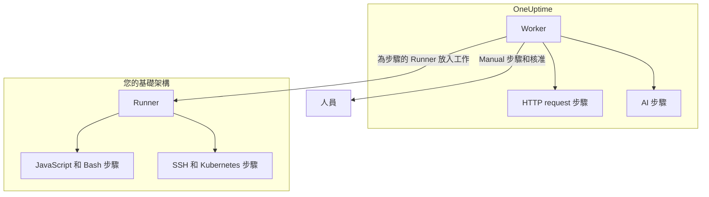

# Runbook 設定與安全

這是給維運人員和安全審查人員的參考：每類步驟在哪裡執行、步驟受哪些限制和逾時約束、誰可以做什麼，以及 Runbook 如何經過強化。

:::cards
- [每種步驟類型的執行位置](#每種步驟類型的執行位置): Worker、Runner 或人員。
- [輸出上限與逾時](#輸出上限與逾時): 步驟受到的每一項限制。
- [權限](#權限): 細部權限、三個 Runbook 角色，以及角色能觸及哪些 Runbook。
- [強化說明](#強化說明): 沙箱、網路存取和 Runner 驗證。
:::

## 每種步驟類型的執行位置

| 步驟類型 | 執行位置 | 方式 |
| --- | --- | --- |
| Manual | 人員 | 執行會一直等待，直到有人完成或略過該步驟。 |
| JavaScript | Runner | 在 `isolated-vm` 沙箱中。 |
| HTTP request | OneUptime Worker | 一次對外 HTTP 呼叫。 |
| Bash | Runner | `bash -c <script>`。 |
| SSH | Runner | 使用 [憑證](/docs/runbooks/credentials) 建立的 SSH 連線。 |
| Kubernetes | Runner | 使用憑證呼叫叢集的 API 伺服器。 |
| AI | OneUptime Worker | 呼叫專案的 LLM 提供者。 |

## Runner 步驟如何分派

JavaScript、Bash、SSH 和 Kubernetes 步驟 **絕不在 OneUptime Worker 上執行** 。它們會以工作的形式分派給特定的 [Runbook 代理程式](/docs/runbooks/agents)：一個您安裝在自己基礎架構中某台主機上的小型處理程序。

分派模型：

1. Runbook 步驟的作者在撰寫步驟時從下拉式清單中選擇一個 Runner。
2. 步驟執行時，Worker 在 `RunnerJob` 中插入一列，`targetAgentId` 設為該 Runner 的 ID，狀態為 `Pending`。
3. 正是這個 Runner（而且只有它）以不可分割的方式認領工作，在本機執行——Bash 透過 `bash -c <script>`，JavaScript 在 `isolated-vm` 沙箱中，SSH 和 Kubernetes 使用步驟的憑證——並傳回結果。
4. Worker 以該結果繼續執行 Runbook。

不再有 `RUNBOOK_BASH_ENABLED` 環境旗標。這些步驟在某個部署中能否運作，完全取決於專案中是否有已連線且開啟了 **執行操作手冊** 的 Runner。

## 輸出上限與逾時

| 限制 | 值 | 適用於 |
| --- | --- | --- |
| 每個步驟的輸出 | **50 KB** 。更長的輸出會被截斷並加上標記。 | 每個自動步驟 |
| 執行逾時 | 預設 **30 秒** | JavaScript、Bash、SSH 和 Kubernetes 步驟 |
| 請求逾時 | 預設 **30 秒** | HTTP request 步驟 |
| 認領逾時 | 預設 **2 分鐘** ：Worker 等待所選 Runner 認領工作、超過即判定失敗的時間 | JavaScript、Bash、SSH 和 Kubernetes 步驟 |
| 逾時範圍 | **1 秒到 1 小時** | 每種逾時 |
| 等待人員 | 無限制 | Manual 步驟和核准 |

在 Runbook 的 **步驟** 頁面上依步驟設定逾時；欄位留空即保留預設值。超出範圍的值會在步驟執行時被限制在範圍內，因此輸入錯誤的設定既無法關閉逾時，也無法無限期佔用 Worker 的位置。

## 權限

Runbook 權限位於 `Runbook` 權限群組中：

- `CreateRunbook`、`EditRunbook`、`DeleteRunbook`、`ReadRunbook` —— 管理 Runbook 範本。
- `CreateRunbookExecution`、`EditRunbookExecution`、`DeleteRunbookExecution`、`ReadRunbookExecution` —— 啟動、勾選、刪除和讀取執行。
- `CreateRunbookRule`、`EditRunbookRule`、`DeleteRunbookRule`、`ReadRunbookRule` —— 管理自動觸發規則。
- `CreateRunner`、`EditRunner`、`DeleteRunner`、`ReadRunner` —— 管理在您自己基礎架構中執行步驟的 Runner。（在更名為 Runner 之前它們叫做 `*RunbookAgent`；現有的授權已經移轉，無需重新指派。）
- `RunbookAdmin`、`RunbookMember`、`RunbookViewer`（角色）—— `RunbookAdmin` 建構 Runbook、其規則以及執行它們的 Runner，並執行 Runbook。`RunbookMember` 開啟 Runbook 及其執行並執行它們（啟動執行、完成或略過其步驟、取消執行），但不建立、變更或刪除任何 Runbook 或 Runner。`RunbookViewer` 只讀取 Runbook 及其執行，不執行任何東西。`RunbookAdmin` 包含上述所有細部權限。

角色會執行其範圍所及的 Runbook。限定於某些標籤的 `RunbookMember`、`RunbookAdmin` 或 `ProjectMember` 授權，可以啟動並推進帶有這些標籤之 Runbook 的執行；限定於 **Owned** 的授權，可以啟動並推進其團隊擁有之 Runbook 的執行；團隊對某個標籤的封鎖會把這些 Runbook 排除在外。`CreateRunbookExecution` 和 `EditRunbookExecution` 針對的是沒有標籤的執行，因此能觸及專案中的每個 Runbook。核准一項會啟動 Runbook 的修復建議，也以同樣方式檢查。

憑證和密鑰不在 `RunbookAdmin` 的範圍內。管理它們需要 `ProjectOwner` 或 `ProjectAdmin`，或者 `CreateRunbookCredential`、`EditRunbookCredential`、`DeleteRunbookCredential`、`ReadRunbookCredential` 和 `CreateRunbookSecret`、`EditRunbookSecret`、`DeleteRunbookSecret`、`ReadRunbookSecret` 權限。請參閱 [Runbook 憑證](/docs/runbooks/credentials)。

**運行手冊 → 設定** 下的擁有者規則和標籤規則同樣不在 `RunbookAdmin` 的範圍內。管理它們需要 `ProjectOwner` 或 `ProjectAdmin`，或者 `CreateRunbookOwnerRule` 和 `CreateRunbookLabelRule` 權限及其對應的編輯、刪除和讀取權限。

關於角色和細部權限如何組合，請參閱 [使用者、團隊與權限](/docs/permissions/index)。

## 佇列與 Worker

Runbook 執行在 `Runbook` BullMQ 佇列上進行。每個 Worker 處理程序最多同時執行 25 個執行；這個數字固定在程式碼中，不透過環境變數設定。

透過 API 勾選手動步驟後，執行會重新加入佇列，從下一個步驟繼續。它會以 `Scheduled` 狀態等待，直到 Worker 再次認領，而佇列中的執行永遠不會因為等待而失敗。

## 強化說明

- **JavaScript、Bash、SSH 和 Kubernetes** 在您掌控的 Runner 主機上執行，而不是在 OneUptime Worker 上。JavaScript 在獨立的 `isolated-vm` 隔離環境中執行，擁有 128 MB 記憶體，無法存取 Runner 的檔案系統或處理程序；它可以用 `axios` 發出 HTTP 請求，但發往私人網路、回送和鏈路本機位址的請求會被拒絕。Bash 以 `bash -c` 執行，其逾時在 Runner 上強制執行。
- **HTTP 步驟** 使用寬鬆的狀態驗證，因此 4xx 或 5xx 回應會被記錄為失敗的步驟，而不是作為例外擲回，記錄的輸出也會反映上游實際傳回的內容。不會追蹤重新導向。Worker 絕不呼叫回送或鏈路本機位址，例如雲端中繼資料端點；在 OneUptime Cloud 上，它也會拒絕私人網路位址，自行託管的 OneUptime 則在設定 `DATA_SOURCE_BLOCK_PRIVATE_ADDRESSES=true` 時拒絕。
- **AI 步驟** 永遠看不到事件的私人備註，也看不到 Slack 和 Microsoft Teams 的訊息；前面步驟的輸出會被掃描是否含有機密資訊，並在到達模型之前被遮蔽。內嵌圖片和很長的編碼資料不會進入提示詞。請參閱 [AI](/docs/runbooks/authoring#ai)。
- **Runner 驗證** 使用 ID 和秘密金鑰，以環境變數設定在 Runner 容器上。在伺服器端，Runner 的權威身分來自與所提供的 ID 和金鑰對應的資料庫列：即使金鑰外洩，用戶端也無法冒充另一個 Runner。
- **憑證和密鑰** 靜態加密儲存，API 永遠不會傳回，只會在指派到的 Runner 認領步驟時交給它們。

## 資料庫資料表

| 資料表 | 內容 |
| --- | --- |
| `Runbook` | 範本：名稱、slug、描述、`isEnabled`、標籤，以及以 JSON 儲存的步驟。 |
| `RunbookExecution` | 每次執行一列，具有可為空值的外鍵 `incidentId`、`alertId` 和 `scheduledMaintenanceId`，以及一個 JSON 陣列 `stepExecutions`，保存步驟和每個步驟狀態的快照。 |
| `RunbookRule` | 自動觸發規則，具有判別欄位 `triggerEntityType`（Incident、Alert、ScheduledMaintenance）、與要啟動之 Runbook 的多對多關聯，以及比對依據：JSON 欄 `criteria`（條件），加上指向監測器、事件嚴重性、警示嚴重性、標籤和監測器標籤的多對多連結，以及標題、描述、監測器名稱和監測器描述的比對模式。 |
| `Runner` | 每個已安裝的 Runner 一列：名稱、秘密金鑰、`lastAlive`、`connectionStatus`、主機資訊和功能。 |
| `RunnerJob` | 每個分派給 Runner 的步驟一列：`targetAgentId`（步驟作者選擇的 Runner）、步驟類型、指令碼或酬載、狀態（`Pending` → `Claimed` → `Running` → `Succeeded`、`Failed`、`TimedOut` 或 `Cancelled`）、認領期限、租約、輸出和結束代碼。 |
| `RunbookCredential` | SSH 和 Kubernetes 憑證，其機密欄位已加密，以及它們指派到的 Runner。 |
| `RunbookSecret` | 已加密的 Runbook 密鑰，以及可以接收它們的 Runner。 |

## 維運建議

- **確保您在步驟上選擇的 Runner 是健康的。** 如果需要備援，可以再執行一個 Runner 並把步驟分配給兩者，或者準備一個指向另一個 Runner 的備用 Runbook。
- **記錄 URL，而不是大量資料。** 如果某個步驟產生超過幾 KB 的輸出，請把它寫入物件儲存或記錄系統，並傳回 URL。
- **冪等性很重要。** 如果 Worker 在步驟進行中重新啟動而執行隨後恢復，HTTP request 或 AI 步驟會再次執行。Runner 上的步驟每次執行最多分派一次，但指令碼可能在失敗前已部分執行，而您也可能再次執行 Runbook。請把步驟設計成可以安全重試。

## 後續步驟

:::cards
- [Runbook 代理程式](/docs/runbooks/agents): 安裝、維運 Runner 並排解問題。
- [Runbook 憑證](/docs/runbooks/credentials): 受管的 SSH 和 Kubernetes 存取權，以及供指令碼使用的密鑰。
- [使用者、團隊與權限](/docs/permissions/index): 角色、標籤和團隊如何決定誰能執行什麼。
:::
