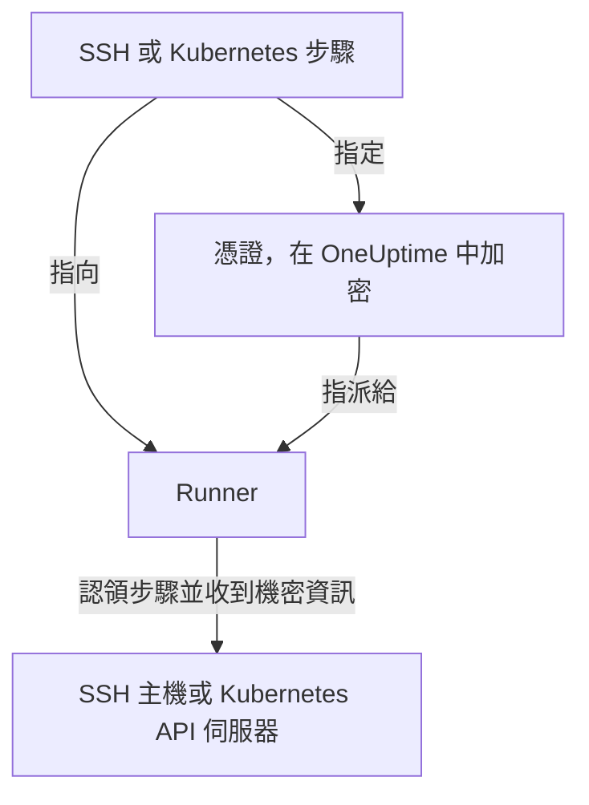

# Runbook 憑證

憑證是 Runbook 連到 **不是** Runner 本身主機之系統的方式：透過 SSH 連線的伺服器，或 Kubernetes 叢集。沒有憑證時，「重新啟動服務」意味著撰寫一個 Shell 指令碼，並手動把金鑰或 kubeconfig 放到 Runner 的主機上，讓它留在 OneUptime 管控之外的磁碟上。憑證把同樣的存取權變成一個受管物件：靜態加密儲存、指派給特定的 Runner，並由步驟依名稱參照。

在 **運行手冊 → Runbook 代理程式 → 憑證** 下管理憑證。

:::cards
- [建立憑證](#建立憑證): 它的存取權，以及可以使用它的 Runner。
- [另一端的最小權限](#另一端的最小權限): 限制金鑰或權杖能做的事。
- [供指令碼使用的密鑰](#供指令碼使用的密鑰): 為 Bash 或 JavaScript 指令碼提供密碼或權杖。
:::

## 憑證的使用方式



SSH 或 Kubernetes 步驟會指定一個憑證和一個 Runner。當該 Runner 認領步驟時，OneUptime 會確認憑證已指派給它，解密其中的機密資訊，並只在對這次認領的回應中交出。機密資訊從不儲存在工作上，也永遠無法透過 API 讀取。

## 開始之前

- **能管理憑證的角色。** Project Owner 和 Project Admin，或擁有 **Create Runbook Credential** 權限的任何人。Runbook Admin 角色不包含此權限。把 SSH 憑證指派給執行 OneUptime AI 指令的 Runner 還需要 **Read Runbook Credential** ；請參閱 [執行 OneUptime AI 指令的 Runner](#執行-oneuptime-ai-指令的-runner)。
- **包含此功能的方案。** 在 OneUptime Cloud 上，Runbook 憑證需要 **Growth** 或更高方案。
- **一個 [Runner](/docs/runbooks/agents)** ，能透過網路連到目標主機或叢集的 API 伺服器。

## 建立憑證

:::steps
### 開啟憑證

開啟 **運行手冊 → Runbook 代理程式 → 憑證** ，點選 **建立Runbook Credential** 。

### 命名並選擇類型

在 **Credential** 步驟中輸入 **名稱** （例如 `prod-cluster`）、選用的 **描述** 以及 **類型** ： **SSH** 或 **Kubernetes** 。類型之後無法變更；如需變更，請建立新的憑證。

### 輸入存取資訊

:::tabs
@tab SSH
在 **SSH 主機** 下輸入 **主機名稱** 、 **連接埠** （留空則為 22）和 **使用者名稱** 。在 **SSH 驗證** 下貼上 **Private Key (PEM)** 及其 **Private Key Passphrase** （如果有），或為不支援金鑰存取的主機輸入 **密碼** 。可以選擇時，金鑰是最佳選擇。
@tab Kubernetes
在 **Kubernetes** 下輸入 **API Server URL** （例如 `https://10.0.0.1:6443`）、 **Service Account Token** 和 **CA Certificate (PEM)** ，讓 Runner 能驗證 API 伺服器。只有當 API 伺服器出示的憑證已受 Runner 信任時，才可以把 CA 留空。
:::

### 指派給 Runner

在 **Runbook 代理程式** 步驟中選擇可以使用此憑證的 Runner，然後點選 **建立Runbook Credential** 。未指派給任何 Runner 的憑證無法被任何步驟使用。

### 在步驟中使用

在 [SSH 或 Kubernetes 步驟](/docs/runbooks/authoring#步驟類型) 中選擇其中一個 Runner，然後在 **Credential** 下選擇該憑證。步驟只會列出與其類型相同的憑證，而儲存指定了憑證的步驟需要讀取 Runbook 憑證的權限。
:::

## 儲存的內容

| 類型 | 欄位 |
| --- | --- |
| SSH | 主機名稱、連接埠（預設 22）、使用者名稱，以及 PEM 私密金鑰（可附複雜密碼）或密碼。 |
| Kubernetes | API 伺服器 URL、服務帳戶權杖和叢集的 CA 憑證。 |

## 機密值只能寫入

私密金鑰、複雜密碼、密碼和服務帳戶權杖都靜態加密儲存，API **永遠不會傳回它們** ：不會傳回給儀表板，不會傳回給工作流程，也不會出現在匯出中。表格可以告訴您憑證 *是什麼* ，但永遠不會顯示其中的內容。

因此，機密值沒有「檢視」，只有「取代」：重新輸入一個值就是輪替它的方式。如果您遺失了原始值，請在目標系統上核發新金鑰，然後更新憑證。

## 將憑證指派給 Runner

憑證只能由您指派的 Runner 使用，而步驟必須指向其中一個。如果步驟指定的憑證沒有指派給它的 Runner， **步驟會失敗而不會執行** ：一個悄悄什麼都沒做的 Runner，看起來和一個成功的 Runner 一模一樣。

指派就是存取邊界，所以請讓範圍盡量小：一個只負責重新啟動某個叢集的 Runner，不需要您資料庫主機的 SSH 金鑰。

### 執行 OneUptime AI 指令的 Runner

在開啟了 **執行 AI 修復指令** 的 Runner 上，OneUptime AI 會從指派給該 Runner 的 SSH 憑證中挑選，用於它在那裡執行的指令。因此，無論先儲存哪一方，SSH 憑證都只能經由有權讀取 Runbook 憑證的人（ **Read Runbook Credential** ，或 Project Owner、Project Admin）到達這樣的 Runner：

- **指派憑證。** 建立包含此類 Runner 的 SSH 憑證，或把此類 Runner 加入憑證，都需要該權限。沒有該權限時，儲存會被拒絕並指出該 Runner：請把憑證指派給不執行 AI 修復指令的 Runner，或請擁有該權限的人來指派。
- **開啟開關。** 為持有 SSH 憑證的 Runner 開啟 **執行 AI 修復指令** 需要同樣的權限。

從憑證中移除 Runner、依憑證現有的 Runner 原樣儲存憑證，以及 Kubernetes 憑證，都不需要額外權限：OneUptime AI 的 kubectl 指令會使用繫結到其叢集的憑證執行。沒有該權限的人所做的憑證指派和開關開啟，在一個專案中會逐一儲存，因此兩者無法一起通過檢查；在另一次儲存進行中到達的儲存會等待它完成，若等待太久，則會以 *Try again in a moment* 被拒絕。請再次儲存。

工作流程的步驟以 Project Admin 的身分執行，但不會借用 Project Admin 讀取 Runbook 憑證的權限：只有當最後儲存工作流程步驟的人擁有該權限時，步驟才擁有它。請參閱 [工作流程步驟可以做什麼](/docs/workflows/configuration#工作流程步驟可以做什麼)。

## 另一端的最小權限

OneUptime 無法限制您的憑證在目標系統上能做什麼：這是目標系統的職責，而且值得去做：

- **SSH** ——優先使用金鑰而非密碼，只給使用者它需要的指令（在可行時使用強制指令或受限的 Shell），不要重複使用管理員的個人金鑰。
- **Kubernetes** ——將服務帳戶繫結到一個 Role，只允許對您的 Runbook 會碰到的工作負載、在它們所在的命名空間中執行 `patch`。 **Restart workload** 修改工作負載本身， **Scale workload** 修改其 `scale` 子資源：不需要更多權限。

例如，一個只能重新啟動和調整一個 Deployment 的規模、其他什麼都不能做的服務帳戶：

```yaml title="oneuptime-runbooks-rbac.yaml"
apiVersion: v1
kind: ServiceAccount
metadata:
  name: oneuptime-runbooks
  namespace: checkout
---
apiVersion: rbac.authorization.k8s.io/v1
kind: Role
metadata:
  name: oneuptime-runbooks
  namespace: checkout
rules:
  # Restart workload: patches the Deployment's pod template.
  - apiGroups: ["apps"]
    resources: ["deployments"]
    resourceNames: ["checkout-api"]
    verbs: ["patch"]
  # Scale workload: patches the Deployment's scale subresource.
  - apiGroups: ["apps"]
    resources: ["deployments/scale"]
    resourceNames: ["checkout-api"]
    verbs: ["patch"]
---
apiVersion: rbac.authorization.k8s.io/v1
kind: RoleBinding
metadata:
  name: oneuptime-runbooks
  namespace: checkout
subjects:
  - kind: ServiceAccount
    name: oneuptime-runbooks
    namespace: checkout
roleRef:
  apiGroup: rbac.authorization.k8s.io
  kind: Role
  name: oneuptime-runbooks
```

對於 StatefulSet 或 DaemonSet，請改用 `statefulsets` 或 `daemonsets`。DaemonSet 無法調整規模，因此不需要 `scale` 規則。

## 供指令碼使用的密鑰

Bash 和 JavaScript 步驟沒有 **Credential** 欄位。若要在不把密碼、權杖或 API 金鑰寫進 Runbook 的情況下把它提供給指令碼，請將其儲存為 **Runbook 密鑰** 。密鑰在 **運行手冊 → 設定 → 密鑰** 下管理，由 Project Owner 和 Project Admin 或擁有 **Create Runbook Secret** 權限的人負責。

:::steps
### 建立密鑰

點選 **建立Runbook Secret** 。在 **密鑰** 步驟中輸入 **名稱** （英文字母、數字、連字號和底線）、選用的 **描述** 以及 **密鑰值** 。在 **存取** 步驟中，於 **可存取此密鑰的操作手冊代理程式** 下選擇 Runner。

### 在指令碼中使用

在需要該值的位置寫入 `{{runbookSecrets.NAME}}`：

```bash
curl -s -X POST \
  -H "Authorization: Bearer {{runbookSecrets.CDN_API_TOKEN}}" \
  "https://api.cdn.example.com/v1/purge"
```

當指派了此密鑰的 Runner 認領步驟時，它收到的指令碼中已填入該值。
:::

與憑證的機密欄位一樣，密鑰的值靜態加密儲存，API 永遠不會傳回： **更新密鑰值** 會取代它。在 OneUptime Cloud 上，Runbook 密鑰同樣需要 **Growth** 或更高方案。

| | 憑證 | Runbook 密鑰 |
| --- | --- | --- |
| 使用者 | SSH 和 Kubernetes 步驟 | Bash 和 JavaScript 指令碼 |
| 內容 | 一台主機及其金鑰，或一個叢集的 URL 和權杖 | 任意單一值 |
| 管理位置 | **運行手冊 → Runbook 代理程式 → 憑證** | **運行手冊 → 設定 → 密鑰** |
| 到達 Runner 的方式 | 在認領指定它的步驟時的回應中 | 填入它所認領步驟的指令碼中 |
| 能否透過 API 再次讀取 | 只能讀取其非機密欄位 | 永遠無法讀取其值 |

## 誰能看到它們

建立、編輯和刪除憑證需要 Runbook 憑證權限（或 Project Owner/Admin）。讀取憑證只會顯示其非機密欄位。

請注意，Runner 的 **代理程式金鑰** 等同於指派給該 Runner 的憑證：任何持有該金鑰的東西都能以該 Runner 的身分認領工作並收到憑證。因此，代理程式金鑰只能由 Project Owner、Project Admin 和 Runbook Admin 讀取：請像對待憑證本身一樣對待它們。

## 後續步驟

:::cards
- [撰寫 Runbook](/docs/runbooks/authoring): 撰寫使用憑證的 SSH 和 Kubernetes 步驟。
- [Runbook 代理程式](/docs/runbooks/agents): 安裝要指派憑證的 Runner。
- [Runbook 設定與安全](/docs/runbooks/configuration): 整個 Runbook 架構的權限和強化。
:::
