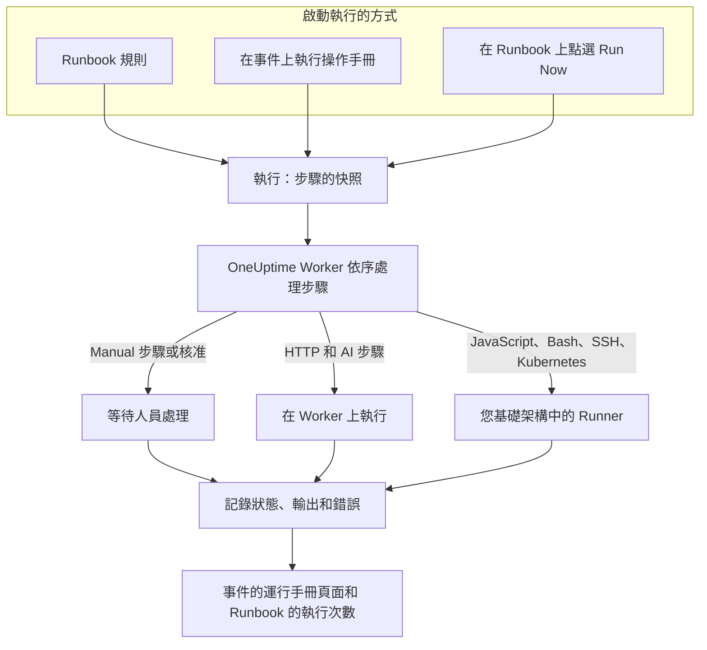

# Runbook 概觀

Runbook 是可重複使用的應變程序：一份由手動步驟和自動步驟組成的有序清單，您可以在事件、警示或排定維護事件上執行它。它把「現在該怎麼辦？」的討論變成一份檢查清單，任何值班人員都能在凌晨 3 點照著執行，指令碼、API 呼叫和核准都已事先寫好。Runbook 是為處理事件的值班工程師，以及將這類應變自動化的平台團隊而設計。

:::cards
- [撰寫 Runbook](/docs/runbooks/authoring): 建立 Runbook 並撰寫其步驟。
- [Runbook 規則](/docs/runbooks/rules): 在新的事件、警示和維護事件上啟動 Runbook。
- [執行 Runbook](/docs/runbooks/running): 啟動一次執行，完成並核准其步驟，或取消它。
- [Runbook 代理程式](/docs/runbooks/agents): 安裝在您自己的基礎架構中執行指令碼的 Runner。
:::

## Runbook 如何執行



每次執行 Runbook 都會建立一次 **執行** 。執行開始時，Runbook 的步驟會複製到其中，OneUptime 會依序逐一處理。Manual 步驟或需要核准的步驟會暫停執行，直到有人處理為止。

HTTP 和 AI 步驟在 OneUptime Worker 上執行。JavaScript、Bash、SSH 和 Kubernetes 步驟在您安裝於自己基礎架構中的 [Runner](/docs/runbooks/agents) 上執行，因此您的指令碼永遠不會在 OneUptime 的伺服器上執行。每個步驟的狀態、輸出和錯誤訊息都會記錄在執行中，而執行會一直保留在它所針對的事件、警示或排定維護事件上。

## 核心概念

| 概念 | 意義 |
| --- | --- |
| **Runbook** | 範本。一個具名、可重複使用的程序，包含有序的步驟清單和 **執行此操作手冊** 開關。 |
| **步驟** | Runbook 中的一個項目。它有類型（Manual、JavaScript、HTTP request、Bash、SSH、Kubernetes 或 AI）、標題、描述以及與類型相關的設定。 |
| **Runbook 規則** | 一條規則，會自動將一個或多個 Runbook 關聯到符合其條件（監測器、嚴重性、標籤、監測器標籤、標題或描述）的事件、警示或排定維護事件。 |
| **執行** | Runbook 的一次執行。在規則觸發、有人在事件上點選 **執行操作手冊** ，或在 Runbook 本身點選 **Run Now** 時建立。它保存步驟的快照，以及每個步驟的狀態和輸出。 |
| **快照** | 保存在每次執行中的 Runbook 步驟凍結副本。之後編輯 Runbook 不會改寫過去執行的歷史。 |
| **Runner** | 您在自己基礎架構中的主機上執行的小型代理程式。它會執行指定它的 JavaScript、Bash、SSH 和 Kubernetes 步驟。也稱為 Runbook 代理程式。 |
| **憑證** | SSH 和 Kubernetes 步驟使用的受管 SSH 或 Kubernetes 存取權。靜態加密儲存，只交給您指派的 Runner。 |
| **密鑰** | 單一值，例如 API 權杖，Bash 或 JavaScript 指令碼以 `{{runbookSecrets.NAME}}` 的形式使用它。靜態加密儲存，只交給您指派的 Runner。 |

## 步驟類型

為每個步驟選擇合適的類型。[撰寫 Runbook](/docs/runbooks/authoring) 說明了每種類型的設定。

| 步驟類型 | 執行位置 | 適用情況 | 範例 |
| --- | --- | --- | --- |
| **Manual** | 人員 | 需要由人檢查、判斷或執行 OneUptime 無法完成的動作。 | 「確認流量已切換到備援區域。」 |
| **JavaScript** | Runner | 需要在沙箱中進行小型、受限的計算。 | 計算副本延遲並決定是否繼續。 |
| **HTTP request** | OneUptime Worker | 呼叫既有的 API：雲端供應商、PagerDuty、Slack Webhook、您自己的服務。 | 對容錯移轉協調器發出 `POST`。 |
| **Bash** | Runner | 需要在您自己的基礎架構上執行 Shell 指令。 | 執行 `kubectl rollout restart` 或復原指令碼。 |
| **SSH** | Runner | 需要以受管的 SSH 憑證在遠端主機上執行一個指令。 | 在 Web 伺服器上重新啟動服務。 |
| **Kubernetes** | Runner | 需要重新啟動或調整 Deployment、StatefulSet 或 DaemonSet 的規模。 | 在 `production` 中重新啟動 `checkout-api`。 |
| **AI** | OneUptime Worker | 想在執行過程中由專案的 LLM 提供者給出分析、摘要或判斷。 | 「檢視上面的診斷結果。現在容錯移轉安全嗎？」 |

一個 Runbook 可以混合所有類型。Runbook 的優勢在於把人工檢查與自動化和 AI 分析交織在一起。

## 啟動執行的方式

| 方式 | 位置 | 執行關聯到 |
| --- | --- | --- |
| Runbook 規則 | **事件** 、 **警示** 或 **排定維護** → **規則** → **Runbook 規則** | 新的事件、警示或排定維護事件 |
| **執行操作手冊** | 事件、警示或排定維護事件的 **運行手冊** 頁面 | 該事件、警示或排定維護事件 |
| **Run Now** | Runbook 的 **概覽** 頁面 | 無：一次臨時執行 |
| 自動修復規則 | 請參閱 [AI SRE](/docs/ai/ai-sre) | 事件或警示 |

如果 Runbook 在 **設定** 頁面上關閉了 **執行此操作手冊** 開關，以上任何方式都不會啟動它。已經開始的執行會繼續進行。

## Runbook 在儀表板中的位置

Runbook 位於 **產品** 下的 **儀表板與自動化** 群組中。

| 頁面 | 在這裡做什麼 |
| --- | --- |
| **產品 → 運行手冊** | 瀏覽、建立和開啟 Runbook。 |
| Runbook 的 **步驟** | 撰寫步驟並調整順序，然後選擇 **Save Steps** 。 |
| Runbook 的 **概覽** | 查看最近的執行和結果，並點選 **Run Now** 。 |
| Runbook 的 **執行次數** | 該 Runbook 的所有執行，可依狀態或開始日期篩選。 |
| Runbook 的 **擁有者** | 新增對它負責的人員和團隊。 |
| Runbook 的 **設定** | 在不刪除 Runbook 的情況下關閉 **執行此操作手冊** 。 |
| **運行手冊 → 執行次數** | 專案中所有 Runbook 的所有執行。 |
| **運行手冊 → Runbook 代理程式** 和 **運行手冊 → Runbook 代理程式 → 憑證** | 安裝 [Runner](/docs/runbooks/agents) 並管理 [憑證](/docs/runbooks/credentials)。 |
| **運行手冊 → 設定** | 管理供指令碼使用的 [密鑰](/docs/runbooks/credentials#供指令碼使用的密鑰)，以及為新 Runbook 新增擁有者和標籤的 **擁有者規則** 和 **標籤規則** 。 |
| **事件 / 警示 / 排定維護 → 規則 → Runbook 規則** | 建立自動啟動 Runbook 的規則。 |
| 事件、警示或維護事件 → **運行手冊** | 查看與其關聯的執行，並點選 **執行操作手冊** 啟動新的執行。 |

## 完整範例

假設每個標題中含有「db-primary」的事件都應啟動一個五步驟的資料庫容錯移轉 Runbook。

:::steps
### 建立 Runbook

在 **運行手冊** 中點選 **建立操作手冊** ，將其命名為「DB primary failover」。開啟它，進入 **步驟** ，新增以下步驟，然後點選 **Save Steps** ：

| # | 類型 | 標題 |
| --- | --- | --- |
| 1 | JavaScript | 記錄容錯移轉前的副本延遲 |
| 2 | Manual | 在 DBA 儀表板中確認副本健康 |
| 3 | HTTP request | 對容錯移轉協調器發出 `POST` |
| 4 | Manual | 確認寫入已轉到新的主要資料庫 |
| 5 | HTTP request | 向 Slack 的 `#db-incidents` 發送解除通知 |

### 新增規則

在 **事件 → 規則 → Runbook 規則** 中，建立一條只有一個條件、並指定要啟動之 Runbook 的規則：

```text
Conditions:  Incident Title starts with db-primary
Runbooks:    [DB primary failover]
```

### 讓它執行

某個監測器開啟了事件 `INC-4821 · db-primary connection timeout`。規則相符，執行開始：

- 步驟 1（JavaScript）在您為它選擇的 Runner 上執行。傳回值（例如 `{ lagMs: 412 }`）會被記錄。
- 步驟 2（Manual）暫停執行，執行顯示 **等待您處理** 。值班人員查看儀表板並點選 **Mark complete** 。
- 步驟 3（HTTP request）執行，`POST` 的回應會被記錄。
- 步驟 4（Manual）再次暫停執行，直到有人完成它。
- 步驟 5（HTTP request）執行，執行變為 **已完成** 。

### 回顧

執行會保留在事件的 **運行手冊** 頁面上。撰寫事後檢討時，每個步驟的輸出、錯誤和耗時一鍵即可查看。
:::

## 常見用途

- **資料庫容錯移轉**：用 JavaScript 記錄狀態，請值班 DBA 確認副本健康（Manual），呼叫協調器（HTTP request），確認 DNS（Manual），發送解除通知（HTTP request）。
- **清除快取**：一次 HTTP 請求，接著一個 Manual 步驟「確認快取命中率正在恢復」。
- **影響客戶的事件**：Manual「在狀態頁面發布更新」，用 HTTP 請求通知支援團隊，用 JavaScript 取得受影響帳戶的清單。
- **排定維護前的預先檢查**：為指標建立快照，與相關人員確認變更時段（Manual），在負載平衡器上開啟維護模式（HTTP request）。
- **先診斷，再修復**：Bash 步驟收集診斷資訊，開啟 **需要核准** 的 AI 步驟讀取這些資訊並建議修復方式，只有在人員核准後，Kubernetes 步驟才會重新啟動工作負載。
- **一律執行的例行檢查**：一條沒有條件的規則，在每個事件上記錄系統狀態，供事後檢討使用。

## Runbook 與 OneUptime 其他功能的關係

- **監測器** 開啟事件和警示， **Runbook 規則** 把它們變成 Runbook 執行：偵測、觸發、應變、記錄。
- **[值班原則](/docs/on-call/schedules)** 決定要呼叫誰。Runbook 決定這個人醒來後要做什麼。
- Slack 和 Microsoft Teams 等 **[工作區連線](/docs/workspace-connections/slack)** 是發布更新的 HTTP 請求步驟的自然目標。
- **[狀態頁面](/docs/status-pages/index)** 常以面向客戶的 Runbook 中的一個 Manual 步驟來更新。

## 後續步驟

:::cards
- [撰寫 Runbook](/docs/runbooks/authoring): 建立您的第一個 Runbook 及其步驟。
- [Runbook 代理程式](/docs/runbooks/agents): 在撰寫 JavaScript、Bash、SSH 或 Kubernetes 步驟之前安裝 Runner。
- [Runbook 規則](/docs/runbooks/rules): 在建立事件時自動啟動 Runbook。
- [Runbook 設定與安全](/docs/runbooks/configuration): 限制、逾時、權限和強化。
:::
