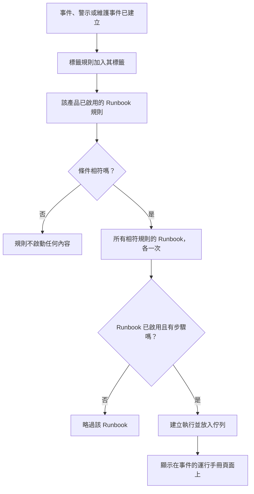

# Runbook 規則

Runbook 規則會在 **事件** 、 **警示** 或 **排定維護事件** 建立時自動啟動 Runbook，這樣在故障當中就沒有人需要記得去執行它們。每個產品在其 **規則** 選單中都有自己的規則頁面：

- 事件 → 規則 → **Runbook 規則**
- 警示 → 規則 → **Runbook 規則**
- 排定維護 → 規則 → **Runbook 規則**

這三個頁面編輯的是同一種規則，只是分別篩選出各自產品的規則。

:::cards
- [建立 Runbook 規則](#建立-runbook-規則): 四個步驟：名稱、條件和要啟動的 Runbook。
- [條件](#條件): 規則可以使用的每個條件項目和運算子。
- [比對邏輯](#比對邏輯): 多條規則、監測器條件和標籤規則。
- [範例](#範例): 三條可以直接複製的規則。
:::

## 規則如何啟動 Runbook



規則觸發時，對它指定的每個 Runbook 都會發生以下過程：

1. 載入 Runbook。
2. 它的步驟以 **快照** 的形式複製到一次新的 Runbook 執行中。
3. 執行被放入 Runbook Worker 的佇列。
4. 執行關聯到來源實體：它會出現在事件、警示或排定維護事件的 **運行手冊** 頁面上，以及 Runbook 的 **執行次數** 清單中。

無論是否由規則啟動，所有執行都可以在 **運行手冊 → 執行次數** 中查看，並可依狀態、Runbook 或開始日期篩選。

## 開始之前

- **一個可以執行的 Runbook。** 它至少需要一個步驟，並在其 **設定** 頁面上開啟 **執行此操作手冊** 。請參閱 [撰寫 Runbook](/docs/runbooks/authoring)。
- **管理規則的權限。** Project Owner、Project Admin 和 Runbook Admin 可以建立 Runbook 規則，擁有 **Create Runbook Rule** 權限的任何人也可以。

## 建立 Runbook 規則

:::steps
### 開啟 Runbook 規則

在 **事件** 、 **警示** 或 **排定維護** 中，開啟 **規則 → Runbook 規則** ，然後點選 **建立Runbook Rule** 。

### 為規則命名

在 **基本資訊** 中輸入 **名稱** ，例如「資料庫事件時啟動 DB 容錯移轉」，並可選擇輸入 **描述** 。

### 新增條件

在 **比對條件** 中點選 **新增條件** ，選擇條件項目和運算子，然後輸入或選擇值。如有需要，可新增更多條件，並選擇 **符合全部** 或 **符合任一** 。若不新增任何條件，則會在此類每個新事件上啟動 Runbook。

### 選擇 Runbook

在 **運行手冊** 中選擇一個或多個 **待開始的執行手冊** ，然後點選 **建立Runbook Rule** 。規則建立後立即生效，並以 **已啟用** 狀態顯示在清單中。
:::

## 規則的組成

| 欄位 | 用途 |
| --- | --- |
| **名稱** | 規則的簡短、易讀名稱。 |
| **描述** | 給團隊成員的選用內容。 |
| **已啟用** | 新規則預設開啟。在規則的編輯表單中關閉它，即可暫停規則而不刪除。 |
| **條件** | 規則比對的內容，位於 **比對條件** 步驟中。留空則比對該類型的每個事件。 |
| **待開始的執行手冊** | 規則觸發時啟動的一個或多個 Runbook。 |

## 條件

每個條件會將事件、警示或排定維護事件的某一項與您提供的值進行比較。Runbook 規則提供的條件項目與該產品的其他規則相同：事件的 Runbook 規則與事件的隱私規則或值班規則比對相同的內容。

| 條件項目 | 檢查的內容 |
| --- | --- |
| **監測器** | 事件或排定維護事件影響的監測器，或觸發警示的監測器。 |
| **事件 嚴重性** / **警示 嚴重性** | 事件或警示的嚴重性。排定維護事件沒有嚴重性，因此其規則不提供此項。 |
| **事件標籤** / **警示標籤** | 事件、警示或維護事件本身的標籤（排定維護規則中此條件項目同樣名為 **事件標籤** ），包括建立時標籤規則加入的標籤。 |
| **監測器標籤** | 其監測器的標籤。為監測器加上 `production` 或 `staging` 標籤，即可只在一個環境中執行 Runbook。 |
| **事件標題** / **警示標題** | 其標題（排定維護規則中此條件項目同樣名為 **事件標題** ）。 |
| **事件描述** / **警示描述** | 其描述（排定維護規則中儀表板使用相同的名稱）。 |
| **監測器名稱** / **監測器描述** | 其監測器的名稱或描述。 |

為每個條件選擇一個運算子：

- 清單類條件項目（ **監測器** 、嚴重性和標籤）對所選值使用 **包含任一** 、 **包含全部** 或 **不包含任何** 。
- 文字類條件項目使用 **包含** （新條件的預設值）、 **不包含** 、 **等於** 、 **不等於** 、 **開頭為** 、 **結尾為** ，或用於不區分大小寫的規則運算式或 `*` 萬用字元的 **符合模式** / **不符合模式** 。文字比較不區分大小寫。

有兩個或更多條件時，選擇 **符合全部** （每個條件都必須為真）或 **符合任一** （至少一個為真）。

## 比對邏輯

- 沒有條件的規則適用於該類型的每個事件（一條全域的「一律執行」規則）。
- 多條規則可以比對同一個事件。每個相符的規則都會觸發，它們的 Runbook 聯集會執行：每個 Runbook 都有自己的執行，兩條相符規則都指定的 Runbook 只會執行一次。
- 監測器條件一次檢查一個監測器。在 **符合全部** 下，「 **監測器名稱** 包含 `api`」和「 **監測器標籤** 包含任一 _Production_」需要同一個監測器同時滿足兩者，而不是各有一個監測器分別滿足。
- Runbook 規則在標籤規則之後執行，因此標籤規則為新事件、警示或維護事件加上的標籤可以啟動 Runbook。
- 建立時就已解決的事件或警示不會啟動 Runbook：它在被記錄之前就已經結束了。請參閱 [宣告時即已確認或已解決](/docs/incidents/declaring-incidents#宣告時即已確認或已解決)。
- 針對另一個產品嚴重性的條件（例如事件規則中的 **警示 嚴重性** ）永遠不可能為真，因此 API 會拒絕儲存。
- 規則只在事件建立時評估一次。之後編輯事件的標題、嚴重性或標籤不會再次觸發規則。

## 範例

### 資料庫事件時進行 DB 容錯移轉

```text
Name:        Start DB failover for DB incidents
Trigger:     Incident
Conditions:  Incident Title matches pattern (?:^|\b)(db|database|postgres|mysql|mongo)
Runbooks:    [DB failover playbook, Notify DBA team]
```

每當建立標題中含有「db」「database」「postgres」等字樣的事件時，這會建立兩次 Runbook 執行。

### 僅針對正式環境的嚴重事件

```text
Name:        Flush the CDN cache for critical production incidents
Trigger:     Incident
Conditions:  Match all
             Monitor Labels has any of Production
             Incident Severities has any of Critical
Runbooks:    [Flush CDN cache]
```

在帶有 _Production_ 標籤的監測器發生嚴重事件時執行，在 staging 上則什麼都不做。

### 一律執行的例行檢查規則

```text
Name:        Always-run pre-flight check
Trigger:     Incident
Conditions:  (none)
Runbooks:    [Capture pre-incident state]
```

在每個事件上觸發：適合為事後檢討記錄系統狀態、指標等快照。

## 已停用的 Runbook

如果規則指定的 Runbook 已關閉（在 Runbook 的 **設定** 頁面上關閉了 **執行此操作手冊** ，即 `isEnabled = false`），規則仍會相符，但 Runbook 執行會被略過。重新開啟開關即可恢復。沒有步驟的 Runbook 也會以同樣方式被略過。

## 測試規則

在正式環境中依賴一條規則之前，請先建立一個符合規則條件的測試事件（或測試警示），並確認預期的 Runbook 出現在其 **運行手冊** 頁面上。

> [!NOTE]
> Runbook 規則只作用於新事件。與標籤規則和擁有者規則不同，它們無法 [在現有紀錄上執行](/docs/configuration/run-rules-now)：那樣會為已經結束的事件啟動 Runbook。

## 疑難排解

:::details 規則相符了，但沒有 Runbook 執行
請依以下順序檢查：

- 規則處於 **已啟用** 狀態。
- 每個 Runbook 都在其 **設定** 頁面上開啟了 **執行此操作手冊** ，並且至少有一個已儲存的步驟。
- 事件或警示在建立時並非已解決狀態。
- Runbook 的執行並不只是在等待：從事件的 **運行手冊** 頁面開啟它。Manual 步驟或核准會顯示 **等待您處理** 。
:::

:::details 規則從不相符
規則看到的是事件建立時的樣子，以及那一刻標籤規則加入的標籤。之後變更的標籤、嚴重性或標題不會被看到。有多個條件時，請核對 **符合全部** 與 **符合任一** ，並記得所有監測器條件都必須適用於同一個監測器。
:::

:::details API 以「can only be used by」拒絕規則
嚴重性條件項目屬於某一個產品。事件規則中的 **警示 嚴重性** ，或警示規則中的 **事件 嚴重性** ，永遠不可能相符，因此規則會被拒絕，並顯示類似「Alert Severities can only be used by alert runbook rules.」的訊息。請移除該條件。儀表板只提供每個產品自己的條件項目。
:::

## 後續步驟

:::cards
- [執行 Runbook](/docs/runbooks/running): 規則啟動執行時，應變人員會看到什麼。
- [撰寫 Runbook](/docs/runbooks/authoring): 撰寫由您的規則啟動的 Runbook。
- [宣告事件](/docs/incidents/declaring-incidents): 事件如何建立，以及規則何時看到它們。
:::
