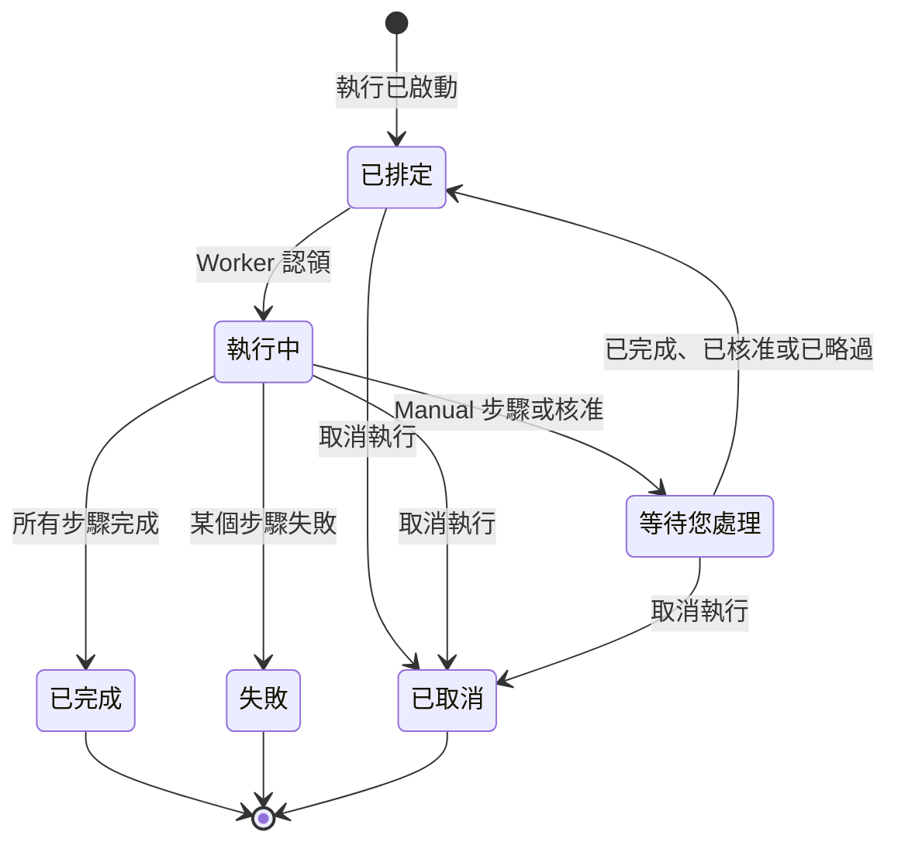

# 執行 Runbook

Runbook 的每次執行都是一次 **執行** ：一份 Runbook 步驟的快照，依序逐一處理，並記錄每個步驟的狀態和輸出。本頁面向處理事件、啟動執行並推動其進行的人員：執行如何開始、執行頁面顯示什麼，以及如何完成、核准、略過和取消步驟。

:::cards
- [啟動執行](#啟動執行): 從事件、警示或維護事件啟動，或從 Runbook 本身啟動。
- [執行檢視](#執行檢視): 執行進行中每個步驟顯示的內容。
- [完成、核准和略過步驟](#完成核准和略過步驟): 哪個步驟在什麼時候接受決定。
- [疑難排解](#疑難排解): 無法開始或無法結束的執行。
:::

## 執行的流程

新的執行處於 **已排定** 狀態，直到某個 Worker 認領它並將其標記為 **執行中** 。在 Manual 步驟，或在需要核准的步驟之後，它會以 **等待您處理** 暫停，一旦有人處理就重新進入佇列。等待人員處理的執行永遠不會逾時。執行最終以 **已完成** 、 **失敗** 或 **已取消** 結束。

## 啟動執行

Runbook 執行有三種建立方式：

1. **透過規則自動啟動**：當相符的事件、警示或排定維護事件被建立時，[Runbook 規則](/docs/runbooks/rules) 會啟動執行。自動修復規則也可以啟動執行；請參閱 [AI SRE](/docs/ai/ai-sre)。
2. **從事件手動啟動**：在事件、警示或排定維護事件上點選 **執行操作手冊** 。執行會關聯到該事件。
3. **從 Runbook 頁面手動啟動**：在 Runbook 的 **概覽** 頁面上點選 **Run Now** 。這次執行不會關聯到任何事件、警示或排定維護事件。

手動啟動的方式：

:::tabs
@tab 從事件啟動
1. 開啟事件、警示或排定維護事件，進入其 **運行手冊** 頁面。
2. 點選 **執行操作手冊** 。 **執行操作手冊** 對話方塊會列出專案中已啟用的 Runbook。
3. 點選 Runbook 旁邊的 **Run** 。這次執行會出現在該事件的清單中：點選 **檢視** 開啟它。
@tab 從 Runbook 啟動
1. 從 **運行手冊** 開啟 Runbook。
2. 在其 **概覽** 上點選 **Run Now** 。
3. 執行頁面會開啟。
:::

啟動執行需要 Project Owner、Project Admin、Project Member、Runbook Admin 或 Runbook Member，或 **Create Runbook Execution** 權限。Runbook Viewer 和 Viewer 看到的 **Run Now** 處於鎖定狀態，並附有原因。請參閱 [權限](/docs/runbooks/configuration#權限)。

## 執行檢視

開啟一次執行即可看到它的檢查清單。頁面頂端顯示執行的 **狀態** 、 **Progress** （已完成的步驟數與總步驟數）、 **已開始** （開始時間）和 **觸發者** （由什麼啟動）。每個步驟顯示：

- **狀態徽章** ——待處理、執行中、等待您處理、完成、已略過、失敗或已取消。
- **標題和描述** ——在執行開始時從 Runbook 複製而來。
- **Output** （可摺疊）——stdout、傳回值、HTTP 回應或 AI 的回答。
- 步驟失敗時的 **錯誤訊息** 。
- 在執行正在等待的步驟上： **Mark complete** （Manual 步驟）或 **Approve & continue** （開啟 **需要核准** 的步驟），以及 **略過** 。
- 執行暫停期間，在之後不需要核准的自動步驟上顯示 **略過** 。

執行進行期間，頁面每 30 秒會自動重新整理。點選 **重新整理** 可立即查看最新狀態。

## 完成、核准和略過步驟

只有執行正在等待的那個步驟可以被完成、核准或略過，讓執行繼續進行。Manual 步驟或開啟 **需要核准** 的步驟，在執行到達之前無法勾選或略過：它們的作用就是讓執行停下來，所以只有當執行停在那裡時（對於核准，是步驟已經執行、您能看到其輸出時）才接受決定。

執行暫停期間，您也可以略過之後不需要核准的自動步驟，這樣執行繼續時它就不會執行。執行仍會停在等待您的那個步驟上。步驟執行期間無法略過：請等執行暫停，或取消執行。每個步驟都會記錄是誰完成或略過了它。

| 步驟 | 完成或核准 | 略過 |
| --- | --- | --- |
| 執行正在等待的步驟 | 是 | 是 |
| 之後未開啟 **需要核准** 的自動步驟 | 否 | 是，在執行暫停期間 |
| 之後的 Manual 步驟，或開啟 **需要核准** 的步驟 | 否 | 否 |
| 步驟執行期間的任何步驟 | 否 | 否 |

完成、核准、略過和取消需要與啟動執行相同的角色，或 **Edit Runbook Execution** 權限。

## 交替使用手動與自動步驟

典型流程：

| # | 步驟 | 會發生什麼事 |
| --- | --- | --- |
| 1 | Bash：記錄系統狀態 | 執行一開始就在它的 Runner 上執行。 |
| 2 | Manual：「用狀態頁面橫幅通知客戶。」 | 執行暫停，直到有人點選 **Mark complete** 。 |
| 3 | HTTP request：透過 PagerDuty 呼叫 DBA | 在 Worker 上執行。 |
| 4 | Manual：「確認次要資料庫現在是主要資料庫。」 | 執行再次暫停。 |
| 5 | HTTP request：向 Slack Webhook 發送解除通知 | 執行，執行變為 **已完成** 。 |

步驟 2 和 4 會暫停執行，直到有人勾選它們。步驟 1、3 和 5 會自動執行。整個過程是一次執行、一條時間軸、一個可信的事實來源。

## 取消一次執行

在執行頁面上點選 **取消執行** 。狀態變為 `Cancelled`，之後的步驟都不會開始。已經在執行的步驟不會被中斷，但其結果不會被記錄：該步驟維持 `Cancelled`。仍在等待 Runner 的工作會被取消；已經在執行指令碼的 Runner 會把它執行完，但結果不會被接受。

## 輸出限制

每個步驟的輸出上限為 **50 KB** ，以免失控的指令碼撐大資料庫。更長的輸出會被截斷並加上標記。如果需要更大的產出物，請在指令碼中把它寫入物件儲存或記錄系統，並輸出其 URL。

## 再次執行 Runbook

執行是一次性、不可變更的紀錄。要再次執行，請在已結束的執行上點選 **再次執行** ，或在 Runbook 上點選 **Run Now** 。兩者都會依據 Runbook 目前的步驟建立一次新的執行，且不關聯任何事件。若要在某個事件上再次執行，請在該事件的 **運行手冊** 頁面上使用 **執行操作手冊** 。原本的執行保持不變，作為稽核軌跡。

## 尋找過去的執行

| 位置 | 顯示內容 |
| --- | --- |
| Runbook 的 **執行次數** | 該 Runbook 的所有執行，附有狀態和開始日期篩選，以及 **觸發者** 欄。 |
| **運行手冊 → 執行次數** | 專案中所有 Runbook 的所有執行。 |
| 事件、警示或維護事件的 **運行手冊** 頁面 | 關聯到它的執行。一旦有執行，事件的概覽中也會顯示。 |

## 疑難排解

:::details Run Now 被鎖定
您的角色可以讀取 Runbook，但無法執行它們：按鈕顯示「您沒有在此專案中啟動操作手冊執行的權限。」請申請 Runbook Member 角色或 **Create Runbook Execution** 權限。
:::

:::details 啟動執行時失敗，顯示「Runbook is disabled」或「Runbook has no steps to run」
Runbook 的 **執行此操作手冊** 開關在其 **設定** 頁面上被關閉了，或者它沒有已儲存的步驟。請開啟開關或新增步驟，然後點選 **Save Steps** 。
:::

:::details 步驟因缺少 Runner 或憑證而失敗
訊息類似於「Bash step is missing a Runner. Pick one under Runbooks → Runners.」該步驟儲存時沒有選擇 **Runner** ，或者 SSH 或 Kubernetes 步驟儲存時沒有選擇 **Credential** 。開啟 Runbook 的 **步驟** ，選擇缺少的項目，點選 **Save Steps** ，然後再次執行 Runbook。
:::

:::details 步驟因沒有 Runbook 代理程式認領而失敗
訊息是「No runbook agent picked up this step before the wait window expired.」該步驟的 Runner 沒有在其 claim timeout 內認領工作。請在 **運行手冊 → Runbook 代理程式** 中確認 Runner 為 **已連線** ，且 **執行操作手冊** 已開啟。請參閱 [Runbook 代理程式](/docs/runbooks/agents#疑難排解)。
:::

:::details 執行已經等待了好幾個小時
等待人員處理的執行永遠不會逾時。開啟它，在顯示 **等待您處理** 的步驟上採取行動，或點選 **取消執行** 。
:::

:::details 某個步驟表示它可能只執行了一部分
執行該步驟的 OneUptime Worker 重新啟動或停止回應，執行被標記為失敗，而不是一直停滯。再次執行 Runbook 之前，請先檢查目標系統。
:::

## 後續步驟

:::cards
- [撰寫 Runbook](/docs/runbooks/authoring): 在需要由人決定的地方加入 Manual 步驟和核准。
- [Runbook 規則](/docs/runbooks/rules): 在新事件上自動啟動執行。
- [Runbook 代理程式](/docs/runbooks/agents): 讓您的步驟所需的 Runner 保持連線。
:::
