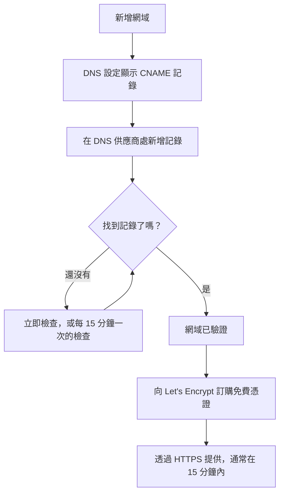

# 狀態頁品牌與網域

狀態頁是客戶會看的唯一一個 OneUptime 畫面，所以它應該看起來像您自己的頁面，並放在您自己的網域上，例如 `status.yourcompany.com`。本頁逐張卡片說明 **品牌** 頁面，然後把狀態頁放到您的網域上：新增網域，新增一筆 DNS 記錄，免費的 SSL 憑證就會自動隨之而來。

:::cards
- [品牌頁面](#品牌頁面): 標誌、標題、網站圖示、連結、頁尾、顏色與語言。
- [自訂 HTML、CSS 與 JavaScript](#自訂-htmlcss-與-javascript): 內建設定涵蓋不到的一切。
- [自訂網域](#自訂網域): 您自己的主機名稱，附帶免費憑證。
- [狀態欄](#解讀網域的狀態欄): 每個網域在通往 HTTPS 的路上走到了哪一步。
:::

## 各項品牌設定的位置

開啟一個狀態頁，其側邊選單的 **品牌** 區塊中有三個項目：

| 頁面 | 在那裡設定什麼 |
| ---- | ------------------ |
| **品牌** | 標誌與封面圖片、頁面標題與描述、網站圖示、頁首連結、概覽頁面描述、著作權行與頁尾連結。摺疊在 **更多設定** 下的：歷史圖表顏色、語言與搜尋引擎索引。 |
| **自訂網域** | 您自己的網域、它的 DNS 記錄以及免費的 SSL 憑證。 |
| **HTML、CSS 與 JavaScript** | 標頭 HTML、頁尾 HTML、自訂 CSS、自訂 JavaScript。 |

有三項看起來像品牌設定的內容，實際位於 **狀態頁面 → 您的頁面 → 進階 → 進階設定**（`{id}/settings`），因為它們決定的是頁面顯示什麼，而不是頁面的外觀：整體正常運作時間百分比、哪些監測器狀態會計入停機時間，以及「Powered by OneUptime」這一行。三者都是那裡 **狀態頁面顯示的內容** 卡片中的列。

品牌設定以前分散在 **基本品牌**、**頁首**、**頁尾**、**概覽頁面** 與 **語言** 幾個獨立的畫面中。它們的舊地址（`{id}/header-style`、`{id}/footer-style`、`{id}/overview-page-branding` 與 `{id}/languages`）現在都會開啟 **品牌** 頁面，所以舊的書籤與連結仍然有效。

## 品牌頁面

**狀態頁面 → 您的頁面 → 品牌 → 品牌**（`{id}/branding`）。每張卡片各自儲存。在標誌、標題與網站圖示之後，卡片會依狀態頁由上而下的順序排列：頁首的連結、概覽頂端的文字，然後是頁尾。很少人修改的內容摺疊在底部的 **更多設定** 下。

### 標誌與封面圖片

第一張卡片 **標誌與封面圖片** 有一個 **Edit Images** 按鈕，會開啟兩個步驟：

| 步驟 | 欄位 |
| ---- | ------ |
| **標誌** | 標誌上傳（預留位置 `Upload logo`）與 **Logo Alt Text**（預留位置 `Logo of My Company`）。替代文字留空時，會改用狀態頁的標題。 |
| **封面圖片** | **封面**，用於頁首後方寬橫幅的上傳（預留位置 `Upload cover image`），以及 **Cover Image Alt Text**。如果封面純屬裝飾，替代文字請留空。 |

標誌、封面圖片與網站圖示是上傳到狀態頁自身專案中的檔案，每次儲存其中任何一個時都會檢查這一點，無論是透過儀表板、API、Terraform 還是工作流程。上傳到其他專案的檔案會被拒絕，提示與已不存在的檔案相同："The logo's file could not be found. Upload the logo again."、"The cover image's file could not be found. Upload the cover image again." 或 "The favicon's file could not be found. Upload the favicon again." 從頁面重新上傳圖片即可解決。

您的狀態頁只會顯示其自身專案的圖片；無法顯示的圖片會被省略，就像頁面沒有圖片一樣。儀表板、API 與 Terraform 讀取頁面圖片的方式相同：來自其他專案的圖片會以沒有圖片的形式傳回。頁面寄出的電子郵件（寄給訂閱者，以及寄給私人使用者、關於其登入的郵件）以同樣的方式顯示標誌：頁面無法顯示的標誌也會從郵件中省略，而不是顯示為一張破損的圖片。

### 標題、描述與網站圖示

- **標題與描述**：卡片註明這些內容也用於 SEO。**編輯** 會開啟 **頁面標題**（預留位置 `Please enter page title here.`）與 **頁面描述**。搜尋引擎與連結預覽會顯示它們，所以請為客戶而不是為您的團隊撰寫。
- **Favicon**：**Edit Favicon** 會開啟 **Favicon** 上傳：瀏覽器分頁中的小圖示。

### 頁首連結

**標頭連結** 表包含狀態頁頁首中的連結，例如您的網站、文件或支援入口網站。每個連結都有 **標題** 與 **連結**（一個 URL，預留位置 `https://link.com`），您可以拖曳它們來調整順序。沒有連結時，表格會顯示 **此狀態頁面沒有狀態頁首連結**，下方是 **建立狀態頁面 頁首 連結**。

### 概覽頁面描述

**概覽頁面描述** 是狀態頁概覽上的第一項內容，位於公告、整體狀態與您的資源之上。**編輯描述** 會開啟一個 markdown 欄位。用它寫一句背景說明：這個頁面涵蓋什麼，以及到哪裡取得支援。您放進去的圖片會顯示給頁面的每位訪客。

### 頁尾

- **著作權資訊**：**Edit Copyright** 會開啟一個欄位 **著作權資訊**，預留位置為 `Acme, Inc.`。
- **頁尾連結**：與頁首連結相同的 **標題** 與 **連結** 組合，透過拖曳排序。沒有連結時，會顯示「此狀態頁面沒有狀態頁尾連結。」

頁首連結用於導覽；頁尾連結用於細則，例如法律聲明、隱私權與條款。

### 更多設定

頁面的最後一個區塊摺疊在 **更多設定** 下，因為很少有人會修改其中的內容。摺疊時，其標題會列出它的四個區塊（**預設長條顏色**、**長條顏色規則**、**語言** 與 **搜尋引擎索引**），並顯示與新狀態頁初始設定不同的每一項：不同於每個頁面初始綠色的預設長條顏色、任何長條顏色規則、不是英文的預設語言、較短的語言清單，或已關閉的搜尋引擎索引。點選即可展開：它是一張卡片，四個區塊上下排列，每個都有自己的標題與按鈕，以分隔線隔開。

**歷史圖表顏色。** 這是狀態頁上僅有的內建顏色設定。

- **歷史圖表的預設長條顏色**：**Edit Default Bar Color** 會開啟 **預設長條顏色** 選擇器。每個新狀態頁都從綠色開始。設定了長條顏色規則時，它也是沒有任何規則符合的那一天的顏色。頁面沒有資料的日子一律顯示為灰色。
- **Rules for Bar Colors of History Chart**：一張有序的規則表，透過拖曳排序。每條規則都有 **當正常運作時間百分比大於或等於** 與 **然後,使用此長條顏色**；表格的欄名為 `When Uptime Percent >=` 與 `Then, Bar Color is`。新規則的顏色已經預先選好，是其他規則尚未使用的顏色；請改為您想要的顏色。順序很重要，所以請依您希望的評估順序排列規則。沒有規則時，每天的長條會採用當天最低的監測器狀態的顏色。

圖表涵蓋多少天不在這裡設定。那是 **進階 → 進階設定** 上 **狀態頁面顯示的內容** 卡片中的 **正常運作時間歷史記錄**，範圍為 1 到 90 天。哪些監測器狀態算作停機，則是同一卡片同一列中的 **計為停機時間**。

**語言。** **語言** 區塊會設定訪客在頁面頁尾看到的語言切換器。**編輯語言** 會開啟兩個欄位：

| 欄位 | 作用 |
| ----- | ------------ |
| **預設語言** | 首次造訪者看到的語言，從一個以該語言本身與英文同時命名每種語言的清單中選擇（`Deutsch (German)`）。預設為英文，訪客隨時都可以在頁尾切換。 |
| **已啟用的語言** | 一個多選方塊，預留位置 `All languages`。留空則提供所有支援的語言；只選幾種，頁尾就只列出這些語言。 |

OneUptime 內建十七種語言：英文、德文、法文、西班牙文、義大利文、葡萄牙文、荷蘭文、丹麥文、挪威文、瑞典文、俄文、日文、韓文、簡體中文、繁體中文、印地文與波斯文。

**搜尋引擎索引。** 一個開關 **允許搜尋引擎索引此狀態頁面** 決定 Google、Bing 等搜尋引擎能否收錄該頁面。它預設開啟。沒有 **編輯** 按鈕：開關會在切換的那一刻儲存。關閉後，頁面會附帶 `noindex, nofollow`（一個 robots 中繼標記與一個 `X-Robots-Tag` 回應標頭）提供；擁有連結的任何人仍然可以開啟它。搜尋引擎可能需要幾週時間才會移除已經收錄的頁面。

> [!TIP]
> 當頁面僅供內部使用或仍在建置中時，請關閉 **允許搜尋引擎索引此狀態頁面**，以免一個半成品頁面開始出現在您品牌名稱的搜尋結果中。

## 正常運作時間百分比與停機狀態

兩者都位於 **狀態頁面 → 您的頁面 → 進階 → 進階設定**（`{id}/settings`）上 **狀態頁面顯示的內容** 卡片的 **正常運作時間歷史記錄** 列中。沒有 **編輯** 按鈕：每一項都會在您變更的那一刻儲存。

- **顯示整體正常運作時間百分比**：一個開關，預設關閉。開啟時，旁邊的 **精確度** 會決定百分比顯示幾位小數：`99%`、`99.9%`、`99.99%`（預設）或 `99.999%`。在 OneUptime Cloud 上，開啟百分比需要 **Scale** 方案；它的精確度在任何方案上都可以變更。
- **計為停機時間**：以彩色標籤顯示的監測器狀態，這些狀態下的時間會在此頁面上計入停機時間。例如，您可以在這裡決定效能降低的狀態是否計入停機時間。至少會保留一個狀態處於選取狀態。

它們以前是兩張獨立的卡片 **整體正常運作時間百分比** 與 **停機監測器狀態**，各自藏在一個 **編輯** 按鈕後面。卡片的其餘部分請參閱 [決定頁面上顯示什麼](/docs/status-pages/index#決定頁面上顯示什麼)。

## 自訂 HTML、CSS 與 JavaScript

**狀態頁面 → 您的頁面 → 品牌 → HTML、CSS 與 JavaScript**（`{id}/custom-code`）有四張卡片，每張各自編輯，並儲存在狀態頁的一個欄位中：

| 卡片 | 欄位 | 包含的內容 |
| ---- | ------ | ------------- |
| **標頭 HTML** | `headerHTML` | 加入頁面頁首的 HTML（預留位置 `Insert Custom HTML here.`）。 |
| **頁尾 HTML** | `footerHTML` | 加入頁面頁尾的 HTML。 |
| **自訂 CSS** | `customCSS` | 整個頁面的樣式（預留位置 `Insert Custom CSS here.`）。 |
| **自訂 JavaScript** | `customJavaScript` | 頁面執行的指令碼（預留位置 `Insert Custom JavaScript here.`）。 |

> [!IMPORTANT]
> 自訂 HTML、CSS 與 JavaScript 只會在已驗證的自訂網域上提供。它們在預設地址 `/status-page/:id` 上是關閉的，因為該地址與 OneUptime 的已登入來源相同。

在 OneUptime Cloud 上，新增或變更其中任何一項都需要 **Growth** 方案。清空任何一項在所有方案上都可以，所以試用期間加入的自訂程式碼隨時都可以移除。

**沒有主題選擇器。** OneUptime 狀態頁沒有主題或品牌色設定：任何地方唯一的內建顏色設定，就是 **品牌** 頁面 **更多設定** 下的 **預設長條顏色** 與歷史圖表長條顏色規則。字型、背景色、強調色與版面調整都透過 **自訂 CSS** 實現。如果您一直在找「品牌色」欄位，答案就在這裡：沒有這樣的欄位，這個文字方塊就是實現它的方式。

> [!WARNING]
> 自訂 JavaScript 會在訪客的瀏覽器中執行，而且是在人們恰恰認為出了問題時才會開啟的頁面上執行。請保持它精簡，盡量自行託管它載入的內容，並在依賴它之前先測試。

## 自訂網域

根據預設，狀態頁可以透過其 **概覽** 畫面上的預覽 URL 存取。若要把它放到您自己的主機名稱上，請前往 **狀態頁面 → 您的頁面 → 品牌 → 自訂網域**（`{id}/domains`）。

**自訂網域** 卡片說明了該怎麼做：把每個網域的 CNAME 記錄指向您安裝的狀態頁 CNAME 記錄，OneUptime 就會為該網域核發 SSL 憑證並替您續約。尚未設定任何內容時，表格會顯示 **找不到自訂網域**，下方是 **建立狀態頁面 網域**。表格有兩欄 **網域** 與 **狀態**，以及 **網域**、**CNAME 有效** 與 **SSL 已佈建** 的篩選器。

把頁面放到您的網域上需要三個步驟，只有前兩步需要您來做：

1. **新增網域**：一個子網域與一個您已驗證的網域。
2. **新增它的 CNAME 記錄**：在您的 DNS 供應商處新增。新增網域後，**DNS 設定** 對話方塊會立即顯示該記錄。
3. **免費的 SSL 憑證會自動核發**：一找到記錄就會核發。沒有需要點選的按鈕。



### 開始之前

- **父網域必須已驗證。** **網域** 下拉式清單只會列出在 **專案設定 → 網域** 中驗證過的網域，您在那裡用 TXT 記錄證明自己擁有某個網域。欄位旁邊的 **新增網域** 連結會在新分頁中開啟該頁面。
- **您的安裝需要一個狀態頁 CNAME 記錄。** OneUptime Cloud 已經有了。在自行託管的安裝中，請把它設為指向您 OneUptime 伺服器的主機名稱（A 記錄），並確認伺服器在 80 連接埠上回應，Let's Encrypt 會在那裡進行檢查。沒有它時，卡片與 **DNS 設定** 對話方塊會顯示 "Custom Domains not enabled for this OneUptime installation"，而不是顯示記錄。

:::tabs
@tab Docker Compose
```ini title="config.env"
STATUS_PAGE_CNAME_RECORD=oneuptime.yourcompany.com
```
@tab Kubernetes
```yaml title="values.yaml"
statusPage:
  cnameRecord: oneuptime.yourcompany.com
```
:::

### 新增網域

:::steps
#### 開啟 建立狀態頁面 網域

在 **自訂網域** 上點選 **建立狀態頁面 網域**。對話方塊只有一頁。

#### 輸入子網域

在 **子網域**（預留位置 `status (leave blank for root)`）中只輸入標籤，例如 `status`，而不是完整的主機名稱。留空或輸入 `@` 可使用根網域（apex）。

#### 選擇網域

在 **網域**（預留位置 `Select domain`）中選擇一個您已驗證的網域。未驗證的網域不會出現在清單中，因為它會被拒絕。

#### 使用免費憑證，或上傳您自己的憑證

**更多欄位** 預設摺疊，其標題會說明該網域將使用哪種憑證：「我們為此網域核發免費的 SSL 憑證並自動續約。」只有在使用您自己的憑證時才需要展開它：開啟 **上傳自訂憑證**，然後以 PEM 格式貼上 **憑證** 與 **憑證私密金鑰**。此時兩者都是必填項目。

#### 建立網域

點選 **建立狀態頁面 網域**。對話方塊關閉，新網域的 **DNS 設定** 會開啟，其中顯示要新增的記錄。
:::

網域的完整名稱在新增時就固定了，因此 **編輯** 只能變更它的憑證。若要使用另一個子網域，請新增該網域並刪除舊的網域。

### DNS 設定與驗證

**DNS 設定** 對話方塊會顯示要在 DNS 供應商處新增的記錄，每列一個欄位，每個欄位都有複製按鈕：

| 欄位 | 輸入什麼 |
| ----- | ------------- |
| **類型** | `CNAME` |
| **名稱** | 您新增的完整網域，例如 `status.yourcompany.com` |
| **值** | 您安裝的狀態頁 CNAME 記錄 |

> [!NOTE]
> 對於沒有子網域的根網域，對話方塊會加上一則說明：許多 DNS 供應商不允許在那裡使用 CNAME 記錄。請改用您供應商的 ALIAS、ANAME 或 CNAME 扁平化記錄，填入相同的值。

OneUptime 每 15 分鐘檢查一次每個未驗證的網域，一旦您的記錄生效就會完成驗證，無論您是否回來查看。若要立即檢查，請點選 **立即檢查**：

- **尚未找到記錄。** 對話方塊會保持開啟，並說明它尋找的是哪筆記錄。新的 DNS 記錄可能需要一段時間才會出現：稍後再點選 **立即檢查**，或交給每 15 分鐘一次的檢查。
- **已找到記錄。** 對話方塊會顯示「您的 CNAME 記錄已驗證。」以及憑證接下來會發生什麼。免費憑證會在那一刻訂購。

在網域通過驗證並且憑證就緒之前，它所在的列會有一個 **DNS 設定** 動作，會開啟同一個對話方塊。對於憑證訂購一直失敗或憑證已過期的已驗證網域，那裡的 **立即檢查** 會重新訂購，並顯示上一次訂購失敗的原因。每個網域每 15 分鐘最多訂購一次；在這段期間，OneUptime 會自行不斷重試。

### SSL 憑證

每個自訂網域都會取得 Let's Encrypt 核發的免費憑證，核發與續約都是自動的。不需要點選任何東西：

- **立即檢查** 會在找到記錄的那一刻訂購憑證。接著對話方塊會說明憑證通常在 15 分鐘內生效。
- 當每 15 分鐘一次的檢查驗證了某個網域時，它會在同一次檢查中為該網域訂購憑證。
- 續約是自動的，會在憑證到期前很早進行。如果在續約憑證時您的 DNS 短暫沒有回應，憑證會繼續提供，並在之後的嘗試中續約。DNS 檢查失敗絕不會移除仍然有效的憑證。

新憑證會在核發後 15 分鐘內提供，因為憑證就是以這個頻率寫入回應您網域的伺服器。狀態欄說的是 _通常_ 在 15 分鐘內：當許多網域同時等待時，它們會被分批處理。

每個 OneUptime 憑證都透過一個共用的 Let's Encrypt 帳戶訂購，而 Let's Encrypt 會限制一個帳戶在短時間內可以下的新訂單數量，以及同一網域的訂單可以失敗的次數。OneUptime 會讓它所有的訂單（新網域、**立即檢查**、重新核發與續約）合計保持在這些限制之內，並且續約一律優先，這樣大量新網域永遠不會耽誤讓現有網域保持上線的續約。

如果訂購失敗，網域的狀態欄會顯示出來，下一行附有原因，**DNS 設定** 中的 **立即檢查** 也會顯示。OneUptime 會自行繼續嘗試，每連續失敗一次就多等一會兒，這樣一個訂單一直失敗的網域不會耗盡其他所有網域需要的訂單。常見原因是您的網域上有不允許 `letsencrypt.org` 的 CAA 記錄，以及在自行託管的安裝中 Let's Encrypt 無法透過 80 連接埠連到伺服器；在自行託管的安裝中，worker 記錄裡有詳細資訊。修正原因後，點選 **立即檢查** 即可立即重新訂購。每個網域每 15 分鐘最多下一筆訂單；在這段期間點選會顯示上一次訂購的結果。

如果您在 **更多欄位** 下上傳了自己的憑證，OneUptime 會改為提供該憑證，在儲存後 15 分鐘內生效。請在它到期之前，透過編輯網域上傳替換憑證。

### 重新核發憑證

自動續約能涵蓋一般情況，但有時您需要立刻取得一張全新的憑證：一把您不想再保留的私密金鑰、一張您自己的掃描器不認可的憑證，或者一個在上游發生了變更的網域。一旦為某個網域訂購了免費憑證，它所在的列就會顯示 **Reissue SSL** 動作。

它的對話方塊 **Reissue SSL Certificate for this Status Page** 會向 Let's Encrypt 為該網域申請一張新憑證，並用它取代正在提供的憑證。在這段期間，您的狀態頁會繼續使用現有憑證保持上線，新憑證會在 15 分鐘內提供。點選 **Reissue SSL Certificate** 即可訂購。

> [!NOTE]
> 每個網域每 24 小時只能重新核發一次。Let's Encrypt 會限制同一網域的核發頻率，而每個 OneUptime 憑證都透過一個共用帳戶訂購，包括讓其他所有人的頁面保持上線的自動續約。在這段時間內，對話方塊會告訴您還剩多久，而不會下單。如果當時正在為該網域訂購憑證，或者安裝的 Let's Encrypt 訂單暫時用完了，對話方塊會說明這一點，不會訂購任何內容，這次點選也不會計為您的重新核發。

使用您上傳憑證的網域不會出現這個動作：沒有可以重新核發的 Let's Encrypt 憑證，所以請改為透過編輯網域上傳新憑證。在網域的第一張憑證訂購之前也不會出現，而第一張憑證會在其 CNAME 記錄驗證後自動訂購。

同樣的按鈕與同樣的 24 小時限制，也出現在 **儀表板 → 您的儀表板 → 品牌 → 自訂網域** 下的儀表板自訂網域上，它們的運作方式與狀態頁自訂網域相同：請參閱 [共用與公開儀表板](/docs/dashboards/sharing#自訂網域)。

### 解讀網域的狀態欄

**狀態** 欄會以七種狀態之一，說明每個網域在通往 HTTPS 的路上走到了哪一步。訂購失敗時，原因位於下一行。

| 狀態欄顯示的內容 | 意義 |
| --------------------------- | ------------- |
| 等待 DNS：請新增 CNAME 記錄。 | 尚未找到 CNAME 記錄。開啟 **DNS 設定** 查看記錄，在您的 DNS 供應商處新增它，然後點選 **立即檢查** 或等待每 15 分鐘一次的檢查。 |
| 正在核發免費憑證，通常會在 15 分鐘內完成。 | 記錄已驗證，憑證正在訂購或寫入。不需要任何動作。 |
| 暫時無法核發免費憑證。我們會繼續嘗試。 | 記錄已驗證，但訂購其憑證失敗了，原因見下一行。修正原因後，開啟 **DNS 設定** 並點選 **立即檢查**，即可立即重新訂購。 |
| 憑證已過期。我們會繼續嘗試續約。 | 由於續約失敗，網域的憑證已過期。開啟 **DNS 設定** 並點選 **立即檢查**，即可立即續約並查看原因。 |
| 憑證已核發，將自動續約。 | 完成。網域透過 HTTPS 提供其憑證，由 OneUptime 負責續約。 |
| 憑證已核發，但續約失敗。我們會繼續嘗試。 | 網域仍在提供有效的憑證，但上一次續約失敗了，原因見下一行。OneUptime 會在憑證到期前很早再次嘗試。 |
| 正在使用您上傳的憑證。 | 記錄已驗證，網域使用您上傳的憑證提供服務。 |

:::details 新增記錄很久之後，網域仍停留在「等待 DNS」
檢查記錄的名稱是否為完整網域，例如 `status.yourcompany.com`，以及它的值是否與您安裝的 CNAME 記錄完全一致。在根網域上，請使用 ALIAS、ANAME 或扁平化的 CNAME 記錄。然後在 **DNS 設定** 中點選 **立即檢查**。
:::

:::details 狀態欄顯示無法核發免費憑證
在您的網域上尋找沒有包含 `letsencrypt.org` 的 CAA 記錄；在自行託管的安裝中，檢查您的伺服器是否在 80 連接埠上回應。修正原因後，在 **DNS 設定** 中點選 **立即檢查** 重新訂購。
:::

### 誰可以檢查與重新核發

**立即檢查**、訂購網域憑證與 **Reissue SSL** 都會變更網域，因此需要編輯該網域的權限：**Edit Status Page Domain**，或包含該權限的角色（Project Owner、Project Admin、Project Member、Status Page Admin 或 Status Page Member）。

只能讀取該網域的人，例如 Viewer 或 Status Page Viewer，仍然可以看到 **狀態** 欄以及 **DNS 設定** 中要新增的記錄。對他們來說，**立即檢查** 與 **Reissue SSL** 處於鎖定狀態，並會說明需要哪項權限。無論如何，OneUptime 都會繼續自行檢查每個網域並訂購其憑證。

API 金鑰也是如此。只能讀取狀態頁網域的金鑰無法在 `/status-page-domain` 上呼叫 `verify-cname`、`order-ssl` 或 `reissue-ssl`。如有需要，請授予它 **Read Status Page Domain** 與 **Edit Status Page Domain**。

## Powered by OneUptime

「Powered by OneUptime」這一行不是品牌設定。它是 **狀態頁面 → 您的頁面 → 進階 → 進階設定**（`{id}/settings`）上 **狀態頁面顯示的內容** 卡片的最後一個開關：**顯示「Powered By OneUptime」品牌標示**，預設開啟。關閉它即可隱藏這一行；它會立即儲存。在 OneUptime Cloud 上，隱藏它需要 **Scale** 方案。

## 後續步驟

:::cards
- [狀態頁概觀](/docs/status-pages/index): 頁面顯示什麼，以及誰可以檢視。
- [狀態頁資源與群組](/docs/status-pages/resources-and-groups): 選擇訪客在頁面上實際看到的內容。
- [訂閱者與公告](/docs/status-pages/subscribers): 帶有您標誌並連結到您網域的電子郵件。
- [公開 API](/docs/status-pages/public-api): 以 JSON 形式讀取頁面，在您自己的網域上也可以。
:::
