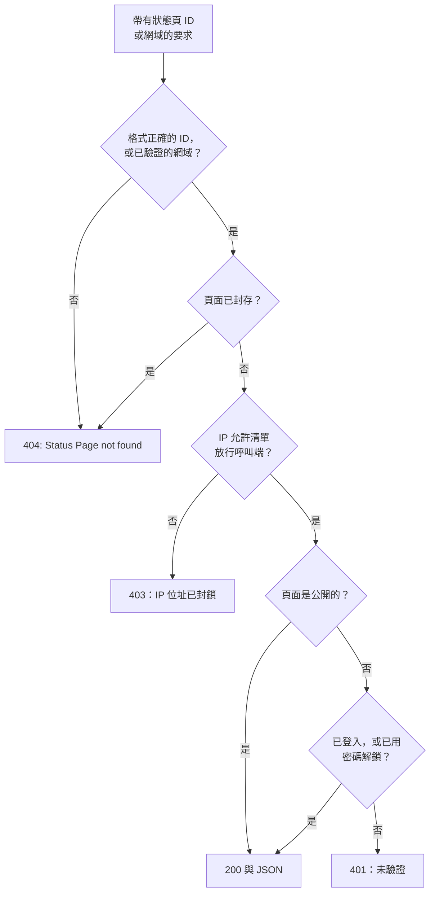

# 公開 API

每個狀態頁都會回應一小組唯讀的 JSON 端點：它的概覽、運作率、事件、片段、排定維護事件與公告。這些正是狀態頁自己載入的端點，所以回傳的內容與訪客看到的完全相同，公開頁面也不需要 API 金鑰。可以用它們在你自己的應用程式、聊天機器人或牆上的顯示器中呈現狀態。

:::cards
- [端點](#端點): 頁面顯示的每類內容都有一個端點。
- [讀取概覽](#讀取概覽): 一個要求取得整個頁面，提供 curl、Node.js 與 Python 範例。
- [指定日期範圍的運作率](#指定日期範圍的運作率): 依資源與群組統計的運作率，最長 90 天。
- [錯誤](#錯誤): 每個狀態碼的意義。
:::

## 要求如何得到回應

每個要求都以 ID 或某個自訂網域指定狀態頁。OneUptime 會找到該頁面，套用與訪客相同的存取規則，然後以 JSON 回應。



私人頁面只會回應已登入該頁面或已用密碼解鎖它的瀏覽器：API 讀取的是與頁面相同的工作階段。指令碼請使用公開頁面。請參閱[限制誰能看到這個頁面](/docs/status-pages/index#限制誰能看到這個頁面)。

格式正確但不屬於任何狀態頁的 ID，會走與私人頁面相同的路徑，得到 `401`。如果公開頁面回應 `401`，請檢查 ID。

## 開始之前

- **狀態頁 ID。** 在儀表板中開啟該頁面（**狀態頁面 → 所有狀態頁面**，然後選擇該頁面）。其 **概覽** 上的 **狀態頁面詳細資料** 卡片會顯示 **狀態頁面 ID**。
- **基礎 URL。** 下方所有端點都位於 `/status-page-api` 之下：

| 頁面執行的位置 | 基礎 URL |
| ------------------- | -------- |
| OneUptime Cloud | `https://oneuptime.com/status-page-api` |
| 自行託管的 OneUptime | `https://<your-oneuptime-host>/status-page-api` |
| 頁面的自訂網域 | `https://status.example.com/status-page-api` |

下方路徑中寫著 `{statusPageIdOrDomain}` 的地方，可以傳入頁面 ID 或它的某個已驗證自訂網域，例如 `status.example.com`。運作率端點只接受 ID。

## 端點

| 端點 | 方法 | 回傳 |
| -------- | ------- | ------- |
| `/overview/{statusPageIdOrDomain}` | `GET`、`POST` | 概覽顯示的一切：整體狀態、資源與群組、進行中的事件與片段、排定維護、目前的公告，以及運作率長條背後的資料。 |
| `/uptime/{statusPageId}` | `POST` | 指定日期範圍內，每個資源與每個群組的運作率百分比。 |
| `/incidents/{statusPageIdOrDomain}` | `GET`、`POST` | 頁面列出的事件，以及它們的公開備註與狀態變化。 |
| `/incidents/{statusPageIdOrDomain}/{incidentId}` | `POST` | 一個事件。 |
| `/episodes/{statusPageIdOrDomain}` | `POST` | 頁面列出的事件片段。 |
| `/episodes/{statusPageIdOrDomain}/{episodeId}` | `POST` | 一個片段。 |
| `/scheduled-maintenance-events/{statusPageIdOrDomain}` | `GET`、`POST` | 頁面列出的排定維護事件，以及它們的公開備註與狀態變化。 |
| `/scheduled-maintenance-events/{statusPageIdOrDomain}/{scheduledMaintenanceId}` | `POST` | 一個排定維護事件。 |
| `/announcements/{statusPageIdOrDomain}` | `GET`、`POST` | 頁面列出的公告。 |
| `/announcements/{statusPageIdOrDomain}/{announcementId}` | `POST` | 一則公告。 |

這些端點會遵循頁面自身的設定，也就是 **狀態頁面顯示的內容** 卡片中的設定（請參閱[決定頁面上顯示什麼](/docs/status-pages/index#決定頁面上顯示什麼)）：

- 已關閉的清單會拒絕對應的端點，例如回傳 `Incidents are not enabled on this status page.`
- 每個清單回溯的天數由它的 **顯示最近 … 天** 設定決定（預設 14）。事件清單還會包含所有尚未解決的事件，排定維護清單還會包含所有即將開始或正在進行的事件。
- 以 ID 要求時，事件、片段、維護事件或公告無論多舊都會回傳，因此指向舊項目的連結仍然有效。頁面完全不顯示的項目（例如不在頁面上的監控器的事件）會回傳空清單，片段則回傳 `404`。

**頁面回傳哪些事件。** 事件端點會回傳頁面上監控器的事件，扣除限定到其他狀態頁的事件；如果頁面只顯示限定到它自己的事件，還會扣除所有沒有限定到此頁面的事件（請參閱[每個受眾一個狀態頁](/docs/status-pages/one-status-page-per-audience)）。事件限定到哪些頁面，永遠不會出現在回應中。

## 讀取概覽

概覽就是取得整個頁面的一個要求。它與狀態頁繪製的資料相同，最多是 15 秒前的資料。

:::tabs
@tab curl
```bash
curl https://oneuptime.com/status-page-api/overview/YOUR_STATUS_PAGE_ID
```
@tab Node.js
```javascript title="status.mjs"
// Node.js 18 or later: fetch is built in. Run with `node status.mjs`.
const statusPageId = "YOUR_STATUS_PAGE_ID";

const response = await fetch(
  `https://oneuptime.com/status-page-api/overview/${statusPageId}`,
);
const body = await response.json();

if (!response.ok) {
  throw new Error(`${response.status}: ${body.error}`);
}

console.log(body.overallStatus?.name); // "Operational"
```
@tab Python
```python title="status.py"
# Python 3, standard library only. Run with `python3 status.py`.
import json
import urllib.request

STATUS_PAGE_ID = "YOUR_STATUS_PAGE_ID"
url = f"https://oneuptime.com/status-page-api/overview/{STATUS_PAGE_ID}"

with urllib.request.urlopen(url, timeout=10) as response:
    overview = json.load(response)

print((overview.get("overallStatus") or {}).get("name"))  # Operational
```
:::

整體狀態是頁面上監控器與監控器群組目前狀態中最差的那一個，也就是優先順序最高的那一個。一個監控器狀態如下所示：

```json
{
  "_id": "cc80b385-4190-42a3-ae8b-9b391e90d79f",
  "name": "Operational",
  "color": { "_type": "Color", "value": "#2ab57d" },
  "isOperationalState": true,
  "priority": 1
}
```

### 概覽回傳的內容

| 鍵 | 內容 |
| --- | ------------- |
| `overallStatus` | 頁面的整體狀態，也就是上面那樣的監控器狀態；頁面上什麼都沒有時為 `null`。 |
| `statusPage` | 頁面的公開設定：標題、說明、品牌，以及顯示的內容。 |
| `statusPageResources` | 每個資源：顯示名稱、說明、群組、監控器或監控器群組，以及顯示選項。 |
| `resourceGroups` | 群組；巢狀群組帶有 `parentStatusPageGroupId`。 |
| `monitorStatuses` | 專案的所有監控器狀態，依優先順序由低到高排列。 |
| `monitorGroupCurrentStatuses`、`monitorsInGroup` | 頁面上每個監控器群組的目前狀態，以及其中的監控器。 |
| `monitorStatusTimelines`、`uptimeDailyAggregate`、`monitorGroupMergedDowntime`、`statusPageHistoryChartBarColorRules` | 繪製運作率長條所用的資料，以及頁面的長條顏色規則。 |
| `activeIncidents`、`incidentPublicNotes`、`incidentStateTimelines`、`incidentStates` | 頁面顯示的未解決事件、它們的公開備註與狀態變化，以及專案的事件狀態。 |
| `timelineIncidents` | 運作率長條時間範圍內的事件（包括已解決的），用於長條的提示說明。 |
| `activeEpisodes`、`episodePublicNotes`、`episodeStateTimelines` | 事件片段的相同內容。 |
| `scheduledMaintenanceEvents`、`scheduledMaintenanceEventsPublicNotes`、`scheduledMaintenanceStateTimelines`、`scheduledMaintenanceStates` | 即將開始或正在進行的排定維護事件，以及它們的公開備註與狀態變化。 |
| `activeAnnouncements` | 目前顯示中的公告：已經開始且尚未結束。 |

## 指定日期範圍的運作率

`POST /uptime/{statusPageId}` 會回傳頁面上每個資源與群組在兩個日期之間的運作率。兩個日期都是選用的：

| 欄位 | 預設值 | 說明 |
| ----- | ------- | ----- |
| `startDate` | 14 天前 | ISO 8601 格式的日期與時間。 |
| `endDate` | 現在 | 不能早於 `startDate`。範圍最長 90 天。 |

:::tabs
@tab curl
```bash
curl -X POST https://oneuptime.com/status-page-api/uptime/YOUR_STATUS_PAGE_ID \
  -H "Content-Type: application/json" \
  -d '{"startDate": "2026-09-01T00:00:00Z", "endDate": "2026-09-30T23:59:59Z"}'
```
@tab Node.js
```javascript title="uptime.mjs"
// Node.js 18 or later. Run with `node uptime.mjs`.
const statusPageId = "YOUR_STATUS_PAGE_ID";

const response = await fetch(
  `https://oneuptime.com/status-page-api/uptime/${statusPageId}`,
  {
    method: "POST",
    headers: { "Content-Type": "application/json" },
    body: JSON.stringify({
      startDate: "2026-09-01T00:00:00Z",
      endDate: "2026-09-30T23:59:59Z",
    }),
  },
);
const uptime = await response.json();

for (const group of uptime.groupUptimes) {
  console.log(group.statusPageGroupName, group.uptimePercent);
}
```
@tab Python
```python title="uptime.py"
# Python 3, standard library only. Run with `python3 uptime.py`.
import json
import urllib.request

STATUS_PAGE_ID = "YOUR_STATUS_PAGE_ID"

request = urllib.request.Request(
    f"https://oneuptime.com/status-page-api/uptime/{STATUS_PAGE_ID}",
    data=json.dumps(
        {"startDate": "2026-09-01T00:00:00Z", "endDate": "2026-09-30T23:59:59Z"}
    ).encode(),
    headers={"Content-Type": "application/json"},
    method="POST",
)

with urllib.request.urlopen(request, timeout=10) as response:
    uptime = json.load(response)

for group in uptime["groupUptimes"]:
    print(group["statusPageGroupName"], group["uptimePercent"])
```
:::

回應：

```json
{
  "statusPageResourceUptimes": [
    {
      "statusPageResourceId": {
        "_type": "ObjectID",
        "value": "cfffa3c3-fdf3-4cd7-9585-d6d408a14663"
      },
      "uptimePercent": 99.98,
      "statusPageResourceName": "Checkout API",
      "currentStatus": {
        "_id": "cc80b385-4190-42a3-ae8b-9b391e90d79f",
        "name": "Operational",
        "color": { "_type": "Color", "value": "#2ab57d" },
        "isOperationalState": true,
        "priority": 1
      }
    }
  ],
  "groupUptimes": [
    {
      "statusPageGroupId": {
        "_type": "ObjectID",
        "value": "df7632c4-c5c0-453c-88bf-9ee3d68d45f2"
      },
      "parentStatusPageGroupId": null,
      "uptimePercent": 99.98,
      "statusPageResourceUptimes": [
        {
          "statusPageResourceId": {
            "_type": "ObjectID",
            "value": "8175534f-aa77-456c-ad5b-b8e7b85876aa"
          },
          "uptimePercent": 99.98,
          "statusPageResourceName": "Web app",
          "currentStatus": {
            "_id": "cc80b385-4190-42a3-ae8b-9b391e90d79f",
            "name": "Operational",
            "color": { "_type": "Color", "value": "#2ab57d" },
            "isOperationalState": true,
            "priority": 1
          }
        }
      ],
      "statusPageGroupName": "Web",
      "currentStatus": {
        "_id": "cc80b385-4190-42a3-ae8b-9b391e90d79f",
        "name": "Operational",
        "color": { "_type": "Color", "value": "#2ab57d" },
        "isOperationalState": true,
        "priority": 1
      }
    }
  ],
  "startDate": "2026-09-01T00:00:00.000Z",
  "endDate": "2026-09-30T23:59:59.000Z"
}
```

| 鍵 | 內容 |
| --- | ------------- |
| `statusPageResourceUptimes` | 不屬於任何群組的資源，也就是訪客在頁面頂端看到的那些。 |
| `groupUptimes` | 每個群組一項。群組的 `uptimePercent` 與 `currentStatus` 涵蓋它底下的所有資源，包括巢狀群組；它的 `statusPageResourceUptimes` 只列出直接位於該群組中的資源。請用 `parentStatusPageGroupId` 重建樹狀結構。 |
| `uptimePercent` | 依資源或群組自身的精確度捨入。資源或群組不顯示運作率百分比時為 `null`。 |
| `currentStatus` | 資源或群組不顯示目前狀態時為 `null`。 |

當一段時間的監控器狀態屬於頁面的 **計為停機時間** 狀態之一時，這段時間會計為停機。

## 事件、片段、維護與公告

清單端點除了 `POST` 也回應 `GET`；單一項目的端點與片段端點回應 `POST`。

:::tabs
@tab curl
```bash
# The incidents the page lists
curl https://oneuptime.com/status-page-api/incidents/YOUR_STATUS_PAGE_ID

# One scheduled maintenance event
curl -X POST https://oneuptime.com/status-page-api/scheduled-maintenance-events/YOUR_STATUS_PAGE_ID/EVENT_ID
```
@tab Node.js
```javascript title="incidents.mjs"
// Node.js 18 or later. Run with `node incidents.mjs`.
const statusPageId = "YOUR_STATUS_PAGE_ID";

const response = await fetch(
  `https://oneuptime.com/status-page-api/incidents/${statusPageId}`,
);
const { incidents } = await response.json();

for (const incident of incidents) {
  console.log(incident.title, incident.currentIncidentState?.name);
}
```
@tab Python
```python title="incidents.py"
# Python 3, standard library only. Run with `python3 incidents.py`.
import json
import urllib.request

STATUS_PAGE_ID = "YOUR_STATUS_PAGE_ID"
url = f"https://oneuptime.com/status-page-api/incidents/{STATUS_PAGE_ID}"

with urllib.request.urlopen(url, timeout=10) as response:
    incidents = json.load(response)["incidents"]

for incident in incidents:
    print(incident["title"], (incident.get("currentIncidentState") or {}).get("name"))
```
:::

| 端點 | 回應中的鍵 |
| -------- | -------------------- |
| 事件 | `incidents`、`incidentPublicNotes`、`incidentStateTimelines`、`incidentStates`、`statusPageResources`、`monitorsInGroup` |
| 片段 | `episodes`、`episodePublicNotes`、`episodeStateTimelines`、`incidentStates`、`statusPageResources`、`monitorsInGroup` |
| 排定維護事件 | `scheduledMaintenanceEvents`、`scheduledMaintenanceEventsPublicNotes`、`scheduledMaintenanceStateTimelines`、`scheduledMaintenanceStates`、`statusPageResources`、`monitorsInGroup` |
| 公告 | `announcements`、`statusPageResources`、`monitorsInGroup` |

單一項目的要求會以相同的鍵回應，其中只包含那一筆記錄。

## 錯誤

發生錯誤時會回傳一個狀態碼，以及說明原因的 JSON 內文：

```json
{ "error": "You can only get uptime for 90 days. Please select a date range within 90 days." }
```

| 狀態 | 何時出現 |
| ------ | ---- |
| `400` | 要求了頁面不顯示的內容（例如已關閉的清單），或者運作率範圍超過 90 天，或結束時間早於開始時間。 |
| `401` | 頁面是私人的，而要求既沒有已登入的工作階段，也沒有該頁面的密碼。格式正確但不屬於任何狀態頁的 ID 也會得到 `401`。 |
| `403` | 頁面的 IP 允許清單中沒有呼叫端的位址。 |
| `404` | ID 格式不正確、沒有相符的已驗證自訂網域，或頁面已封存。頁面不顯示的片段也會得到 `404`。 |

## 讀取狀態頁的其他方式

- **RSS。** 每個狀態頁都提供 `/rss`，這是其事件、公告與排定維護事件的訂閱來源。請參閱[可嵌入的徽章與 RSS 訂閱來源](/docs/status-pages/index#可嵌入的徽章與-rss-訂閱來源)。
- **llms.txt。** 每個狀態頁都在 `/rss` 旁邊提供 `/llms.txt`，它會為 AI 代理指出 RSS 訂閱來源與概覽 JSON 的位置。
- **MCP。** AI 代理可以透過 OneUptime 的 MCP 伺服器 `https://oneuptime.com/mcp` 讀取頁面，不需要 API 金鑰，只要把頁面 ID 或網域當作 `statusPageIdOrDomain` 傳入。此功能預設開啟；可在頁面側邊選單的 **人工智慧 → MCP** 中以 **啟用 MCP 伺服器** 關閉。請參閱 [MCP 伺服器](/docs/ai/mcp-server)。
- **REST API。** 若要建立或變更狀態頁、資源、訂閱者與公告，請使用 API 金鑰呼叫 [OneUptime API](/docs/api-reference/api-reference)。

## 後續步驟

:::cards
- [狀態頁概觀](/docs/status-pages/index): 狀態頁顯示什麼，以及誰能看到它。
- [狀態頁資源與群組](/docs/status-pages/resources-and-groups): 這些端點回傳的資源與群組。
- [每個受眾一個狀態頁](/docs/status-pages/one-status-page-per-audience): 為什麼一個頁面列出的事件，另一個頁面卻沒有列出。
- [狀態頁品牌與網域](/docs/status-pages/branding-and-domains): 在你自己的網域上提供頁面與這些端點。
:::
