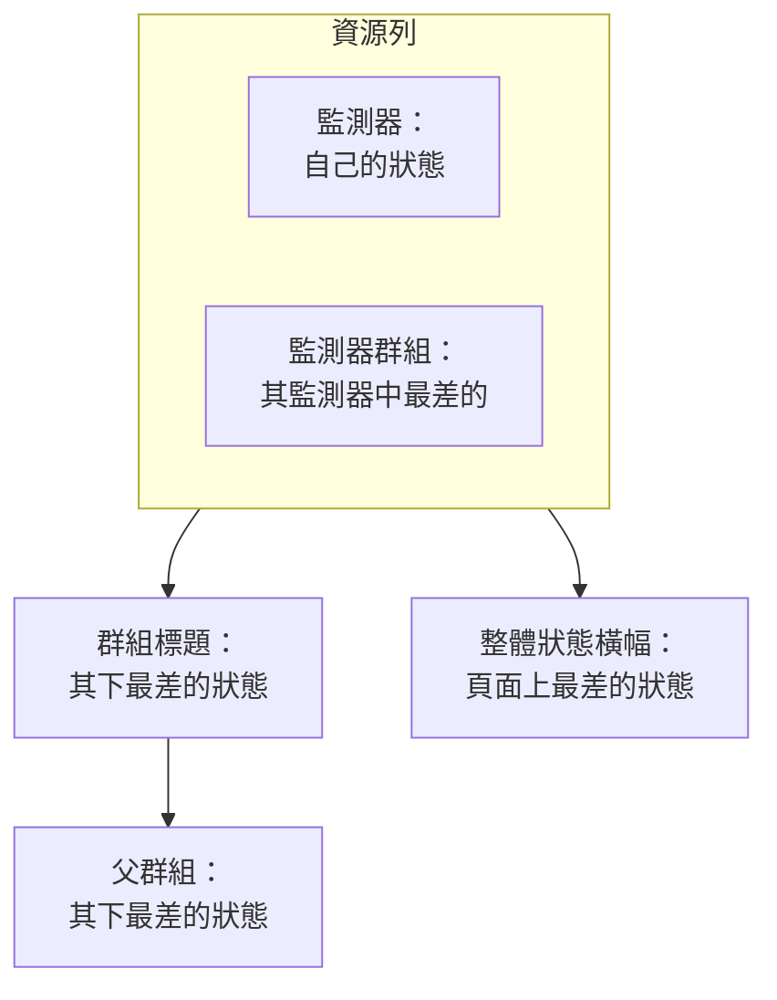

# 狀態頁資源與群組

資源是狀態頁上的一列：一個監測器或一個監測器群組，帶有客戶看得懂的名稱、目前狀態，以及（如果需要）正常運作時間與歷史記錄。群組是容納資源的區塊，這樣一個有四十個監測器的頁面就能讀成「API」「Web 應用程式」「資料管道」，而不是一份沒有盡頭的清單。兩者都在同一個畫面中建立：開啟一個狀態頁，在其側邊選單中選擇 **資源**。

:::cards
- [新增監測器](#新增監測器): 用訪客讀到的名稱把監測器放到頁面上。
- [群組](#群組): 把頁面拆分為區塊，並相互巢狀。
- [監測器規則](#用監測器規則自動新增監測器): 讓規則替您新增每個符合的監測器。
- [從 CSV 匯入群組](#從-csv-匯入群組): 一次建立很深的階層。
:::

訪客會根據這些列判斷「是我的問題還是他們的問題」，所以請依客戶談論您產品的方式命名：用 **Checkout API**，而不是 `prod-checkout-lb-healthcheck-us-east-1`。

## 狀態如何在頁面上逐層往上

每一列顯示其監測器的目前狀態。它上面的每一層顯示其下所有內容中最差的狀態，最差的狀態是指您專案的監測器狀態中優先順序最高的那一個。

資源決定的不只是它那一列的顏色：

- **已封存的監測器不會顯示。** 已封存的監測器不再被檢查，所以它最後的狀態是凍結的；頁面會省略它的列（也不把它計入監測器群組的狀態），而不是把這個凍結的狀態當作即時狀態顯示。該列會被保留，所以取消封存後它會立刻回來。
- **資源決定頁面顯示哪些事件。** 當事件的某個監測器直接或透過監測器群組成為頁面上的資源時，事件就會顯示在這裡，頁面的訂閱者也會收到通知。把同一個監測器放到多個頁面上，它的事件會抵達所有這些頁面，除非某個事件被限定在其中部分頁面。請參閱 [每個受眾一個狀態頁](/docs/status-pages/one-status-page-per-audience)。
- **監測器群組的列代表其中的每個監測器，對訂閱者也是如此。** 在允許訂閱者選擇資源的頁面上，訂閱某個監測器群組的人會收到該群組中任何監測器的事件、排定維護與公告通知，就像他們選擇了那個監測器一樣。請參閱 [訂閱者與公告](/docs/status-pages/subscribers#讓訂閱者自己挑資源與事件類型)。

## 資源畫面

在開啟了監測器群組的專案中，這個選單項目叫 **資源**，在其他專案中叫 **監測器**；它們是同一個畫面。群組以前有自己的頁面，舊地址 `/groups` 現在會開啟這個畫面。

畫面分為兩部分：

| 部分 | 包含的內容 |
| ---- | ------------- |
| **群組導覽器**（左側） | 以樹狀顯示頁面上的所有群組，上方有 **Search groups...** 方塊，下方有計數，例如 `3 groups · 12 resources`。較長的清單末尾有一個 **Show N more of M** 按鈕。 |
| **Top of page** | 導覽器的第一列：不屬於任何群組的資源，訪客會在所有群組之上最先看到它們。在沒有群組的頁面上，右側窗格的標題改為 **All resources**。 |
| **資源窗格**（右側） | 所選群組的資源。它的標題列有 **Edit Group**、主要按鈕 **新增監測器** 與 **More actions** 選單。 |
| 卡片標題 | **New Group**，以及包含 **Import groups from CSV** 和 **重新整理** 的三點選單。 |

**空白狀態會告訴您該做什麼。** 空的群組會顯示 **No monitors here yet**，以及 **新增監測器**、**Add Multiple**，並且只在頁面一個群組都沒有時顯示 **Create a Group**。沒有符合結果的搜尋會顯示 **No resources match your search**。

## 新增監測器

:::steps
### 選擇列要放在哪裡

在群組導覽器中，選擇資源所屬的群組；如果是不屬於任何群組的列，則選擇 **Top of page**。

### 點選 新增監測器

**Add a monitor to {group}** 對話方塊會開啟。它只有一頁。

### 選擇監測器

在 **監測器**（預留位置 **選擇監測器**）中選擇它。**顯示名稱** 是訪客讀到的文字，會自動填入監測器的名稱，並在您選擇另一個監測器時跟著改變，直到您自己輸入名稱為止。它與監測器本身的名稱分開儲存，因此在這裡重新命名不會影響監控。

### 設定顯示選項（如需要）

**更多欄位** 預設摺疊。其中包含 **描述**（顯示在列下方的選用 markdown，適合用一句話說明該服務實際做什麼；其中的圖片會顯示給每位訪客）與 [顯示選項](#資源的顯示選項)。保持摺疊時，資源會使用它們的預設值。

### 儲存資源

點選 **新增監測器**。該列會出現在群組中，也會出現在狀態頁上。
:::

在格狀群組中，對話方塊還會在 **更多欄位** 上方詢問監測器所在的列與欄；請參閱 [清單版面與格狀版面](#清單版面與格狀版面)。

> [!TIP]
> 若要把多項檢查顯示為一列，請新增監測器群組。當 **監測器群組** 開關開啟時（**專案設定** > **進階** > **功能旗標**，切換後立即儲存），下拉式清單下方會出現一個連結 **Add a Monitor Group instead.** 點選它，**監測器** 會變成 **監測器 群組**（**選擇監測器群組**）；**Add a Monitor instead.** 可以切換回來。

### 一次新增多個

**Add Multiple**（也可以使用 **More actions** 選單中的 **Add multiple monitors**）會開啟 **Add Multiple Monitors**。它同樣只有一頁：一個 **監測器** 多選方塊，然後是同樣摺疊的 **更多欄位**，其中的顯示選項會套用到您選擇的每個監測器。每個資源會從其監測器取得顯示名稱與描述，**Add Monitors** 會一次全部新增。這是填滿新頁面最快的方式。

多選方塊有一個 **標籤** 分頁：點選一個標籤，帶有該標籤的所有監測器會被一次選取。

### 依標籤新增兩次是安全的

狀態頁上每個監測器只會出現一次。新增是冪等的，因此在替幾個新監測器加上標籤之後再次選擇同一個標籤，只會新增新的監測器：已經在頁面上的監測器維持原樣，保留您替它們設定的顯示名稱與選項。

批次新增結束時的摘要也會這樣說明：新加入的監測器列在 **已新增** 下，原本就在的列在 **Already Added** 下。不會有任何內容被回報為失敗，也不會替它們寫入任何內容。

在其他任何建立資源的地方，同樣的規則也適用。在單一新增表單中新增已在頁面上的監測器，或在編輯表單中讓現有資源指向它，都會被拒絕，提示 *"This monitor is already added to this status page"*，即使現有資源位於另一個群組中也是如此，因為訪客仍然會看到這個監測器兩次。若要在另一個群組中顯示某個監測器，請刪除它現有的資源，然後在您想要的位置新增它。

## 資源的顯示選項

**更多欄位** 區塊在單一新增表單與批次新增對話方塊中都一樣。它在兩者中都預設摺疊，在 **編輯資源** 中也是如此，其摺疊的標題會顯示其中哪些項目與預設值不同。這裡的所有設定都是依資源設定的：同一群組中的兩列可以有不同的設定。

| 欄位 | 預設值 | 作用 |
| ----- | ------- | ------------ |
| **工具提示**（`displayTooltip`） | 空 | 在狀態頁上的資源旁顯示為工具提示。可用於說明範圍：「美國與歐盟客戶」。 |
| **顯示目前資源狀態**（`showCurrentStatus`） | 開啟 | 在列旁顯示即時狀態，例如正常運作、效能降低或離線。 |
| **顯示正常運作時間 %**（`showUptimePercent`） | 關閉 | 在資源旁顯示正常運作時間百分比。 |
| **選擇運作時間精確度**（`uptimePercentPrecision`） | 一位小數 | 在 **顯示正常運作時間 %** 開啟後出現，此時為必填。 |
| **顯示狀態歷史記錄圖表**（`showStatusHistoryChart`） | 開啟 | 顯示資源每日的正常運作時間歷史長條。 |

**顯示名稱**（`displayName`）與 **描述**（`displayDescription`）也只用於顯示：它們從不變更監測器本身。

## 正常運作時間百分比與歷史圖表

**顯示正常運作時間 %** 與 **顯示狀態歷史記錄圖表** 都讀取同一個全頁面設定：它們涵蓋多少天。這就是 **狀態頁面 → 您的頁面 → 進階 → 進階設定** 上 **狀態頁面顯示的內容** 卡片中的 **正常運作時間歷史記錄**。它接受 1 到 90 天，預設為 90 天。所以請依資源開啟開關，然後為整個頁面設定一次時間範圍。

**精確度是需要判斷的問題。** **選擇運作時間精確度** 提供 `99% (No Decimal)`、`99.9% (One Decimal)`、`99.99% (Two Decimal)` 與 `99.999% (Three Decimal)`。小數位越多看起來越精確，也越容易引發關於第三位小數的爭論；如果您公布的 SLA 是三個九，就與之保持一致，不要更多。

群組有這些開關的獨立副本（見下文），因此群組可以顯示彙總的百分比，而其中的監測器保持安靜，反之亦然。

歷史圖表長條的顏色在 **品牌** 頁面的 **更多設定** 下設定，哪些監測器狀態算作「停機」則在 **進階設定** 上 **狀態頁面顯示的內容** 卡片中的 **計為停機時間** 設定；兩者都在 [狀態頁品牌與網域](/docs/status-pages/branding-and-domains) 中說明。

## 群組

大多數群組只需要一個名稱。

:::steps
### 點選 New Group

**Create New Status Page Group** 會開啟：兩個欄位，然後是兩個摺疊的區塊。

### 為群組命名

輸入 **群組名稱**：訪客看到的區塊標題。

### 如果它屬於另一個群組，就把它設為巢狀

選擇一個 **Parent Group**，或保留 **No parent group (top level)**。群組選單中的 **Add a sub group** 會替您填好這一項。

### 建立群組

點選 **Create Status Page Group**。群組會出現在導覽器中，可以放入監測器了。
:::

這兩個欄位是 **群組名稱**（`name`）與 **Parent Group**（`parentStatusPageGroupId`）。兩個摺疊的區塊包含其餘所有設定：

- **版面配置**：摺疊時的標題顯示 **List** 或 **Grid**。其中包含 **檢視模式** 與格狀的軸（請參閱 [清單版面與格狀版面](#清單版面與格狀版面)），在格狀群組上會自動展開。
- **更多欄位**：資源選項在群組層級的副本：
  - **群組描述**（`description`）：選用的 markdown，顯示在標題下方。其中的圖片會顯示給每位訪客。
  - **預設在狀態頁面上展開**（`isExpandedByDefault`）：預設開啟；決定該區塊對訪客是展開還是摺疊。
  - **顯示目前群組狀態**（`showCurrentStatus`）：預設開啟。在群組標題旁顯示狀態。
  - **顯示正常運作時間 %**（`showUptimePercent`）：預設關閉，開啟後會出現 **選擇運作時間精確度**。

要修改群組，請使用窗格標題列中的 **Edit Group**，或導覽器列選單中的 **Edit group**：**Edit Status Page Group** 會開啟，並帶有 **儲存變更** 按鈕。窗格標題列會以標籤顯示已開啟的設定（**Grid**、**Collapsed by default**、**Uptime %** ），讓您不必開啟表單也能看出群組的設定。

### 管理群組

| 位置 | 動作 |
| ----- | ------- |
| 導覽器的列選單 | **Edit group**、**Move up**、**Move down**、**顯示 ID**、**Delete group** |
| 窗格的 **More actions** 選單 | **Edit this group**、**Add a sub group**、**Move group up**、**Move group down**、**Show group ID**、**重新整理**、**Delete this group** |

沒有名稱就儲存的群組會顯示為 **Untitled group**，這很好地提醒您原本想輸入點什麼。

## 巢狀群組

群組可以巢狀：在子群組上設定 **Parent Group**，或在導覽器中使用 **Add a sub group inside this group**。表單的說明文字描述了它適合的結構（類似 事業單位 › 區域 › 市場），每一層都會顯示其下所有內容的彙總狀態與正常運作時間。

當群組有子群組時，資源窗格會顯示一列 **Sub groups** 標籤，直接連到每個子群組，這樣您不必回到導覽器就能瀏覽階層。

巢狀在大型頁面上才有價值：在產品中再分區域的託管服務商，或在事業單位中再分市場的零售商。在只有十二個監測器的頁面上，單一扁平的層級更友善。

## 清單版面與格狀版面

群組表單的 **版面配置** 區塊會設定群組的 **檢視模式**（`viewMode`），它會改變群組在狀態頁上的顯示方式。

| 如果您想… | 選擇 |
| --------------- | ---- |
| 顯示一個簡單的直式服務清單，每列一個 | **List**（預設） |
| 把同一個服務在多個區域或租用戶中的情況顯示為矩陣 | **Grid** |

選擇 **Grid** 後會出現另外四個欄位：

| 欄位 | 輸入什麼 |
| ----- | ------------- |
| **列軸標籤** | 列維度的名稱，預留位置 `Service`。 |
| **列軸數值** | 列，用 **Add Row** 逐一新增（預留位置 `e.g. Auth`）。 |
| **欄軸標籤** | 欄維度，預留位置 `Region`。 |
| **欄軸數值** | 欄，用 **Add Column** 新增（預留位置 `e.g. US-East`）。 |

格狀群組中的每個監測器占據一個儲存格，因此 **新增監測器** 與批次新增對話方塊會使用您自己的軸標籤，連同監測器一起詢問列與欄。

> [!IMPORTANT]
> 請在新增監測器之前設定好軸。沒有列或欄的格狀群組會顯示一則通知，說明還沒有地方放置監測器，並提供一個 **Set up the grid** 按鈕，在 **版面配置** 區塊開啟群組的表單；在您完成設定之前，它的 **新增監測器** 按鈕會被隱藏。

## 訪客看到的順序

順序由您決定，而不是依字母排序：

| 對象 | 如何調整順序 |
| ---- | ----------------- |
| 群組內的資源 | 拖曳一列。窗格上也會提示：**Drag a row to change the order visitors see**。 |
| 群組之間 | 導覽器列選單中的 **Move up** / **Move down**，或 **More actions** 中的 **Move group up** / **Move group down**。 |
| 不屬於任何群組的資源 | 它們在 **Top of page** 中，一律顯示在所有群組之上，所以請把大家最先查看的內容放在這裡。 |

**有兩種情況無法拖曳。** 在 **Search in {group}...** 方塊中搜尋時會關閉排序（窗格會顯示 `N of M shown · drag to reorder is off while filtering`），所以請先清除搜尋。另外，格狀群組從不透過拖曳排序，因為監測器的位置由它的列與欄決定。

把最常被詢問的服務放在最上面。在服務中斷期間來到頁面的訪客，通常看完第一個畫面就不再往下讀了。

## 用監測器規則自動新增監測器

監測器規則會替您把監測器新增到頁面：只要描述一次監測器，每個符合的監測器都會進入您選擇的群組。規則位於資源畫面旁邊的 **資源 → Monitor Rules** 下。

:::steps
### 開啟 Monitor Rules

開啟狀態頁，在其側邊選單的 **資源** 區塊中選擇 **Monitor Rules**，然後點選 **建立Status Page Monitor Rule**。

### 為規則命名

在 **基本資訊** 中輸入 **名稱**。**已啟用** 預設開啟。

### 說明它符合哪些監測器

在 **比對條件** 中，至少填寫 **監測器標籤**（帶有其中任一標籤的監測器即符合）、**監測器名稱** 與 **監測器描述** 中的一項。監測器必須通過您填寫的每一項條件。兩種模式接受不區分大小寫的規則運算式（`^api-.*`）或萬用字元 `*`（`*checkout*`）；`.*` 會符合所有監測器。

### 選擇群組

在 **群組** 中選擇 **Add Monitors To Group**，或留空以把監測器新增為不屬於任何群組。接下來是與資源相同的顯示選項；在規則中，**顯示正常運作時間 %** 預設開啟。

### 儲存規則

規則會立即對已經存在的每個監測器執行，清單會在 **Adds Monitors To** 下顯示它把監測器新增到哪個群組。
:::

此後，每當有監測器被建立，或某個監測器的標籤、名稱或描述變更，規則都會針對該監測器再次執行。規則只會移除它自己新增的資源：關閉或刪除規則會把這些資源從頁面上移除，而您手動新增的監測器永遠不會被更動。已經在頁面上的監測器永遠不會被新增兩次。

## 從 CSV 匯入群組

手動建立很深的階層非常繁瑣。卡片標題三點選單中的 **Import groups from CSV** 會開啟 **Import Groups from CSV** 對話方塊。

:::steps
### 下載範本

點選 **Download CSV Template** 取得 `status-page-groups-template.csv`。

### 填寫範本

每個群組一列。只有 `name` 是必填的；各欄位見下表。

### 上傳並預覽

點選 **Choose CSV File**，選擇您的檔案，然後點選 **Preview Import**，在寫入任何內容之前檢查將要建立什麼。

### 匯入

執行匯入。**Import results** 表會把每一列列為 **已建立**、**失敗** 或 **已略過**，並附上原因，這樣有問題的列絕不會悄悄消失。
:::

| 欄 | 設定什麼 |
| ------ | ------------ |
| `name` | 群組名稱。必填。 |
| `parentName` | 此群組巢狀於其中的群組名稱。 |
| `description` | 群組描述。 |
| `isExpandedByDefault` | 該區塊對訪客是否預設展開。 |
| `showCurrentStatus` | 是否在群組標題旁顯示狀態。 |
| `showUptimePercent` | 是否在群組旁顯示正常運作時間百分比。 |
| `uptimePercentPrecision` | 該百分比使用幾位小數。 |
| `viewMode` | `List` 或 `Grid`。 |
| `rowAxisLabel` | 格狀群組的列維度名稱。 |
| `rowAxisValues` | 格狀群組的列值。 |
| `columnAxisLabel` | 格狀群組的欄維度名稱。 |
| `columnAxisValues` | 格狀群組的欄值。 |

匯入建立的是群組，而不是資源：之後請用 **新增監測器**、**Add Multiple** 或監測器規則新增監測器。

## 疑難排解

:::details "This monitor is already added to this status page"
一個頁面上每個監測器只會列出一次，即使跨群組也是如此。該監測器已經有一個資源，可能在另一個群組中，或由監測器規則新增。請在導覽器中搜尋它，刪除那個資源，然後在您想要的位置新增該監測器。
:::

:::details 我新增的監測器沒有顯示在狀態頁上
檢查該監測器是否已封存：已封存監測器的列會被省略，直到您取消封存。也請檢查群組：設定為預設摺疊的群組（**預設在狀態頁面上展開** 關閉）會隱藏它的列，直到訪客展開它。
:::

:::details 格狀群組中沒有 新增監測器 按鈕
格狀還沒有列或欄。點選 **Set up the grid**，在 **版面配置** 區塊中新增軸值，**新增監測器** 就會回來。
:::

:::details 我無法拖曳列
清空 **Search in {group}...** 方塊：窗格被篩選時排序處於關閉狀態。格狀群組從不透過拖曳排序。
:::

## 後續步驟

:::cards
- [狀態頁品牌與網域](/docs/status-pages/branding-and-domains): 標誌、網站圖示、歷史圖表顏色以及您自己的網域。
- [訂閱者與公告](/docs/status-pages/subscribers): 這些資源變更時誰會收到通知。
- [每個受眾一個狀態頁](/docs/status-pages/one-status-page-per-audience): 同一個監測器出現在多個頁面上，以及只抵達其中部分頁面的事件。
- [公開 API](/docs/status-pages/public-api): 以 JSON 形式讀取資源、群組與正常運作時間。
:::
