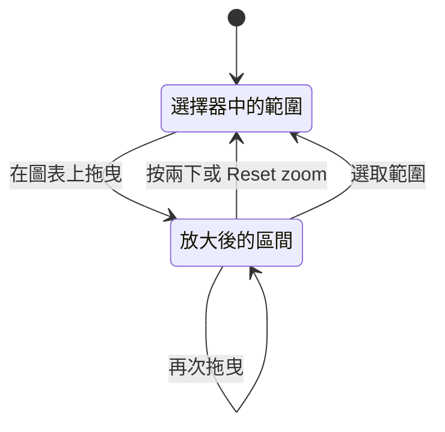

# 放大時間範圍

在圖表上拖曳即可把頁面放大到那個時刻，按兩下即可返回。本頁說明這些手勢、放大的行為方式，以及哪些圖表會放大什麼。

:::cards
- [放大與返回](#放大與返回): 兩種手勢，以及 Reset zoom 按鈕。
- [放大的行為方式](#放大的行為方式): 巢狀放大、自動重新整理、點選與拖曳。
- [適用範圍](#適用範圍): 拖曳會改變時間範圍的頁面與圖表。
- [無法放大的圖表](#無法放大的圖表): 條帶、量表與迷你走勢圖。
:::

## 放大與返回

OneUptime 中的每個時間序列圖表同時也是時間範圍選擇器。當圖表上出現你想查看的尖峰時，不必開啟選擇器輸入日期：

:::steps
1. 在任何圖表上 **拖曳過尖峰**。頁面的時間範圍會移到你拖出的區間，與在時間範圍選擇器中選取它完全相同。每個圖表，以及依頁面時間範圍計算的每個磚塊或表格，都會針對它重新查詢，因此你在所有圖表上看到的是同一個時刻。
2. **在任何圖表上按兩下** 即可返回。頁面會回到你開始放大之前的時間範圍。
:::

顯示目前狀態的面板會停留在現在，就像你自己選取範圍時一樣：清查數量、健康狀態、資源用量最高的項目、最近的警告、未解決的事件與警示，以及儀表板的即時清單。

放大期間，頁面的時間範圍選擇器旁會出現 **Reset zoom** 按鈕。它的作用與按兩下相同，也是鍵盤使用者與觸控螢幕上的返回方式。

## 放大的行為方式

- **想放大多深都可以，一次重設就能全部退出。** 從 "Past 1 Hour" 深入到十分鐘、再深入到一分鐘之後，按一次兩下（或 **Reset zoom**）就會回到完整的一小時，而不是一次退一層。
- **任何圖表都能重設任何放大。** 在 CPU 圖表上拖曳，在記憶體圖表上按兩下：被放大的是頁面，而不是圖表。
- **自己選取範圍就會重新開始。** 在選擇器中選取預設或自訂範圍就是新的起點：放大結束，**Reset zoom** 隨之消失。
- **放大後的區間是固定的。** "Past 30 Minutes" 會隨著時鐘往前移動；放大是固定的區間，所以即使開啟了自動重新整理，它也會停止移動。重設放大即可重新開始移動。
- **放大永遠不會超過現在。** 圖表最新的桶通常還在填入中；結束在該桶的拖曳會在目前時間截斷。
- **可以在圖表外放開滑鼠**，拖曳仍然有效。
- **不必等圖表載入完成就能返回。** 剛放大後，圖表仍在擷取你拖出的區間時，或該區間結果為空時，在圖表上按兩下都會立即重設放大。
- **在未放大的頁面上按兩下不會有任何作用。**

### 點選與拖曳

- **在折線圖、面積圖與長條圖上，單純的點選不是放大。** 這涵蓋了大多數圖表：指標卡片與指標瀏覽器、資源概觀、SLO、監測器，以及儀表板上的所有圖表。只有跨越多個桶的拖曳才會放大，因此點選某個點、某根長條或某個圖例項目的行為與以前相同。放大期間，點選圖表的繪圖區會稍後才生效，以便與用來重設的按兩下區分開來。日誌洞察中的錯誤模式時間軸與例外的 Occurrence Trend 也只在拖曳時放大。
- **在瀏覽器的數量圖表上，點選一根長條會放大到該長條。** 日誌、追蹤、例外與安全性事件瀏覽器的數量圖表，以及日誌與追蹤分析圖表，會放大到你拖曳過的長條，或你點選的那一根長條。這些圖表會顯示 **Click or drag to zoom**。

### 圖表上的提示

大多數可以放大的圖表會在繪圖區上方註明手勢，即 **Drag to zoom** 或 **Click or drag to zoom**，放大期間還會提醒你 **double-click to reset**。指標卡片、指標瀏覽器與瀏覽器的數量圖表一律顯示提示。在資源概觀與 SLO 的圖表卡片以及部分儀表板小工具上，只有當你指向卡片或用 Tab 鍵移入時才會出現。

## 適用範圍

在下列位置，放大會改變整個頁面的時間範圍：

- 資源概觀及其洞察頁面：Kubernetes 叢集，Docker、Podman 與 Docker Swarm 主機，主機及其處理程序，服務與 systemd 單元，VMware、Proxmox、Ceph、儲存陣列、資料庫、雲端資源與無伺服器函式；
- 服務與 RUM 應用程式；
- 網路設備的指標與流量；
- 指標卡片，包括資源的指標分頁與監測器的指標；
- 指標瀏覽器；
- SLO 歷史圖表；
- 日誌洞察，包括錯誤模式的「發生時間」時間軸，該面板會蓋住頁面的選擇器，因此有自己的 **Reset zoom**；
- 日誌、追蹤、例外與安全性事件的數量圖表，以及日誌與追蹤分析圖表，它們會改變所屬瀏覽器的時間範圍；
- [儀表板](/docs/dashboards/authoring)，拖曳會改變整個儀表板的時間範圍。

擁有自己區間的圖表只會放大該區間，因此絕不會改變頁面上的其他內容。這包括監測器表單中的指標預覽（監測器會繼續依自己的滾動區間評估）、例外的 Occurrence Trend、在快顯視窗或 Investigate 面板中開啟的圖表，以及 AI 聊天回答中的圖表。在其中任何一個上按兩下，或點選它的 **Reset zoom** 按鈕，都會還原它自己的區間。

事件、警示或片段頁面上的遙測快照也有自己的區間。在它的圖表（指標圖表，或快照所顯示的日誌、追蹤或例外數量圖表）上拖曳會放大整個快照，因此它的指標、日誌、追蹤與例外分頁都會顯示你拖出的時間片段。快照徽章旁的 **Reset zoom**，或在該圖表上按兩下，會還原快照的區間。

## 無法放大的圖表

有少數視覺化沒有可供拖曳的時間軸、太小而無法拖曳，或一律顯示自己的固定區間，因此無法放大：

- 正常運作時間歷史條帶（每天一根長條），無法顯示比一天更細的粒度；
- 占比與比例長條、量表與進度列；
- 火焰圖、服務地圖與流程圖；
- 指標清單中的小型趨勢迷你圖，點選會開啟該指標，開啟後即可得到可以放大的圖表；
- 有自己固定區間的小型迷你圖，例如網路設備過去一小時的往返時間，它的 **Open metrics** 連結會帶你到可以放大的圖表。

## 後續步驟

:::cards
- [建立儀表板](/docs/dashboards/authoring): 放大適用於儀表板上的每個圖表。
- [搜尋語法](/docs/telemetry/search-syntax): 找到那個時刻後，篩選瀏覽器中的資料。
- [指標監控](/docs/monitor/metrics-monitor): 針對你正在查看的指標發出警示。
:::
