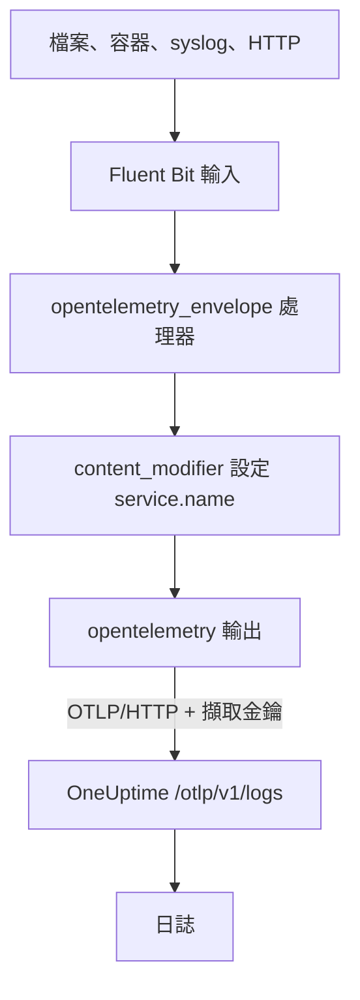

# Fluent Bit

[Fluent Bit](https://docs.fluentbit.io/manual) 是一個輕量級代理程式，可以從檔案、systemd、容器、syslog、HTTP 以及許多其他來源收集日誌。它的 [OpenTelemetry 輸出](https://docs.fluentbit.io/manual/pipeline/outputs/opentelemetry)會把收集到的資料傳送到 OneUptime 的 OpenTelemetry（OTLP）端點，之後就能在 **產品 → 日誌** 中搜尋這些日誌。

:::cards
- [設定 Fluent Bit](#設定-fluent-bit): 加入 OpenTelemetry 輸出並為服務命名。
- [完整範例](#完整範例): 一份可以直接上手的完整設定檔。
- [自行託管的 OneUptime](#自行託管的-oneuptime): 讓 Fluent Bit 傳送到你自己的執行個體。
:::

## 運作方式



Fluent Bit 會把每筆記錄包進一個 OpenTelemetry 信封，使其能夠攜帶 `service.name` 這類資源屬性。接著 OpenTelemetry 輸出會把記錄傳送到 OneUptime，並在 `x-oneuptime-token` 標頭中帶上你的擷取金鑰。OneUptime 會把它們歸到 `service.name` 指定的服務下，並在第一次傳送時建立該服務。

## 開始之前

- **安裝 Fluent Bit**：請參閱[安裝指南](https://docs.fluentbit.io/manual/installation/getting-started-with-fluent-bit)。本頁的設定使用 Fluent Bit 的 YAML 格式與 `opentelemetry_envelope` 處理器，因此請使用較新的版本。
- **一個 OneUptime 專案。** 在 OneUptime Cloud 上，遙測資料依擷取的 GB 計費（請參閱[價格](https://oneuptime.com/pricing)），而且 Free 方案的專案必須先新增付款方式才能傳送遙測資料。
- **一個遙測擷取金鑰。** 如果還沒有，請依下列步驟建立：

:::steps
### 開啟擷取金鑰

前往 **產品 → 專案設定**，在側邊選單中展開 **遙測與 APM**，然後選擇 **擷取金鑰**。


### 建立金鑰

點選 **建立擷取金鑰**。對話框已經填好金鑰名稱，並選好 **伺服器**（應用程式或 Collector 傳送資料時使用的金鑰類型），因此直接點選 **建立擷取金鑰** 即可建立，也可以先重新命名。

### 複製機密

新金鑰會在自己的頁面中開啟。複製它的 **密鑰金鑰**：這就是下方設定中的 `YOUR_TELEMETRY_INGESTION_TOKEN`。


:::

## 設定 Fluent Bit

Fluent Bit 會從 `/etc/fluent-bit/fluent-bit.yaml` 這類檔案讀取 YAML 設定。

:::steps
### 加入 OpenTelemetry 輸出

加入一個傳送到 OneUptime 的 `opentelemetry` 輸出。如果想在本機查看記錄，測試期間可以保留 `stdout` 輸出：

```yaml title="fluent-bit.yaml"
pipeline:
  outputs:
    - name: stdout
      match: "*"
    - name: opentelemetry
      match: "*"
      host: "oneuptime.com"
      port: 443
      metrics_uri: "/otlp/v1/metrics"
      logs_uri: "/otlp/v1/logs"
      traces_uri: "/otlp/v1/traces"
      tls: On
      header:
        - x-oneuptime-token YOUR_TELEMETRY_INGESTION_TOKEN
```

### 把日誌包進 OpenTelemetry 信封並為服務命名

為每個輸入加入 `opentelemetry_envelope` 處理器，後面再接一個設定 `service.name` 的 `content_modifier`。把 `YOUR_SERVICE_NAME` 換成日誌在 OneUptime 中要顯示的名稱：

```yaml title="fluent-bit.yaml"
pipeline:
  inputs:
    - name: tail # or any other input
      path: /var/log/my-app/*.log

      processors:
        logs:
          - name: opentelemetry_envelope

          - name: content_modifier
            context: otel_resource_attributes
            action: upsert
            key: service.name
            value: YOUR_SERVICE_NAME
```

### 重新啟動 Fluent Bit

重新啟動 Fluent Bit 服務，或用 `fluent-bit -c /etc/fluent-bit/fluent-bit.yaml` 啟動它。幾秒內，日誌就會出現在 **產品 → 日誌** 中，服務也會列在 **產品 → 服務** 下。
:::

## 完整範例

這份設定在連接埠 `8888` 上透過 HTTP 接收日誌，並轉送到 OneUptime：

```yaml title="fluent-bit.yaml"
service:
  flush: 1
  log_level: info

pipeline:
  inputs:
    - name: http
      listen: 0.0.0.0
      port: 8888

      processors:
        logs:
          - name: opentelemetry_envelope

          - name: content_modifier
            context: otel_resource_attributes
            action: upsert
            key: service.name
            value: YOUR_SERVICE_NAME

  outputs:
    - name: stdout
      match: "*"
    - name: opentelemetry
      match: "*"
      host: "oneuptime.com"
      port: 443
      metrics_uri: "/otlp/v1/metrics"
      logs_uri: "/otlp/v1/logs"
      traces_uri: "/otlp/v1/traces"
      tls: On
      header:
        - x-oneuptime-token YOUR_TELEMETRY_INGESTION_TOKEN
```

把 `http` 輸入換成你需要的輸入，例如日誌檔案用 `tail`、journal 用 `systemd`，並在每個輸入上保留這兩個處理器。

## 自行託管的 OneUptime

把 `host` 設為你的 OneUptime 執行個體的主機。如果它透過一般 HTTP 而非 HTTPS 提供服務，也要把 `port` 設為它所監聽的連接埠（通常是 `80`），並移除 `tls`：

```yaml title="fluent-bit.yaml"
pipeline:
  outputs:
    - name: stdout
      match: "*"
    - name: opentelemetry
      match: "*"
      host: "your-oneuptime-instance.com"
      port: 80
      metrics_uri: "/otlp/v1/metrics"
      logs_uri: "/otlp/v1/logs"
      traces_uri: "/otlp/v1/traces"
      header:
        - x-oneuptime-token YOUR_TELEMETRY_INGESTION_TOKEN
```

## 疑難排解

:::details Fluent Bit 記錄了來自 OpenTelemetry 輸出的 `401`
擷取金鑰缺少、未知或已過期。檢查 `header` 這一行：它是 `x-oneuptime-token`、一個空格，接著是該金鑰的 **密鑰金鑰**。
:::

:::details Fluent Bit 記錄了 `402` 或 `422`
`402`：在 OneUptime Cloud 上，專案使用 Free 方案且沒有付款方式。請在 **專案設定 → 帳單與發票 → 帳單** 中新增。`422`：金鑰已停用，或是瀏覽器金鑰。請在金鑰的設定中重新開啟 **已啟用**，或建立一個 **伺服器** 金鑰。
:::

:::details 日誌歸到了意料之外的服務下
服務來自 `service.name`。檢查每個輸入是否都有 `opentelemetry_envelope` 處理器，並且後面接著設定它的 `content_modifier`。
:::

:::details 什麼都沒有收到，Fluent Bit 記錄了連線錯誤
檢查 HTTPS 端點是否設定了 `tls: On` 與 `port: 443`，以及執行 Fluent Bit 的主機能否透過該連接埠連到你的 OneUptime 主機。
:::

如果對設定有任何問題或需要協助，請寄信至 support@oneuptime.com。

## 後續步驟

:::cards
- [日誌管道](/docs/telemetry/log-pipelines): 剖析並豐富 Fluent Bit 傳送的日誌。
- [搜尋語法](/docs/telemetry/search-syntax): 在日誌瀏覽器中尋找日誌。
- [OpenTelemetry](/docs/telemetry/open-telemetry): 所有遙測資料的端點、金鑰與限制。
- [Fluentd](/docs/telemetry/fluentd): 改用 Fluentd。
:::
