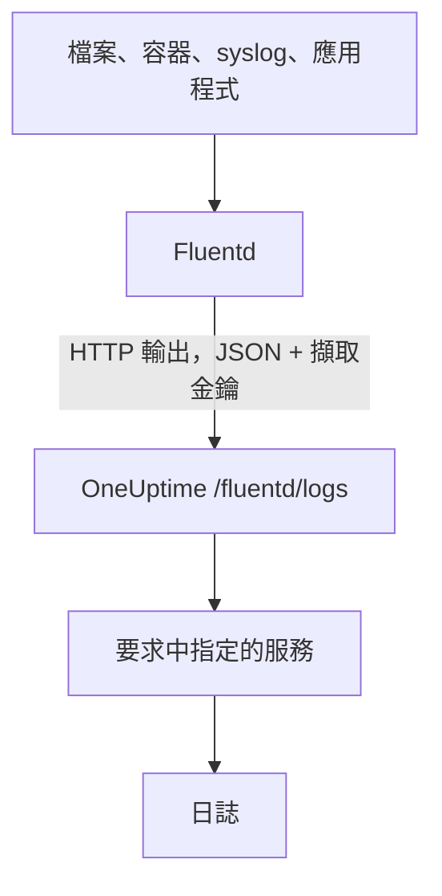

# Fluentd

[Fluentd](https://www.fluentd.org/) 可以從檔案、容器、syslog、應用程式以及[許多其他來源](https://www.fluentd.org/datasources)收集日誌。它內建的 [HTTP 輸出](https://docs.fluentd.org/output/http)會把日誌傳送到 OneUptime 的 Fluentd 端點，之後就能在 **產品 → 日誌** 中搜尋這些日誌。

:::cards
- [設定 Fluentd](#設定-fluentd): 加入一個指向 OneUptime 的 HTTP 輸出。
- [記錄的讀取方式](#記錄的讀取方式): 哪些欄位會成為訊息、嚴重性與屬性。
- [自行託管的 OneUptime](#自行託管的-oneuptime): 讓 Fluentd 傳送到你自己的執行個體。
:::

## 運作方式



Fluentd 以 JSON 格式批次傳送記錄，擷取金鑰放在 `x-oneuptime-token` 標頭中，服務名稱放在 `x-oneuptime-service-name` 中。OneUptime 會把每筆記錄變成該服務的一筆日誌，並在第一次傳送時建立該服務。

## 開始之前

- **安裝 Fluentd**：請參閱[安裝指南](https://docs.fluentd.org/installation)。
- **一個 OneUptime 專案。** 在 OneUptime Cloud 上，遙測資料依擷取的 GB 計費（請參閱[價格](https://oneuptime.com/pricing)），而且 Free 方案的專案必須先新增付款方式才能傳送遙測資料。
- **一個遙測擷取金鑰。** 如果還沒有，請依下列步驟建立：

:::steps
### 開啟擷取金鑰

前往 **產品 → 專案設定**，在側邊選單中展開 **遙測與 APM**，然後選擇 **擷取金鑰**。


### 建立金鑰

點選 **建立擷取金鑰**。對話框已經填好金鑰名稱，並選好 **伺服器**（應用程式或 Collector 傳送資料時使用的金鑰類型），因此直接點選 **建立擷取金鑰** 即可建立，也可以先重新命名。

### 複製機密

新金鑰會在自己的頁面中開啟。複製它的 **密鑰金鑰**：這就是下方設定中的 `YOUR_SERVICE_TOKEN`。


:::

## 設定 Fluentd

Fluentd 的設定檔通常是 `/etc/fluent/fluentd.conf`，舊的 td-agent 套件則是 `/etc/td-agent/td-agent.conf`。

:::steps
### 加入 HTTP 輸出

加入一個把記錄傳送到 OneUptime 的 `<match>` 區段。把 `YOUR_SERVICE_TOKEN` 換成你的擷取金鑰，把 `YOUR_SERVICE_NAME` 換成日誌要顯示的名稱（任何名稱都可以）：

```text title="fluentd.conf"
# Match all patterns
<match **>
  @type http

  endpoint https://oneuptime.com/fluentd/logs
  open_timeout 2

  headers {"x-oneuptime-token":"YOUR_SERVICE_TOKEN", "x-oneuptime-service-name":"YOUR_SERVICE_NAME"}

  content_type application/json
  json_array true

  <format>
    @type json
  </format>
  <buffer>
    flush_interval 10s
  </buffer>
</match>
```

`json_array true` 讓每次排清緩衝區時都以一個 JSON 陣列傳送，`flush_interval 10s` 則每 10 秒傳送一批。

### 重新啟動 Fluentd

重新啟動 Fluentd 服務，讓它載入新的輸出。

### 確認日誌已送達

下一次排清後幾秒內，日誌就會出現在 **產品 → 日誌** 中。服務會列在 **產品 → 服務** 下；如果它之前不存在，OneUptime 會建立它。
:::

## 完整範例

這份設定在連接埠 `24224` 上透過 Fluentd 的 forward 協定接收記錄，並把它們全部傳送到 OneUptime：

```text title="fluentd.conf"
####
## Source descriptions:
##

## built-in TCP input
## @see https://docs.fluentd.org/input/forward
<source>
  @type forward
  port 24224
  bind 0.0.0.0
</source>

<match **>
  @type http

  endpoint https://oneuptime.com/fluentd/logs
  open_timeout 2

  headers {"x-oneuptime-token":"YOUR_SERVICE_TOKEN", "x-oneuptime-service-name":"YOUR_SERVICE_NAME"}

  content_type application/json
  json_array true

  <format>
    @type json
  </format>
  <buffer>
    flush_interval 10s
  </buffer>
</match>
```

若要把不同的來源當成不同的服務傳送，請為每個標籤使用一個 `<match>` 區段，並各自設定 `x-oneuptime-service-name`。

## 記錄的讀取方式

OneUptime 會從每筆記錄讀取下列欄位：

| 日誌欄位 | 從記錄中下列欄位裡最先出現的一個讀取 | 說明 |
| --- | --- | --- |
| 內文 | `message`、`log`、`msg`、`body`、`text` | 日誌行。這些欄位都沒有的記錄會整筆以 JSON 儲存。 |
| 嚴重性 | `level`、`severity`、`loglevel`、`log_level`、`priority`、`severityText`、`severity_text` | 例如 `trace`、`debug`、`info`、`notice`、`warn`、`error`、`critical` 與 `fatal` 這類名稱，不分大小寫。其他任何值都會儲存為 `Unspecified`。 |
| 追蹤 ID | `trace_id`、`traceId`、`traceid` | 把日誌關聯到它的追蹤。 |
| Span ID | `span_id`、`spanId`、`spanid` | 把日誌關聯到它的 span。 |
| 服務 | `x-oneuptime-service-name` 標頭 | 沒有設定該標頭時為 `Fluentd`。 |
| 時間 | — | OneUptime 收到記錄的時間。 |

其他每個欄位都會成為一個名為 `fluentd.` 加欄位名稱的屬性，可以用來搜尋與篩選：例如 `container_name` 欄位在日誌瀏覽器中就是 `@fluentd.container_name`。巢狀物件會以點號展開，例如 `fluentd.kubernetes.pod_name`，清單則以 JSON 儲存。

Fluentd 日誌會像其他日誌一樣，經過你的[日誌管道](/docs/telemetry/log-pipelines)、捨棄過濾器與遮蔽規則。

## 自行託管的 OneUptime

把 `endpoint` 中的 `https://oneuptime.com` 換成你的 OneUptime 執行個體的 URL：`http(s)://YOUR_ONEUPTIME_HOST/fluentd/logs`。

## 疑難排解

:::details Fluentd 記錄了來自 HTTP 輸出的 `401`
擷取金鑰缺少、未知或已過期。檢查 `headers` 中 `x-oneuptime-token` 的值。
:::

:::details Fluentd 記錄了 `402` 或 `422`
`402`：在 OneUptime Cloud 上，專案使用 Free 方案且沒有付款方式。請在 **專案設定 → 帳單與發票 → 帳單** 中新增。`422`：金鑰已停用，或是瀏覽器金鑰。請在金鑰的設定中重新開啟 **已啟用**，或建立一個 **伺服器** 金鑰。
:::

:::details 日誌歸到了 `Fluentd` 服務下
缺少 `x-oneuptime-service-name` 標頭。請在每個 `<match>` 區段的 `headers` 中加上它。
:::

:::details 日誌內文顯示了整筆記錄的 JSON
OneUptime 會從記錄中 `message`、`log`、`msg`、`body` 或 `text` 裡最先出現的一個讀取內文，這些都沒有時就儲存整筆記錄。請把保存日誌行的欄位重新命名為其中之一，例如使用 Fluentd 的 `record_transformer` 過濾器。
:::

如果對設定有任何問題或需要協助，請寄信至 support@oneuptime.com。

## 後續步驟

:::cards
- [日誌管道](/docs/telemetry/log-pipelines): 剖析並豐富 Fluentd 傳送的日誌。
- [搜尋語法](/docs/telemetry/search-syntax): 在日誌瀏覽器中尋找日誌。
- [Fluent Bit](/docs/telemetry/fluentbit): 一個透過 OpenTelemetry 傳送、更輕量的代理程式。
- [日誌監控](/docs/monitor/logs-monitor): 出現符合的日誌時發出警示。
:::
