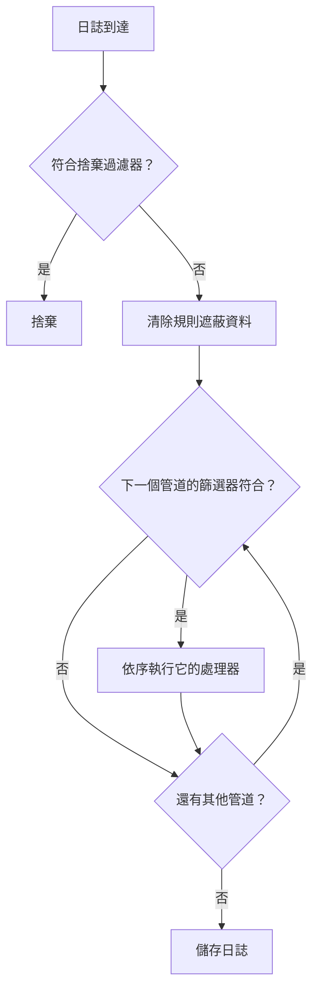

# 日誌管道

日誌管道會在 OneUptime 擷取日誌時、儲存之前轉換日誌。管道有一個決定它適用於哪些日誌的 **篩選器**，以及一份有順序的 **處理器** 清單，每個處理器都會修改這些日誌：從訊息中擷取欄位、修正嚴重程度、重新命名屬性，或替日誌加上類別標籤。

管道位於 **日誌 → 設定 → 管道**。

:::cards
- [管道的執行方式](#管道的執行方式): 管道在擷取過程中的位置，以及它們的執行順序。
- [建立管道](#建立管道): 比對一些日誌，並為它們新增處理器。
- [Key=Value Parser](#keyvalue-parser): 把防火牆與 logfmt 日誌行變成屬性。
- [範例：Sophos XGS 防火牆](#範例sophos-xgs-防火牆): 端對端剖析防火牆 syslog。
:::

## 管道的執行方式

管道會在 OneUptime 擷取的每筆日誌上執行（OpenTelemetry 日誌、syslog 與 Fluentd 都一樣），執行時機在捨棄過濾器與清除規則之後、日誌儲存之前：



- **管道會依序執行**，也就是清單中的順序，你可以拖曳資料列來變更。管道只會處理其篩選器符合的日誌，而且所有篩選器符合的管道都會執行，不只是第一個。
- **處理器也會依序執行**，每個處理器看到的是前一個處理器的結果，因此剖析器必須排在讀取其擷取欄位的處理器之前。後面管道的篩選器也會看到前面管道所做的變更。
- **處理發生在擷取時。** 變更管道會影響之後到達的日誌，大約一分鐘內生效；已儲存的日誌不會重新處理。
- **處理器絕不會捨棄或清空日誌。** 剖析器無法讀取的行會原樣通過。若要捨棄日誌，請使用 **日誌 → 設定 → 捨棄過濾器**。
- **只有已啟用的管道與處理器會執行。** 在其頁面上將它關閉即可暫停，而不會遺失其設定。

## 處理器類型

| 處理器 | 作用 |
| --- | --- |
| Grok Parser | 使用具名模式，從形狀固定的行（例如 nginx 存取日誌行）中擷取欄位。 |
| Key=Value Parser | 把由 `key=value` 配對組成的行（Sophos XGS、Fortinet、logfmt）拆分為屬性，順序不拘。 |
| 嚴重性重新對應器 | 把屬性中的原始層級（例如 `warn`）對應到日誌的標準嚴重程度。 |
| 屬性重新對應器 | 重新命名或複製屬性，例如把 `src_ip` 改為 `source_ip`。 |
| 類別處理器 | 當日誌符合篩選器時，為其加上類別名稱，例如 "Payment Error"。 |

## 開始之前

- 正在進入 OneUptime 的日誌，透過 [OpenTelemetry](/docs/telemetry/open-telemetry)、[syslog](/docs/telemetry/syslog)、[Fluentd](/docs/telemetry/fluentd) 或探測器傳送。
- 變更管道的權限。專案擁有者與管理員擁有此權限；其他人需要 **Create Log Pipeline** 與 **Create Log Pipeline Processor** 權限。

## 建立管道

:::steps
### 新增管道

前往 **日誌 → 設定 → 管道**，點選 **建立日誌 管道**。為它設定 **名稱**，例如 *剖析防火牆日誌*，然後建立。管道的頁面隨即開啟。

### 選擇適用的日誌

在 **篩選條件** 下點選 **編輯**，新增針對 **嚴重程度**、**日誌內文**、**服務 ID** 或自訂屬性的條件。以 **所有條件** 或 **任一條件** 連接它們，然後點選 **儲存變更**。沒有條件的管道適用於所有日誌。

### 新增處理器

在 **處理器** 下點選 **新增處理器**，輸入 **處理器名稱**，選擇 **處理器類型** 並填寫其設定。Grok 與 Key=Value 剖析器附有測試器：貼上一行範例即可查看它們會擷取什麼。點選 **建立處理器**。

### 排列順序

拖曳處理器來變更它們的執行順序，並以相同方式在 **管道** 清單中拖曳管道。新日誌大約會在一分鐘內處理。
:::

### 篩選條件

每個條件會把一個欄位與一個值進行比較。在建構器背後，篩選器是一個查詢，例如 `severityText = 'Error' AND body LIKE 'timeout'`，可以透過 **Preview query** 查看。

| 運算子 | 查詢中 | 說明 |
| --- | --- | --- |
| 等於 | `=` | 精確比對，區分大小寫。 |
| 不等於 | `!=` | 精確比對，區分大小寫。 |
| 包含 | `LIKE` | 忽略大小寫。值中的 `%` 是萬用字元。 |
| 屬於 | `IN` | 以逗號分隔的精確值清單。 |

嚴重程度的值為 `Fatal`、`Error`、`Warning`、`Information`、`Debug`、`Trace` 與 `Unspecified`，因此 `severityText = 'Error'` 會符合，而 `'ERROR'` 永遠不會。自訂屬性寫作 `attributes.<key>`，例如 `attributes.networkDevice.name = 'hq-firewall'`。

## Key=Value Parser

防火牆與其他網路設備會把每個事件記錄為一行 `key=value` 配對。一行包含哪些欄位、順序如何，取決於事件，因此單一 grok 模式無法描述它們。Key=Value Parser 不需要模式：它會走過整行，把找到的每個配對都變成日誌屬性，不論順序如何。成為屬性後，你就可以對它們進行搜尋與篩選，在 [日誌監控](/docs/monitor/logs-monitor) 中使用它們，並透過 [分組依據](/docs/monitor/logs-monitor) 依通道、介面或使用者各發出一次警示。

### 設定

| 設定 | 預設值 | 說明 |
| --- | --- | --- |
| Source Field | `body` | 要剖析的欄位：日誌訊息用 `body`，屬性則例如 `attributes.raw_line`。 |
| Target Prefix | 無 | 擷取出的鍵的命名空間。`sophos` 會把 `con_name` 儲存為 `sophos.con_name`。除非前置詞已經以 `.`、`_`、`-` 或 `:` 結尾，否則會加上分隔符號。 |
| Pair Delimiter | 任何空白字元 | 分隔一個配對與下一個配對的字元。Sophos、Fortinet 與 logfmt 請留空；其他格式可設為 `,`、`;` 或 `\|`。 |
| Key-Value Delimiter | `=` | 分隔鍵與值的字元，例如 `status:up` 用 `:`。 |
| 衝突時覆寫 | 關閉 | 鍵是否可以取代日誌中已有的屬性。預設為關閉：鍵來自日誌行本身，否則一行日誌可能會改寫擷取時設定的屬性，例如它來自哪台設備。 |

兩個分隔符號必須不同、不能互相包含，也不能包含引號或反斜線；每個最多 8 個字元。處理器表單會在儲存前檢查這些規則，其測試器 **Test With a Sample Line** 會精確顯示一行範例將產生的屬性。

### 剖析規則

- **加引號的值** 會保留其中的空格與分隔符號：`message="IPSec Connection HQ-Branch1 terminated"` 是一個值。雙引號與單引號都可以，值中的 `\"` 是字面上的引號。從未關閉的引號（因 syslog 大小限制而被截斷的行）會一直延續到行尾。
- **未加引號的值** 會一直延續到下一個配對分隔符號，因此 `url=https://example.com/?a=b` 會保留其中的 `=`。
- **空值**（`key=` 與 `key=""`）會儲存為空字串。
- **值一律是文字。** `latency=11` 會儲存為 `"11"`，與未指定類型的 grok 擷取相同。
- **鍵** 以字母或底線開頭，包含字母、數字與 `. _ - @`。第一個配對之前的文字（例如 RFC 3164 syslog 標頭）以及沒有分隔符號的零散字詞會被略過。黏在第一個鍵上的 syslog 優先順序（`<30>device_name="SFW"`）會被移除，鍵則保留。
- **重複的鍵會保留第一個值**；之後的值會被忽略。
- **限制：** 超過 32 KiB 的行不會被剖析，一行最多取 100 個配對，超過 256 個字元的鍵會被略過，超過 4,096 個字元的值會被截斷。

### 範例：Sophos XGS 防火牆

當 Sophos XGS 防火牆把 syslog 傳送到 [探測器](/docs/monitor/network-device-monitor) 時，每則訊息都會儲存為該網路設備的日誌，syslog 訊息即為其內文。若要剖析它：

:::steps
#### 為防火牆建立管道

前往 **日誌 → 設定 → 管道** 並建立管道。為它設定符合防火牆日誌的篩選器，例如自訂屬性 `networkDevice.name` 等於 `hq-firewall`（`attributes.networkDevice.name = 'hq-firewall'`），或 **日誌內文** 包含 `log_component=`，以符合所有 Sophos 日誌行。

#### 新增剖析器

開啟管道並點選 **新增處理器**。選擇 **Key=Value Parser**，**Source Field** 保持為 `body`，並把 **Target Prefix** 設為 `sophos`（選用，但能讓防火牆的欄位集中在一起）。

#### 測試並儲存

把防火牆的一行日誌貼到 **Test With a Sample Line** 中檢查結果，然後點選 **建立處理器**。
:::

一個 Sophos IPsec 事件：

```text
device_name="SFW" timestamp="2024-05-02T11:03:12+0200" device_model="XGS2100" device_serial_id="X1234" log_id="010101600001" log_type="Event" log_component="IPSec" log_subtype="System" severity="Information" con_name="HQ-Branch1" src_ip="10.171.4.117" dst_ip="10.171.4.118" status="Terminated" message="IPSec Connection HQ-Branch1 between 10.171.4.117 and 10.171.4.118 for Child HQ-Branch1 terminated."
```

會變成下列屬性（以及其他屬性）：

| 屬性 | 值 |
| --- | --- |
| `sophos.log_component` | `IPSec` |
| `sophos.con_name` | `HQ-Branch1` |
| `sophos.status` | `Terminated` |
| `sophos.src_ip` | `10.171.4.117` |
| `sophos.message` | `IPSec Connection HQ-Branch1 between 10.171.4.117 and 10.171.4.118 for Child HQ-Branch1 terminated.` |

SD-WAN SLA 日誌行的欄位組合與順序都不同，但同一個處理器也能處理它：

```text
log_id=158825619025 log_type="SD-WAN" log_component="SLA" profile_name="Branch-Internet" gw_name="WAN2" latency=11 jitter=2 packet_loss=0 gw_status="up" sla_status="SLA met"
```

得到 `sophos.gw_name = WAN2`、`sophos.latency = 11`、`sophos.packet_loss = 0`、`sophos.gw_status = up` 與 `sophos.sla_status = SLA met`。較舊的 SFOS 版本會以舊格式記錄日誌（`device="SFW" date=2017-01-31 time=18:02:03 timezone="IST" ... connectionname="Tunnel A"`）；它的剖析方式相同，只是通道名稱在 `connectionname` 中，而不是 `con_name`。

若要把這些 SLA 日誌行變成每個閘道的延遲、抖動與封包遺失指標，請參閱 [日誌記錄規則](/docs/telemetry/log-recording-rules) 中的範例。

### 範例：Fortinet FortiGate

FortiGate 日誌使用相同的風格：

```text
date=2024-01-01 time=10:00:00 devname="FG100" logid="0100032001" type="event" subtype="vpn" level="notice" action="tunnel-down" vpntunnel="HQ-to-Branch2" msg="IPsec tunnel down"
```

使用預設設定與 `fortigate` 前置詞，會得到 `fortigate.devname = FG100`、`fortigate.subtype = vpn`、`fortigate.action = tunnel-down`、`fortigate.vpntunnel = HQ-to-Branch2` 與 `fortigate.time = 10:00:00`。時間值中的冒號是值的一部分，而不是分隔符號。

### 每個通道只警示一次

剖析出欄位後，[日誌監控](/docs/monitor/logs-monitor) 就能計算失敗次數，並為每個通道分別發出警示：篩選 `sophos.log_component` = `IPSec` 且內文包含 `terminated` 的日誌，並依 `sophos.con_name` 分組。請參閱 [依群組警示](/docs/monitor/logs-monitor)。

## Grok Parser

從形狀固定的行中擷取結構化欄位。grok 模式是帶有具名參照的規則運算式：`%{IPV4:client_ip}` 的意思是「比對一個 IPv4 位址並將其儲存為 `client_ip`」。模式不必符合整行，不符合的行會保持不變。

| 設定 | 預設值 | 說明 |
| --- | --- | --- |
| **Source Field** | `body` | 要剖析的欄位，與 Key=Value Parser 的相同。 |
| **Target Prefix** | 無 | 擷取出的欄位的命名空間，加上的方式相同。 |
| **Grok Pattern** | — | 模式。表單會列出可用的具名模式。 |

除非指定類型，否則擷取的內容會儲存為文字：`%{NUMBER:status:int}` 會把它儲存為數字。類型有 `int`、`long`、`float`、`double`、`boolean` 與 `string`。儲存之前，請在 **Test Your Pattern** 中用一行範例檢查模式。

| 日誌內文 | 模式 | 新增的屬性 |
| --- | --- | --- |
| `10.0.1.5 - GET /health 200` | `%{IPV4:client_ip} - %{WORD:method} %{NOTSPACE:path} %{NUMBER:status:int}` | client_ip, method, path, status |

當日誌行由順序會變動的 `key=value` 配對組成時，請改用 Key=Value Parser。

## 嚴重性重新對應器

從屬性讀取原始值，並將其對應到標準嚴重程度。把 **來源屬性** 設為存放層級的屬性（預設為 `level`），然後新增 **對應**：每個對應會把應用程式發出的值（例如 `warn`）與一個嚴重程度（例如 Warning）配對。比對時忽略大小寫。沒有對應的值會讓日誌的嚴重程度維持原樣。

## 屬性重新對應器

把一個屬性（**來源金鑰**）的值移到另一個屬性（**目標索引鍵**），例如把 `src_ip` 移到 `source_ip`。

| 設定 | 預設值 | 效果 |
| --- | --- | --- |
| **保留來源** | 關閉 | 關閉時重新命名屬性：來源鍵會被移除。開啟時複製屬性並保留來源鍵。 |
| **衝突時覆寫** | 開啟 | 開啟時，如果目標已存在則取代它。關閉時保持目標不變並略過重新對應。 |

## 類別處理器

依序評估規則清單，並把第一個篩選器符合的規則名稱儲存到目標屬性中，讓你可以一次搜尋所有 "Payment Error" 日誌。設定 **目標屬性**（預設為 `category`），然後新增 **類別規則**：每條規則包含一個 **Category name** 與 **When logs match** 下的條件。第一個符合的規則生效；不符合任何規則的日誌會保持不變。

## 後續步驟

:::cards
- [日誌監控](/docs/monitor/logs-monitor): 根據管道擷取的屬性發出警示。
- [日誌記錄規則](/docs/telemetry/log-recording-rules): 把剖析出的日誌欄位變成指標。
- [Syslog](/docs/telemetry/syslog): 把防火牆與伺服器的 syslog 傳送到 OneUptime。
- [搜尋語法](/docs/telemetry/search-syntax): 在日誌瀏覽器中依新屬性搜尋。
:::
