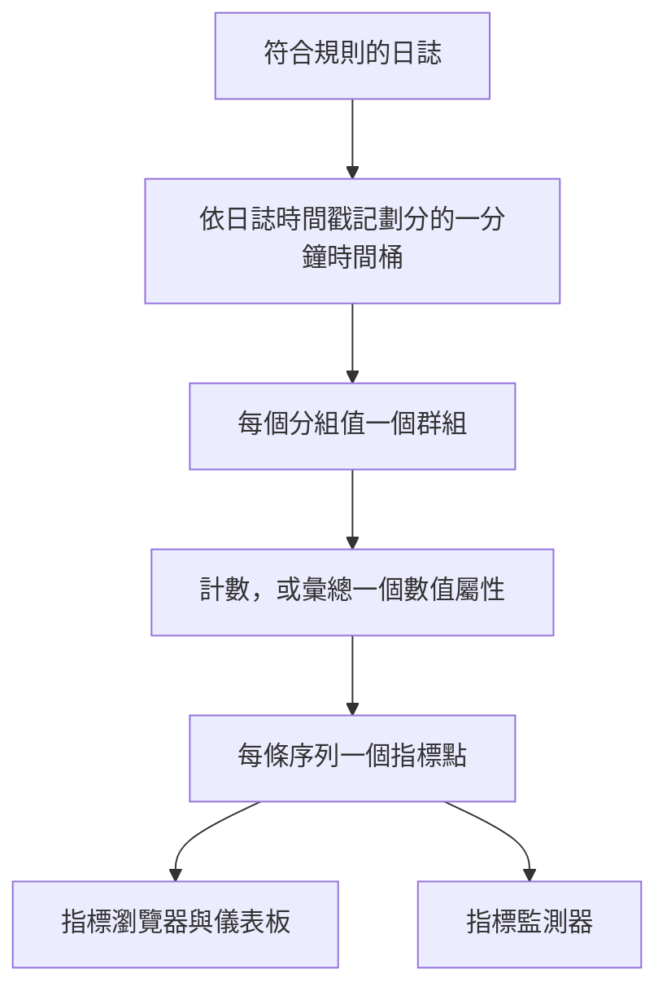
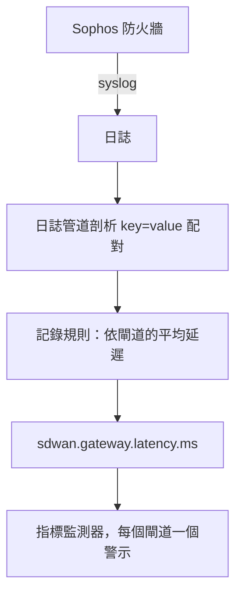

# 日誌記錄規則

**Log Recording Rule** 會把日誌變成指標。它每分鐘取出符合篩選器的日誌，並每分鐘向指標儲存區寫入一個數字：符合的日誌數量，或這些日誌所帶數值屬性的總和、平均、最小值、最大值或百分位數。依最多五個日誌屬性拆分結果，每個值就會得到一條序列：每個閘道、每台主機、每位客戶各一條。

:::cards
- [規則的運作方式](#規則的運作方式): 時間桶、時機、補算與空缺。
- [建立規則](#建立規則): 規則編輯器的各個欄位。
- [範例：SD-WAN 閘道延遲](#範例來自-sophos-防火牆的-sd-wan-閘道延遲): 從防火牆 syslog 到依閘道的警示。
- [權限](#權限): 誰可以建立、變更與讀取規則。
:::

## 概觀

輸出是一般的指標。可以在 **指標瀏覽器** 與儀表板中繪製圖表，用 **指標** 監測器針對它發出警示，包括透過 **分組依據** 依序列警示。

當你關心的數字只存在於日誌中時，請使用日誌記錄規則：防火牆的 SLA 摘要、記錄自身耗時的批次作業、存取日誌中的回應大小，或只是某個服務每分鐘寫入多少筆錯誤日誌。

日誌記錄規則位於 **日誌 → 設定 → 記錄規則**。用於指標與 span 的同類規則位於 **指標 → 設定 → 記錄規則** 與 **追蹤 → 設定 → 記錄規則**。

## 規則的運作方式



- **每條序列每分鐘一個點。** 日誌會依時間戳記歸入一分鐘的時間桶。每個時間桶會為分組屬性值的每種不同組合產生一個點。
- **在該分鐘結束 30 秒後計算。** 這段短暫的等待讓稍晚到達的日誌仍能落入其所屬的分鐘。比這更晚到達的日誌不會被計入。
- **沒有空缺，也不會重複計算。** 每條規則都會記住它最後寫入的分鐘（在規則清單中顯示為 **Computed Until**）。在 worker 重新啟動或其他停機之後，它會補算錯過的分鐘，最多回溯 60 分鐘，而且同一分鐘絕不會寫入兩次。
- **不分組的計數規則絕不會出現空缺。** 沒有符合日誌的分鐘會寫入 `0`。其他所有規則在沒有可彙總內容的分鐘裡什麼也不寫，因此圖表與監測器看到的是「沒有資料」，而不是憑空捏造的零。
- **與其他衍生指標一樣寫入。** 這些點是以規則的 **輸出指標名稱** 命名的 Gauge 資料點，帶有分組屬性與 `oneuptime.derived.log_rule_id`（規則的 ID），並與指標及追蹤記錄規則的點遵循相同的保留期：15 天。

變更規則的定義會從它下一次寫入的分鐘開始生效；已寫入的點不會被重寫。關閉規則會使其停止；重新開啟後，它會補算關閉期間錯過的分鐘，同樣最多 60 分鐘。

## 建立規則

:::steps
### 開啟記錄規則

前往 **日誌 → 設定 → 記錄規則**，然後選擇 **建立Log Recording Rule**。

### 為規則命名

輸入 **名稱**。它下方的 **輸出指標名稱** 會隨著你的輸入從名稱產生；選擇旁邊的 **編輯** 即可自行輸入。

### 選擇日誌與計算內容

在 **Which Logs** 下，以遙測服務、嚴重程度、內文文字與屬性篩選器縮小規則的範圍。選擇一種 **彙總**，除了計數之外，還要選擇要彙總的 **Numeric Attribute**。

### 拆分結果並儲存

可以選擇新增 **分組依據** 屬性與 **Unit**。檢查編輯器底部的那一行，然後儲存。幾分鐘內，規則清單就會顯示 **Computed Until** 時間。
:::

| 欄位 | 作用 |
| --- | --- |
| 名稱 | 規則計算的內容，例如 *SD-WAN gateway latency*。 |
| 輸出指標名稱 | 規則寫入的指標。由名稱產生（*SD-WAN gateway latency* 會寫入 `sd_wan_gateway_latency`），除非你選擇 **編輯** 並自行輸入。它在專案的記錄規則中必須是唯一的。 |
| Which Logs | 選用的篩選器，全部以 AND 組合：遙測服務、嚴重程度、內文包含的文字，以及屬性篩選器（某個屬性等於某個值）。 |
| 彙總 | `Count of logs`，或數值屬性的彙總（見下文）。 |
| Numeric Attribute | 用於計數以外的所有彙總：其值會被彙總的屬性，例如 `latency`。 |
| 分組依據 | 選用：最多 5 個屬性鍵。它們的值的每種不同組合對應一條序列。 |
| Unit | 選用：輸出指標的單位，例如 `ms`。在繪製該指標的所有位置顯示。 |
| 描述 | 位於 **更多欄位** 下：規則的用途。 |
| 已啟用 | 位於 **更多欄位** 下：預設為開啟。只有已啟用的規則才會被計算。 |

編輯器底部的那一行會說明規則將寫入什麼，例如 `avg(latency) by gw_name, profile_name`。

一條規則最多可以依 10 個屬性與 100 個遙測服務篩選。

### 彙總方式

| 彙總 | 每分鐘的點 |
| --- | --- |
| Count of logs | 符合篩選器的日誌數量。 |
| 平均 | 數值屬性值的平均。 |
| 總和 | 屬性值相加的結果。 |
| 最小值 | 最小的值。 |
| 最大值 | 最大的值。 |
| p50 (median) | 中位數。 |
| p75 | 第 75 百分位數。 |
| p90 | 第 90 百分位數。 |
| p95 | 第 95 百分位數。 |
| p99 | 第 99 百分位數。 |

### 數值屬性

數值屬性的值必須是一般的數字。它可以以數字形式到達（`latency=11` 被剖析為數字），也可以以文字形式到達（`"11"`、`"11.5"`、`"1e3"`）。值缺少或不是數字的日誌（`"11ms"`、`"n/a"`、空字串）會被 **略過**。它絕不會被計為 `0`，因此格式錯誤的日誌不會拉低平均。

### 屬性鍵

屬性篩選器的鍵與日誌瀏覽器的篩選器一樣，比對時不區分大小寫。數值屬性與分組鍵必須與日誌中帶有的完全一致，包括日誌管道加上的任何前置詞。鍵欄位會建議專案日誌中帶有的鍵，因此請從清單中選擇，而不要手動輸入。

鍵可以包含字母、數字與 `. _ : / -`。

### 分組與序列上限

每增加一個分組鍵，規則寫入的序列數就會成倍增加，因此請依識別你想單獨查看或單獨警示的對象的屬性分組（閘道、主機、客戶），而不要依每筆日誌都不同的屬性分組，例如請求 ID 或用戶端 IP 位址。

一條規則每分鐘最多寫入 1,000 條序列。超過後，會保留符合日誌最多的序列，並捨棄該分鐘的其餘序列。不帶某個分組屬性的日誌仍會被計入；它的序列在寫入時不含該屬性。

## 範例：來自 Sophos 防火牆的 SD-WAN 閘道延遲

開啟了 SD-WAN 日誌的 Sophos XGS 防火牆，每隔幾分鐘就會依 SD-WAN 設定檔與閘道傳送一份 SLA 摘要：

```text
log_type="SD-WAN" log_component="SLA" profile_name="Branch-Internet" gw_name="WAN2" latency=11 jitter=2 packet_loss=0 gw_status="up" sla_status="SLA met"
```

本範例把這些摘要變成每個閘道的延遲指標，並在某個閘道的延遲持續偏高時發出警示。



:::steps
### 擷取日誌，並把欄位變成屬性

1. 把防火牆的 syslog 傳送到 OneUptime，請參閱 [Syslog](/docs/telemetry/syslog)。
2. 在 **日誌 → 設定 → 管道** 下新增一個管道，其中的處理器會把內文中的 `key=value` 配對剖析為日誌屬性，讓每份摘要都帶有 `log_type`、`log_component`、`profile_name`、`gw_name`、`latency`、`jitter` 與 `packet_loss` 屬性。[Key=Value Parser](/docs/telemetry/log-pipelines#keyvalue-parser) 可以完成這項工作。
3. 開啟 **日誌** 瀏覽器，在一筆 SLA 日誌上檢查屬性名稱。如果你的管道加上了前置詞，請在下文中使用帶前置詞的名稱。

### 建立記錄規則

在 **日誌 → 設定 → 記錄規則** 下建立一條規則：

- **名稱：** SD-WAN gateway latency
- **輸出指標名稱：** 選擇 **編輯** 並輸入 `sdwan.gateway.latency.ms`
- **Which Logs：** 屬性篩選器 `log_type` = `SD-WAN` 與 `log_component` = `SLA`
- **彙總：** 平均，**Numeric Attribute：** `latency`
- **分組依據：** `gw_name` 與 `profile_name`
- **Unit：** `ms`

透過 API、MCP 或 Terraform 建立時，同一規則的 **定義** 為：

```json
{
  "filter": {
    "attributeFilters": [
      { "key": "log_type", "value": "SD-WAN" },
      { "key": "log_component", "value": "SLA" }
    ]
  },
  "aggregationType": "Avg",
  "valueAttribute": "latency",
  "groupByAttributes": ["gw_name", "profile_name"],
  "unit": "ms"
}
```

對另外兩項 SLA 測量值，以 `jitter`（`sdwan.gateway.jitter.ms`，單位 `ms`）與 `packet_loss`（`sdwan.gateway.packet_loss.percent`，單位 `%`）重複上述步驟。依 `gw_status` = `down` 篩選並依 `gw_name` 分組的 **Count of logs** 規則，會計算每個閘道的閘道中斷回報數。

幾分鐘內，規則清單就會顯示 **Computed Until** 時間，`sdwan.gateway.latency.ms` 也會出現在指標瀏覽器中：選取它並依 `gw_name` 分組，每個閘道就有一條延遲曲線。

### 當某個閘道的延遲持續偏高時警示

建立一個 **指標** 監測器（請參閱 [指標監控](/docs/monitor/metrics-monitor)）：

1. **指標查詢：** `sdwan.gateway.latency.ms`，彙總為 **平均**，**分組依據** 為 `gw_name` 與 `profile_name`。
2. **滾動時間區間：** Past 15 Minutes。防火牆每隔幾分鐘回報一次，因此區間內每個閘道都有多個點。
3. **彙總策略：** **All Values**。區間內的每個點都必須超過門檻，因此一份緩慢的摘要不會呼叫任何人。若要在平均偏高時警示，請改用 **平均**。
4. **條件：** Metric value **Greater Than** `150` 時開啟警示。
5. 可以在警示標題中使用分組值，例如 `SD-WAN latency high on {{gw_name}} ({{profile_name}})`。

設定分組依據後，每個閘道都是獨立的序列：WAN2 變慢只會為 WAN2 開啟警示，並在 WAN2 恢復時自行解決。請參閱 [依序列警示](/docs/monitor/metrics-monitor#依序列警示group-by)。
:::

## 須知

- **時間戳記來自日誌。** 日誌會落入它自身時間戳記所在的分鐘。時鐘偏差較大的設備，其日誌會落入錯誤的分鐘，甚至完全落在區間之外。
- **不回填。** 新規則會從它第一次執行之前的那一分鐘開始；更早的日誌不會被計算。
- **刪除規則** 會使其停止。它已寫入的點會保留到過期為止。
- **記錄規則以專案對日誌的完整檢視執行。** 任何能讀取輸出指標的人，都能看到依規則篩選器符合的每筆日誌計算出的數字，因此建立與編輯日誌記錄規則僅限於專案擁有者、管理員與擁有 **Create / Edit Log Recording Rule** 權限的人。

## 權限

| 權限 | 允許 |
| --- | --- |
| Create Log Recording Rule | 建立規則。 |
| Edit Log Recording Rule | 變更規則，以及將其關閉。 |
| Delete Log Recording Rule | 刪除規則。 |
| Read Log Recording Rule | 查看規則及其計算內容。 |

專案擁有者與管理員可以執行以上所有操作。專案成員、檢視者與遙測角色可以讀取規則。

## 後續步驟

:::cards
- [指標監控](/docs/monitor/metrics-monitor): 針對規則寫入的指標發出警示。
- [日誌管道](/docs/telemetry/log-pipelines): 擷取規則所彙總的屬性。
- [Syslog](/docs/telemetry/syslog): 把防火牆與伺服器日誌傳送到 OneUptime。
:::
