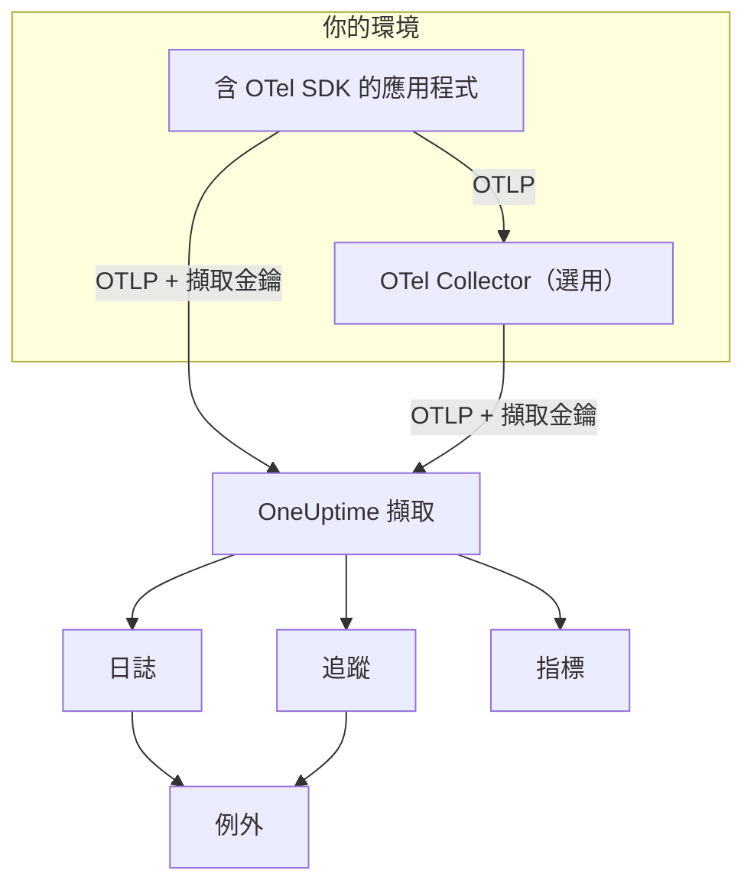

# OpenTelemetry

OneUptime 透過 OpenTelemetry Protocol（OTLP）擷取日誌、指標與追蹤。用擷取金鑰把任何 OpenTelemetry SDK 或 OpenTelemetry Collector 指向 OneUptime，資料就會出現在 **日誌**、**追蹤**、**指標** 與 **例外** 中。本頁先讓一個服務在幾分鐘內開始傳送資料，接著說明正式環境需要了解的端點、限制與錯誤。

:::cards
- [快速入門](#快速入門): 建立金鑰、設定四個環境變數並加入 SDK。
- [使用 Collector](#透過-opentelemetry-collector-傳送): 將 OneUptime 新增為你已在執行的 Collector 的匯出器。
- [端點與限制](#端點與限制): URL、連接埠、編碼、大小限制與狀態碼。
- [疑難排解](#疑難排解): 收不到資料時要檢查什麼。
:::

## 運作方式

你的應用程式將 OTLP 直接匯出到 OneUptime，或匯出到負責轉送的 OpenTelemetry Collector。每個請求都會在 `x-oneuptime-token` 標頭中帶著擷取金鑰，OneUptime 會用這把金鑰找到你的專案。



- **服務會自動建立。** 資源屬性 `service.name`（以 `OTEL_SERVICE_NAME` 設定）就是資料所屬服務的名稱。OneUptime 會在第一次傳送時建立該服務，並列在 **產品 → 服務** 中。
- **錯誤會變成例外。** span 上的例外事件，以及記錄在日誌中的例外，會在 **例外** 中歸併為問題，請參閱[來自日誌的例外](#來自日誌的例外)。

## 開始之前

- 一個你可以在其中建立擷取金鑰的 OneUptime 專案：專案擁有者與管理員可以建立，擁有 **Create Telemetry Ingestion Key** 權限的任何人也可以。
- 一個可以加入 OpenTelemetry SDK 的應用程式，或一個 OpenTelemetry Collector。
- 從應用程式或 Collector 到 `oneuptime.com`（或你自己的 OneUptime 主機）的對外 HTTPS（連接埠 443）。

> [!NOTE]
> 在 OneUptime Cloud 上，遙測資料依擷取的 GB 計費。Free 方案的專案必須先新增付款方式才能傳送遙測資料，建立金鑰的對話框會顯示價格。

## 快速入門

:::steps
### 建立擷取金鑰

1. 前往 **產品 → 專案設定**。
2. 在側邊選單中展開 **遙測與 APM**，然後選擇 **擷取金鑰**。
3. 點選 **建立擷取金鑰**。對話框會填好名稱，並選擇 **伺服器** 金鑰類型，也就是應用程式或 Collector 傳送資料時使用的類型。可視需要重新命名，然後點選 **建立擷取金鑰**。


新金鑰會在自己的頁面中開啟。複製它的 **密鑰金鑰**，這就是你以 `x-oneuptime-token` 傳送的權杖。


### 設定 OpenTelemetry 環境變數

所有 OpenTelemetry SDK 都讀取同一組標準環境變數，因此這個步驟在任何語言中都相同。

| 環境變數 | 值 | 作用 |
| --- | --- | --- |
| `OTEL_EXPORTER_OTLP_ENDPOINT` | `https://oneuptime.com/otlp` | 傳送目標。SDK 會自行加上 `/v1/traces`、`/v1/metrics` 與 `/v1/logs`。 |
| `OTEL_EXPORTER_OTLP_HEADERS` | `x-oneuptime-token=YOUR_ONEUPTIME_INGESTION_KEY` | 在每個請求中傳送你的擷取金鑰。 |
| `OTEL_EXPORTER_OTLP_PROTOCOL` | `http/protobuf` | 透過 HTTP 的 OTLP。有些 SDK 預設使用 gRPC，而 gRPC 使用另一個端點。 |
| `OTEL_SERVICE_NAME` | `my-service` | 資料在 OneUptime 中所屬的服務。 |

```bash
export OTEL_EXPORTER_OTLP_ENDPOINT="https://oneuptime.com/otlp"
export OTEL_EXPORTER_OTLP_HEADERS="x-oneuptime-token=YOUR_ONEUPTIME_INGESTION_KEY"
export OTEL_EXPORTER_OTLP_PROTOCOL="http/protobuf"
export OTEL_SERVICE_NAME="my-service"
```

自行託管？將 `https://oneuptime.com` 換成你的 OneUptime 執行個體 URL，例如 `https://oneuptime.example.com/otlp`。若要為例外加上環境標籤，也請將 `OTEL_RESOURCE_ATTRIBUTES` 設為 `deployment.environment=production`。

### 為應用程式加入 OpenTelemetry

選擇你的語言。每種設定都會讀取上方的環境變數，因此程式碼中不會出現端點或金鑰。

:::tabs
@tab Node.js
安裝 SDK、自動檢測與 OTLP/HTTP 匯出器：

```bash
npm install @opentelemetry/sdk-node @opentelemetry/auto-instrumentations-node \
  @opentelemetry/exporter-trace-otlp-proto @opentelemetry/exporter-metrics-otlp-proto \
  @opentelemetry/exporter-logs-otlp-proto @opentelemetry/sdk-metrics @opentelemetry/sdk-logs
```

在獨立的檔案中建立 SDK：

```javascript title="instrumentation.js"
const { NodeSDK } = require("@opentelemetry/sdk-node");
const { getNodeAutoInstrumentations } = require("@opentelemetry/auto-instrumentations-node");
const { OTLPTraceExporter } = require("@opentelemetry/exporter-trace-otlp-proto");
const { OTLPMetricExporter } = require("@opentelemetry/exporter-metrics-otlp-proto");
const { OTLPLogExporter } = require("@opentelemetry/exporter-logs-otlp-proto");
const { PeriodicExportingMetricReader } = require("@opentelemetry/sdk-metrics");
const { BatchLogRecordProcessor } = require("@opentelemetry/sdk-logs");

// The exporters read OTEL_EXPORTER_OTLP_ENDPOINT and OTEL_EXPORTER_OTLP_HEADERS.
const sdk = new NodeSDK({
  traceExporter: new OTLPTraceExporter(),
  metricReader: new PeriodicExportingMetricReader({
    exporter: new OTLPMetricExporter(),
  }),
  logRecordProcessors: [new BatchLogRecordProcessor(new OTLPLogExporter())],
  instrumentations: [getNodeAutoInstrumentations()],
});

sdk.start();
```

在應用程式程式碼之前載入它：

```bash
node --require ./instrumentation.js app.js
```
@tab Python
安裝 OpenTelemetry 發行版與匯出器，接著安裝應用程式所用程式庫的檢測：

```bash
pip install opentelemetry-distro opentelemetry-exporter-otlp
opentelemetry-bootstrap -a install
```

透過 `opentelemetry-instrument` 啟動應用程式。它會匯出追蹤、指標與日誌；日誌變數還會傳送以 Python `logging` 模組寫入的紀錄：

```bash
OTEL_PYTHON_LOGGING_AUTO_INSTRUMENTATION_ENABLED=true opentelemetry-instrument python app.py
```
@tab Go
加入 SDK 與 OTLP/HTTP 匯出器：

```bash
go get go.opentelemetry.io/otel go.opentelemetry.io/otel/sdk go.opentelemetry.io/otel/sdk/metric \
  go.opentelemetry.io/otel/exporters/otlp/otlptrace/otlptracehttp \
  go.opentelemetry.io/otel/exporters/otlp/otlpmetric/otlpmetrichttp
```

在程式啟動時建立 tracer 與 meter 提供者：

```go title="main.go"
package main

import (
	"context"
	"log"

	"go.opentelemetry.io/otel"
	"go.opentelemetry.io/otel/exporters/otlp/otlpmetric/otlpmetrichttp"
	"go.opentelemetry.io/otel/exporters/otlp/otlptrace/otlptracehttp"
	sdkmetric "go.opentelemetry.io/otel/sdk/metric"
	sdktrace "go.opentelemetry.io/otel/sdk/trace"
)

func main() {
	ctx := context.Background()

	// Both exporters read OTEL_EXPORTER_OTLP_ENDPOINT and OTEL_EXPORTER_OTLP_HEADERS.
	traceExporter, err := otlptracehttp.New(ctx)
	if err != nil {
		log.Fatal(err)
	}
	tracerProvider := sdktrace.NewTracerProvider(sdktrace.WithBatcher(traceExporter))
	defer tracerProvider.Shutdown(ctx)
	otel.SetTracerProvider(tracerProvider)

	metricExporter, err := otlpmetrichttp.New(ctx)
	if err != nil {
		log.Fatal(err)
	}
	meterProvider := sdkmetric.NewMeterProvider(
		sdkmetric.WithReader(sdkmetric.NewPeriodicReader(metricExporter)),
	)
	defer meterProvider.Shutdown(ctx)
	otel.SetMeterProvider(meterProvider)

	// Your application code.
}
```

提供者會從環境中讀取 `OTEL_SERVICE_NAME`。至於日誌，請加入 `otlploghttp` 並搭配 `otelslog` 之類的日誌橋接，它會讀取相同的變數。
@tab Java
下載 OpenTelemetry Java 代理程式並掛載到你的應用程式上，不需要修改程式碼：

```bash
curl -L -O https://github.com/open-telemetry/opentelemetry-java-instrumentation/releases/latest/download/opentelemetry-javaagent.jar
java -javaagent:opentelemetry-javaagent.jar -jar my-app.jar
```

代理程式會檢測常見的框架與程式庫，並匯出追蹤、指標，以及透過 Logback 或 Log4j 寫入的日誌。
@tab .NET
加入適用於 ASP.NET Core 的 OpenTelemetry 套件：

```bash
dotnet add package OpenTelemetry.Extensions.Hosting
dotnet add package OpenTelemetry.Exporter.OpenTelemetryProtocol
dotnet add package OpenTelemetry.Instrumentation.AspNetCore
dotnet add package OpenTelemetry.Instrumentation.Http
```

在啟動時註冊 OpenTelemetry。`UseOtlpExporter()` 會傳送追蹤、指標與日誌，並讀取 `OTEL_EXPORTER_OTLP_*` 變數：

```csharp title="Program.cs"
using OpenTelemetry;
using OpenTelemetry.Metrics;
using OpenTelemetry.Trace;

var builder = WebApplication.CreateBuilder(args);

builder.Services.AddOpenTelemetry()
    .WithTracing(tracing => tracing
        .AddAspNetCoreInstrumentation()
        .AddHttpClientInstrumentation())
    .WithMetrics(metrics => metrics
        .AddAspNetCoreInstrumentation()
        .AddHttpClientInstrumentation())
    .WithLogging()
    .UseOtlpExporter();

var app = builder.Build();
app.Run();
```

正在使用 Serilog？請參閱 [Serilog](/docs/telemetry/serilog)，將它的日誌傳送到 OneUptime。
:::

### 確認資料已送達

詢問 OneUptime 是否接受你的金鑰：

```bash
curl -i -H "x-oneuptime-token: YOUR_ONEUPTIME_INGESTION_KEY" \
  https://oneuptime.com/otlp/v1/validate
```

可用的金鑰會傳回 `200`，並帶有 `"valid": true`。其他情況都會傳回 `401`，訊息會說明問題所在：未知、已停用或已過期。

接著執行應用程式並使用一分鐘。開啟 **產品 → 服務**：你的服務會以 `OTEL_SERVICE_NAME` 中設定的名稱列出，並附有它的日誌、追蹤、指標與例外。**產品 → 日誌**、**產品 → 追蹤** 與 **產品 → 指標** 會顯示所有服務的同一批資料。
:::

:::details 不用 SDK 傳送一筆測試日誌
OTLP/HTTP 也接受 JSON，所以你可以用 `curl` 傳送日誌。將 `severityNumber` 設為 `9` 表示這是一筆資訊層級的日誌：

```bash
curl -i https://oneuptime.com/otlp/v1/logs \
  -H "Content-Type: application/json" \
  -H "x-oneuptime-token: YOUR_ONEUPTIME_INGESTION_KEY" \
  -d '{
    "resourceLogs": [{
      "resource": {
        "attributes": [
          { "key": "service.name", "value": { "stringValue": "my-service" } }
        ]
      },
      "scopeLogs": [{
        "logRecords": [{
          "severityNumber": 9,
          "body": { "stringValue": "Hello from curl" }
        }]
      }]
    }]
  }'
```

傳回 `200` 表示日誌已被接受。幾秒內它就會出現在 **產品 → 日誌** 中的 `my-service` 服務下。
:::

## 透過 OpenTelemetry Collector 傳送

如果你已經有 Collector，或想在一個地方對資料進行批次處理、篩選或補充，又或者不想讓擷取金鑰出現在應用程式中，就使用 Collector。應用程式匯出到 Collector，只有 Collector 會與 OneUptime 通訊。

:::steps
### 將 OneUptime 新增為匯出器

新增一個指向 OneUptime 的 `otlphttp` 匯出器，並讓每條管線都經過它：

```yaml title="otel-collector-config.yaml"
receivers:
  otlp:
    protocols:
      grpc:
        endpoint: 0.0.0.0:4317
      http:
        endpoint: 0.0.0.0:4318

processors:
  batch: {}

exporters:
  otlphttp:
    endpoint: https://oneuptime.com/otlp
    headers:
      x-oneuptime-token: YOUR_ONEUPTIME_INGESTION_KEY

service:
  pipelines:
    traces:
      receivers: [otlp]
      processors: [batch]
      exporters: [otlphttp]
    metrics:
      receivers: [otlp]
      processors: [batch]
      exporters: [otlphttp]
    logs:
      receivers: [otlp]
      processors: [batch]
      exporters: [otlphttp]
```

保留匯出器的預設值：它會傳送以 gzip 壓縮的 protobuf，OneUptime 兩者都接受。不要在匯出器上設定 `Content-Type` 標頭。OneUptime 依這個標頭選擇解碼器，所以在 protobuf 位元組前加上 JSON 內容類型會讓擷取失敗。

### 執行 Collector

:::tabs
@tab Docker
```bash
docker run -d --name otel-collector \
  -p 4317:4317 -p 4318:4318 \
  -v "$(pwd)/otel-collector-config.yaml:/etc/otelcol-contrib/config.yaml" \
  otel/opentelemetry-collector-contrib:latest
```
@tab Linux
```bash
otelcol-contrib --config otel-collector-config.yaml
```
:::

Collector 會在連接埠 `4317`（gRPC）與 `4318`（HTTP）上接收 OTLP，這是 SDK 預設傳送的連接埠。

### 讓應用程式指向 Collector

在應用程式中將 `OTEL_EXPORTER_OTLP_ENDPOINT` 設為 Collector 的位址，例如 `http://localhost:4318`，並移除 `OTEL_EXPORTER_OTLP_HEADERS`，金鑰由 Collector 加上。每個應用程式都保留 `OTEL_SERVICE_NAME`。

資料送達 OneUptime 的方式與快速入門完全相同。如果沒有送達，Collector 本身的日誌會說明原因，請參閱[疑難排解](#疑難排解)。
:::

已經在匯出到其他廠商？在現有匯出器旁新增 `otlphttp` 匯出器，並在每條管線的 `exporters` 中同時列出兩者，比較期間就能同時傳到兩邊。若也要收集主機指標與日誌檔，請參閱 [Host OpenTelemetry Collector](/docs/telemetry/host-otel-collector) 指南。

## 端點與限制

| 設定 | OTLP/HTTP（建議） | OTLP/gRPC |
| --- | --- | --- |
| 端點 | `https://oneuptime.com/otlp` | `https://oneuptime.com:443` |
| 驗證 | `x-oneuptime-token` 標頭 | `x-oneuptime-token` 中繼資料 |
| 編碼 | Protobuf（`application/x-protobuf`）或 JSON（`application/json`） | Protobuf |
| 壓縮 | 不壓縮、`gzip`、`deflate` 或 `zstd` | 不壓縮或 `gzip` |
| 請求大小 | `/otlp` 上每個請求最多 4 MB | 每則訊息最多 4 MB |

透過 HTTP 時，每種訊號在端點下都有自己的路徑。SDK 與 Collector 會替你加上；只有在某個工具要求完整 URL 時才需要自行設定。

| 訊號 | OTLP/HTTP URL |
| --- | --- |
| 追蹤 | `https://oneuptime.com/otlp/v1/traces` |
| 指標 | `https://oneuptime.com/otlp/v1/metrics` |
| 日誌 | `https://oneuptime.com/otlp/v1/logs` |
| 效能剖析 | `https://oneuptime.com/otlp/v1/profiles` |

若要持續剖析效能，大多數剖析器會改為傳送到相容 Pyroscope 的端點，請參閱[持續效能剖析](/docs/telemetry/profiles)。匯出 OTLP 剖析資料的 Collector 必須將匯出器的 `profiles_endpoint` 設為 `https://oneuptime.com/otlp/v1/profiles`，因為預設情況下它會把剖析資料傳送到 OneUptime 未提供的開發路徑。

### 透過 gRPC 的 OTLP

OneUptime 在與網頁應用程式相同的主機上，透過 TLS 於連接埠 443 提供 OTLP/gRPC。將 `OTEL_EXPORTER_OTLP_PROTOCOL` 設為 `grpc`、`OTEL_EXPORTER_OTLP_ENDPOINT` 設為 `https://oneuptime.com:443`，並傳送相同的 `x-oneuptime-token` 標頭。在 Collector 中，使用 `otlp` 匯出器，設定 `endpoint: oneuptime.com:443` 與相同的 `headers`。

在自行託管的安裝中，gRPC 只能透過 HTTPS 送達 OneUptime：明文 HTTP（h2c）連線會被拒絕。如果你的執行個體透過一般 HTTP 提供服務，請使用 OTLP/HTTP。

金鑰的兩項設定只對 OTLP/HTTP 生效：**Requests Per Minute Limit** 與 **Pinned Service Name**。透過 gRPC 傳送的資料會保留傳送時的 `service.name`，也不計入限額。

### 回應

資料一進入佇列，OneUptime 就會回應匯出請求，資料會在幾秒後出現。

| 回應 | gRPC 狀態 | 意義 | 處理方式 |
| --- | --- | --- | --- |
| `200` | `OK` | 已接受。 | 不需處理。 |
| `401` | `UNAUTHENTICATED` | 金鑰缺少、未知或已過期。 | 將 `x-oneuptime-token` 的值與該金鑰的 **密鑰金鑰** 核對。 |
| `402` | `PERMISSION_DENIED` | 僅限 OneUptime Cloud：專案使用 Free 方案且沒有付款方式。 | 在 **專案設定 → 帳單與發票 → 帳單** 中新增。 |
| `413` | — | 請求超過大小限制。 | 傳送較小的批次。 |
| `415` | — | 不支援的 `Content-Encoding`。 | 使用 `gzip`、`deflate` 或 `zstd`，或不壓縮。 |
| `422` | `PERMISSION_DENIED` | 金鑰已停用，或是在允許來源之外使用的瀏覽器金鑰。 | 重新啟用金鑰，或改用伺服器金鑰傳送。 |
| `429` | — | 已達金鑰的 **Requests Per Minute Limit**。 | 一開始不需處理：匯出器會在 `Retry-After` 時間之後重試。若經常發生，請提高限額。 |
| `503` | `UNAVAILABLE` | OneUptime 正在啟動，或擷取佇列無法使用。 | 不需處理：OTLP 匯出器會自行重試 `503`。 |

`401`、`402`、`413`、`415` 與 `422` 對 OTLP 匯出器而言是永久性錯誤：匯出器會捨棄該批次並記錄錯誤，而不會重試。

### 重新啟動與升級

OneUptime 重新啟動或升級期間，會以 `503` 與 `Retry-After: 5` 回應匯出請求，直到準備就緒，匯出器會重新傳送這些請求。Collector 的匯出器預設會持續重試五分鐘（`retry_on_failure`），並將傳送失敗的資料保存在它的 `sending_queue` 中，所以請讓兩者保持開啟。OneUptime 未在接收資料的時間，絕不會被算作你的伺服器、主機或其他資源的停機：請參閱[OneUptime 未接收資料時](/docs/monitor/when-oneuptime-is-not-receiving#啟動時)。

### 擷取金鑰

每把金鑰的頁面位於 **專案設定 → 遙測與 APM → 擷取金鑰**，包含以下設定：

| 設定 | 作用 |
| --- | --- |
| **金鑰類型** | **伺服器**（預設）用於應用程式、Collector 與代理程式。**Browser** 用於隨網頁發布的金鑰：只能寫入，且只接受來自其 **Allowed Origins** 的請求。金鑰建立後就無法變更。 |
| **Allowed Origins** | 瀏覽器金鑰可使用的網頁來源，例如 `https://app.example.com`。對伺服器金鑰無效。 |
| **Pinned Service Name** | 設定後，會取代透過 OTLP/HTTP 以此金鑰傳送之所有資料的 `service.name`。 |
| **已啟用** | 關閉後會立即停止接受以此金鑰傳送的資料，而不需刪除金鑰。 |
| **到期於** | 超過此日期後金鑰會被拒絕。留空表示永不過期。 |
| **Requests Per Minute Limit** | 使用此金鑰的所有用戶端合計，每分鐘可被接受的 OTLP/HTTP 請求數上限。留空時，伺服器金鑰沒有上限，瀏覽器金鑰為 6,000。 |
| **Last Used At** | 最近一次以此金鑰接受資料的時間。可用來找出能安全輪替或刪除的金鑰。 |

金鑰頁面上的 **重設密鑰** 會取代密鑰。所有仍以舊密鑰傳送的應用程式與 Collector 都會被拒絕，直到你更新它們。

## 自行託管的 OneUptime

本頁的所有內容在你自己的安裝中同樣適用。凡是本頁寫著 `https://oneuptime.com` 的地方，都換成你的 OneUptime URL：

- `OTEL_EXPORTER_OTLP_ENDPOINT` 為 `https://YOUR-ONEUPTIME-HOST/otlp`；若你透過一般 HTTP 提供 OneUptime，則為 `http://YOUR-ONEUPTIME-HOST/otlp`。
- 內建的 Ingress 在 `/otlp` 上接受最大 4 MB 的請求。你在 OneUptime 前面執行的代理伺服器可能限制更低（ingress-nginx 的 `proxy-body-size` 預設為 1 MB），所以也要為 `/otlp` 調高限制，否則匯出器會收到 `413`。
- 如果設定了 `DISABLE_TELEMETRY_INGESTION=true`，OneUptime 會接受每次匯出但不儲存任何內容。自行託管的執行個體完全看不到資料時，請先檢查這一項。

## 來自日誌的例外

OneUptime 會在你的 **logs** 中尋找例外，並將它們匯入追蹤錯誤所進入的同一個 **例外** 檢視。每筆日誌本來就屬於某個服務或主機，因此例外會歸到它名下。日誌例外與追蹤例外共用指紋分組，所以同一個錯誤同時由追蹤與日誌回報時，會合併為一個問題。

日誌變成例外有兩種方式：

| 偵測方式 | 適用的日誌 | 運作方式 |
| --- | --- | --- |
| **例外屬性**（建議） | 任何日誌 | 帶有 OpenTelemetry `exception.type`、`exception.message` 或 `exception.stacktrace` 屬性的日誌紀錄會直接變成例外。大多數日誌整合在你記錄例外時都會設定這些屬性：Logback 與 Log4j appender、Serilog、Python 日誌檢測。這種方式精確，且適用於任何語言。 |
| **本文中的堆疊追蹤** | 不帶追蹤 ID 與 span ID 的錯誤與嚴重錯誤日誌 | OneUptime 會在本文的前 16 KB 中尋找 JavaScript、Python、Java、Go、Ruby、C#/.NET 或 PHP 堆疊追蹤，並從中取出類型、訊息與框架。在 span 內寫入的日誌會被略過，因為該 span 本身會回報例外。 |

本文掃描適用於 Collector 讀取的純文字日誌，例如原始 stdout、journald 或 syslog。多行堆疊追蹤必須以一筆日誌紀錄送達，因此請在 Collector 中啟用多行合併，請參閱 [Host OpenTelemetry Collector](/docs/telemetry/host-otel-collector) 指南。

偵測預設為開啟。在自行託管的安裝中，在 `app` 服務上設定 `TELEMETRY_LOG_EXCEPTION_EXTRACTION_ENABLED=false` 即可關閉；若你執行了 Helm chart 的專用 worker，也要在 `worker` 上設定。

## 疑難排解

:::details 沒有出現資料，匯出器記錄了 `401`
金鑰缺少、未知或已過期。檢查 `OTEL_EXPORTER_OTLP_HEADERS` 是否為 `x-oneuptime-token=` 後接該金鑰的 **密鑰金鑰**，值中沒有引號或空格，並確認該金鑰屬於你正在檢視的專案。[確認資料已送達](#確認資料已送達)中的驗證請求會告訴你是哪一種情況。
:::

:::details 匯出器記錄了 `422`
金鑰已停用，或是瀏覽器金鑰。在金鑰設定中重新開啟 **已啟用**，或建立 **伺服器** 金鑰：瀏覽器金鑰只接受來自其允許來源之一上的網頁的請求。
:::

:::details 匯出器記錄了 `402`
專案使用 OneUptime Cloud 的 Free 方案且沒有付款方式，而遙測資料依用量計費。在 **專案設定 → 帳單與發票 → 帳單** 中新增付款方式後，匯出就會重新被接受。
:::

:::details 匯出器記錄了 `404`
SDK 傳送到錯誤的路徑。`OTEL_EXPORTER_OTLP_ENDPOINT` 必須以 `/otlp` 結尾，結尾不要有斜線，也不要有 `/v1/...`，這部分由 SDK 加上。若你設定了 `OTEL_EXPORTER_OTLP_TRACES_ENDPOINT` 這類針對單一訊號的變數，它需要完整 URL，例如 `https://oneuptime.com/otlp/v1/traces`。
:::

:::details 什麼事都沒發生，SDK 記錄了連線錯誤
SDK 很可能正透過 gRPC 匯出到 HTTP 端點或 `localhost`。設定 `OTEL_EXPORTER_OTLP_PROTOCOL=http/protobuf`，或使用[透過 gRPC 的 OTLP](#透過-grpc-的-otlp)中說明的 gRPC 端點。同時確認處理程序確實讀得到這些環境變數：在容器中要設定在容器上，而不是你的 shell 中。
:::

:::details Collector 記錄了帶 `413` 的 `Exporting failed`
某個批次超過大小限制。縮小批次大小，例如在 `batch` 處理器上設定 `send_batch_max_size: 1000`。若你在自己的代理伺服器後方自行託管，也要檢查該代理伺服器的本文大小限制。
:::

:::details 資料進入錯誤的服務，或進入 Unknown Service
服務來自資源屬性 `service.name`。請在每個應用程式中設定 `OTEL_SERVICE_NAME`。如果金鑰設定了 **Pinned Service Name**，以該金鑰進行的每次 OTLP/HTTP 匯出都會改為歸入這個名稱。
:::

## 後續步驟

:::cards
- [搜尋語法](/docs/telemetry/search-syntax): 在檢視器中篩選日誌、追蹤、指標與例外。
- [日誌管線](/docs/telemetry/log-pipelines): 在日誌送達時進行剖析與補充。
- [日誌監測器](/docs/monitor/logs-monitor): 出現符合的日誌時發出警示。
- [Host OpenTelemetry Collector](/docs/telemetry/host-otel-collector): 以 Collector 收集主機指標與日誌檔。
:::
