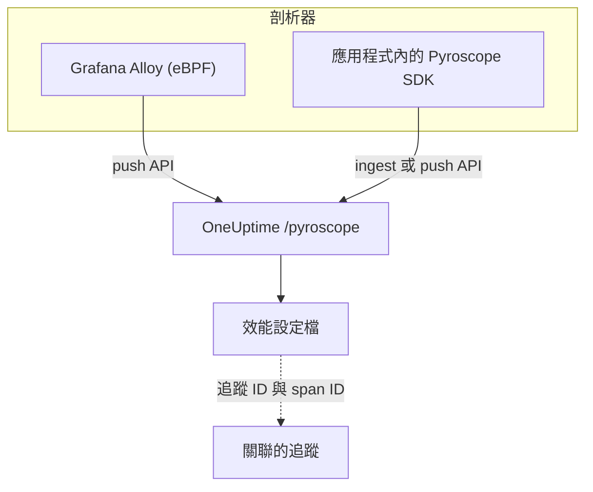

# 持續效能剖析

持續效能剖析會逐一函式顯示應用程式如何使用 CPU 時間與記憶體。OneUptime 提供 **與 Pyroscope 相容的擷取 API**，因此任何能推送到 Pyroscope 伺服器的工具（Grafana Alloy eBPF 剖析器或各語言的 Pyroscope SDK）都能推送到 OneUptime，你可以在日誌、指標與追蹤旁以火焰圖查看結果。

:::cards
- [傳送剖析資料](#傳送剖析資料): 使用 eBPF 的 Grafana Alloy，或應用程式內的 Pyroscope SDK。
- [擷取端點](#擷取端點): 基礎 URL，以及傳遞金鑰的三種方式。
- [確認是否正常運作](#確認是否正常運作): 檢查金鑰、頁面與上傳狀態。
- [查看剖析資料](#在-oneuptime-中查看剖析資料): 火焰圖、熱門函式、比較與追蹤連結。
:::

## 運作方式

剖析器會對你的處理程序取樣，每隔幾秒就帶著擷取金鑰把一份剖析資料上傳到 OneUptime 的 `/pyroscope` 端點。OneUptime 會把每份資料儲存在它所指定的服務下，並在 **效能設定檔** 中繪製成火焰圖。



## 開始之前

你需要一把 **伺服器** 類型的遙測擷取金鑰。如果還沒有，請依下列步驟建立：

:::steps
### 開啟擷取金鑰

前往 **產品 → 專案設定**，在側邊選單中展開 **遙測與 APM**，然後選擇 **擷取金鑰**。


### 建立金鑰

點選 **建立擷取金鑰**。對話框已填好金鑰名稱，並選擇了 **伺服器**（應用程式或收集器傳送資料時使用的金鑰類型），因此可以直接點選 **建立擷取金鑰** 建立，也可以先重新命名。

### 複製密鑰

新金鑰會在自己的頁面中開啟。複製它的 **密鑰金鑰**：這就是下方範例中稱為 `YOUR_ONEUPTIME_INGESTION_TOKEN` 的擷取權杖。


:::

## 擷取端點

| 設定 | 值 |
| --- | --- |
| 基礎 URL（Pyroscope 伺服器位址） | `https://oneuptime.com/pyroscope` |
| 驗證標頭 | `x-oneuptime-token: YOUR_ONEUPTIME_INGESTION_TOKEN` |

用戶端會在基礎 URL 後加上自己的路徑（大多數 Pyroscope SDK 為 `/ingest`，Grafana Alloy 與 v0.14 起的 .NET SDK 為 `/push.v1.PusherService/Push`），因此你只需要設定基礎 URL，結尾不加斜線。

OneUptime 會從下列任一位置讀取擷取權杖，請使用你的用戶端支援的方式：

| 方式 | 使用時機 |
| --- | --- |
| `x-oneuptime-token` 標頭 | 允許新增自訂標頭的用戶端。 |
| `Authorization: Bearer <token>` | 具有 `authToken` / `auth_token` 選項的 SDK，它們傳送的就是這種形式。 |
| HTTP 基本驗證，把權杖當作 **密碼**（使用者名稱不拘） | 只提供基本驗證使用者名稱與密碼的用戶端。 |

> [!NOTE]
> 自行託管 OneUptime？把 `https://oneuptime.com` 換成你自己的主機，例如 `https://YOUR-ONEUPTIME-HOST/pyroscope`。

## 支援的剖析資料格式

| 格式 | 傳送者 | 支援 |
| --- | --- | --- |
| pprof（二進位 protobuf，可選擇以 gzip 壓縮） | Go、Node.js 與 .NET 的 Pyroscope SDK；Grafana Alloy | 是 |
| Folded / collapsed 文字 | Python、Ruby 與 Rust 的 Pyroscope SDK（其預設上傳格式） | 是 |
| JFR（Java Flight Recorder） | Pyroscope Java 代理程式 | 尚未支援，Java 服務請使用 Grafana Alloy |

## 傳送剖析資料

Grafana Alloy 不必修改程式碼即可剖析主機上的每個處理程序，是建議的入門方式。Pyroscope SDK 則是在你的應用程式內部執行。

:::tabs
@tab Grafana Alloy
[Grafana Alloy](https://grafana.com/docs/alloy/latest/) 使用 eBPF 從 Linux 主機上的每個處理程序收集 CPU 剖析資料，應用程式內不需要代理程式，也不必修改程式碼。它適用於 Go、Rust、C/C++、Java、Python、Ruby、PHP、Node.js 與 .NET。

建立 Alloy 設定：

```hcl title="alloy-config.alloy"
discovery.process "all" {
  refresh_interval = "60s"
}

discovery.relabel "alloy_profiles" {
  targets = discovery.process.all.targets

  rule {
    action       = "replace"
    source_labels = ["__meta_process_exe"]
    target_label  = "service_name"
  }
}

pyroscope.ebpf "default" {
  targets    = discovery.relabel.alloy_profiles.output
  forward_to = [pyroscope.write.oneuptime.receiver]

  collect_interval = "15s"
  sample_rate      = 97
}

pyroscope.write "oneuptime" {
  endpoint {
    url = "https://oneuptime.com/pyroscope"
    headers = {
      "x-oneuptime-token" = "YOUR_ONEUPTIME_INGESTION_TOKEN",
    }
  }
}
```

用 Docker 執行。eBPF 需要使用主機 PID 命名空間的特權容器：

```yaml title="docker-compose.yml"
services:
  alloy:
    image: grafana/alloy:latest
    privileged: true
    pid: host
    volumes:
      - ./alloy-config.alloy:/etc/alloy/config.alloy
      - /proc:/proc:ro
      - /sys:/sys:ro
    command:
      - run
      - /etc/alloy/config.alloy
```

或直接在主機上執行：

```bash
alloy run alloy-config.alloy
```

relabel 規則會用處理程序的執行檔名稱來命名每份剖析資料的服務。
@tab Go
Go SDK 會上傳 pprof。把它的伺服器位址指向 OneUptime 基礎 URL，並把擷取權杖當作驗證權杖傳入：

```go
import "github.com/grafana/pyroscope-go"

pyroscope.Start(pyroscope.Config{
    ApplicationName: "my-service",
    ServerAddress:   "https://oneuptime.com/pyroscope",
    AuthToken:       "YOUR_ONEUPTIME_INGESTION_TOKEN",
    ProfileTypes: []pyroscope.ProfileType{
        pyroscope.ProfileCPU,
        pyroscope.ProfileAllocObjects,
        pyroscope.ProfileAllocSpace,
        pyroscope.ProfileInuseObjects,
        pyroscope.ProfileInuseSpace,
        pyroscope.ProfileGoroutines,
    },
})
```
@tab Node.js
Node.js SDK 會上傳 pprof：

```javascript
const Pyroscope = require("@pyroscope/nodejs");

Pyroscope.init({
  serverAddress: "https://oneuptime.com/pyroscope",
  appName: "my-service",
  authToken: "YOUR_ONEUPTIME_INGESTION_TOKEN",
});

Pyroscope.start();
```
@tab Python
Python SDK 會上傳 folded 文字：

```python
import pyroscope

pyroscope.configure(
    application_name="my-service",
    server_address="https://oneuptime.com/pyroscope",
    auth_token="YOUR_ONEUPTIME_INGESTION_TOKEN",
)
```
@tab .NET
Pyroscope .NET 剖析器是原生 CLR 剖析器：不必修改程式碼，完全透過環境變數啟用。從 [pyroscope-dotnet releases](https://github.com/grafana/pyroscope-dotnet/releases) 下載符合你映像檔的版本（`glibc` 或 Alpine 用的 `musl`，`x86_64` 或 `aarch64`），並將它載入執行階段：

```dockerfile title="Dockerfile"
FROM alpine:3.20 AS pyroscope-profiler
ARG PYROSCOPE_DOTNET_VERSION=1.5.1
ADD https://github.com/grafana/pyroscope-dotnet/releases/download/pyroscope-${PYROSCOPE_DOTNET_VERSION}/pyroscope.${PYROSCOPE_DOTNET_VERSION}-glibc-x86_64.tar.gz /tmp/pyroscope.tar.gz
RUN mkdir -p /pyroscope && tar -xzf /tmp/pyroscope.tar.gz -C /pyroscope

FROM mcr.microsoft.com/dotnet/aspnet:10.0
# ... your application ...
COPY --from=pyroscope-profiler /pyroscope /pyroscope
ENV CORECLR_ENABLE_PROFILING=1
ENV CORECLR_PROFILER={BD1A650D-AC5D-4896-B64F-D6FA25D6B26A}
ENV CORECLR_PROFILER_PATH=/pyroscope/Pyroscope.Profiler.Native.so
ENV LD_PRELOAD=/pyroscope/Pyroscope.Linux.ApiWrapper.x64.so
ENV LD_LIBRARY_PATH=/pyroscope
```

接著把它指向 OneUptime，例如在你的 Kubernetes / Helm 環境中：

```bash
PYROSCOPE_APPLICATION_NAME=my-service
PYROSCOPE_PROFILING_ENABLED=1
PYROSCOPE_SERVER_ADDRESS=https://oneuptime.com/pyroscope
PYROSCOPE_BASIC_AUTH_USER=oneuptime
PYROSCOPE_BASIC_AUTH_PASSWORD=YOUR_ONEUPTIME_INGESTION_TOKEN
```

擷取權杖放在基本驗證的密碼中。使用者名稱可以是任何非空值，但除非兩者都設定，否則剖析器根本不會傳送認證資訊。若要改用標頭傳送權杖，請設定 `PYROSCOPE_HTTP_HEADERS={"x-oneuptime-token":"YOUR_ONEUPTIME_INGESTION_TOKEN"}`。

權杖的傳遞方式取決於剖析器的版本。1.5 及更新版本會忽略 `PYROSCOPE_AUTH_TOKEN`，因此如果你從舊版升級後仍保留該設定，每次上傳都會以 `401` 遭到拒絕：

| pyroscope-dotnet 版本 | 上傳到 | 權杖設定 |
| --- | --- | --- |
| v0.13 及更早 | `/pyroscope/ingest` | `PYROSCOPE_AUTH_TOKEN` |
| v0.14 至 1.4 | `/pyroscope/push.v1.PusherService/Push` | `PYROSCOPE_AUTH_TOKEN` |
| 1.5 及更新 | `/pyroscope/push.v1.PusherService/Push` | `PYROSCOPE_BASIC_AUTH_USER=oneuptime` 與 `PYROSCOPE_BASIC_AUTH_PASSWORD=<token>`（兩者都必須設定），或 `PYROSCOPE_HTTP_HEADERS={"x-oneuptime-token":"<token>"}` |

1.0 之前的版本使用 `v<version>-pyroscope` 標籤，而不是 `pyroscope-<version>`（例如 `https://github.com/grafana/pyroscope-dotnet/releases/download/v0.13.0-pyroscope/pyroscope.0.13.0-glibc-x86_64.tar.gz`）；剖析器的 GUID 與檔案名稱在每個版本中都相同。

CPU 剖析預設為開啟。實際經過時間、記憶體配置、例外與鎖定競爭剖析需要手動開啟：把 `PYROSCOPE_PROFILING_WALLTIME_ENABLED`、`PYROSCOPE_PROFILING_ALLOCATION_ENABLED`、`PYROSCOPE_PROFILING_EXCEPTION_ENABLED` 或 `PYROSCOPE_PROFILING_LOCK_ENABLED` 設為 `true`。靜態標籤放在 `PYROSCOPE_LABELS`（`key:value,key:value`）中。

剖析器每 15 秒上傳一次，而且 **不會** 壓縮上傳內容，因此忙碌的服務每次上傳可能有好幾 MB。OneUptime 本身的輸入端在 `/pyroscope` 上最多接受 16 MB；如果 OneUptime 前面還有其他 Proxy（例如 ingress-nginx，其預設 `proxy-body-size` 為 1 MB），也要提高它對 `/pyroscope` 的請求本文大小限制，否則大型上傳會在到達 OneUptime 之前以 `413` 遭到拒絕。
@tab Java
Pyroscope Java 代理程式以 JFR 格式上傳剖析資料，而 OneUptime 目前還無法擷取這種格式。請改用 Grafana Alloy（**Grafana Alloy** 分頁）剖析 Java 服務，它不需要代理程式或修改程式碼即可擷取 JVM 的 CPU 剖析資料。
:::

**Ruby** 與 **Rust** 的用法與 Go、Node.js 與 Python 相同：安裝 [對應語言的 Pyroscope SDK](https://grafana.com/docs/pyroscope/latest/configure-client/)，把伺服器位址設為 `https://oneuptime.com/pyroscope`，並把擷取權杖當作驗證權杖傳入（如果你的 SDK 版本只提供基本驗證，則當作基本驗證密碼傳入）。

## 支援的剖析類型

一份 pprof 可以宣告多種樣本類型；每份上傳的資料都會儲存在其中一種類型下：有 CPU 時間（以奈秒為單位的 `cpu`）就用它，否則用實際經過時間，再否則依序用使用中的位元組與已配置的位元組，最後用它宣告的第一種類型。任何類型都會被儲存且可以查看；下列類型在 OneUptime UI 中有專屬的分組、單位與標籤：

| 剖析類型 | 顯示為 | 單位 |
| --- | --- | --- |
| `cpu`、`samples` | CPU 時間 | 奈秒 |
| `wall` | 實際經過時間 | 奈秒 |
| `inuse_space`、`alloc_space`、`heap` | 記憶體（位元組） | 位元組 |
| `inuse_objects`、`alloc_objects` | 記憶體（物件數） | 個數 |
| `mutex`、`contention`、`block` | 鎖定競爭 | 奈秒 |
| `goroutine` | Goroutines（Go） | 個數 |

其他類型（例如自訂樣本類型）會以原始名稱顯示在「其他」下。

## 確認是否正常運作

:::steps
### 檢查權杖

擷取端點對缺少或無效的權杖會回應 `401`，但大多數剖析器不會在你看得到的地方顯示它（例如 .NET 剖析器只在 debug 層級記錄 HTTP 回應）。直接詢問驗證端點：

```bash
curl -i -H "x-oneuptime-token: YOUR_ONEUPTIME_INGESTION_TOKEN" \
  https://oneuptime.com/otlp/v1/validate
```

有效的權杖會回傳 `200` 與 `{"valid": true, ...}`，而且其 `keyType` 必須是 `Server`：瀏覽器金鑰也有效，但無法傳送剖析資料。未知、已撤銷、已停用或已過期的權杖會回傳 `401`。

### 開啟剖析資料頁面

在 OneUptime 儀表板中前往 **產品 → 效能設定檔**。依照 Alloy 15 秒的收集間隔（或 SDK 10 到 15 秒的上傳間隔），代理程式啟動後一兩分鐘內就會出現第一批資料及其火焰圖。

### 檢查服務

剖析資料會關聯到 SDK 的 `application_name` / `appName` / `PYROSCOPE_APPLICATION_NAME` 所指定的遙測服務（在上方的 Alloy relabel 規則下，則是處理程序的執行檔名稱）。

### 還是沒有？查看上傳狀態

對於 .NET 剖析器，在應用程式上設定 `DD_TRACE_DEBUG=1` 一分鐘：它會為每次上傳記錄一行 `PyroscopePprofSink <status>`。`200` 表示 OneUptime 已接受；`401` 是權杖問題；`404` 通常表示 `PYROSCOPE_SERVER_ADDRESS` 缺少 `/pyroscope` 後置詞；`413` 表示 OneUptime 前面的 Proxy 因上傳大小而拒絕了它（請參閱 [傳送剖析資料](#傳送剖析資料) 下的 **.NET** 分頁）。如果你自行執行 OneUptime，輸入端（nginx）的存取日誌也會為每個 `/pyroscope` 請求記錄相同的狀態。
:::

## 在 OneUptime 中查看剖析資料

**產品 → 效能設定檔** 會開啟一個概觀，顯示時間在你的各個服務中花在哪裡，**所有設定檔** 會列出每一次上傳。選擇要分析的內容：**全部**、**CPU 時間**、**記憶體** 或 **鎖定**，或是 **實際經過時間**、**Goroutines** 等特定類型。

剖析資料的頁面有三個檢視：

| 檢視 | 顯示內容 |
| --- | --- |
| **火焰圖** | 每個長條代表呼叫堆疊中的一個函式，其寬度與它消耗的時間或資源成正比。點選函式即可放大，並查看它的呼叫者與被呼叫者。 |
| **Top functions** | 剖析資料中的函式，依自身時間或總時間排序。**Only my code** 會隱藏程式庫的堆疊框架。 |
| **Diff vs. baseline** | 與較早的時段（**與 1 小時前相比**、**與昨天相比** 或 **與上週相比**）比較，並列出 **Most regressed** 與 **Most improved** 的函式。 |

**Download pprof** 會儲存這份資料，供 `go tool pprof` 等本機工具使用。

### 與追蹤關聯

當剖析資料帶有追蹤 ID 與 span ID（例如作為 `trace_id` / `span_id` 樣本標籤）時，你可以從緩慢的追蹤 span 直接跳到對應的 CPU 或記憶體剖析資料，精確了解當時正在執行的程式碼；**Open linked trace** 則反向跳轉。

span 的 **個人資料** 分頁也包含與其下巢狀 span 相關聯的樣本，因為剖析器常常把請求的 CPU 時間歸到子 span，而不是請求 span 本身。

## 資料保留

剖析資料的保留時間與專案的遙測保留期相同：**專案設定 → 遙測與 APM → 資料保留** 會設定 **預設保留期（天）**，除非你變更，否則為 15 天。保留期結束後，資料會自動刪除。包含保留期覆寫的方案還可以讓剖析資料比其他遙測資料保留得更長或更短，或在服務的 **設定** 頁面上依服務設定保留期。

## 後續步驟

:::cards
- [效能剖析監控](/docs/monitor/profiles-monitor): 依數量與類型，針對服務傳送的剖析資料發出警示。
- [OpenTelemetry](/docs/telemetry/open-telemetry): 傳送剖析資料所關聯的追蹤。
- [Kubernetes 代理程式](/docs/telemetry/kubernetes-agent): 用代理程式的 eBPF 剖析器剖析整個叢集。
:::
