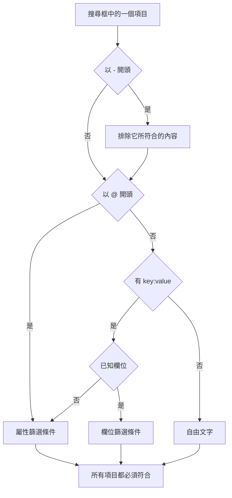

# 搜尋語法

日誌、追蹤、指標與例外瀏覽器上方的搜尋框使用同一種查詢語言。查詢是一組以空格分隔的篩選條件，而且 **每個篩選條件都必須符合**：篩選條件之間沒有隱含的 OR。搜尋時可以把本頁當作參考。

:::cards
- [兩種篩選條件](#兩種篩選條件): 內建欄位、屬性與自由文字。
- [比對值](#比對值): 萬用字元、包含、比較與清單。
- [排除](#排除): 在任何篩選條件前加上 `-` 來反轉它。
- [各訊號的欄位](#各訊號的欄位): 每個瀏覽器中可以依哪些欄位篩選。
:::

## 查詢的解讀方式

```text
severity:error @platform.team:a* -@http.method:GET timeout
```

它的意思是：錯誤層級的日誌，其 `platform.team` 屬性以 `a` 開頭，`http.method` 屬性不是 `GET`，而且訊息中提到 `timeout`。

| 項目 | 種類 | 符合 |
| --- | --- | --- |
| `severity:error` | 欄位 | 日誌的嚴重程度為 Error。 |
| `@platform.team:a*` | 屬性 | `platform.team` 屬性以 `a` 開頭。 |
| `-@http.method:GET` | 排除的屬性 | `http.method` 屬性是 `GET` 以外的任何值。 |
| `timeout` | 自由文字 | 訊息包含 `timeout`。 |

每個以空格分隔的項目都會個別解讀，然後全部以 AND 組合：



## 兩種篩選條件

| 形式 | 篩選對象 | 範例 |
| --- | --- | --- |
| `field:value` | 該訊號的內建欄位 | `severity:error` |
| `@attribute:value` | 資料列上的 OpenTelemetry 屬性 | `@http.status_code:500` |
| 單獨的字詞 | 訊息（日誌）、span 名稱（追蹤）、指標名稱（指標）或例外訊息（例外） | `connection refused` |

鍵不是已知欄位的單獨 `key:value` 會被視為屬性，因此 `k8s.pod:api-0` 與 `@k8s.pod:api-0` 意思相同。加上 `@` 前置詞一律表示「在屬性中尋找」，只有一個例外：在例外瀏覽器中，`@type:`、`@service:`、`@env:` 與 `@class:` 仍然會篩選這些欄位。

只是剛好包含冒號的文字仍然是文字：`https://example.com` 與 `12:30` 會當作字詞搜尋，而不會被解讀為篩選條件。

## 比對值

此表中的所有寫法都適用於任何屬性與大多數內建欄位；[各訊號的欄位](#各訊號的欄位) 註明了以更簡單方式讀取值的欄位。

| 你輸入 | 它符合 |
| --- | --- |
| `@k:abc` | 剛好是 `abc` |
| `@k:a*` | 以 `a` 開頭的任何值，例如 `abc`、`alpha` |
| `@k:*c` | 以 `c` 結尾的任何值 |
| `@k:a*c` | 以 `a` 開頭並以 `c` 結尾 |
| `@k:a?c` | `?` 剛好是一個字元：符合 `abc`、`axc`，但不符合 `ac` |
| `@k:*` | 該屬性存在且不為空 |
| `@k:~abc` | 任何位置包含 `abc` |
| `@k:!abc` | `abc` 以外的任何值 |
| `@k:>100` | 大於 100。也可以用 `>=`、`<`、`<=` |
| `@k:(a OR b)` | 兩個值中的任一個。`@k:[a, b]` 與此相同 |
| `@k:(a* OR b*)` | 兩個模式中的任一個 |

萬用字元比對與包含比對會忽略大小寫；精確比對則不會，因為它是與儲存時的原樣值進行比較。

### 含空格的值

用雙引號把值括起來：

```text
name:"SELECT wp_options"
@k8s.container.name:"my container"
```

引號保護的是 **空格**，而不是萬用字元：`@k:"a b*"` 仍然符合以 `a b` 開頭的任何值。

### 字面上的 `*`、`?` 與其他標點符號

反斜線會讓下一個字元成為字面值：

| 你輸入 | 它符合 |
| --- | --- |
| `@k:a\*b` | 剛好是 `a*b` |
| `@k:\~abc` | 剛好是 `~abc` |
| `@k:\>5` | 剛好是 `>5` |

包含 `%` 或 `_` 的值不需要跳脫，它們一律是字面值。

## 排除

前置的 `-` 會反轉任何篩選條件，包括上面這些：

| 你輸入 | 它符合 |
| --- | --- |
| `-severity:debug` | debug 以外的所有內容 |
| `-@platform.team:a*` | `platform.team` **不** 以 `a` 開頭的任何資料列，包括完全沒有 `platform.team` 的資料列 |
| `-@k:*` | 該屬性不存在或為空 |
| `-@k:(a OR b)` | 兩個值都不是 |
| `-@k:>100` | 100 或更小 |
| `-@k:~abc` | 不包含 `abc` |

在追蹤瀏覽器中，`-` 只會排除屬性。`-status:error` 會被解讀為要在 span 名稱中尋找的文字，因此什麼也找不到；請改為指定你想要的值，例如 `status:(ok OR unset)`。

## 各訊號的欄位

欄位名稱不區分大小寫：`statusMessage:` 與 `statusmessage:` 是同一個欄位。

### 日誌

| 欄位 | 別名 | 說明 |
| --- | --- | --- |
| `severity` | `level` | `fatal`、`error`、`warning`（或 `warn`）、`info`（或 `information`）、`debug`、`trace`、`unspecified`，大小寫皆可 |
| `service` | | 服務名稱，需寫完整名稱，大小寫皆可 |
| `trace` | | 追蹤 ID |
| `span` | | Span ID |
| `message` | `msg`、`log`、`body` | 日誌行。單獨的字詞也會搜尋這裡 |

### 追蹤

追蹤欄位接受單一值或「任一」清單，例如 `status:(ok OR unset)`，`duration` 還接受 `>` 與 `<`。萬用字元、`~`、`!` 與前置的 `-` 在這裡只對屬性有效。

| 欄位 | 說明 |
| --- | --- |
| `service` | 服務名稱 |
| `name` | Span 名稱。單一值會符合其中任何部分。單獨的字詞也會搜尋這裡 |
| `status` | `ok`、`error`、`unset` (unset = 未設定錯誤狀態，即 OpenTelemetry 預設值) |
| `kind` | `server`、`client`、`producer`、`consumer`、`internal` |
| `duration` | 毫秒：`duration:>500`、`duration:<200` 或精確值 |
| `statusMessage` | 狀態訊息文字。單一值會符合其中任何部分 |
| `hasException` | `true` 或 `false` |
| `trace`、`span` | ID |

### 指標

| 欄位 | 說明 |
| --- | --- |
| `name` | 指標名稱。一般值會符合其中任何部分，因此 `name:http.server` 能找到 `http.server.request.duration`。單獨的字詞也會搜尋這裡 |
| `service` | 服務名稱。一般值會符合其中任何部分 |

### 例外

| 欄位 | 別名 | 說明 |
| --- | --- | --- |
| `type` | `exceptionType` | 例外類型，例如 `type:TypeError` |
| `env` | `environment` | 環境，來自資源屬性 `deployment.environment` |
| `service` | | 服務名稱。一般值會符合其中任何部分 |
| `class` | `errorClass` | 錯誤是誰造成的：`code-fault`、`user-error`、`expected-denial`、`infrastructure` 或 `unknown` |

單獨的字詞會搜尋例外訊息。

**Security Events** 瀏覽器使用相同的語言，但有自己的欄位，例如 `severity`、`tactic` 與 `user`，請參閱 [安全性事件](/docs/telemetry/security-events)。

## 組合篩選條件

篩選條件以 AND 組合。可以在它們之間寫上 `AND`，但不會改變任何結果：

```text
severity:error service:api          # both must hold
severity:error AND service:api      # identical
```

篩選條件 **之間** 沒有 OR 或 NOT：寫在那裡的 `OR` 與 `NOT` 會被略過，因此 `NOT severity:debug` 與 `severity:debug` 意思相同。請用前置的 `-` 來排除（`-severity:debug`）；若要讓同一個鍵符合兩個值中的任一個，請使用「任一」形式：

```text
@http.method:(GET OR POST)
```

同一個鍵上的兩個篩選條件會以 AND 組合，範圍或兩端的模式就是這樣寫的：

```text
@http.status_code:>=500 @http.status_code:<=599
@k:a* @k:*z
```

## 篩選標籤與搜尋框

在 `key:value` 項目上按 Enter 會套用它，通常會以結果上方的篩選標籤呈現。篩選標籤會按輸入時的原樣帶著值，因此萬用字元仍是萬用字元。篩選標籤無法帶著的項目（例如排除的 `-key:value`）會留在搜尋框中，並從那裡進行篩選。點選分面側欄中的值會新增同類的篩選標籤，其值經過跳脫：剛好包含 `*` 的儲存值會依該字面值篩選，而不是當作模式。

篩選標籤是已儲存檢視與頁面 URL 的一部分，因此篩選條件在重新整理、書籤與分享連結中都會保留。

## 須知

- 對於萬用字元、包含以及前綴/後綴篩選，屬性 **鍵** 的比對不區分大小寫，因此你不必記得它擷取時是 `requestId` 還是 `requestid`。
- `-@k:...` 篩選條件也會符合從未有過該屬性的資料列：完全不帶 `platform.team` 的資料列當然不會以 `a` 開頭。
- 數值比較適用於以文字儲存的屬性值；不是數字的值永遠不會滿足比較。

## 後續步驟

:::cards
- [放大時間範圍](/docs/telemetry/charts-and-time-ranges): 把瀏覽器聚焦到關鍵的時刻。
- [日誌管道](/docs/telemetry/log-pipelines): 把日誌行的各部分變成可以搜尋的屬性。
- [日誌監控](/docs/monitor/logs-monitor): 你搜尋的日誌出現時發出警示。
- [OpenTelemetry](/docs/telemetry/open-telemetry): 傳送可供搜尋的日誌、指標與追蹤。
:::
