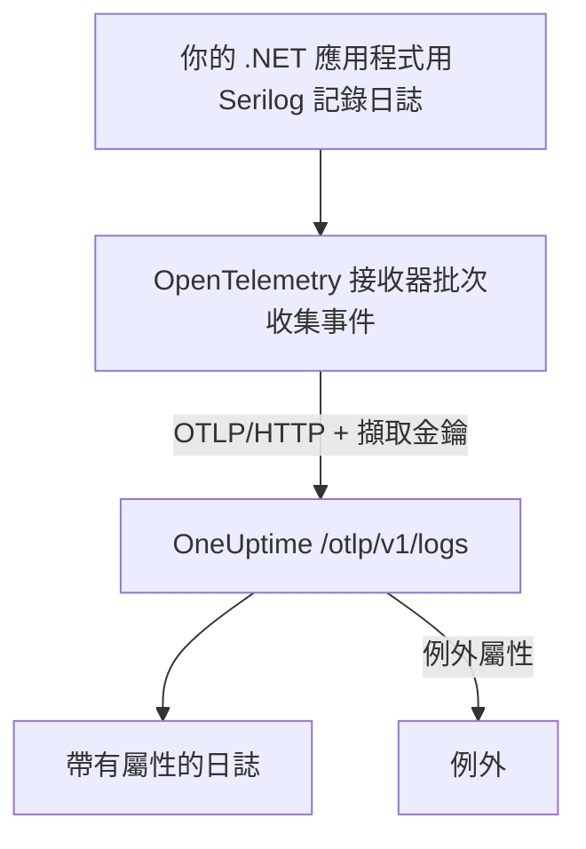

# Serilog (.NET)

[Serilog](https://serilog.net) 是 .NET 最常用的結構化日誌程式庫。透過官方的 [`Serilog.Sinks.OpenTelemetry`](https://github.com/serilog/serilog-sinks-opentelemetry) 接收器（sink），應用程式經由 Serilog 記錄的每個事件，都會透過 OpenTelemetry Protocol（OTLP）傳送到 OneUptime，並可在 **產品 → 日誌** 中搜尋，連同其結構化屬性、嚴重性與追蹤關聯。

不需要安裝任何 OneUptime 專用的套件：接收器連線的就是 OneUptime 為所有 OpenTelemetry 資料提供的同一個 OTLP 端點。主控台應用程式、Worker 服務、ASP.NET Core 應用程式，以及其他任何在 .NET 上執行的程式都適用。

:::cards
- [設定接收器](#設定接收器): 安裝兩個套件，並在程式碼或 `appsettings.json` 中設定。
- [例外](#例外): 記錄下來的例外會成為例外中的問題。
- [疑難排解](#疑難排解): 收不到日誌時要檢查什麼。
:::

## 運作方式



接收器會批次收集日誌事件，並在背景傳送。每個具名屬性都會成為日誌的一個屬性；用 Serilog 記錄的例外送達時，會帶著 OneUptime 用來產生問題的屬性。

## 開始之前

- 一個 OneUptime 專案。在 OneUptime Cloud 上，遙測資料依擷取的 GB 計費（請參閱[價格](https://oneuptime.com/pricing)），而且 Free 方案的專案必須先新增付款方式才能傳送遙測資料。
- 一個正在使用或可以使用 Serilog 的 .NET 應用程式。
- 一個用來驗證日誌的遙測擷取金鑰。如果還沒有，請依下列步驟建立：

:::steps
### 開啟擷取金鑰

前往 **產品 → 專案設定**，在側邊選單中展開 **遙測與 APM**，然後選擇 **擷取金鑰**。


### 建立金鑰

點選 **建立擷取金鑰**。對話框已經填好金鑰名稱，並選好 **伺服器**（應用程式或 Collector 傳送資料時使用的金鑰類型），因此直接點選 **建立擷取金鑰** 即可建立，也可以先重新命名。

### 複製機密

新金鑰會在自己的頁面中開啟。複製它的 **密鑰金鑰**：這就是下方範例中的 `YOUR_TELEMETRY_INGESTION_TOKEN`。


:::

## 你需要從 OneUptime 取得的資訊

| 設定 | 值 |
| ------------- | ------------------------------------------------------------ |
| OTLP 端點 | `https://oneuptime.com/otlp` |
| 驗證標頭 | `x-oneuptime-token: YOUR_TELEMETRY_INGESTION_TOKEN` |
| 服務名稱 | 服務要顯示的名稱，例如 `my-service` |

> [!NOTE]
> 自行託管 OneUptime？請把 `https://oneuptime.com/otlp` 換成 `https://YOUR-ONEUPTIME-HOST/otlp`（如果不終止 TLS，則使用 `http://...`）。其他一切保持不變。

協定設為 `HttpProtobuf` 時，接收器會在端點後面加上 `/v1/logs` 路徑，因此它最後傳送到的 URL 是 `https://oneuptime.com/otlp/v1/logs`。你只需要提供基礎的 `/otlp` 端點。

## 設定接收器

:::steps
### 安裝 NuGet 套件

把 Serilog 與 OpenTelemetry 接收器加入專案：

```bash
dotnet add package Serilog
dotnet add package Serilog.Sinks.OpenTelemetry
```

如果要透過 `appsettings.json` 設定接收器，還要加入 `Serilog.Settings.Configuration`。ASP.NET Core 應用程式則加入 `Serilog.AspNetCore`，它會把 Serilog 接入主機與要求管線：

```bash
dotnet add package Serilog.Settings.Configuration
dotnet add package Serilog.AspNetCore
```

### 配置接收器

把接收器指向你的 OneUptime OTLP 端點，將協定設為 `HttpProtobuf`，以標頭傳入擷取權杖，並為日誌加上 `service.name`。可以在程式碼、`appsettings.json` 或 ASP.NET Core 主機中設定：

:::tabs
@tab 在程式碼中
```csharp title="Program.cs"
using Serilog;
using Serilog.Sinks.OpenTelemetry;

Log.Logger = new LoggerConfiguration()
    .MinimumLevel.Information()
    .Enrich.FromLogContext()
    .WriteTo.Console() // optional: keep local logs too
    .WriteTo.OpenTelemetry(options =>
    {
        // Base OTLP endpoint. The sink appends /v1/logs automatically.
        options.Endpoint = "https://oneuptime.com/otlp";
        options.Protocol = OtlpProtocol.HttpProtobuf;

        // Authenticate with your OneUptime telemetry ingestion token.
        options.Headers = new Dictionary<string, string>
        {
            ["x-oneuptime-token"] = "YOUR_TELEMETRY_INGESTION_TOKEN"
        };

        // Identify your service in OneUptime.
        options.ResourceAttributes = new Dictionary<string, object>
        {
            ["service.name"] = "my-service",
            ["deployment.environment"] = "production"
        };
    })
    .CreateLogger();

try
{
    Log.Information("Application starting up");
    // ... your application code ...
}
finally
{
    // Flush any buffered logs before the process exits.
    Log.CloseAndFlush();
}
```
@tab appsettings.json
把接收器的設定寫進 `appsettings.json`：

```json title="appsettings.json"
{
  "Serilog": {
    "Using": ["Serilog.Sinks.OpenTelemetry"],
    "MinimumLevel": "Information",
    "WriteTo": [
      {
        "Name": "OpenTelemetry",
        "Args": {
          "endpoint": "https://oneuptime.com/otlp",
          "protocol": "HttpProtobuf",
          "headers": {
            "x-oneuptime-token": "YOUR_TELEMETRY_INGESTION_TOKEN"
          },
          "resourceAttributes": {
            "service.name": "my-service",
            "deployment.environment": "production"
          }
        }
      }
    ]
  }
}
```

接著從設定建立記錄器：

```csharp title="Program.cs"
using Serilog;
using Microsoft.Extensions.Configuration;

IConfiguration configuration = new ConfigurationBuilder()
    .AddJsonFile("appsettings.json")
    .Build();

Log.Logger = new LoggerConfiguration()
    .ReadFrom.Configuration(configuration)
    .CreateLogger();
```
@tab ASP.NET Core
ASP.NET Core（.NET 6 以上的最小裝載）請使用 `Serilog.AspNetCore`，讓 Serilog 取代預設的記錄器，並同時記錄架構與要求的日誌：

```csharp title="Program.cs"
using Serilog;
using Serilog.Sinks.OpenTelemetry;

var builder = WebApplication.CreateBuilder(args);

builder.Host.UseSerilog((context, services, configuration) =>
{
    configuration
        .ReadFrom.Configuration(context.Configuration)
        .Enrich.FromLogContext()
        .WriteTo.OpenTelemetry(options =>
        {
            options.Endpoint = "https://oneuptime.com/otlp";
            options.Protocol = OtlpProtocol.HttpProtobuf;
            options.Headers = new Dictionary<string, string>
            {
                ["x-oneuptime-token"] = "YOUR_TELEMETRY_INGESTION_TOKEN"
            };
            options.ResourceAttributes = new Dictionary<string, object>
            {
                ["service.name"] = "my-service"
            };
        });
});

var app = builder.Build();

// Logs one summary event per HTTP request.
app.UseSerilogRequestLogging();

app.MapGet("/", () => "Hello World");
app.Run();
```
:::

> [!IMPORTANT]
> 接收器會批次收集日誌事件並非同步傳送。應用程式結束前，請務必呼叫 `Log.CloseAndFlush()`（或釋放記錄器），否則最後一批日誌可能會遺失。在 ASP.NET Core 中，`Serilog.AspNetCore` 會在正常關閉時替你完成這件事。

> [!TIP]
> 不要把權杖放進原始碼版本控制。請從環境變數或機密儲存區讀取，並在啟動時注入設定，而不是提交到 `appsettings.json`。

### 寫入日誌

照常使用 Serilog。結構化屬性會保留下來，並成為 OneUptime 中可搜尋的屬性：

```csharp
Log.Information("Order {OrderId} placed by {CustomerId} for {Amount:C}",
    orderId, customerId, amount);

Log.Warning("Payment gateway slow: {LatencyMs}ms", latencyMs);
```

每個具名屬性（`OrderId`、`CustomerId`、`Amount`、`LatencyMs`）都會以日誌屬性傳送，因此可以在 **產品 → 日誌** 瀏覽器中依它們篩選與搜尋。

### 確認日誌已送達

執行應用程式並寫入幾筆日誌事件。幾秒內，它們就會出現在 **產品 → 日誌** 中，以及 **產品 → 服務** 下你的服務頁面上；服務以你設定的 `service.name`（`my-service`）命名。它們的結構化屬性可以當作篩選條件使用。
:::

## 例外

用 Serilog 記錄例外時，接收器會在日誌記錄上附加 OpenTelemetry 的 `exception.type`、`exception.message` 與 `exception.stacktrace` 屬性：

```csharp
try
{
    ProcessPayment();
}
catch (Exception ex)
{
    Log.Error(ex, "Failed to process payment for order {OrderId}", orderId);
}
```

OneUptime 會偵測這些屬性，依指紋把錯誤歸併為 **例外** 中的問題，並關聯到正確的服務。同時由追蹤與日誌回報的錯誤會合併成一個問題。偵測的運作方式請參閱[來自日誌的例外](/docs/telemetry/open-telemetry#來自日誌的例外)。

## 追蹤關聯

如果你的應用程式也用 OpenTelemetry .NET SDK 做了追蹤檢測，那麼在作用中的 span 內產生的 Serilog 事件，會自動帶上目前的 `TraceId` 與 `SpanId`（這屬於接收器預設的 `IncludedData`）。這樣 OneUptime 就能把一行日誌直接關聯到它所在的追蹤，你可以從日誌跳到所屬的要求，再跳回來。

若也要傳送追蹤與指標，請參閱 [OpenTelemetry 快速入門](/docs/telemetry/open-telemetry#快速入門) 中的 .NET 設定。

## 疑難排解

:::details 沒有出現日誌
仔細檢查 `x-oneuptime-token` 的值，確認它屬於你正在檢視的專案。確認端點是 `https://oneuptime.com/otlp`（只寫基礎路徑，不要自己加上 `/v1/logs`）。要查看接收器失敗的原因，可在啟動時以 `Serilog.Debugging.SelfLog.Enable(Console.Error)` 開啟 Serilog 自身的錯誤輸出：它會印出 OneUptime 回應的狀態碼。
:::

:::details 日誌只在應用程式結束時出現，或最後的日誌遺失
確保關閉時會執行 `Log.CloseAndFlush()`。接收器會批次收集事件，所以如果程序在排清之前被強制結束，緩衝區中的日誌就會遺失。
:::

:::details 回應 401 Unauthorized，什麼都沒有擷取
金鑰缺少、未知或已過期。確認標頭名稱正好是 `x-oneuptime-token`，而且值是該金鑰的 **密鑰金鑰**。
:::

:::details 回應 402 或 422，什麼都沒有擷取
`402`：在 OneUptime Cloud 上，專案使用 Free 方案且沒有付款方式。請在 **專案設定 → 帳單與發票 → 帳單** 中新增。`422`：金鑰已停用，或是瀏覽器金鑰。請在金鑰的設定中重新開啟 **已啟用**，或建立一個 **伺服器** 金鑰。
:::

:::details 日誌歸到錯誤的服務名稱下
在 `ResourceAttributes`（程式碼）或 `resourceAttributes`（appsettings.json）中設定 `service.name`。沒有設定的話，日誌會歸到接收器改為傳送的暫用名稱下，而不是你的服務名稱。
:::

:::details 連線到自行託管的執行個體時發生錯誤
確認協定與端點的配置（`https://` 或 `http://`）一致，而且應用程式可以連到你的 OneUptime 主機。
:::

如有任何問題或需要協助，請寄信至 support@oneuptime.com。

## 後續步驟

:::cards
- [OpenTelemetry](/docs/telemetry/open-telemetry): 也從 .NET 傳送追蹤與指標。
- [日誌管道](/docs/telemetry/log-pipelines): 在日誌送達時剖析並豐富它們。
- [日誌監控](/docs/monitor/logs-monitor): 出現符合的日誌時發出警示。
- [搜尋語法](/docs/telemetry/search-syntax): 依 Serilog 屬性篩選。
:::
