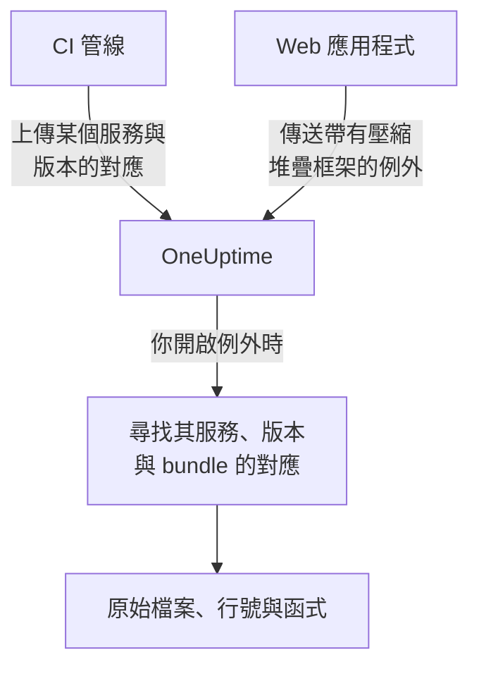

# 原始碼對應

把前端建置的原始碼對應上傳到 OneUptime 後，**例外** 中的瀏覽器例外就會顯示原始的檔案名稱、行號與函式，而不是壓縮後的名稱。本頁適用於已經把瀏覽器遙測資料傳送到 OneUptime 的前端開發人員。

:::cards
- [比對方式](#比對方式): 服務名稱、版本與 bundle 檔案。
- [上傳原始碼對應](#上傳原始碼對應): 在 CI 中傳送一個 `curl` 請求。
- [限制](#限制): 大小、數量與自行託管的設定。
- [查看解析後的堆疊追蹤](#查看解析後的堆疊追蹤): 解析後的堆疊框架長什麼樣子。
:::

## 概觀

正式環境的前端 bundle 經過壓縮，因此透過 OpenTelemetry Web SDK 擷取的瀏覽器例外到達時，其堆疊框架類似這樣：

```text
TypeError: Cannot read properties of undefined (reading 'id')
    at e.onSelect (https://app.example.com/assets/main.a8f1b2.js:1:48291)
```

把建置的原始碼對應上傳到 OneUptime，例外儀表板就會把這些堆疊框架解析回原始的檔案、行號與函式名稱；如果對應在建置時包含 `sourcesContent`，還會顯示原始程式碼的上下文行。

對應會透過經過驗證的 API 上傳到 OneUptime，**絕不會從你的網站擷取**，因此你可以（也應該）繼續使用 `hidden-source-map`（webpack）或 `sourcemap: 'hidden'`（Vite / Rollup）建置，永遠不要把 `.map` 檔案發佈在 bundle 旁邊。



## 比對方式

原始碼對應依三個鍵儲存：

| 鍵 | 必須符合 |
|---|---|
| 服務名稱 | 你的 Web 應用程式傳送遙測資料時使用的 OpenTelemetry 資源屬性 `service.name` |
| 服務版本 | 資源屬性 `service.version`（你的版本識別碼） |
| Bundle 路徑 | 產生該對應的壓縮檔案，例如 `main.a8f1b2.js` |

開啟例外時，OneUptime 會尋找為該例外的服務與版本上傳的對應，依檔案名稱把每個堆疊框架比對到一個 bundle（路徑後綴相同即可：`main.a8f1b2.js` 會符合 `https://app.example.com/assets/main.a8f1b2.js`），並透過對應解析壓縮後的行與欄。解析會在查看例外時延遲進行，絕不會發生在擷取路徑上，因此在新版本的第一個錯誤出現幾分鐘 *之後* 才上傳的對應，仍會追溯套用。

## 開始之前

- 一把 **伺服器** 類型的遙測擷取金鑰，在 **專案設定 → 遙測與 APM → 擷取金鑰** 中建立。請參閱 [建立擷取金鑰](/docs/telemetry/open-telemetry#建立擷取金鑰)。
- 一個已經透過 OpenTelemetry Web SDK 向 OneUptime 傳送例外的 Web 應用程式，請參閱 [瀏覽器端設定](/docs/rum/browser-setup)。
- 一個會輸出原始碼對應的建置；如果希望在每個堆疊框架周圍顯示原始碼片段，需包含 `sourcesContent`（大多數打包工具的預設值）。

## 上傳原始碼對應

:::steps
### 隨遙測資料傳送 `service.version`

你的 Web 應用程式必須傳送 `service.version`，而且它必須與上傳對應時使用的字串相同：

```javascript
import { resourceFromAttributes } from "@opentelemetry/resources";

const resource = resourceFromAttributes({
  "service.name": "my-web-app",
  "service.version": "1.4.2", // same value you upload maps with
});
```

任何穩定的版本識別碼都可以（語意化版本、git 提交 SHA、建置編號），只要上傳的 `serviceVersion` 與資源屬性 `service.version` 是同一個字串即可。

### 每次正式建置後上傳對應

在 CI 中上傳，把擷取金鑰放在 `x-oneuptime-token` 標頭中：

```bash
curl --fail -X POST "https://oneuptime.com/source-maps/v1/upload" \
  -H "x-oneuptime-token: YOUR_TELEMETRY_INGESTION_KEY" \
  -F "serviceName=my-web-app" \
  -F "serviceVersion=1.4.2" \
  -F "sourcemap=@dist/assets/main.a8f1b2.js.map" \
  -F "sourcemap=@dist/assets/vendor.9c3d4e.js.map"
```

對於自行託管的安裝，請把 `oneuptime.com` 換成你的 OneUptime 主機。也可以用 `Authorization: Bearer YOUR_KEY` 取代 `x-oneuptime-token` 標頭。

### 檢查上傳結果

上傳成功後會回傳一個列出已儲存對應的 JSON 本文，CI 可以據此進行斷言。這些對應也會列在 OneUptime 中該服務的 **Source Maps** 頁面上。
:::

典型的 CI 步驟會上傳建置輸出的每個對應：

```bash
VERSION="$(git rev-parse --short HEAD)"

find dist -name "*.js.map" -print0 | while IFS= read -r -d '' map; do
  curl --fail -X POST "https://oneuptime.com/source-maps/v1/upload" \
    -H "x-oneuptime-token: $ONEUPTIME_INGESTION_KEY" \
    -F "serviceName=my-web-app" \
    -F "serviceVersion=$VERSION" \
    -F "sourcemap=@$map"
done
```

### 上傳規則

- 每個上傳檔案的 bundle 路徑是去掉結尾 `.map` 後的檔案名稱：`main.a8f1b2.js.map` 會變成 `main.a8f1b2.js`。如果你的對應檔案名稱不遵循這個慣例，請每個請求只上傳一個檔案，並明確傳入 `bundlePath` 欄位。
- 為同一服務與版本重新上傳同一個 bundle，會取代先前的對應，因此 CI 重試是安全的。
- 檔案必須是 [source map v3](https://tc39.es/ecma426/) JSON（所有現代打包工具輸出的都是這種格式，也支援帶有 `sections` 的索引對應）。
- 如果自行託管的維運人員停用了遙測擷取（`DISABLE_TELEMETRY_INGESTION`），上傳會回傳一個空的成功回應，而且不會儲存任何內容，這與該模式下所有遙測擷取端點的行為相同。真正的上傳一律會回傳列出已儲存對應的 JSON 本文，因此 CI 可以區分這兩種情況。

## 限制

每個 `.map` 檔案最大可達 50 MB，但輸入端也把 **整個請求本文** 限制為 50 MB，所以大型對應請每個請求上傳一個。每個請求最多接受 50 個檔案，一個版本（服務 + 版本號）總共最多可保存 1,000 個對應；超過的上傳會遭到拒絕，並附上指明該限制的訊息。如果建置輸出的對應多於單一請求能接受的數量，只要傳送多個請求即可：同一版本的上傳會累積。

自行託管的安裝可以變更這些值。五個值都是一般的環境變數，Helm chart 在 `values.yaml` 的 `sourceMaps` 下提供了它們：

| `values.yaml` | 環境變數 | 預設值 |
| --- | --- | --- |
| `sourceMaps.maxMapsPerRelease` | `SOURCE_MAP_MAX_MAPS_PER_RELEASE` | `1000` |
| `sourceMaps.maxFilesPerRequest` | `SOURCE_MAP_MAX_FILES_PER_REQUEST` | `50` |
| `sourceMaps.maxFileSizeBytes` | `SOURCE_MAP_MAX_FILE_SIZE_BYTES` | `52428800` |
| `sourceMaps.maxBytesPerResolve` | `SOURCE_MAP_MAX_BYTES_PER_RESOLVE` | `536870912` |
| `sourceMaps.retentionDays` | `SOURCE_MAP_RETENTION_DAYS` | `90` |

如果你的建置超出預設值，需要調高的是 `maxMapsPerRelease`；它只是對儲存形態的限制，因為解析的成本是由 `maxBytesPerResolve` 限定，而不是由一個版本保存了多少對應決定。`maxFilesPerRequest` 與 `maxFileSizeBytes` 只能 **調低**：multipart 本文會在請求驗證之前就被剖析，因此未經驗證的呼叫端受其上方的共用上限約束，較大的值會被收窄到上限，而不會被採用。

## 查看解析後的堆疊追蹤

在儀表板的 **例外** 下開啟任何例外。透過原始碼對應解析的堆疊框架會顯示 **Source mapped** 徽章，並顯示原始函式名稱與檔案位置；展開堆疊框架會在壓縮位置旁顯示原始程式碼片段（當對應包含 `sourcesContent` 時）。

某個服務已上傳的對應可以在 **產品 → 服務 → 你的服務 → Source Maps** 中檢視與刪除，那裡會列出每個對應的版本、bundle、大小與上傳時間。

## 保留

原始碼對應在上傳後保留 90 天，然後自動刪除。只有當某個版本的例外還在你的遙測保留期內時，對應才有用，因此這個期限足以超過它所還原的那些例外。如果再次需要，請重新上傳該版本的對應。

## 安全性

- 對應會透過經過驗證的端點上傳，並儲存在你的 OneUptime 專案中；它們絕不會從你的網站擷取，因此隱藏的原始碼對應會一直保持隱藏。
- 對應的原始內容（以 `sourcesContent` 建置時包含你的原始程式碼）只有專案擁有者與管理員，以及獲授予 **Read Telemetry Source Map** 權限的人才能讀取。其他團隊成員只能看到他們已有權存取的例外的解析後堆疊框架，以及每個當機位置周圍的幾行原始碼。
- 刪除服務會一併刪除其原始碼對應。

## 疑難排解

:::details 堆疊框架仍然是壓縮後的
該例外的版本沒有符合的對應。請檢查：你的應用程式傳送的 `service.version` 是否與上傳時使用的 `serviceVersion` 完全相同，`serviceName` 是否與 `service.name` 相符，以及是否為該 bundle 檔案上傳了對應。服務的 **Source Maps** 頁面會列出每個對應的版本與 bundle。
:::

:::details 上傳因對應太大而遭到拒絕
單一對應最大可達 50 MB，整個請求也是如此。請像上方的 CI 迴圈那樣，每個請求上傳一個大型對應。
:::

## 後續步驟

:::cards
- [瀏覽器端設定](/docs/rum/browser-setup): 使用 OpenTelemetry Web SDK 傳送瀏覽器追蹤與例外。
- [例外狀況監控](/docs/monitor/exceptions-monitor): 出現新例外時發出警示。
- [OpenTelemetry](/docs/telemetry/open-telemetry): 所有遙測資料的端點、金鑰與限制。
:::
