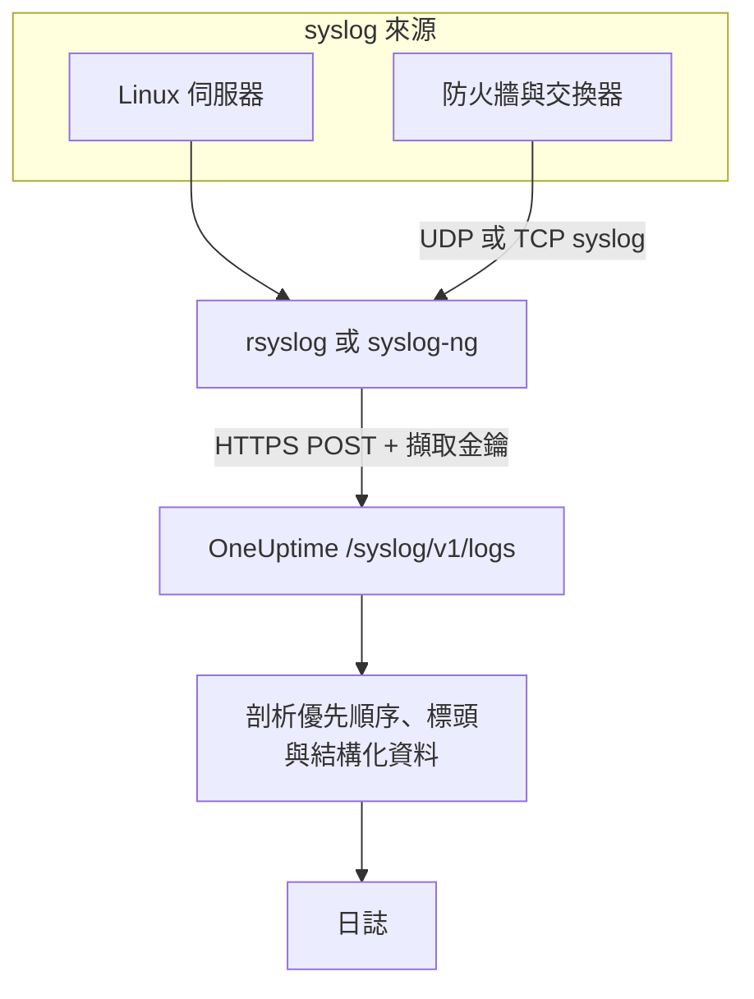

# Syslog

OneUptime 透過 HTTPS 接收 syslog。帶上你的擷取金鑰，把 RFC 5424 或 RFC 3164 訊息傳送到 `/syslog/v1/logs`，每則訊息都會成為一筆可搜尋的日誌，其優先順序、設施（facility）、嚴重性、主機、應用程式與結構化資料都會成為屬性。可以用它從 rsyslog、syslog-ng 或任何能發出 HTTP 要求的轉送站轉送日誌。

:::cards
- [傳送測試訊息](#傳送測試訊息): 只需要一個 `curl` 要求。
- [從 rsyslog 轉送](#從-rsyslog-轉送): 傳送伺服器或轉送站收到的所有內容。
- [剖析出的屬性](#剖析出的屬性): OneUptime 從每則訊息擷取出什麼。
- [疑難排解](#疑難排解): 被拒絕的要求與意料之外的服務。
:::

## 運作方式



OneUptime 一讀完要求中的訊息就會回應，稍後再剖析並儲存它們。訊息文字會保留在日誌內文中，其他所有內容都會成為屬性。

> [!TIP]
> 以 OneUptime 探針監控的網路設備，可以不經轉送站、直接透過 UDP 把 syslog 傳送到探針，日誌隨後會出現在 OneUptime 中該設備的頁面上。請參閱[網路設備廠商指南(Sophos、Extreme、Cambium)](/docs/monitor/network-vendor-guides)。

## 開始之前

- **一個 OneUptime 專案**：在 OneUptime Cloud 上，遙測資料依擷取的 GB 計費，而且 Free 方案的專案必須先新增付款方式才能傳送遙測資料。
- **遙測擷取金鑰**：在 **產品 → 專案設定 → 遙測與 APM → 擷取金鑰** 下建立一個 **伺服器** 金鑰，並複製它的 **密鑰金鑰**。你需要把它放在 `x-oneuptime-token` 標頭中傳送。
- **syslog 轉送工具**：任何能傳送 HTTP POST 要求的工具（例如 `curl`、透過 `omhttp` 的 `rsyslog`，或使用 HTTP 目的地的 `syslog-ng`）。
- **服務名稱（選用）**：設定 `x-oneuptime-service-name` 標頭，把收到的日誌歸到特定的遙測服務下。省略時，OneUptime 會依序使用 syslog 的 `APP-NAME`、主機名稱或 `Syslog`。

## 端點

```http
POST https://oneuptime.com/syslog/v1/logs
```

| 標頭 | 必要 | 值 |
| --- | --- | --- |
| `x-oneuptime-token` | 是 | 你的擷取金鑰。 |
| `Content-Type` | JSON 內文時必要 | `application/json` |
| `x-oneuptime-service-name` | 否 | 日誌所屬的服務。 |
| `Content-Encoding` | 否 | 壓縮內文時為 `gzip`。 |

如果你自行託管 OneUptime，請把 `oneuptime.com` 換成你的主機。

## 要求內文

傳送一個包含 `messages` 陣列的 JSON。RFC 5424 與 RFC 3164（BSD）兩種格式都支援，而且可以在同一個要求中混用：

```json
{
  "messages": [
    "<34>1 2025-03-02T14:48:05.003Z web-01 nginx 7421 ID47 [env@32473 host=\"web-01\"] 502 on /api/login",
    "<13>Feb  5 17:32:18 db-01 postgres[2419]: connection received from 10.0.0.12"
  ]
}
```

### 支援的內文格式

| 內文 | 傳送方式 |
| --- | --- |
| 包含 `messages` 陣列的 JSON 物件 | `Content-Type: application/json`，建議使用。 |
| 由訊息組成的 JSON 陣列 | `Content-Type: application/json`。 |
| 包含一個 `message` 的 JSON 物件 | `Content-Type: application/json`。多行的值會被讀取為多則訊息。 |
| 以換行分隔的訊息 | 以 gzip 壓縮，並以 `Content-Encoding: gzip` 傳送。 |

沒有以 gzip 壓縮的純文字內文不會被讀取，要求會以 `400` 被拒絕。以 gzip 壓縮的內文一律會被讀取為以換行分隔的訊息，所以不要壓縮 JSON 內文。請讓每個要求小於 1 MB：OneUptime 的輸入端並未針對這個端點調高 nginx 預設的要求內文大小上限。

## 傳送測試訊息

```bash
curl \
  -X POST https://oneuptime.com/syslog/v1/logs \
  -H "Content-Type: application/json" \
  -H "x-oneuptime-token: YOUR_TELEMETRY_KEY" \
  -H "x-oneuptime-service-name: production-web" \
  -d '{
    "messages": [
      "<34>1 2025-03-02T14:48:05.003Z web-01 nginx 7421 ID47 [env@32473 host=\"web-01\"] 502 on /api/login"
    ]
  }'
```

回應 `200` 表示訊息已被接受。開啟 **產品 → 日誌**：這筆日誌會出現在 `production-web` 服務中，內文為 `502 on /api/login`，嚴重性為 `Error`，並帶有[剖析出的屬性](#剖析出的屬性)中列出的屬性。

## 從 rsyslog 轉送

rsyslog 使用它的 HTTP 輸出模組 `omhttp` 傳送到 OneUptime。

:::steps
### 確認 `omhttp` 可以使用

下方的設定以 `module(load="omhttp")` 載入它。如果 rsyslog 回報無法載入該模組，請安裝你的發行版中提供 `omhttp` 的套件。

### 加入 OneUptime 目的地

建立 `/etc/rsyslog.d/oneuptime.conf`。範本會把每則訊息重新組成一行 RFC 5424 格式，並包進 OneUptime 預期的 JSON 內文中：

```text title="/etc/rsyslog.d/oneuptime.conf"
module(load="omhttp")

template(name="OneUptimeJson" type="string"
         string="{\"messages\":[\"<%PRI%>1 %TIMESTAMP:::date-rfc3339% %HOSTNAME% %APP-NAME% %PROCID% %MSGID% - %msg:::json%\"]}")

action(
  type="omhttp"
  server="oneuptime.com"
  serverport="443"
  usehttps="on"
  restpath="syslog/v1/logs"
  httpheaders=[
    "x-oneuptime-token: YOUR_TELEMETRY_KEY",
    "x-oneuptime-service-name: rsyslog-demo"
  ]
  template="OneUptimeJson"
)
```

`restpath` 填寫不含開頭斜線的路徑。`omhttp` 預設傳送 JSON 的 `Content-Type`，這正是此範本產生的格式。

### 檢查設定並重新啟動 rsyslog

```bash
sudo rsyslogd -N1
sudo systemctl restart rsyslog
```

`rsyslogd -N1` 會在不啟動 rsyslog 的情況下驗證設定。重新啟動後，新的訊息會出現在 **產品 → 日誌** 的 `rsyslog-demo` 服務中。
:::

這個動作會轉送 rsyslog 處理的每則訊息：本機程式、rsyslog 讀取時的 systemd 日誌（journal），以及它從網路收到的一切。

### 轉送網路設備的 syslog

防火牆、交換器與其他設備通常只能透過 UDP 或 TCP 傳送 syslog。讓它們傳送到一個 rsyslog 轉送站，再由轉送站透過 HTTPS 轉送。在轉送站的設定中，於 `action` 之前加入一個接聽程式：

```text title="/etc/rsyslog.d/oneuptime.conf"
module(load="imudp")
input(type="imudp" port="514")
```

把 `x-oneuptime-service-name` 設為 `perimeter-firewall` 之類的名稱，或移除這個標頭，讓每台設備的日誌依主機名稱分組。許多設備會把訊息寫成 `key=value` 配對；[Key=Value Parser](/docs/telemetry/log-pipelines#keyvalue-parser) 可以把它們變成屬性。

:::details 批次傳送，而不是每則訊息一個要求
rsyslog 可以把訊息批次組合並以 gzip 壓縮，OneUptime 會把它讀取為以換行分隔的訊息。把範本與動作換成：

```text title="/etc/rsyslog.d/oneuptime.conf"
template(name="OneUptimeLine" type="string"
         string="<%PRI%>1 %TIMESTAMP:::date-rfc3339% %HOSTNAME% %APP-NAME% %PROCID% %MSGID% - %msg%")

action(
  type="omhttp"
  server="oneuptime.com"
  serverport="443"
  usehttps="on"
  restpath="syslog/v1/logs"
  httpheaders=["x-oneuptime-token: YOUR_TELEMETRY_KEY"]
  template="OneUptimeLine"
  batch="on"
  batch.format="newline"
  compress="on"
)
```

請保留 `compress="on"`：OneUptime 只會從以 gzip 壓縮的內文中讀取以換行分隔的訊息。
:::

### 其他轉送工具

- **syslog-ng**：使用它的 HTTP 目的地，URL、標頭與 JSON 內文都相同。
- **Fluent Bit**：以 Fluent Bit 的 `syslog` 輸入接收 syslog，再像其他日誌一樣轉送。請參閱 [Fluent Bit](/docs/telemetry/fluentbit)。

## 剖析出的屬性

OneUptime 會自動為每筆日誌加上下列屬性：

| 屬性 | 值 | 測試訊息中的值 |
| --- | --- | --- |
| `syslog.priority` | 優先順序，`<PRI>` | `34` |
| `syslog.facility.code`、`syslog.facility.name` | 由優先順序得出的設施 | `4`、`security` |
| `syslog.severity.code`、`syslog.severity.name` | 由優先順序得出的嚴重性 | `2`、`critical` |
| `syslog.version` | RFC 5424 版本 | `1` |
| `syslog.hostname` | `HOSTNAME` | `web-01` |
| `syslog.appName` | `APP-NAME`，或 RFC 3164 的標籤 | `nginx` |
| `syslog.processId` | `PROCID` | `7421` |
| `syslog.messageId` | `MSGID` | `ID47` |
| `syslog.structured.raw` | 依原樣保存的 RFC 5424 結構化資料 | `[env@32473 host="web-01"]` |
| `syslog.structured.*` | 結構化資料的每個參數，展開後保存 | `syslog.structured.env_32473.host` = `web-01` |
| `syslog.raw` | 原始訊息，方便追溯 | 整行 |

這些屬性可以在 **產品 → 日誌** 瀏覽器中搜尋，例如 `@syslog.severity.name:error` 或 `@syslog.hostname:web-01`。請參閱[搜尋語法](/docs/telemetry/search-syntax)。

訊息本身會保留在日誌內文中。Sophos XGS 與 Fortinet FortiGate 等防火牆會把訊息寫成 `key=value` 配對（`log_component="IPSec" con_name="HQ-Branch1" status="Terminated"`）；在[日誌管道](/docs/telemetry/log-pipelines#keyvalue-parser)中加入一個 **Key=Value Parser** 處理器，就能把這些配對也變成屬性。

### 嚴重性

| syslog 嚴重性 | 代碼 | OneUptime 嚴重性 |
| --- | --- | --- |
| Emergency、Alert | `0`、`1` | `Fatal` |
| Critical、Error | `2`、`3` | `Error` |
| Warning | `4` | `Warning` |
| Notice、Informational | `5`、`6` | `Information` |
| Debug | `7` | `Debug` |
| 訊息中沒有優先順序 | — | `Unspecified` |

沒有時間戳記的訊息會以 OneUptime 收到它的時間儲存。

### 服務

每筆日誌都歸屬於一個遙測服務，該服務會在第一次傳送時由 OneUptime 建立。服務取下列各項中最先出現的一個：

1. `x-oneuptime-service-name` 標頭；
2. 訊息的 `APP-NAME`（或標籤）；
3. 訊息的主機名稱；
4. `Syslog`。

## 疑難排解

:::details HTTP 401
金鑰缺少、未知或已過期。檢查 `x-oneuptime-token` 標頭中是否帶著應接收日誌的專案裡某個擷取金鑰的 **密鑰金鑰**。
:::

:::details HTTP 402 或 422
`402`：在 OneUptime Cloud 上，專案使用 Free 方案且沒有付款方式。請在 **專案設定 → 帳單與發票 → 帳單** 中新增。`422`：金鑰已停用，或是瀏覽器金鑰。請在金鑰的設定中重新開啟 **已啟用**，或建立一個 **伺服器** 金鑰。
:::

:::details HTTP 400，或沒有出現日誌
確認要求內文中確實有 syslog 行，並以 JSON 加上 `Content-Type: application/json` 傳送。空的內文，以及沒有以 gzip 壓縮的純文字內文，都會以 HTTP 400 被拒絕。
:::

:::details HTTP 413
要求超過輸入端能接受的大小。每個要求少傳一些訊息。
:::

:::details 日誌歸到了意料之外的服務名稱下
設定 `x-oneuptime-service-name` 以覆寫預設的判斷邏輯（先用 `APP-NAME`，再用主機名稱）。
:::

## 後續步驟

:::cards
- [日誌管道](/docs/telemetry/log-pipelines): 把 `key=value` 訊息剖析成屬性。
- [日誌記錄規則](/docs/telemetry/log-recording-rules): 把 syslog 中的數字變成指標。
- [日誌監控](/docs/monitor/logs-monitor): 收到符合的 syslog 訊息時發出警示。
:::
