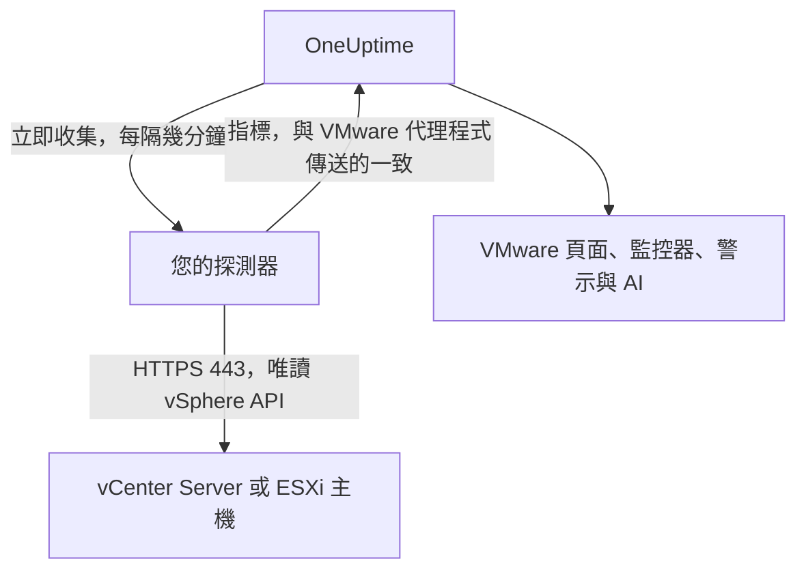

# 免代理程式的 VMware

無需安裝任何東西即可監控 vCenter Server 或獨立 ESXi 主機：在 OneUptime 中輸入 vCenter 的位址與一個唯讀帳戶，選擇能夠連線到它的探測器，該探測器就會收集與 [VMware 代理程式](/docs/telemetry/vmware) 相同的資料。不需要安裝、升級或保持執行任何代理程式，也不需要為其準備專用機器。

:::cards
- [開始之前](#開始之前)：一個能連線到 vCenter 的探測器與一個唯讀帳戶。
- [連線 vCenter](#連線-vcenter)：四個欄位、一次測試與一個名稱。
- [疑難排解](#疑難排解)：每則訊息的意義與解決方法。
:::

## 運作方式

探測器每隔幾分鐘就會使用您儲存的帳戶登入 vCenter，讀取清單、效能計數器與 vSAN 統計資料，並將其傳送到 OneUptime。這些資料的抵達方式與 VMware 代理程式的完全相同，因此每個 VMware 頁面、[VMware 監控器](/docs/monitor/vmware-monitor)、警示範本與 OneUptime AI 都會以相同方式讀取。探測器在兩次收集之間會保持 vCenter 工作階段，因此 vCenter 的事件記錄不會被登入紀錄塞滿。

## 探測器還是代理程式？

| | 探測器（本頁） | VMware 代理程式 |
|---|---|---|
| 您需要執行什麼 | 您已在執行的探測器，或一個新探測器 | 代理程式，執行於專用機器上 |
| 帳戶保存在哪裡 | 在 OneUptime 中加密保存，只傳送給探測器 | 在代理程式的 `.env` 檔案中 |
| 需要連線到什麼 | 從探測器透過 TCP 443 連線到 vCenter | 從代理程式透過 TCP 443 連線到 vCenter |
| 最大的 vCenter | 每次收集約 48 MiB 指標 | 無限制 |
| ESXi syslog 與 AI 代理程式 | 不包含 | 包含 |

兩者傳送相同的資料。您可以隨時在 vCenter 的 **設定** 頁面上將其從一種方式切換到另一種方式。

## 開始之前

- **一個能透過 TCP 443 連線到 vCenter 的探測器。** 通常是位於 vCenter 網路中的 [自訂探測器](/docs/probe/custom-probe)。在 OneUptime Cloud 上，共用探測器絕不會收到 vCenter 密碼，因此請新增您自己的探測器。在自行託管的執行個體上，執行個體自己的探測器也可以收集。
- **一個具有 Read-Only 角色的 vSphere 使用者**，在最上層 vCenter 物件上授予，並勾選 **Propagate to children**。請依照 [建立唯讀 vSphere 使用者](/docs/telemetry/vmware#create-the-read-only-vsphere-user) 操作：該帳戶與代理程式使用的帳戶相同。

> [!IMPORTANT]
> 如果沒有勾選 **Propagate to children**，使用者可以登入但什麼也看不到，探測器會回報該帳戶無法讀取 vCenter 的清單。

## 連線 vCenter

:::steps
### 開啟 vCenter 清單
在 OneUptime 中開啟 **VMware → 所有 vCenter**，然後按一下 **連線 vCenter**。

### 輸入位址與帳戶
輸入您開啟 vSphere Client 所用的位址，例如 `https://vcsa.example.com`，含網域的使用者名稱，例如 `oneuptime@vsphere.local`，以及其密碼。選擇能夠連線到 vCenter 的探測器。

### 測試連線
在下一個步驟中按一下 **測試連線**。探測器會登入、讀取該帳戶可見的內容後登出，結果會顯示它找到多少個資料中心、叢集、主機、虛擬機器與資料存放區。

### 信任 vCenter 的憑證
vCenter 預設使用其自有憑證授權單位簽發的憑證，探測器並不信任該憑證。此時測試會顯示該憑證：將其指紋與 vCenter 本身的指紋核對，然後按一下 **信任此憑證**。

### 命名並連線
名稱預設為 vCenter 的主機名稱。按一下 **連線 vCenter** 以儲存。
:::

vCenter 的 **概覽** 會顯示一張 **資料收集** 卡片。在一分鐘內開始的首次收集之前，它會顯示 **檢查中**，之後顯示 **收集中**，清單也會隨之填入。

## 憑證

探測器絕不會略過憑證驗證。每次連線都會完成完整的 TLS 交握，然後：

- 若未設定受信任的憑證，vCenter 的憑證必須來自探測器所在機器信任的憑證授權單位，並且適用於您輸入的位址；
- 若已設定受信任的憑證，vCenter 必須出示正是該憑證（以其 SHA-256 指紋識別）。不接受任何其他憑證，即使是公開受信任的憑證也不行。

若要核對指紋，請在 vSphere Client 中開啟 **Administration → Certificates → Certificate Management**，或在探測器所在機器上執行 `openssl s_client -connect vcsa.example.com:443 </dev/null | openssl x509 -noout -fingerprint -sha256`。

當 vCenter 的憑證更新後，收集會以 **vCenter 的憑證已變更** 停止，並顯示新的憑證。在您於 vCenter 的 **概覽** 或 **設定** 頁面上信任它之前，不會傳送任何內容給 vCenter。

## 已儲存的密碼

密碼經過加密且只能寫入：任何人都無法讀回，API 也從不回傳它。它只會傳送給收集該 vCenter 的探測器，探測器會將其保存在記憶體中。

已儲存的密碼只會傳送到當初輸入時所針對的位址、經由當時的探測器，並且只傳給當時的憑證。變更位址、探測器或受信任的憑證都會要求重新輸入密碼，因此任何能夠編輯該 vCenter 的人都無法把密碼傳送到別處。信任探測器在已儲存位址上找到的憑證時，密碼會保留。

## 在代理程式與探測器之間切換

開啟 vCenter 的 **設定** 頁面。其 **資料收集** 卡片為由代理程式傳送資料的 vCenter 提供 **使用探測器收集**，為由探測器收集的 vCenter 提供 **使用 VMware 代理程式**。切換到代理程式會刪除已儲存的密碼。

> [!WARNING]
> 探測器的首次收集成功後，請停止 VMware 代理程式。兩者同時執行期間，每個指標都會收到兩次。

## 參考

| 設定 | 預設值 | 說明 |
|---|---|---|
| 收集間隔 | 2 分鐘 | 1 到 60 分鐘。大型 vCenter 可降低收集頻率，以減輕其負載。 |
| 同時進行的收集 | 每個探測器 4 個 | 耗時超過其間隔的收集會被略過，絕不會堆積。 |
| 最大收集量 | 約 48 MiB | 更大的 vCenter 需要使用 VMware 代理程式。 |
| 連線測試 | 90 秒內開始 | 沒有探測器及時領取、或執行超過 2 分鐘的測試，會被判定為失敗。 |

## 疑難排解

:::details vCenter 的憑證不受信任
vCenter 出示的是其自有憑證授權單位簽發的憑證。將顯示的指紋與 vCenter 的憑證核對，然後按一下 **信任此憑證**。
:::

:::details vCenter 拒絕了登入
使用含網域的完整使用者名稱，例如 `oneuptime@vsphere.local`，並檢查密碼以及帳戶是否被鎖定。可在 vCenter 的 **設定** 頁面上透過 **編輯連線** 修改。
:::

:::details 該使用者無法讀取 vCenter 的清單
在最上層 vCenter 物件上為該使用者授予 Read-Only 角色，並勾選 **Propagate to children**。
:::

:::details 探測器收不到 vCenter 的回應
探測器所在網路無法透過 TCP 443 連線到 vCenter。請在防火牆中允許該流量，或選擇位於 vCenter 網路中的探測器。
:::

:::details 探測器未領取此工作
探測器處於離線狀態，或執行的 OneUptime 版本早於 VMware 收集功能。請在 **自訂探針** 表格中確認它已連線，並更新它。
:::

:::details 此 vCenter 太大，無法由探測器收集
其指標超出探測器單次上傳的大小上限。請對此 vCenter 使用 [VMware 代理程式](/docs/telemetry/vmware)。
:::

## 後續步驟

:::cards
- [VMware 監控器](/docs/monitor/vmware-monitor)：針對主機、虛擬機器、資料存放區與叢集的警示。
- [自訂探測器](/docs/probe/custom-probe)：在 vCenter 網路中執行探測器。
- [VMware 代理程式](/docs/telemetry/vmware)：改用代理程式收集 vCenter。
:::
