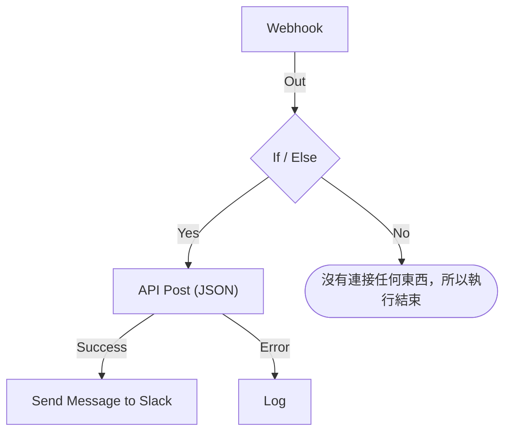

# 建立工作流程

你在工作流程的 **建構器** 中建構它：這是一塊畫布，你在上面新增區塊、連接它們並填寫它們的設定。本頁說明如何建立工作流程、[新增區塊](#新增區塊)、[連接](#連接區塊) 和 [設定](#設定區塊) 區塊、[在區塊之間傳遞值](#使用前面區塊的值)，以及 [開啟工作流程](#開啟它)。

要建立工作流程，開啟 **工作流程** 並點選 **建立工作流程**。**建立工作流程** 對話方塊會先詢問你要如何開始，然後詢問名稱。需要自己設定的範本（例如 Slack Webhook URL）會在額外的一個步驟中詢問這些設定，並把它們儲存為工作流程變數，讓你之後不必編輯工作流程就能變更。

選擇如何開始：

- 對話方塊頂端的 **從零開始** 會給你一塊空白畫布。大多數工作流程都從這裡開始。
- **或從範本開始** 會顯示幾個 **推薦** 範本。要找其他範本，在搜尋方塊旁選擇一個類別，例如 **事件**、**監測器** 或 **Jira**，或 **所有範本**，也可以在 **搜尋範本…** 中輸入。你輸入的每個字詞都必須相符。

點選一個範本，查看它做什麼：它的觸發器、它由哪些區塊組成，以及它會詢問哪些設定。然後點選 **使用此範本**，或按兩下該範本。在搜尋方塊中，方向鍵選擇範本，**Enter** 使用它。`/` 會帶你回到搜尋方塊。

工作流程建立時處於關閉狀態，因此在你開啟之前什麼都不會執行。新的工作流程會在 **建構器** 中開啟，也就是你設計它的畫布。

## 畫布

從零開始的工作流程開啟時只有一個標示 **Choose what starts this workflow** 的虛線區塊。這個區塊就是起點——點選它來選擇觸發器。從範本建立的工作流程開啟時，區塊已經就位。

每個工作流程頂端恰好有一個 **觸發器**。其他一切都是做某件事的 **元件**。要更換觸發器，刪除它：虛線預留位置會回到原處，點選它即可選擇另一個。刪除區塊時，它的連線也會一併刪除，因此請把新的觸發器重新連接到第一個區塊。

變更會自動儲存。工具列中的一個標記會顯示狀態：變更傳送途中顯示 **正在儲存…** ，之後顯示 **已儲存**，失敗時顯示 **無法儲存**。畫布沒有儲存按鈕，也沒有獨立的發布步驟。

## 新增區塊

| 要新增                 | 點選                                                           | 開啟的面板                    |
| ---------------------- | -------------------------------------------------------------- | ----------------------------- |
| 觸發器                 | 虛線預留位置區塊                                               | **Add Trigger**               |
| 其他任何區塊           | 畫布上方工具列中的 **新增元件**                                | **新增元件**                  |

兩個面板都會先在 **Popular** 底下顯示大多數工作流程使用的區塊，接著是其餘的內建區塊。在 **OneUptime resources** 底下點選一個資源，例如 **事件**，查看可以用它做什麼；**Browse all resources** 會列出所有資源。也可以搜尋：輸入幾個字詞，例如 `create incident`，最佳結果會排在最前面。按 `/` 跳到搜尋方塊，用方向鍵在結果之間移動，按 **Enter** 新增醒目提示的區塊。點選區塊也會新增它。

新區塊會放在畫布最下方那個區塊的下面，新的觸發器會取代頂端虛線區塊的位置。新區塊處於選取狀態；如果它落在可見範圍之外，畫布會捲動到剛好能顯示它的位置。它的設定不會自動開啟：準備好設定時再點選這個區塊。在必填設定填好之前，它上面會顯示 **Click to set up**。

把區塊拖曳到任何位置；拖曳時畫布會把它們對齊格線。區塊的位置會被儲存，因此下一個人看到的配置與你離開時相同。

## 區塊上有什麼

| 欄位                                  | 作用                                                                                                                                                                                                                                                                                                          |
| ------------------------------------- | ------------------------------------------------------------------------------------------------------------------------------------------------------------------------------------------------------------------------------------------------------------------------------------------------------------- |
| **Identifier**（在 **ID** 底下）      | 區塊上顯示的短 ID，例如 `log-1`。其他區塊就是用它來參照這個區塊，所以如果你改了它，所有指向它的 `{{local.components.…}}` 參照都會失效。區塊的標題是元件本身的名稱，無法變更。                                                                                                                               |
| **設定**                              | 區塊完成工作所需的東西——URL、Slack 頻道、訊息文字。選填欄位標有 **（選填）** ；其餘都是必填的。開關兩者都不標，因為它總是有一個值。不常用的設定摺疊在 **更多欄位** 底下，其標題會列出這些設定，並顯示已填寫的設定。                                                                                       |
| **Input**                             | 頂端邊緣的點，來自前面區塊的連線從這裡進入。觸發器沒有這個點——在它們之前不會執行任何東西。                                                                                                                                                                                                                    |
| **Outputs**                           | 沿底部邊緣排列的點，正上方附有標籤，連線從這裡通往下一個區塊。許多區塊都有獨立的 **Success** 和 **Error** 輸出，讓你可以分別處理兩種情況。                                                                                                                                                                 |

## 連接區塊

從一個區塊底部的點拖曳到下一個區塊頂端的點。你畫的線決定接下來執行什麼。

- 從 **Success** 連接，下一個區塊只會在前一個區塊成功時執行。
- 從 **Error** 連接，下一個區塊只會在前一個區塊失敗時執行。
- 不連接某個輸出，那條路徑就直接結束。

一個輸出可以連接到多個區塊。它們都會執行——但是依序執行，在同一個佇列中，而不是平行執行。不要依賴分支之間的順序，也不要假設它們在時間上會重疊。

每個區塊在一次執行中最多執行一次。通往已經執行過之區塊的連線——在畫布上往回連，或在第一個分支到達該區塊之後從另一個分支連過去——會以錯誤停止執行，因此工作流程不會陷入迴圈。

## 設定區塊

點選區塊會在對話方塊中開啟它的設定，或者用 **Tab** 移到它上面再按 **Enter**。填寫設定，然後點選 **儲存**。

每個設定都有與其值相符的輸入控制項：

| 設定的內容                                       | 你會得到                                                                       |
| ------------------------------------------------ | ------------------------------------------------------------------------------ |
| 文字：訊息、提示詞、要記錄的值                   | 隨輸入而變高的欄位。**Enter** 另起一行。                                       |
| 短值：URL、ID、主旨行                            | 單行欄位。                                                                     |
| 程式碼或 HTML                                    | 程式碼編輯器。                                                                 |
| JSON                                             | JSON 編輯器。                                                                  |
| 開或關                                           | 旁邊附有名稱的開關。點選開關或名稱即可切換。                                   |

對話方塊會開啟在你最可能想看的內容上。對於 **Webhook** 觸發器，那是它的 URL，附有 **複製 URL** 按鈕、它接受的方法和一個範例請求。對於 **Manual** 觸發器，那是如何啟動工作流程。其他區塊都會開啟在它的設定上。沒有設定的區塊根本沒有 **設定** 區段。

在它下面，從上到下依序是：

- **ID**、**Inputs** 和 **Outputs** 並排顯示——區塊的識別碼、從哪裡到達它，以及之後執行什麼。
- **Returns** —— 這個區塊傳給後續步驟的資料。每個值都會顯示讀取它的確切參照，並附有複製按鈕。
- **How to use** —— 用一句話說明區塊做什麼、設定步驟、可複製的範例，以及人們常犯的錯誤。範例依據你的工作流程產生：在把資料放進訊息的地方，它會使用這個區塊的 ID 和觸發器的值。**Learn more** 會開啟較長的說明，連結會通往完整的指南。每個區塊都有這個區段，對話方塊頂端的 **How to use** 按鈕可以直接跳到這裡。

底部是：

- **刪除** —— 移除這個區塊。它會先詢問，並以類型和識別碼說明是哪個區塊，例如 **Send Email (send-email-2)** ，讓你知道幾個相同的區塊中是哪一個會消失。
- **Run just this step** —— 只執行這一個區塊，不執行工作流程的其餘部分。它本來要從其他步驟讀取的值到達時為空，而它傳送、寫入或刪除的一切都會真的發生。它會略過該區塊之前的所有條件，因此只有獲准編輯工作流程的人才能使用它。

### 使用前面區塊的值

大多數設定都可以使用前面區塊的值或變數——資料就是這樣從一個區塊流向下一個區塊。每個這樣的設定末端都有一個 **{ }** 按鈕。它會開啟一份可用值的清單：每個前面的區塊依名稱列出，並列出它傳回的每個值——名稱、內容和類型——接著是工作流程的變數和全域變數。搜尋清單，用滑鼠或方向鍵加 **Enter** 選擇一個，值就會插入到游標所在的位置。

在設定中，值會顯示為一個標籤，例如 **Webhook › Request Body**。把指標停在上面，可以看到它代表的參照 `{{local.components.webhook-1.returnValues.request-body}}`，儲存的就是這個參照。游標會一步跳過一個標籤，**Backspace** 會整個刪除它，複製它會複製參照。如果你熟悉語法，也可以直接輸入 `{{`：同一份清單會在設定下方開啟，並隨著輸入逐步縮小範圍。

- **只提供將會存在的值。** 也就是觸發器，以及在這個區塊之前執行的區塊。之後才執行的區塊還沒有任何輸出。在區塊連接之前，只會顯示觸發器的值，清單也會這樣說明。
- **記錄會展開為它的欄位。** Find One 或 On Create 區塊會傳回整筆記錄。選擇它即可看到欄位，區塊的 **Select Fields** 讀取的欄位排在最前面。JSON 值或一組標頭會開啟為一個欄位，讓你輸入路徑，例如 `title` 或 `alerts[0].status`。
- **區塊執行過一次之後，清單就知道它的值裡有什麼。** 每個值都會顯示它在最近一次執行中包含的內容——`"production"` 或 `3 fields`——JSON 值或一組標頭會展開為它當時擁有的欄位，每個欄位都附有內容。因此，你可以從 Webhook 的 **Request Body** 中選擇 **incident.title**，而不必輸入路徑。搜尋也能找到這些欄位：輸入 `title`，或輸入 `{{` 和路徑的開頭。記錄的欄位也會顯示它們包含的內容。欄位來自最近一次執行，所以後來的請求省略的欄位在那次執行中為空。看起來像密鑰的值，例如 `Authorization` 標頭、權杖或密碼，顯示時不會附上內容。
- **還沒有收到請求的 Webhook 會如實說明，** 在它的值的頂端，並提供 **Copy test request**：一條向工作流程的 Webhook URL 傳送 `{"message": "Hello"}` 的 `curl` 指令。在清單開啟時到終端機中執行它，一旦它啟動的那次執行結束（通常在幾秒內），請求的欄位就會出現在清單中。工作流程必須處於啟用狀態，否則請求會被拒絕。只有獲准查看 Webhook URL 的人才會看到這個按鈕。還沒有收到電子郵件的 Incoming Email 觸發器會在同一位置說明這一點；寄一封電子郵件到它的地址，它的標頭和附件就會以同樣的方式出現。
- **程式碼編輯器的工具列中有 Insert value。** 在 JSON 中，它會補上值在文件中需要的引號。**Run Custom JavaScript** 透過它的 **Arguments** 讀取值，因此它的程式碼沒有選擇器。
- **數字、密碼、開關和日期保留自己的控制項，** 旁邊有 **{ }**。選取的值會取代控制項，**abc** 會切回輸入。

當標籤讀取的東西不存在時，它會變成橘色：已重新命名或已刪除的區塊、區塊不會傳回的值、之後才執行的區塊，或不存在的變數。它的工具提示會說明是哪一種。參照語法請參閱 [變數](/docs/workflows/variables)。

## 一邊建構一邊檢查

每次你變更時，建構器都會檢查整個圖形，並在工具列的一個標記中報告發現的問題。點選標記會開啟 **Problems with this workflow**，列出每個問題並帶你到相應的區塊。在畫布上，必填設定仍為空的區塊會顯示 **Click to set up**，有其他問題的區塊會在角落帶一個徽章：紅色表示錯誤，橘色表示警告。把指標停在徽章上即可讀到問題所在。

它能發現那些直到執行出錯才會暴露的錯誤：

- 沒有觸發器的工作流程；
- 兩個區塊使用相同的 ID，或 ID 中帶有句點；
- 沒有任何東西連接到它的區塊；
- 留空的必填設定；
- 無效的 JSON；
- `{{ }}` 內的空格；
- 參照了不存在的步驟或傳回值。

有一件事它無法檢查：變數名稱是否存在。區塊的設定可以——參照不存在的變數會在那裡顯示為橘色標籤。在其他任何地方，改了名稱的變數只會在執行的日誌中顯現出來。

## 你的第一個工作流程

熟悉畫布最快的方法，是一個手動啟動、只有兩個區塊的工作流程：

:::steps
1. 點選虛線預留位置區塊，然後在 **Add Trigger** 面板中點選 **Manual**。
2. 點選 **新增元件**，然後點選 **Popular** 底下的 **日誌**。新區塊會放在觸發器下面。把觸發器的 **Execute** 點向下連接到 Log 區塊的輸入點。
3. 點選標示 **Click to set up** 的 Log 區塊，在它的 **Value** 中輸入 `Hello from `。點選 **{ }**，然後點選 **Manual** 底下的 **JSON**。設定會顯示 **Manual › JSON**，並儲存 `{{local.components.manual-1.returnValues.value}}`。`manual-1` 是觸發器的 **Identifier**，顯示在觸發器區塊上。點選 **儲存**。
4. 在建構器頂端開啟 **已啟用**。已停用的工作流程根本無法執行，手動也不行；如果略過這一步，**執行工作流程** 會先要求你開啟它。
5. 回到 **建構器**，點選 **執行工作流程**，在 **JSON** 欄位中輸入 `{ "name": "Ada" }`，點選 **Run Workflow Manually**，然後用 **Run** 確認。
6. **工作流程執行** 面板會自動開啟並追蹤這次執行。日誌會顯示 `Value:`，後面接著 `Hello from { "name": "Ada" }`。
:::

這個循環——新增、連接、設定、執行、閱讀日誌——就是你建構每個工作流程的方式。

> [!TIP]
> 在 **執行工作流程** 中輸入的 JSON 會以你輸入的文字形式到達 Manual 觸發器。要讀取其中的欄位，例如 `name`，新增一個 **Text to JSON** 區塊，把觸發器的 **JSON** 放進它的 **Text**，然後從那個區塊的 **JSON** 讀取欄位：`{{local.components.text-to-json-1.returnValues.json.name}}`。

## 開啟它

新的工作流程一開始處於停用狀態，你複製或匯入的任何工作流程也是如此。工作流程關閉時，建構器會在畫布上方說明這一點，並顯示 **開啟工作流程** 按鈕。

**已啟用** 開關位於 **建構器** 頂端，在 **新增元件** 和 **執行工作流程** 旁邊。它也在工作流程的 **概覽** 頁面上，該頁面的 **工作流程詳細資訊** 卡片會用綠色的 **已啟用** 標記或紅色的 **已停用** 標記顯示目前狀態：點選 **編輯工作流程** 並開啟 **更多欄位**。只有獲准編輯工作流程的人才能開啟或關閉它；其他人看到的開關是灰色的。

已停用的工作流程無論如何啟動都根本無法執行：

| 啟動方式                                                   | 工作流程關閉時                                                                                                                                                                            |
| ---------------------------------------------------------- | ----------------------------------------------------------------------------------------------------------------------------------------------------------------------------------------- |
| 它的觸發器：排程、OneUptime 事件或電子郵件                 | 被忽略。                                                                                                                                                                                  |
| **執行工作流程** 或 **Run just this step**                 | 建構器會改為詢問 **開啟此工作流程？** 。**開啟並執行**（或 **開啟並執行步驟**）會開啟工作流程，然後用你提供的值執行你要求的內容。                                                        |
| 呼叫它的 Webhook URL                                       | 以 HTTP 400 和 "This workflow is turned off, so it can't run. Turn it on with the Enabled switch at the top of its Builder, then try again." 拒絕。                                        |
| 另一個工作流程的 **Execute Workflow** 區塊                 | 那個區塊會走它的 **Error** 路徑，錯誤中會寫明它呼叫的工作流程。                                                                                                                           |

所以順序是：建構它，用 **執行工作流程** 測試它，閱讀執行的日誌，如果還沒準備好讓它的觸發器觸發，就再把 **已啟用** 關掉。要只測試一個區塊而不執行整個工作流程，請在那個區塊的設定中使用 **Run just this step**。

要暫停工作流程而不刪除它，關閉 **已啟用**。不會再啟動新的執行。正在進行的執行會完成，但停在 **Sleep** 區塊上的執行會在醒來時被取消，並記錄為錯誤。

## 整理

- 拖曳區塊來移動它們。配置會被儲存。
- 要刪除一條線，把它的一端從點上拖開，放到畫布的空白處。
- 要刪除一個區塊，點選它，然後使用其設定對話方塊底部的 **刪除**。選取一個區塊或一條線後按 Backspace 也會刪除它。
- 無法只複製單一區塊。工作流程 **設定** 頁面上的 **複製工作流程** 會複製整個工作流程。副本的名稱會自動填好，編號接在專案現有的工作流程之後（"Nightly Sync" 會複製為 "Nightly Sync 2"），副本開啟時處於停用狀態。
- 把區塊由上而下排列，讓它們依執行的方向閱讀——輸入在頂端邊緣，輸出在底部邊緣，所以流程自然向下。

## 後續步驟

:::cards
- [觸發器](/docs/workflows/triggers): 啟動工作流程的五種方式。
- [元件](/docs/workflows/components): 你可以新增的每一種區塊，以及它們的設定和輸出。
- [變數](/docs/workflows/variables): 在區塊之間傳遞資料，並把密鑰放在它們之外。
- [執行記錄](/docs/workflows/runs-and-logs): 逐步檢查每次執行做了什麼。
:::
