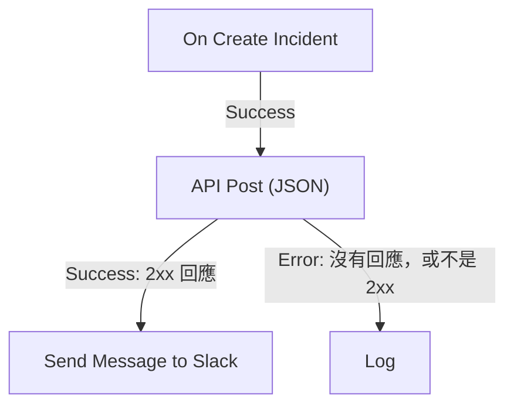

# 工作流程元件

元件是你在觸發器之後新增的區塊。每個元件只做一件事——傳送訊息、呼叫 API、檢查條件、變更 OneUptime 記錄——然後選擇它的一個輸出，進入連接到該輸出的區塊。本頁是目錄：每個區塊需要什麼、傳回什麼，以及何時選擇哪個輸出。

建構時你很少需要一直開著本頁。每個區塊的設定末端都有 **How to use**：區塊做什麼、設定步驟、依據你自己的工作流程產生的範例，以及人們常犯的錯誤。關於新增和連接區塊，請參閱 [建立工作流程](/docs/workflows/authoring)。

:::cards
- [傳送訊息](#slack): Slack、Microsoft Teams、Discord、Telegram、IRC 和電子郵件。
- [呼叫 API](#api): 向任何 HTTP API 傳送請求並讀取回應。
- [加入邏輯](#conditions): 依值分支、轉換資料、等待或記錄日誌。
- [處理 OneUptime 記錄](#oneuptime-資料元件): 尋找、建立、更新和刪除監測器、事件等。
:::

## 我該用哪個元件？

| 想要……                                                        | 使用                                                              |
| ------------------------------------------------------------- | ----------------------------------------------------------------- |
| 在聊天工具中張貼訊息                                          | [Slack](#slack)、[Microsoft Teams](#microsoft-teams)、[Discord](#discord)、[Telegram](#telegram) 或 [IRC](#irc) |
| 透過你自己的郵件伺服器寄送電子郵件                            | [Email](#email)                                                   |
| 呼叫其他任何 API 或你自己的服務                               | [API](#api)                                                       |
| 摘要、分類或草擬文字                                          | [Generate Text with AI](#generate-text-with-ai)                   |
| 依某個值走這條或那條路徑                                      | [Conditions](#conditions)                                         |
| 在兩個區塊之間轉換資料                                        | [JSON](#json) 或 [Custom Code](#custom-code)                      |
| 在下一個區塊之前等待                                          | [Sleep](#sleep)                                                   |
| 啟動另一個工作流程                                            | [Execute Workflow](#execute-workflow)                             |
| 讀取或變更事件、監測器和其他記錄                              | [OneUptime 資料元件](#oneuptime-資料元件)                  |

專用區塊勝過通用區塊：Slack 區塊知道 Slack 的限制，記錄區塊知道記錄的欄位，因此你得到的錯誤和日誌，會比用一個 **API** 區塊做同樣的事更清楚。

## 每個區塊如何運作

當前一個區塊選擇了連接到某個區塊的輸出時，這個區塊就會執行。它讀取自己的設定、完成工作，然後選擇它的一個輸出。接著只會執行連接到該輸出的區塊。



- **設定** 是你要填寫的內容。標有 **（選填）** 的設定可以留空。不常用的設定摺疊在 **更多欄位** 底下。
- **Outputs** 是底部邊緣的點。大多數區塊有 **Success** 和 **Error**；[Conditions](#conditions) 有 **Yes** 和 **No**。
- **Returns** 是區塊傳給後續區塊的值，例如 API 的 **Response Body**。後續區塊用 `{{local.components.<block ID>.returnValues.<value ID>}}` 讀取；設定中的 **{ }** 按鈕會替你插入。請參閱 [變數](/docs/workflows/variables#元件輸出來自前面區塊的資料)。

選擇了 **Error** 的區塊不會讓執行失敗：執行會沿著 **Error** 路徑繼續，如果沒有連接任何東西就在那裡結束。而留空的必填設定，或永遠不可能生效的設定，會以錯誤停止執行。

## API

向任何 URL 發出 HTTP 請求。每種方法都有一個區塊：**API Get (JSON)**、**API Post (JSON)**、**API Put (JSON)**、**API Patch (JSON)** 和 **API Delete (JSON)**。

| 設定                | 作用                                                                                                                                 |
| ------------------- | ------------------------------------------------------------------------------------------------------------------------------------ |
| **URL**             | 要呼叫的位址，`http` 或 `https`。                                                                                                    |
| **Request Body**    | 要傳送的 JSON。通常只有 `POST`、`PUT` 和 `PATCH` 請求需要。                                                                          |
| **Request Headers** | 要一併傳送的標頭，例如 API 金鑰。位於 **更多欄位** 底下。它們的值在執行的日誌中會被隱藏。                                            |

| 輸出        | 何時                                                                                           |
| ----------- | ---------------------------------------------------------------------------------------------- |
| **Success** | 伺服器以 2xx 狀態回應。                                                                        |
| **Error**   | 請求失敗：無法連線到伺服器，或它以其他狀態回應。                                               |

無論哪種情況，區塊都會傳回 **Response Status**、**Response Headers** 和 **Response Body**，失敗時還會傳回附有原因的 **Error**。要讀取 JSON 回應中的欄位，把它的名稱加到參照後面，例如 `{{local.components.api-get-1.returnValues.response-body.id}}`。

重新導向不會被追蹤，所以請把區塊指向實際回應的位址。請求由 OneUptime 發出：解析為私人網路位址的 URL 會被拒絕，除非自行託管的管理員允許，執行會附上原因停止。請參閱 [對外網路存取](/docs/workflows/configuration#對外網路存取)。

## AI

### Generate Text with AI

依據提示詞和選用的 JSON 上下文產生一則文字回覆。區塊使用專案的預設 LLM 提供者，專案沒有時則使用安裝的全域提供者。提供者在 **專案設定 → 人工智慧 → LLM 提供商** 中集中設定；它們的金鑰和端點從來不是區塊的設定。

| 設定                      | 作用                                                                                                                                                              |
| ------------------------- | ----------------------------------------------------------------------------------------------------------------------------------------------------------------- |
| **System Instructions**   | 關於模型角色、語氣和限制的選用指引。                                                                                                                             |
| **Prompt**                | 任務。它會依你寫的原樣傳送，所以可以使用 Markdown，也可以包含變數和前面區塊的值。                                                                                 |
| **Context**               | 你刻意一併傳送的選用 JSON。它附加在一個明確的訊息結尾標記之後，並被視為不可信的資料。                                                                             |
| **Temperature**           | 位於 **更多欄位** 底下。取值從 `0` 到 `1` 的變化程度；預設值是 `0.2`，適合可預測的自動化。目前的 Claude 模型（Opus 4.7 及更新版本，以及所有 Claude 5 模型）會自行選擇取樣方式：OneUptime 會在傳給它們的請求中省略 **Temperature**，因此它對這些模型沒有作用。 |
| **Maximum Output Tokens** | 位於 **更多欄位** 底下。從 `1` 到 `4096`；預設值是 `1024`。                                                                                                      |

System Instructions、Prompt 和序列化後的 Context 合計不超過 50,000 個字元。以 base64 嵌入其中的影像，例如事件描述中合成監測器的螢幕擷取畫面，會在計算長度之前被替換為一則簡短的說明，例如 `[image omitted: PNG, 340 KB]`，因為模型讀取的是文字而不是影像。執行的日誌會說明省略了什麼。對提供者的請求最長持續 60 秒，只嘗試一次。每個專案最多可以同時執行三個工作流程 AI 請求。

它會傳回 **Response**（產生的文字）、**Provider** 和 **Model**（作答的是誰）、**Total Tokens** 和 **Completion Tokens**（提供者回報的用量）、**LLM Log ID**（該呼叫在 AI 日誌中的項目）以及 **Error**。

把 **Success** 連接到使用回覆的區塊，把 **Error** 連接到備用方案：驗證、存取、提供者、預算、計費和逾時失敗都會走這條路徑。區塊不會傳送任何工具，因此模型無法自行查詢 OneUptime、呼叫 API 或變更資料。

> [!WARNING]
> 模型輸出是不可信的文字。在它到達客戶之前先審閱，並且絕對不要讓自由形式的 AI 文字單獨決定一個破壞性的動作。關於傳送給提供者的內容、日誌記錄的內容以及費用，請參閱 [AI 元件](/docs/workflows/configuration#ai-元件)。

## Slack

透過傳入 Webhook 在 Slack 頻道張貼訊息。

| 設定                           | 作用                                                                                                                                                                                                         |
| ------------------------------ | ------------------------------------------------------------------------------------------------------------------------------------------------------------------------------------------------------------ |
| **Slack Incoming Webhook URL** | 要張貼的頻道的 Webhook。它必須以 `https://hooks.slack.com/services/` 開頭。Slack 關於 [建立 Webhook](https://api.slack.com/messaging/webhooks) 的指南只需幾分鐘。                                           |
| **Message Text**               | 要傳送的文字。它會依你寫的原樣傳送，所以請使用 Slack 自己的格式：`*bold*`、`_italic_`、`~strikethrough~` 和 `<https://example.com|a link>`。比一個 Slack 區段（3,000 個字元）更長的文字會分成多個區段傳送；超過十個區段時會被截斷，並以 "… (truncated — see OneUptime for the full text)" 結尾。 |

Slack 接受訊息時觸發 **Success**，Slack 拒絕時觸發 **Error**，Slack 的原因放在 **Error** 中。這些區塊透過它們設定中的 Webhook 張貼，而不是透過專案的 Slack 連線。

## Microsoft Teams

在 Microsoft Teams 頻道張貼訊息。這個區塊叫做 **Send Message to Teams**。

| 設定                           | 作用                                                                                                                                                                                                                                          |
| ------------------------------ | --------------------------------------------------------------------------------------------------------------------------------------------------------------------------------------------------------------------------------------------- |
| **Teams Incoming Webhook URL** | 要張貼的頻道的 Webhook，是 `office.com`、`office365.com`、`logic.azure.com` 或 `environment.api.powerplatform.com` 上的 `https` URL。Microsoft 的指南說明了如何 [用 Teams Workflows 建立一個](https://support.microsoft.com/en-us/teams/apps-service/create-incoming-webhooks-with-workflows-for-microsoft-teams)。 |
| **Message Text**               | 要傳送的文字。超過傳入 Webhook 所能接受之大小（以傳送時計算約 12,000 個字元）的訊息會被截斷，並以 "… (truncated — see OneUptime for the full text)" 結尾。                                                                                     |

## Discord

透過傳入 Webhook 在 Discord 頻道張貼訊息。

| 設定                             | 作用                                                                                                                                               |
| -------------------------------- | -------------------------------------------------------------------------------------------------------------------------------------------------- |
| **Discord Incoming Webhook URL** | 頻道的 Webhook，是 `discord.com` 或 `discordapp.com` 上的 `https` URL。                                                                            |
| **Message Text**                 | 要傳送的文字。超過 Discord 上限 2,000 個字元的訊息會被截斷，並以 "… (truncated — see OneUptime for the full text)" 結尾。                            |

## Telegram

用機器人向 Telegram 聊天傳送訊息。

| 設定                   | 作用                                                                                                                                               |
| ---------------------- | -------------------------------------------------------------------------------------------------------------------------------------------------- |
| **Telegram Bot Token** | BotFather 給你的機器人的權杖，例如 `123456789:ABCdef…`。任何其他形式的權杖都會停止執行，且不會把權杖寫入日誌。                                     |
| **Chat ID**            | 要張貼的聊天：它的 ID，或頻道的 `@username`。先把機器人加入群組或頻道。要傳訊息給個人，對方必須先與機器人開始聊天。                                 |
| **Message Text**       | 要傳送的文字。超過 Telegram 上限 4,096 個字元的訊息會被截斷，並以 "… (truncated — see OneUptime for the full text)" 結尾。                           |

Telegram 拒絕訊息時，**Error** 會附上 Telegram 的原因觸發。

## IRC

在任何 IRC 網路上的 IRC 頻道張貼訊息：Libera.Chat、OFTC 或你自己的伺服器。IRC 沒有 Webhook，所以區塊會自己連線到伺服器、加入頻道、傳送訊息，然後離開。

| 設定             | 作用                                                                                                                                                                                                                                               |
| ---------------- | -------------------------------------------------------------------------------------------------------------------------------------------------------------------------------------------------------------------------------------------------- |
| **IRC Server**   | 伺服器的主機名稱，例如 `irc.libera.chat`。只寫名稱：不帶 `ircs://`，也不帶連接埠。                                                                                                                                                                 |
| **Channel**      | 要張貼的頻道，例如 `#ops`。必須是頻道：在這裡輸入的暱稱會被拒絕，而不是收到一則私人訊息。                                                                                                                                                          |
| **Message Text** | 要傳送的文字。每一行都會作為一則獨立的 IRC 訊息傳送，過長的行會被拆分以符合長度。一則訊息最多以 15 行 IRC 傳送：更長的會被截斷，最後一行會說明這一點。IRC 沒有 Markdown，所以文字會依原樣傳送；IRC 自己的格式代碼（例如粗體和顏色）可以使用。 |

位於 **更多欄位** 底下：

| 設定                                     | 作用                                                                                                                                                                                                               |
| ---------------------------------------- | ------------------------------------------------------------------------------------------------------------------------------------------------------------------------------------------------------------------ |
| **Nickname**                             | 訊息的傳送者。預設是 `OneUptime`。如果暱稱已被使用，區塊會嘗試在後面加上底線或數字，對於不接受更長暱稱的伺服器，則用這樣的字元取代最後幾個字元。                                                                   |
| **Port**                                 | 伺服器的連接埠。預設是 `6697`，開啟 **Disable TLS** 時是 `6667`。                                                                                                                                                  |
| **Disable TLS**                          | 區塊會透過 TLS 連線並檢查伺服器的憑證。只有在伺服器不提供 TLS 時才開啟它；這時如果有密碼，會以未加密的方式傳送。要信任你自己的憑證授權單位所簽發的憑證，自行託管的安裝應改為設定 `NODE_EXTRA_CA_CERTS`。           |
| **Channel Key**                          | 設有金鑰的頻道（模式 `+k`）的金鑰。                                                                                                                                                                                |
| **Send Without Joining**                 | 不加入頻道就張貼，這樣頻道裡看不到區塊的進出。只在頻道接受外部訊息（沒有模式 `+n`）時有效。                                                                                                                        |
| **Server Password**                      | 伺服器或你的 bouncer 在連線時要求的密碼。                                                                                                                                                                          |
| **SASL Username** 和 **SASL Password**   | 在使用 SASL 的網路上登入你的帳戶，例如 Libera.Chat，它對來自某些雲端和 VPN 位址的連線要求 SASL。兩者都填或都不填。                                                                                                 |

伺服器接受了每一行時觸發 **Success**。區塊會在最後一行之後請伺服器回應一次 ping 來確認這一點：伺服器會依序回應，所以如果訊息被拒絕，拒絕會先到。像 ZNC 這樣的 bouncer 會自己回應 ping，因此區塊會多等一秒，等待它背後網路的回應。

無法連線到伺服器，或伺服器拒絕連線、暱稱、密碼或頻道，或者拒絕訊息時，觸發 **Error**。它會傳下原因，伺服器給出了原話就用伺服器的原話。而缺少 **IRC Server**、**Channel** 或 **Message Text**，或某個設定永遠不可能生效，會停止執行。

區塊的每次執行都是一個獨立的連線，而 IRC 網路會限制同一個位址的連線頻率：一連串的訊息可能會以 "Reconnecting too fast" 這樣的原因被拒絕，並像其他拒絕一樣走 **Error**。對於一分鐘內可能觸發很多次的工作流程，請把要說的話合併成一則訊息，或透過你自己的伺服器傳送。

把密碼保存在 [機密全域變數](/docs/workflows/variables#全域變數) 中，並在設定中使用該變數；無論如何它們在執行日誌中都會被隱藏。到回送位址（`localhost`、`127.0.0.1`）、link-local 位址和雲端中繼資料位址的連線會被拒絕。在 OneUptime Cloud 上，位於私人網路位址的伺服器，或解析到這類位址的名稱，也會被拒絕。自行託管的安裝可以連線到它們自己網路中的 IRC 伺服器，除非 `DATA_SOURCE_BLOCK_PRIVATE_ADDRESSES` 被設定為 `true`。

## Email

透過你在區塊上指定的 SMTP 伺服器寄送電子郵件。這個區塊叫做 **Send Email**。

| 設定                                    | 作用                                                                                                  |
| --------------------------------------- | ----------------------------------------------------------------------------------------------------- |
| **From Email**                          | 寄件者，例如 `Alerts <alerts@company.com>`。                                                          |
| **To Email**                            | 收件者的地址。多個地址請用逗號或分號分隔。                                                            |
| **Subject**                             | 主旨行。                                                                                              |
| **Email Body**                          | 以 HTML 形式傳送的訊息。                                                                              |
| **SMTP HOST** 和 **SMTP Port**          | 要連線的郵件伺服器。                                                                                  |
| **SMTP Username** 和 **SMTP Password**  | 選填。兩者都填或都不填。                                                                              |
| **Use Implicit TLS**                    | 對隱含式 TLS（通常是連接埠 465）開啟。對 STARTTLS（通常是連接埠 587）保持關閉。                        |

SMTP 伺服器接受了訊息時觸發 **Success**。SMTP 主機被拒絕、無法連線到伺服器或伺服器拒絕訊息時觸發 **Error**，並傳下錯誤訊息。而缺少 **To Email**、**From Email**、**SMTP HOST** 或 **SMTP Port** 會停止執行。

區塊會直接連線到它設定中的伺服器。它不使用專案的 [SMTP](/docs/emails/smtp) 設定或 OneUptime 自己的郵件伺服器，它寄出的郵件也不會出現在通知日誌中。要檢查它做了什麼，請查看工作流程的 [執行記錄](/docs/workflows/runs-and-logs)。

到回送位址（`localhost`、`127.0.0.1`）、link-local 位址和雲端中繼資料位址的連線會被拒絕。在 OneUptime Cloud 上，位於私人網路位址的 SMTP 主機，或解析到這類位址的名稱，也會被拒絕。自行託管的安裝可以連線到它們自己網路中的郵件伺服器，除非 `DATA_SOURCE_BLOCK_PRIVATE_ADDRESSES` 被設定為 `true`。被拒絕的主機會走 **Error** 輸出，不會寄出任何東西。

## Custom Code

當其他區塊做不到你需要的事情時，執行幾行 JavaScript。這個區塊叫做 **Run Custom JavaScript**。

| 設定                | 作用                                                                                                                                 |
| ------------------- | ------------------------------------------------------------------------------------------------------------------------------------ |
| **JavaScript Code** | 你的程式碼。它用 `return` 傳回的內容會成為區塊的 **Value**。可以使用 `await`。                                                      |
| **Arguments**       | 傳給程式碼之值所組成的 JSON 物件，程式碼以 `args` 讀取它們。把變數和前面區塊的值放在這裡；程式碼本身無法讀取它們。                  |

```json title="Arguments"
{ "title": "{{local.components.incident-on-create-1.returnValues.model.title}}" }
```

```javascript title="JavaScript Code"
const words = args.title.split(" ");

return {
  shortTitle: words.slice(0, 5).join(" "),
  wordCount: words.length,
};
```

後續區塊以 `{{local.components.javascript-1.returnValues.returnValue.shortTitle}}` 讀取簡短標題。

程式碼在沙箱中執行，可以使用 `args`、`console.log`（寫入執行的日誌）、用於 HTTP 請求的 `axios`、`crypto` 和 `sleep`。它沒有檔案系統，也沒有處理程序，它的請求遵守與 API 區塊相同的位址規則。它預設有 5 秒的時間；自行託管的安裝可以用 `WORKFLOW_SCRIPT_TIMEOUT_IN_MS` 變更。

**Success** 會附上傳回的 **Value** 觸發；程式碼擲出例外或逾時時觸發 **Error**，訊息放在 **Error** 中。對於較重的指令碼，請改用 [Runbook](/docs/runbooks/index)。

## JSON

在文字與 JSON 之間轉換，或合併兩個 JSON 物件。

| 區塊             | 接收                                     | 傳回                                                                                                       |
| ---------------- | ---------------------------------------- | ---------------------------------------------------------------------------------------------------------- |
| **JSON to Text** | **JSON**，一個物件                       | **Text**：作為字串的物件。當下一個區塊需要文字時很方便。                                                   |
| **Text to JSON** | **Text**，可以跨多行                     | **JSON**：剖析後的物件，讓你能讀取它的欄位。用在以文字形式到達的 JSON 上。                                  |
| **Merge JSON**   | **JSON 1** 和 **JSON 2**                 | **JSON**：一個包含兩者之鍵的物件。兩者都有的鍵，以 **JSON 2** 為準。                                        |

當文字不是 JSON 時，**Text to JSON** 會走 **Error**。缺少輸入，或 **Merge JSON** 的輸入不是物件，會停止執行。

## Conditions

依據比較進行分支。在 **新增元件** 面板中，這個區塊叫做 **If / Else**，位於 **Popular** 底下。

它的設定讀起來像一句話：**如果** *要檢查的值* *比較方式* *要比較的值*，就繼續走 **Yes**，否則走 **No**。設定下方會用文字把條件重述一遍，方便你確認它說的正是你想表達的。在畫布上，區塊也會顯示它的條件，例如 *如果 environment is equal to “production”*。

| 設定               | 作用                                                                                                                                     |
| ------------------ | ---------------------------------------------------------------------------------------------------------------------------------------- |
| **Value to check** | 通常是前面區塊的一個值。在欄位中按 **{ }** 來選擇，或輸入 `{{`。                                                                         |
| **Comparison**     | 以文字表示的比較方式。比較方式列在下面。                                                                                                 |
| **Compare with**   | 要與之比較的內容，以同樣的方式輸入或選擇。**為空**、**不為空**、**is true** 和 **is false** 不使用它。                                    |
| **Compare as**     | 摺疊在比較方式下面：**文字**、**數字** 或 **True / False**。選擇 **文字** 來比較寫成 `2026-10-01` 之日期的先後，或選擇 **數字** 讓 `200` 和 `200.0` 相等。 |

比較方式：

- **is equal to** 和 **is not equal to**；
- 用於文字：**包含**、**不包含**、**開頭是** 和 **結尾是**；
- 用於數字：**大於**、**is greater than or equal to**、**小於** 和 **is less than or equal to**；
- **為空** 和 **不為空**，檢查值是否存在；
- **is true** 和 **is false**。

數字比較比較的是數字，文字比較比較的是文字，所以你很少需要 **Compare as**。值是這樣比較的：

- 作為文字時會區分大小寫：`Error` 不是 `error`。
- 作為數字時，不是數字的文字會以 `0` 計算。設定會提示這樣輸入的值。
- 作為真或假時，只有 `true` 算作真。
- **為空** 在以下情況成立：完全沒有值、空白文字、空清單或空物件，或前面的區塊沒有的值，例如 Webhook 沒有傳送的欄位。`0` 和 `false` 都是值，所以不算空。

條件成立時執行 **Yes**，不成立時執行 **No**。在設定採用這些名稱之前設定好的區塊，仍會與以前完全一樣地執行。有一個舊選項不再提供：把值按 **Null** 或 **Undefined** 來比較，這會忽略值的內容。仍在使用它的區塊會在你開啟時提示；要檢查值是否缺少，請選擇 **為空**。

## Sleep

在下一個區塊之前暫停執行，給另一個系統一點時間跟上，或稍後再跟進。

**Days**、**Hours**、**Minutes** 和 **Seconds** 會相加。最長等待 30 天：更長的會被縮短為 30 天，執行的日誌會說明這一點。

等待期間，執行會以 **等待中** 狀態被擱置一旁，時間到了再繼續，因此長時間的等待不會佔用任何東西。如果在此期間工作流程被關閉或封存，執行會在醒來時被取消。

## Log

把一個值寫入執行的日誌。它不會變更其他任何東西，所以這是查看某個值包含什麼的最簡單方法。

**Value** 是要寫入的內容。它可以跨多行，也可以包含前面區塊的值，例如 `{{local.components.webhook-1.returnValues.request-body}}`。區塊完成後會走 **Out**。

## Execute Workflow

啟動同一專案中的另一個工作流程。你的工作流程會繼續執行，不等另一個完成。

| 設定          | 作用                                                                                                                                      |
| ------------- | ----------------------------------------------------------------------------------------------------------------------------------------- |
| **Workflow**  | 要啟動的工作流程。它必須處於啟用狀態；要接收引數，它必須有一個 **Manual** 觸發器。                                                        |
| **Arguments** | 要傳入的 JSON。另一個工作流程的 Manual 觸發器會把每個鍵作為獨立的值往下傳：對於 `{"customerId": "42"}`，它讀取 `{{local.components.manual-1.returnValues.customerId}}`。 |

另一個工作流程一進入佇列就觸發 **Out**。無法啟動時觸發 **Error**：它不存在、已關閉或已封存，或啟動它會造成迴圈。

用它來共用通用邏輯：建構一個「張貼到事件頻道」的工作流程，然後從每個需要它的工作流程啟動它。相互啟動的工作流程鏈不能繞回自己，最多 10 層深。請參閱 [設定與安全](/docs/workflows/configuration#呼叫其他工作流程的限制)。

## OneUptime 資料元件

對於 OneUptime 中的每一種記錄（監測器、事件、警示、狀態頁面、待命策略等等），**新增元件** 面板都有這些元件：在 **OneUptime resources** 底下點選記錄類型（沒有顯示的在 **Browse all resources** 中），或依類型名稱搜尋。每個標題都由記錄類型產生，所以 Monitor 的這一組是：

| 元件                     | 作用                                                                           |
| ------------------------ | ------------------------------------------------------------------------------ |
| **Find One Monitor**     | 讀取一筆與查詢相符的記錄。                                                     |
| **Find Many Monitors**   | 讀取一組與查詢相符的記錄。                                                     |
| **Create One Monitor**   | 依據一個 JSON 物件新增一筆記錄。                                               |
| **Create Many Monitors** | 依據一個 JSON 陣列新增多筆記錄。                                               |
| **Update One Monitor**   | 把要寫入的資料套用到一筆相符的記錄。                                           |
| **Update Many Monitors** | 把要寫入的資料套用到相符的記錄，最多 **Limit** 筆。                            |
| **Delete One Monitor**   | 刪除一筆相符的記錄。                                                           |
| **Delete Many Monitors** | 刪除相符的記錄，最多 **Limit** 筆。                                            |

同一組還會給你三個觸發器——**On Create Monitor**、**On Update Monitor** 和 **On Delete Monitor**。請參閱 [觸發器](/docs/workflows/triggers#oneuptime-事件觸發器)。

一種類型只會提供其模型允許的元件。唯讀類型只有兩個 Find 元件，沒有其他的，所以如果你在面板中找不到 **Delete One Monitor**，就表示那種類型不允許。

工作流程就是這樣讀取和變更 OneUptime 資料的。例如，來自 CI 工具的 Webhook 可以用 **Create One Incident** 開立一個帶有失敗詳細資訊的事件。

這些元件以工作流程所在專案的 Project Admin 身分執行：Project Admin 不允許做的事，或你的方案不包含的事，會被拒絕，執行的日誌會說明原因。請參閱 [工作流程步驟可以做什麼](/docs/workflows/configuration#工作流程步驟可以做什麼)。

### 依據範本宣告事件

**Create One Incident** 可以依據你的某個 [事件範本](/docs/incidents/settings#事件範本) 宣告事件：在步驟的第一個設定 **Incident Template** 中選擇它。範本會填寫 **JSON Object** 省略的所有欄位——標題、描述、嚴重程度、初始狀態、監測器和其他資源、待命策略、標籤、狀態頁面和自訂欄位——它的擁有者會成為事件的擁有者。你在 **JSON Object** 中設定的任何內容（包括狀態）都優先於範本，所以選擇了範本後，**JSON Object** 只需要包含要不同的部分，也可以留空。

事件會把它所依據的範本記錄在 `createdIncidentTemplateId` 中。這一欄由 OneUptime 設定：在 **JSON Object** 中傳送它的步驟會被拒絕，它的執行日誌會引導你改用 **Incident Template**。來自另一個專案的範本，或已被刪除的範本，會讓步驟走它的 **Error** 輸出；在不包含事件範本的方案上，步驟會被拒絕，並說明所需的方案。請參閱 [範本如何套用](/docs/incidents/settings#範本如何被套用)。

## 處理記錄

資料元件上的每個欄位都使用記錄自己的 **欄** 名稱——與 API 相同的名稱，而不是儀表板表單中的標籤。ID 欄是 `_id`。在任何可以輸入欄名稱的地方，`id` 這種拼寫都會被當作別名接受，但記錄傳回的是 `_id`，所以取出時要讀它：

```json
{ "_id": "00000000-0000-0000-0000-000000000000" }
```

**Query** 決定元件處理哪些記錄。鍵是欄，值是要相符的內容：

```json
{ "monitorType": "Website", "isEnabled": true }
```

查詢一律限定在工作流程執行所在的專案中。你無法存取另一個專案的記錄，也不需要自己把專案加進查詢。

Create One 上的 **JSON Object**、Create Many 上的 **JSON Array** 以及 Update 元件上的 **Data (JSON Object)** 會用同樣的鍵攜帶要寫入的欄位：

```json
{ "name": "Checkout API", "monitorType": "Website" }
```

不是欄的鍵會被忽略而不是被拒絕——執行的日誌會列出被捨棄的鍵，所以當某個欄位沒有寫進去時，請到那裡查看。Find 元件和觸發器上的 **Select Fields** 使用同樣的欄鍵，值為 `true`：`{"_id": true, "name": true}`。

**自訂欄位** 是一欄 `customFields`，在每個自訂欄位的名稱底下保存它的值。Update 元件只會變更你提到的自訂欄位，其他欄位保持原值：

```json
{ "customFields": { "Notification Count": 1 } }
```

會設定 **Notification Count**，並讓記錄的其他自訂欄位保持原樣。把某個自訂欄位設為 `null` 可以清空它，把 `customFields` 本身設為 `null` 可以全部清空。兩個工作流程在同一時刻更新同一筆記錄的不同自訂欄位，兩項變更都會生效。這只適用於 Update 元件：OneUptime API 會整體寫入 `customFields`，所以傳給它的請求必須包含你想保留的每個自訂欄位。

你很少需要自己輸入這些鍵。在元件的設定中，**Add a field**（在查詢中是 **Add a condition**）會依名稱列出模型的欄，並標明每一欄接受之值的類型。依名稱、欄鍵或欄位的用途搜尋，然後按 **Enter** 新增最佳結果。建立時，沒有它們就無法建立記錄的欄位會排在最前面，接著是模型的主要欄位（你省略時它會自己填寫的那些），最後是其餘欄位。

OneUptime 自己填寫的欄位在你寫入記錄時不會提供：記錄的 `_id`、**建立於**、**更新於**、**Created by User**、slug、記錄編號和通知狀態。誰在何時建立、封存或解決了一筆記錄，從來不由工作流程設定：工作流程建立的記錄沒有建立者；工作流程在其他欄位旁為這些欄位之一傳送的值會被忽略；而一個除此之外什麼都不傳送的 Update 會失敗，並給出提到這些欄位的訊息。更新只會提供記錄存在之後還可以變更的欄位。查詢仍然會提供 ID、時間戳記和 **Created by User**，因為它們便於篩選。**Deleted At** 在任何地方都不提供：記錄會被完全刪除，所以它總是空的。

**Skip** 和 **Limit** 是 Find Many、Update Many 和 Delete Many 上的兩個數字欄位，位於 **更多欄位** 底下——`Skip: 0` 搭配 `Limit: 100` 會取前一百個相符項目。**Limit** 預設是 `10`，在 Update Many 和 Delete Many 上，它限制的是實際寫入的記錄數，而不只是傳回的數量。所以 `Items Deleted: 10` 表示刪除了十筆記錄，而不是相符了十筆。想變更超過十筆時，請調高 **Limit**。

**Success** 和 **Error** 說明的是查詢是否執行，而不是它找到了什麼。沒有相符任何內容的查詢會傳回 `0`，並仍然從 **Success** 出去——這不是錯誤。要依據是否有相符項目來分支，請在 **If / Else** 區塊中讀取傳回的數量。

## 後續步驟

:::cards
- [變數](/docs/workflows/variables): 在區塊之間傳遞值，並把密鑰放在它們之外。
- [執行記錄](/docs/workflows/runs-and-logs): 查看一次執行中每個區塊接收和傳回了什麼。
- [設定與安全](/docs/workflows/configuration): 限制、權限以及步驟可以做什麼。
:::
