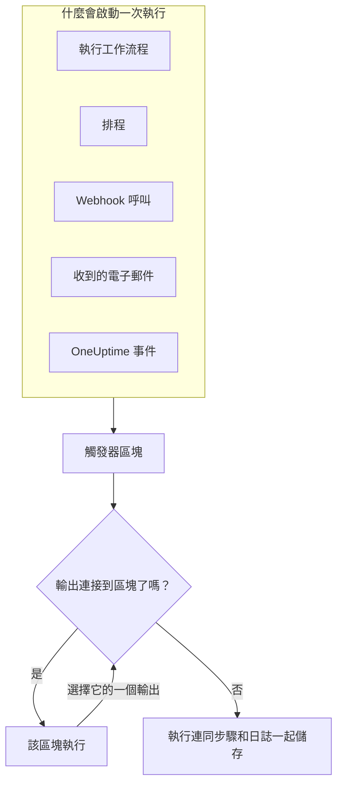
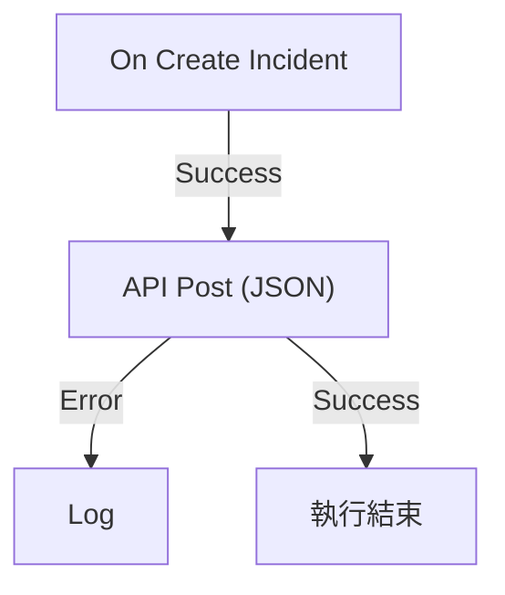

# 工作流程概觀

工作流程讓你不必撰寫程式碼，就能在 OneUptime 中自動化工作。你把區塊放到畫布上並連接起來，每當觸發器觸發時，工作流程就會自行執行：事件被建立、排程時間到了、其他工具呼叫一個 URL，或收到一封電子郵件。用它們把 OneUptime 與你技術堆疊的其他部分連接起來，並在你專注處理問題本身時，代為處理例行的後續工作。

:::cards
- [建立工作流程](/docs/workflows/authoring): 建立一個工作流程，然後在畫布上新增、連接並設定它的區塊。
- [觸發器](/docs/workflows/triggers): 手動、依排程、透過 Webhook、電子郵件或 OneUptime 事件啟動工作流程。
- [元件](/docs/workflows/components): 你可以新增的每一種區塊，從 API 呼叫到 OneUptime 記錄。
- [執行記錄](/docs/workflows/runs-and-logs): 逐步查看每次執行做了什麼。
:::

## 工作流程如何運作

每個工作流程都由三個部分組成：

1. **觸發器** —— 啟動工作流程的東西：手動執行、排程、Webhook 呼叫、收到的電子郵件，或 OneUptime 中的事件，例如新的事件。每個工作流程恰好有一個。
2. **元件** —— 工作流程要做的事：傳送訊息、呼叫 API、檢查條件、建立或更新 OneUptime 記錄。
3. **連線** —— 你從一個區塊畫到下一個區塊的線。它們決定什麼在什麼之後執行。

觸發器觸發時，OneUptime 會開始一次 **執行**。每個區塊最後都會選擇它的一個輸出，例如 **Success** 或 **Error**、**Yes** 或 **No**，接著只會執行連接到該輸出的區塊。如果沒有區塊連接到某個區塊所選的輸出，那條路徑就到此結束。執行會連同它的狀態、走過的路徑，以及每個區塊接收和傳回的內容一起儲存。



這一切都在畫布上以視覺化方式建構。大多數工作流程完全不需要程式碼；需要時，一個 **Run Custom JavaScript** 區塊可以執行幾行 JavaScript。

## 你可以用工作流程做什麼

- **把 OneUptime 連接到你的其他工具** —— 在 Slack、Microsoft Teams、Discord、Telegram 或 IRC 張貼訊息、建立 Jira 工單，或向你技術堆疊中的任何 API 傳送請求。
- **對 OneUptime 中發生的事做出反應** —— 事件建立時，通知合適的頻道並自動開立工單。
- **依排程執行工作** —— 每五分鐘、每晚、每週一早上。
- **接收外部資料** —— 讓其他系統透過呼叫工作流程的 URL，或寄電子郵件到它的地址，來啟動工作流程。
- **重複使用共用的自動化** —— 只建構一次，然後用 **Execute Workflow** 區塊從任何其他工作流程啟動它。

## 關鍵術語

| 術語             | 意義                                                                                                   |
| ---------------- | ------------------------------------------------------------------------------------------------------ |
| **工作流程**     | 整個自動化：一個名稱、一塊放著區塊的畫布，以及一個開啟或關閉它的開關。                                 |
| **觸發器**       | 第一個區塊。它決定工作流程何時執行。每個工作流程恰好有一個。                                           |
| **元件**         | 其他任何區塊：它傳送訊息、發出請求、檢查條件或變更記錄。                                               |
| **輸出**         | 區塊底部的一個點，例如 **Success** 或 **Error**。從它引出的線通往下一個區塊。                          |
| **執行**         | 工作流程的一次執行，連同狀態、時間戳記，以及每個區塊做了什麼一起儲存。                                 |
| **全域變數**     | 一個值（例如 API 金鑰），你只需儲存一次，就能在專案的任何工作流程中使用。                              |

## 開始之前

- **包含工作流程的方案。** 在 OneUptime Cloud 上，工作流程需要 **Growth** 方案或更高，每個方案每 30 天允許一定數量的執行——請參閱 [方案限制](/docs/workflows/configuration#方案限制)。沒有計費的自行託管安裝兩種限制都沒有。
- **建構的權限。** 建立和變更工作流程需要 **Workflow Admin**、**Project Admin** 或 **Project Owner**，或具有相應權限的自訂角色。**Workflow Member** 可以開啟工作流程並手動執行，但不能變更它們。請參閱 [權限](/docs/workflows/configuration#權限)。

## 在 OneUptime 中哪裡找到工作流程

在頂端列開啟 **產品**，然後在 **儀表板與自動化** 底下選擇 **工作流程**。它的選單包含：

- **工作流程** —— 你的工作流程清單。建立新的或開啟現有的。
- **全域變數** —— 所有工作流程共用的值。
- **日誌 → 執行記錄** —— 專案中所有工作流程的執行歷史。
- **設定 → 標籤規則** 和 **擁有者規則** —— 自動為新工作流程加上標籤並指定擁有者。
- **進階 → 已封存** —— 你封存的工作流程。它們永遠不會執行，也不會出現在清單中；可以在這裡取消封存。請參閱 [封存工作流程](/docs/workflows/configuration#封存工作流程)。
- **開發者** —— 如何用 Terraform、API 或 AI 助理管理工作流程。

開啟單一工作流程，它自己的選單包含：

- **概覽** —— 名稱、描述、標籤以及 **已啟用** 開關。
- **建構器** —— 設計工作流程的畫布，頂端有 **已啟用** 開關。
- **工作流程變數** —— 只屬於這個工作流程的值。
- **日誌 → 執行記錄** —— 這個工作流程的每次執行及其詳細資訊。
- **擁有者** —— 負責這個工作流程的人員和團隊。
- **開發者** —— 如何用 Terraform、API 或 AI 助理管理這個工作流程。
- **設定** —— 複製、匯出和封存。

**設定** 位於選單的 **進階** 區段，與 **稽核日誌** 和 **刪除工作流程** 放在一起。**進階** 和 **開發者** 在這個選單和其他所有選單中都預設摺疊，讓你每天使用的頁面排在前面。點選區段名稱即可顯示它的頁面。當你位於其中某個頁面時，它會自動展開。

## 建構你的第一個工作流程

每個工作流程都以相同的方式建構：

:::steps
1. **建立** —— 選擇一個起點，然後為工作流程命名。請參閱 [建立工作流程](/docs/workflows/authoring)。
2. **選擇觸發器** —— 手動、排程、Webhook、收到的電子郵件，或來自 OneUptime 的事件。請參閱 [觸發器](/docs/workflows/triggers)。
3. **新增元件** —— 在畫布上新增動作並連接起來。請參閱 [元件](/docs/workflows/components)。
4. **開啟它** —— 在 **建構器** 頂端開啟 **已啟用**。已停用的工作流程根本無法執行，手動也不行。
5. **測試** —— 在 **建構器** 中點選 **執行工作流程**，觀看執行的進行過程。
:::

下面的範例會為一個真實的工作流程逐一走過這些步驟。

## 範例：把新事件傳送到 Webhook

這個工作流程會把每個新事件的 JSON 摘要傳送到你指定的 URL——工單系統、資料倉儲，任何接受 Webhook 的東西——並在請求失敗時把原因寫入執行的日誌。



> [!TIP]
> **Forward new incidents to another system** 範本會為你建構同樣的工作流程。建立工作流程時，可以在 **事件** 底下找到它。

:::steps
### 建立工作流程

開啟 **工作流程** 並點選 **建立工作流程**。點選 **從零開始**，把工作流程命名為 `Send new incidents to a webhook`，然後點選 **建立工作流程**。

新的工作流程會在 **建構器** 中開啟，處於關閉狀態。

### 新增觸發器

點選虛線的 **Choose what starts this workflow** 區塊，然後在 **Add Trigger** 面板中點選 **Popular** 底下的 **On Create Incident**。

觸發器會取代虛線區塊的位置。它上面的 ID `incident-on-create-1` 就是後續區塊參照它的方式。

### 選擇事件欄位

點選觸發器。在 **Select Fields** 中勾選請求要攜帶的欄位，例如標題和描述，然後點選 **儲存**。

觸發器會把新事件連同這些欄位一起往下傳。你沒有選擇的欄位到達時為空。

### 新增 API 區塊

點選 **新增元件**，然後點選 **Popular** 底下的 **API Post (JSON)**。從觸發器的 **Success** 點向下拖曳到新區塊頂端的點。

### 填寫請求

點選標示 **Click to set up** 的 API 區塊。在 **URL** 中填入你的端點。在 **Request Body** 中寫下要傳送的 JSON，在需要的地方用 **{ }** 插入事件的欄位，然後點選 **儲存**。

```json title="Request Body"
{
  "id": "{{local.components.incident-on-create-1.returnValues.model._id}}",
  "title": "{{local.components.incident-on-create-1.returnValues.model.title}}",
  "description": "{{local.components.incident-on-create-1.returnValues.model.description}}"
}
```

工作流程執行時，每個 `{{…}}` 參照都會被替換為事件的值。語法請參閱 [變數](/docs/workflows/variables)。

### 攔截失敗

點選 **新增元件**，然後點選 **日誌**。把 API 區塊的 **Error** 點連接到它，然後把 Log 區塊的 **Value** 設為 `Could not send the incident: {{local.components.api-post-1.returnValues.error}}`。

失敗的請求——無法連線的 URL，或不是 2xx 的回應——現在會走這條路徑，執行的日誌會說明原因。

### 開啟它

在 **建構器** 頂端開啟 **已啟用**。

### 測試它

點選 **執行工作流程**，輸入本專案中某個事件的 **事件 ID**，點選 **Run Workflow Manually**，然後用 **Run** 確認。

**工作流程執行** 面板會開啟並追蹤這次執行。開啟 **API Post (JSON)** 步驟，即可看到它傳送的內文和收到的回應。
:::

從現在起，專案中的每個新事件都會啟動一次執行。你可以在工作流程的 [執行記錄](/docs/workflows/runs-and-logs) 中找到它們。

> [!NOTE]
> 請求由 OneUptime 發出。在 OneUptime Cloud 上，URL 必須能從網際網路連線。自行託管的安裝會拒絕私人網路位址，除非管理員允許——請參閱 [對外網路存取](/docs/workflows/configuration#對外網路存取)。

## 工作流程與 OneUptime 其他部分的關係

- **監測器** 發現問題。**事件** 和 **警示** 記錄問題。**工作流程** 對問題做出反應。
- **Runbook** 是團隊在事件、警示或維護時逐步執行的應變程序：手動步驟、核准和指令碼，有人參與其中。工作流程在無人看管的情況下執行。當需要有人在過程中做決定時，請使用 [Runbook](/docs/runbooks/index)；當每個步驟都是自動的，請使用工作流程。
- **工作區連線** 把專案連接到 Slack 和 Microsoft Teams，用於事件頻道和通知。工作流程中的 Slack 和 Microsoft Teams 區塊不使用它們：每個區塊都透過自己的傳入 Webhook URL 張貼訊息。

## 後續步驟

:::cards
- [建立工作流程](/docs/workflows/authoring): 使用畫布、區塊及其設定。
- [變數](/docs/workflows/variables): 在區塊之間傳遞資料，並把密鑰放在工作流程之外。
- [設定與安全](/docs/workflows/configuration): 上線前的權限、限制和安全。
:::
