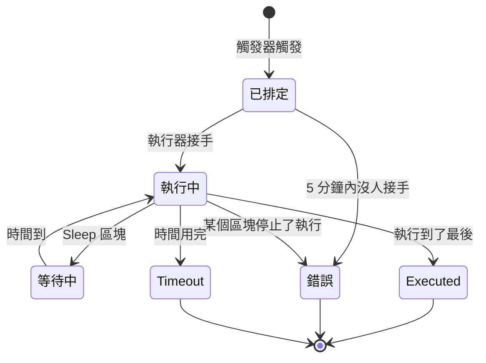

# 工作流程執行記錄

每當工作流程執行一次，OneUptime 都會儲存一份發生了什麼的紀錄——它何時執行、是否成功，以及每個區塊接收和傳回了什麼。這份紀錄稱為一次 **執行**。透過執行，你可以確認工作流程是否正常運作，排查沒有正常運作的工作流程，並回顧過去的活動。

:::cards
- [執行狀態](#執行狀態): 已排定、等待中、Executed 等狀態的意義。
- [閱讀一次執行](#閱讀一次執行): 一個區塊一個區塊地跟著執行走過的路徑。
- [疑難排解](#疑難排解): 沒有執行的工作流程、一直沒有執行的區塊、到達時為空的值。
:::

## 在哪裡找到它們

| 頁面                                                 | 你會看到                                                                                           |
| ---------------------------------------------------- | -------------------------------------------------------------------------------------------------- |
| **工作流程 → 日誌 → 執行記錄**（工作流程選單）       | 專案中每個工作流程的每次執行。可依工作流程名稱、狀態和時間篩選。                                   |
| **工作流程 → 日誌 → 執行記錄**（單一工作流程的選單） | 只有這一個工作流程的執行。這裡用 **執行 ID** 篩選取代工作流程篩選。                                |
| **單次執行**                                         | 透過執行列上的 **檢視日誌** 按鈕開啟——列本身無法點選。                                             |

從 **建構器** 啟動執行時，會開啟同一個 **工作流程執行** 檢視，而且已經在追蹤這次執行，所以你可以看著它發生，而不必事後再去找。

## 執行狀態

| 狀態                                | 意義                                                                                                                                                                                                                                                                  |
| ----------------------------------- | --------------------------------------------------------------------------------------------------------------------------------------------------------------------------------------------------------------------------------------------------------------------- |
| **已排定**                          | 觸發器已觸發，執行正在佇列中等待執行器。通常不到一秒。5 分鐘後仍處於已排定狀態的執行會失敗：沒有任何東西接手它。                                                                                                                                                     |
| **執行中**                          | 工作流程正在進行中。                                                                                                                                                                                                                                                  |
| **等待中**                          | 執行停在一個 **Sleep** 區塊上，會自行繼續。等待期間它不佔用任何 worker。                                                                                                                                                                                              |
| **Executed**                        | 執行沒有失敗地到達了最後。這是成功狀態：標記上寫的是 **Executed**，而不是「成功」。                                                                                                                                                                                  |
| **錯誤**                            | 某個區塊停止了執行。在以下情況也會使用：佇列中的執行一直沒人接手、休眠中執行的恢復遺失、排程運算式無法解析，以及執行在 **Sleep** 區塊上等待期間工作流程被關閉或封存。                                                                                                 |
| **Timeout**                         | 執行時間超過允許的時長：預設 2 分鐘。請參閱 [一次執行能跑多久](/docs/workflows/configuration#一次執行能跑多久)。                                                                                                                                              |
| **Execution Exceeded Current Plan** | 專案已用完最近 30 天的工作流程執行次數，或訂閱尚未付款。執行會被記錄，但不會執行。僅限 OneUptime Cloud。                                                                                                                                                            |

走 **Error** 輸出的區塊——例如收到 4xx 回應的 API 區塊——不會讓執行失敗。連接到 **Error** 的區塊會執行，執行仍以 **Executed** 結束。該步驟本身會以紅色顯示，方便你找到。

## 閱讀一次執行

在一次執行上點選 **檢視日誌** 來開啟它。**工作流程執行** 檢視有兩個分頁：**步驟** 和 **Full Log**。

### 步驟分頁

執行走過的路徑，每個區塊一張附編號的卡片，依執行順序排列。不必展開任何內容，每張卡片就會顯示：

- 區塊的標題和 ID，它是 **已成功** 還是 **失敗**，以及耗時。
- 它走了哪個輸出（依畫布上的名稱），以及通往哪裡：下一個步驟的編號和名稱，或一則說明，指出沒有任何東西連接到它，因此執行或該分支在那裡結束。它通往但從未執行的步驟會顯示 **(did not run)**。Error 輸出以紅色顯示；Yes 和 No 只是執行走的方向。把指標停在輸出名稱上可以看到它的意義。
- 如果步驟失敗，會顯示它的錯誤，以及關於它的任何警告——例如一個解析為空的 `{{…}}` 參照。

展開一張卡片可以看到兩塊詳細資訊：

| 區塊         | 顯示的內容                                                                                                                                                                                                      |
| ------------ | --------------------------------------------------------------------------------------------------------------------------------------------------------------------------------------------------------------- |
| **Received** | 在所有變數填好之後，區塊得到的設定，依名稱並依設定清單中的順序排列。參照了其他步驟或變數的設定會在參照旁邊顯示它變成的值，變成空時顯示 **Did not resolve**。                                                  |
| **Returned** | 它產生的內容，並標出每個值的 ID（`returnValues` 參照的最後一部分）。清單和物件會縮排顯示。                                                                                                                      |

失敗的步驟、帶有警告的步驟，以及只有一個步驟之執行中的那個步驟，會預設展開。**步驟** 分頁上的計數在有內容失敗時變成紅色，在某個步驟帶有警告時變成橘色。

有幾類執行讀起來不太一樣：

- **單一步驟的測試。** 用 **Run just this step** 啟動的執行會在頂端顯示 **Only this step ran**。它之前的步驟沒有執行，所以它從這些步驟讀取的值是缺少的（這些值會出現 **Did not resolve** 警告），它之後的步驟會顯示 **(not run in this test)**。要試整條路徑，請用 **執行工作流程**。
- **在步驟之間停止的執行。** 如果執行因為某個沒有任何步驟能解釋的原因而停止——在兩個步驟之間逾時，或在第一個步驟之前失敗——路徑會以 **The run stopped here** 和原因結束。
- **休眠中的執行。** 停在 **Sleep** 區塊上等待的執行會以 **Sleeping** 和它自行繼續的時間結束；Sleep 之後的步驟會顯示 **(not run yet)**。

每個步驟標題下方的 ID，正是要寫進 `{{local.components.<id>.returnValues.…}}` 參照中的內容，這讓這裡成為寫對參照最快的方法。

顯示的值是區塊收到的內容，也就是變數填好之後、區塊對它們做任何處理之前的樣子，但有兩個例外：密鑰和區塊標記為敏感的欄位會被隱藏，超過 4,000 個字元的值會被截斷並加上 "… (truncated)"。一次執行會保留最近的 100 個步驟；很長或經常被恢復的執行會在較早步驟被捨棄的位置顯示一則橘色說明。在輸出名稱開始被儲存之前記錄的執行，會以 ID 顯示輸出，並且不顯示它通往哪裡。

### Full Log 分頁

執行器逐行寫下的原始日誌，包括區塊自己記錄的任何內容，例如 **Log** 區塊的值或指令碼的 `console.log`。當步驟分頁解釋不了失敗時，就用它。

## 複製和下載一次執行

在 **工作流程執行** 檢視頂端，關閉按鈕旁邊，**複製日誌** 會把整個 **Full Log** 放到剪貼簿，方便貼到聊天或工單中。**下載** 會把執行儲存為檔案：

| 下載                                    | 你會得到                                                                                                                                                                                                                               |
| --------------------------------------- | -------------------------------------------------------------------------------------------------------------------------------------------------------------------------------------------------------------------------------------- |
| **下載日誌**                            | 一個 `.txt` 檔案，包含執行器輸出的完整日誌，無論多長，上方有一個簡短的標頭：工作流程的名稱和 ID、執行 ID、它的狀態，以及它被排定、開始和完成的時間。                                                                                 |
| **以 JSON 格式下載執行**                | 一個 `.json` 檔案，以資料形式包含同樣的資訊、**步驟** 分頁顯示的步驟（每個步驟接收和傳回了什麼、走了哪個輸出），以及作為行清單的日誌。步驟的形式與 API 傳回執行之 `stepTrace` 時相同，並且與 **步驟** 分頁一樣是執行的最近 100 個。日誌永遠是完整的。 |

同樣的兩種下載也在兩份執行清單中每次執行的 **⋯** 選單裡，所以你不必開啟執行就能儲存它。從 **建構器** 啟動的執行在仍在進行時就可以複製或下載；你會得到它到目前為止記錄的內容。

檔案依工作流程、執行和開始時間（UTC）命名，所以存放它們的資料夾會先依工作流程、再依時間排序：`nightly-sync-run-<run id>-2026-09-30T10-00-01.txt`。

下載的檔案中不包含任何你在執行中原本讀不到的內容。密鑰和區塊標記為敏感的欄位在執行被記錄時就已隱藏，所以在檔案中也是隱藏的，而且任何能開啟執行的人都可以下載它。

## 疑難排解

:::details 我的工作流程沒有執行
1. 確認工作流程處於 **已啟用** 狀態：開關位於它的 **建構器** 頂端，工作流程關閉時，建構器會在畫布上方說明。新的工作流程一開始是停用的，而已停用的工作流程會拒絕每一次執行——包括手動執行。對它的 Webhook 呼叫會收到 HTTP 400，並附有說明如何開啟它的訊息。
2. 對於 OneUptime 事件觸發器，確認事件確實發生了：開啟記錄並查看它的歷史。帶有 **Listen on** 的 **On Update** 觸發器只會在其中某個欄位發生變化時觸發。
3. 對於 Webhook 觸發器，確認另一個系統傳送到了正確的 URL。大多數工具在傳送 Webhook 時都會記錄——請到那裡檢查。
4. 對於排程觸發器，確認 cron 運算式與你預期的時間相符。排程以 UTC 執行。

如果執行出現了，狀態為 **Execution Exceeded Current Plan**，表示專案已用完最近 30 天的所有工作流程執行次數，或訂閱尚未付款。執行的日誌會寫明次數和你的方案上限。這只適用於 OneUptime Cloud。
:::

:::details 後面的某個區塊一直沒有執行
不執行的區塊通常是連線問題。開啟 **建構器** 檢查：

- 前一個區塊的輸出連接到這個區塊的輸入了嗎？
- 前一個區塊是否走了你沒預期到的輸出——**Error** 而不是 **Success**，或 **No** 而不是 **Yes**？**步驟** 分頁會說明它走了哪個輸出、通往哪裡，或說明沒有任何東西連接到它。
:::

:::details 值到達時為空，或者是 {{…}} 文字
開啟執行並查看該步驟。沒有解析的參照會作為警告在步驟本身上標示出來，它在 **Received** 區塊中的設定會標記為 **Did not resolve**。

- 如果你看到字面的 `{{local.components.…}}` 文字，表示參照沒有解析。通常是元件 ID 或傳回值 ID 拼錯了——記住它是區塊的 **Identifier**，而不是區塊上顯示的名稱。也請檢查 `local.components` 本身的拼寫：`{{local.componets.api-get-1.returnValues.response-body}}` 會以字面文字傳送，而執行仍然回報 **Executed**。如果這次執行是 **Run just this step** 測試，前面的區塊根本沒有執行——請改為執行整個工作流程。
- 如果你看到 **Empty text**，表示前面的區塊執行了，但沒有產生那個欄位。

同樣的警告也會出現在 **Full Log** 分頁中，是一行以 `Warning:` 開頭的內容。
:::

:::details 手動執行時正常，從觸發器執行就不行
開啟 **建構器**，點選 **執行工作流程**，用看起來像真實觸發器會傳送的值填寫觸發器的欄位。然後把這次執行的 **Received** 值與真實執行的值並排比較。差別通常在某一個欄位的名稱或類型上。
:::

## 重新執行工作流程

沒有「重試這次執行」的按鈕。舊的執行永遠不會被自動重新執行，因為它們的副作用——Slack 訊息、API 呼叫、工單——重複執行可能並不安全。要重做這項工作，請修正工作流程，等下一次真實的觸發器來啟動它，或開啟 **建構器**，用同樣的值點選 **執行工作流程**。

## 執行會保留多久？

在 OneUptime Cloud 上，執行會保留 **30 天**，然後被刪除——這就是為什麼兩份執行清單都說明它們涵蓋最近 30 天。自行託管的安裝會一直保留執行，直到你刪除它們；如果某個工作流程執行得非常頻繁、把歷史弄得很亂，就關閉或刪除它。

在步驟追蹤加入之前記錄的執行沒有 **步驟** 內容，只會顯示它們的 **Full Log**。

## 後續步驟

:::cards
- [設定與安全](/docs/workflows/configuration): 時間限制、方案限制，以及紀錄中隱藏的內容。
- [變數](/docs/workflows/variables): 你的區塊使用的參照語法。
- [元件](/docs/workflows/components): 每個區塊傳回什麼，以及何時走哪個輸出。
:::
