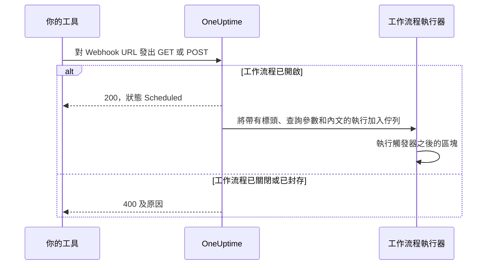
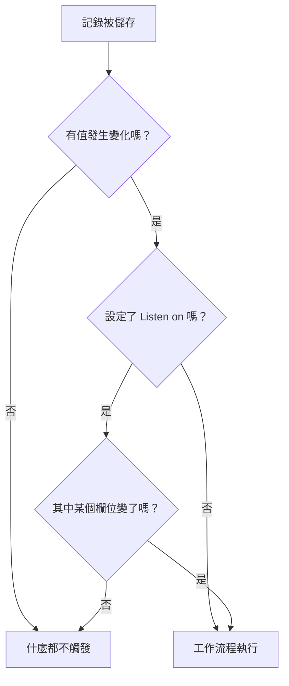

# 工作流程觸發器

觸發器是工作流程的第一個區塊——它決定工作流程何時執行。每個工作流程恰好有一個觸發器。你可以從五種類型中選擇。

:::cards
- [手動](#manual): 從建構器或另一個工作流程啟動工作流程。
- [排程](#schedule): 依照以 cron 運算式寫成的週期排程執行它。
- [Webhook](#webhook): 讓另一個系統透過呼叫一個 URL 來啟動它。
- [收到的電子郵件](#incoming-email): 每封寄到它專屬地址的電子郵件都會啟動它。
- [OneUptime 事件觸發器](#oneuptime-事件觸發器): 在記錄被建立、更新或刪除時做出反應。
:::

要新增觸發器，點選新工作流程畫布上的虛線 **Choose what starts this workflow** 區塊。要更換它，刪除觸發器區塊，虛線區塊就會回來。請參閱 [建立工作流程](/docs/workflows/authoring#新增區塊)。

## 我該用哪一種觸發器？

| 如果你想……                                     | 選擇                        |
| ---------------------------------------------- | --------------------------- |
| 點選按鈕來執行工作流程                         | **Manual**                  |
| 依週期排程執行                                 | **排程**                    |
| 讓另一個系統把資料送進來                       | **Webhook**                 |
| 從一封電子郵件開始                             | **Incoming Email**          |
| 對 OneUptime 中的事做出反應                    | **OneUptime 事件**          |

一個工作流程只能有一個觸發器。如果你需要兩種方式來啟動同一段自動化，就把共用的邏輯建構在一個帶有 **Manual** 觸發器的工作流程中，再從兩個很精簡的「包裝」工作流程用 **Execute Workflow** 區塊啟動它。

## Manual

隨時執行工作流程：在 **建構器** 頁面點選 **執行工作流程**，填寫觸發器的 **JSON**，點選 **Run Workflow Manually**，然後用 **Run** 確認。另一個工作流程也可以用 **Execute Workflow** 區塊啟動它。

適用於：你想用一個按鈕觸發的一鍵式自動化，例如「輪替這個金鑰」或「傳送一則測試警示」，以及在工作流程之間共用的邏輯。

**Returns**: **JSON** —— 啟動這次執行時傳入的內容。

- 從 **執行工作流程** 啟動時，它是你輸入的 JSON，以文字形式到達。要讀取其中的欄位，先讓它經過一個 **Text to JSON** 區塊。
- 從 **Execute Workflow** 區塊啟動時，區塊的 **Arguments** 中的每個鍵都是一個獨立的值。對於 `{"customerId": "42"}`，後續區塊會讀取 `{{local.components.manual-1.returnValues.customerId}}`，其中 `manual-1` 是 Manual 觸發器的 ID。

## Schedule

依週期排程執行工作流程。在 **Schedule at** 中設定頻率：從 **Common schedules** 中選一個，輸入一個 **Custom cron** 運算式，或選擇一個包含運算式的 **變數**。欄位下方會用文字描述這個排程，並顯示 **Next runs**。

適用於：夜間清理、每小時同步、每週報告。

時間使用 UTC，所以選擇鐘點時請從你所在的時區換算。cron 運算式的五個部分依序是分鐘、小時、日期、月份和星期幾：

| 運算式        | 執行時間                               |
| ------------- | -------------------------------------- |
| `*/5 * * * *` | 每 5 分鐘。                            |
| `0 * * * *`   | 每小時整點。                           |
| `0 0 * * *`   | 每天 UTC 午夜。                        |
| `0 9 * * 1-5` | 每個工作日 UTC 9:00。                  |
| `0 9 * * 1`   | 每週一 UTC 9:00。                      |

工作流程關閉時不會排定任何執行。使用 **變數** 的排程會讀取一個工作流程變數或全域變數，例如 `{{local.variables.schedule}}`。如果它無法成為有效的 cron 運算式，工作流程就不會被排定，執行清單中會出現一次失敗的執行並說明原因。

要不等排程就測試工作流程，在 **建構器** 中點選 **執行工作流程**：它會立即啟動一次執行。

## Webhook

OneUptime 會給工作流程一個專屬的 URL。任何呼叫這個 URL 的東西都會啟動工作流程，並傳入請求的標頭、查詢參數和內文。

適用於：把另一個工具的資料接收進 OneUptime——CI/CD 回呼、其他監控系統的警示、CRM 中的註冊。

要取得 URL，點選畫布上的 Webhook 觸發器。URL 會顯示在它的設定頂端，旁邊有 **複製 URL** 按鈕、它接受的方法，以及一條可以貼到終端機中試用的 `curl` 指令：

```bash
curl -X POST "https://oneuptime.example.com/workflow/trigger/<secret key>" \
  -H "Content-Type: application/json" \
  -d '{"message": "Hello"}'
```

這個 URL 同時接受 `GET` 和 `POST`。呼叫端會很快收到確認 `{"status": "Scheduled"}`——工作流程本身在背景執行，所以呼叫端永遠看不到它做了什麼。對已關閉或已封存工作流程的呼叫會以 HTTP 400 和原因被拒絕。



**Returns**:

| 值                       | 包含的內容                                                                                                             |
| ------------------------ | ---------------------------------------------------------------------------------------------------------------------- |
| **Request Headers**      | 請求的每個標頭，依小寫名稱列出，例如 `content-type`。                                                                  |
| **Request Query Params** | URL 中的查詢參數，依名稱列出。                                                                                         |
| **Request Body**         | 呼叫端傳送的內文。以 `Content-Type: application/json` 傳送的 JSON 內文可以逐一讀取欄位。                               |

要讀取單一欄位，把它的名稱加到參照後面，例如 `{{local.components.webhook-1.returnValues.request-body.message}}`。

請求到達後，觸發器之後每個區塊中的值選擇器都會知道裡面有什麼：它會列出內文的欄位、標頭和查詢參數，各自附上內容，因此你可以選擇 `incident.title`，而不必輸入路徑。在那之前，它會說明還沒有請求到達，並提供 **Copy test request**，也就是一條傳往該 URL 的 `curl` 指令；一旦請求啟動的那次執行結束，欄位就會出現。請參閱 [使用前面區塊的值](/docs/workflows/authoring#使用前面區塊的值)。

要在沒有那個工具的情況下測試工作流程，在 **建構器** 中點選 **執行工作流程**，然後輸入標頭、查詢參數和內文。

### 保護好 URL

URL 的最後一部分是工作流程的密鑰，任何拿到 URL 的人都能啟動工作流程。所以在你點選 **顯示** 之前，密鑰是隱藏的，**複製 URL** 會在不顯示的情況下複製整個 URL。

如果 URL 外洩，在同一位置點選 **重設 URL**：工作流程會得到一個新的 URL，舊的會立即失效，所以請更新所有呼叫它的東西。只有獲准編輯工作流程的人才能查看或重設它的 URL——請參閱 [Webhook 安全](/docs/workflows/configuration#webhook-安全)。

> [!WARNING]
> 把 URL 當作密碼對待。任何拿到它的人都可以不登入就啟動你的工作流程。

## Incoming Email

OneUptime 會給工作流程一個專屬的電子郵件地址。每封寄到這個地址的電子郵件都會啟動工作流程並傳入這封郵件：寄件者、收件者、主旨、文字和 HTML、標頭，以及附件（如果有）的名稱。

適用於：處理來自無法呼叫 Webhook 之系統的電子郵件——舊監控工具的警示、供應商的狀態通知、夜間工作寄出的報告。

要取得地址，點選畫布上的 Incoming Email 觸發器。地址會顯示在它的設定頂端，旁邊有 **複製地址** 按鈕。把它交給需要啟動工作流程的東西：只能寄電子郵件的工具、供應商的通知設定，或你自己信箱中的轉寄規則。

每封電子郵件都會啟動自己的一次執行。無論地址出現在收件者還是副本中、是密件副本，還是透過轉寄規則到達，郵件都會到達工作流程。提到這個地址兩次的郵件只會啟動一次執行。

**Returns**:

| 值              | 包含的內容                                                                                               |
| --------------- | -------------------------------------------------------------------------------------------------------- |
| **From**        | 寄件者的地址。                                                                                           |
| **To**          | 郵件的所有收件者，寫在一行中，例如 `ops@example.com, oncall@example.com`。                               |
| **CC**          | 郵件副本的所有收件者，寫在一行中。                                                                       |
| **Subject**     | 主旨行。                                                                                                 |
| **Body**        | 郵件的純文字。                                                                                           |
| **HTML Body**   | 郵件的 HTML（如果有）。Body 和 HTML Body 各自在 1 MB 處截斷。                                            |
| **Headers**     | 郵件的每個標頭，依小寫名稱列出，例如 `message-id`。                                                      |
| **Attachments** | 每個附件的名稱、類型和大小。檔案本身不會儲存。                                                           |
| **Received At** | OneUptime 收到這封郵件的時間。                                                                           |

郵件到達後，觸發器之後每個區塊中的值選擇器都會知道裡面有什麼：它會列出郵件帶有的每個標頭和每個附件及其內容，因此你可以選擇 `headers.message-id`，而不必輸入路徑。在那之前，它會說明還沒有郵件到達這個地址。請參閱 [使用前面區塊的值](/docs/workflows/authoring#使用前面區塊的值)。

要在不寄送郵件的情況下試用工作流程，在 **建構器** 頁面點選 **執行工作流程**，填寫寄件者、主旨和內文。你沒有填寫的值到達時為空。

只有在工作流程開啟時，電子郵件才會啟動它。寄給已關閉之工作流程的郵件會被忽略，寄給觸發器已不再是 Incoming Email 之工作流程的郵件也會被忽略。

### 保護好地址

地址中 `@` 之前的部分包含工作流程的密鑰，任何拿到地址的人都能啟動工作流程。所以在你點選 **顯示** 之前，密鑰是隱藏的，**複製地址** 會在不顯示的情況下複製整個地址。

如果地址外洩，在同一位置點選 **重設地址**：工作流程會得到一個新的地址，從此寄到舊地址的郵件會被忽略，所以請把新地址告訴所有寄郵件給工作流程的東西。只有獲准編輯工作流程的人才能查看或重設它的地址——請參閱 [收到的電子郵件的安全](/docs/workflows/configuration#收到的電子郵件的安全)。

> [!WARNING]
> 任何人都可以在電子郵件上填寫任意寄件者，所以 **From** 不能證明是誰寄的。在某個步驟做重要的事之前，先檢查只有真正的寄件者才知道的東西。

> [!NOTE]
> 在自行託管的安裝上，OneUptime 會透過管理員設定的傳入郵件服務供應商接收郵件——請參閱 [SendGrid Inbound Email](/docs/self-hosted/sendgrid-inbound-email)。在那之前，觸發器沒有地址，它的設定會說明這一點。

## OneUptime 事件觸發器

OneUptime 中幾乎所有東西——監測器、事件、警示、排定的維護、狀態頁面、待命策略、團隊——都可以啟動工作流程。每一種最多提供三種事件：

- **On Create** —— 新增一個時觸發。
- **On Update** —— 有一個被變更時觸發。用記錄已有的值儲存它，例如未作變更就儲存的表單，或依原狀態送出的開關，不算變更，不會觸發。
- **On Delete** —— 有一個被刪除時觸發。

如此一來，你就能建構「當 OneUptime 中發生 X 時，就做 Y」，而不必在迴圈中反覆檢查。

**On Update** 可以用 **Listen on** 限定在某些欄位上：這樣只有在更新把其中某個欄位改成任何值時才會觸發——關閉開關或清空欄位也算。



**On Create** 和 **On Update** 會把記錄傳給下一個區塊，並帶上你在觸發器的 **Select Fields** 中選擇的欄位。例如，**Incident → On Create** 觸發器會傳下新的事件，下一個區塊就能讀取它的標題、描述、嚴重程度或你選擇的任何其他欄位，例如 `{{local.components.incident-on-create-1.returnValues.model.title}}`。你沒有選擇的欄位到達時為空。

**On Delete** 只會傳下被刪除記錄的 ID：工作流程執行時記錄已經不在了，所以無法讀取它的其他欄位。

要不等事件發生就測試事件觸發器，在 **建構器** 中點選 **執行工作流程**，然後輸入一筆現有記錄的 ID，例如 **事件 ID**。這次執行會讀取那筆記錄以及你選擇的欄位。

### 團隊最常用的事件

| 資源                                      | 團隊用它做什麼                                                                            |
| ----------------------------------------- | ----------------------------------------------------------------------------------------- |
| **事件**                                  | 在事件被宣告、更新（已確認、已解決）或刪除時做出反應。                                    |
| **警示**                                  | 警示的同樣三種事件。                                                                      |
| **監測器**                                | 在監測器被新增、編輯或移除時做出反應。                                                    |
| **排定 維護 事件**                        | 在維護時段被排定時自動發布公告。                                                          |
| **狀態頁面 訂閱者**                       | 歡迎訂閱狀態頁面的人。                                                                    |
| **待命策略**                              | 把策略的變更同步到另一個待命系統。                                                        |

在 **Add Trigger** 面板中，它們位於 **OneUptime resources** 底下：先點選資源，再點選觸發器。**Browse all resources** 列出所有資源，搜尋方塊可以用幾個字詞找到觸發器，例如 `incident created`。

## 後續步驟

:::cards
- [元件](/docs/workflows/components): 你在觸發器之後新增的動作。
- [變數](/docs/workflows/variables): 在後續區塊中讀取觸發器傳入的內容。
- [執行記錄](/docs/workflows/runs-and-logs): 確認觸發器已觸發，並查看它帶來了什麼。
:::
