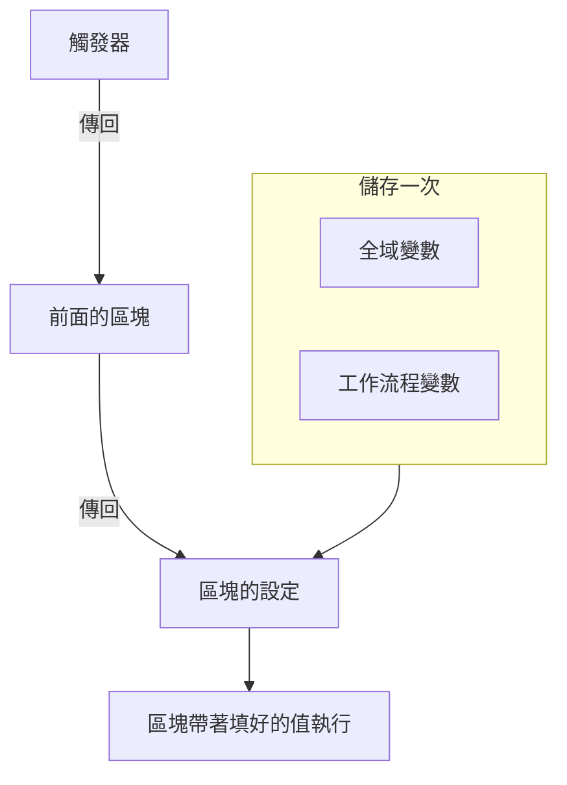
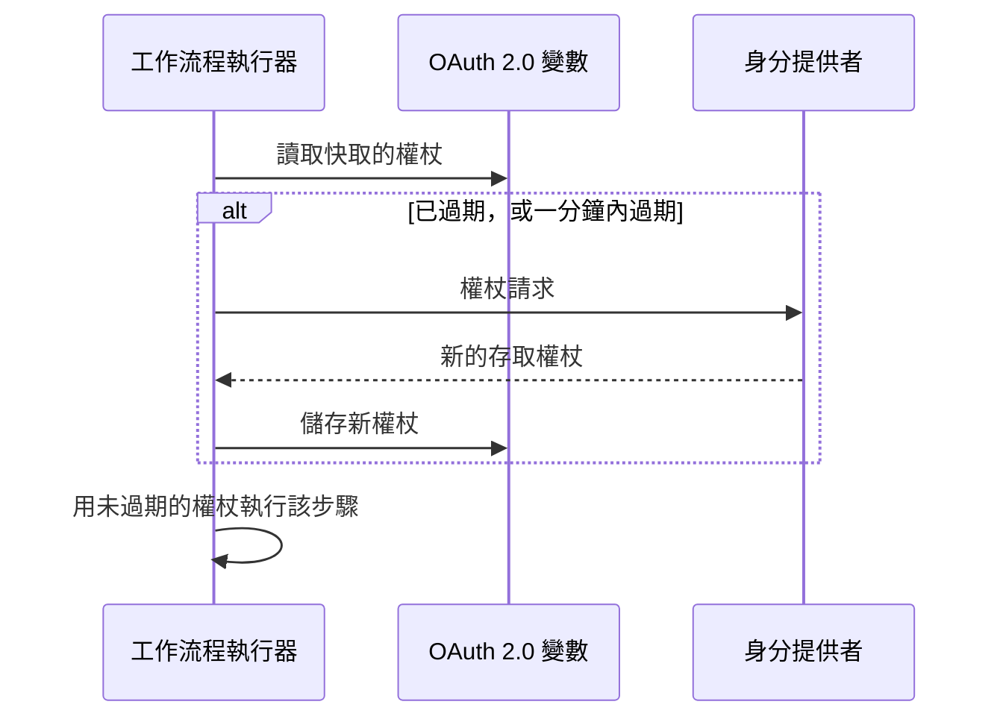

# 工作流程變數

變數是資料在工作流程中流動的方式：從觸發器到第一個區塊，從一個區塊到下一個區塊，以及從你儲存一次的值到每個需要它的區塊。區塊的設定用雙大括號中的參照來讀取值，執行器會在區塊執行前一刻把它填進去。

| 值                             | 來自哪裡                                                             | 區塊如何讀取它                                        |
| ------------------------------ | -------------------------------------------------------------------- | ----------------------------------------------------- |
| **全域變數**                   | 儲存在 **工作流程 → 全域變數** 底下                                  | `{{global.variables.NAME}}`                          |
| **工作流程變數**               | 儲存在某個工作流程的 **工作流程變數** 頁面上                         | `{{local.variables.NAME}}`                           |
| **前面區塊的值**               | 本次執行中觸發器或前面的區塊傳回的內容                               | `{{local.components.BLOCK_ID.returnValues.VALUE_ID}}` |



你很少需要手寫參照。點選設定末端的 **{ }**，或在設定中輸入 `{{`，然後從清單中選擇值。請參閱 [使用前面區塊的值](/docs/workflows/authoring#使用前面區塊的值)。

## 全域變數

整個專案範圍的值，儲存一次就能在每個工作流程中重複使用：API 金鑰、URL、頻道名稱——任何你不想複製到十個不同工作流程中的東西。

:::steps
### 開啟全域變數

前往 **工作流程 → 全域變數**，點選 **建立工作流程 變數**。

### 為變數命名

在 **變數** 步驟中填寫：

- **名稱** —— 你用來參照它的名字。至少兩個字元，不含空格，只能包含字母、數字、連字號和底線。`UPPER_SNAKE_CASE` 是個好習慣，因為它在區塊中很醒目。
- **描述** —— 選填的自由文字，提醒你它是做什麼用的。

點選 **下一步**。

### 給它一個值

在 **值** 步驟中填寫：

- **內容** —— 值本身。這是一個長文字欄位，所以多行的值也可以。
- **密鑰** —— 開啟後，值會從執行日誌和步驟追蹤中移除。

點選 **建立工作流程 變數**。在此之前要變更名稱或描述，請點選表單旁步驟清單（在寬螢幕上顯示）中的 **變數**；你在兩個步驟中輸入的內容都會保留。
:::

在任何工作流程中這樣使用全域變數：

```text
{{global.variables.NAME}}
```

例如，如果你把 PagerDuty 金鑰儲存為 `PAGERDUTY_KEY`，任何區塊都可以用 `{{global.variables.PAGERDUTY_KEY}}` 使用它——編輯器儲存的是參照，工作流程的日誌記錄會移除解析後的密鑰值。

清單會顯示每個變數的名稱和描述。點選某一列的 **檢視** 開啟變數的頁面。它會顯示變數是靜態的還是 OAuth 2.0 的，其他操作都在這裡進行：

| 按鈕                                       | 作用                                                                                                                                             |
| ------------------------------------------ | ------------------------------------------------------------------------------------------------------------------------------------------------ |
| **編輯變數**                               | 變更名稱、描述，以及——對於尚未設為密鑰的靜態變數——密鑰標記。變數一旦設為密鑰，就會一直是密鑰。                                                  |
| **Update Content**                         | 取代靜態值。儲存的內容無法讀回，所以你要完整輸入新值。                                                                                           |
| **Use in Workflows**                       | 顯示要貼到區塊中的確切參照，並附有複製按鈕。                                                                                                     |
| **刪除工作流程 變數**                      | 在請你確認後刪除它。確認訊息會寫明變數名稱，方便你核對刪的是不是正確的那一個。                                                                   |

如果要為 **OAuth 2.0 存取權杖** 建立變數，請開啟 **建立工作流程 變數** 旁邊的 **更多** 選單（**⋯**），選擇 **Create OAuth 2.0 Variable**。OAuth 2.0 變數在下方有 [獨立的一節](#oauth-20-變數會自動重新整理的權杖)。變數儲存後，類型就不能再變更。

你也可以透過 API 更新變數，方法在 [本頁末尾](#從工作流程更新變數) 說明。全域變數和工作流程變數是 Growth 方案的功能。

## 工作流程區域變數

屬於單一工作流程的變數，在該工作流程選單的 **工作流程變數** 中管理。它們的用法與全域變數相同：**建立工作流程 變數** 建立靜態變數，**更多** 選單（**⋯**）建立 OAuth 2.0 變數，**檢視** 開啟變數的頁面。這樣參照它們：

```text
{{local.variables.NAME}}
```

把它用於只有這個工作流程需要的值，例如某個範本的 Slack Webhook URL。會詢問設定的範本會把設定儲存為工作流程變數，讓你之後不必編輯區塊就能變更。

## OAuth 2.0 變數（會自動重新整理的權杖）

貼到靜態變數中的 bearer 權杖只在過期前有效，通常不到一小時。之後，每個使用它的執行都會以 `401 Unauthorized` 失敗，直到有人貼上一個新的。**OAuth 2.0 存取權杖** 變數儲存的是 OAuth 權杖交換所需的資訊，而不是權杖本身，並由 OneUptime 讓權杖保持最新。

用法與其他變數完全一樣：

```http
Authorization: Bearer {{global.variables.CRM_API_TOKEN}}
```

### 權杖如何保持有效



- 工作流程第一次使用變數時，OneUptime 會向你的身分提供者的權杖端點請求存取權杖並儲存。
- 在每個參照該變數的步驟之前，執行器都會檢查權杖。如果已過期，或將在接下來一分鐘內過期，就會在步驟執行前取得新的權杖。無論變數閒置了多久、執行已經進行了多久，元件拿到的永遠是未過期的權杖。
- 只有真正參照了變數的步驟才會觸發重新整理。從不使用某個變數的執行永遠不會取得它的權杖，也不會因為那個提供者停擺而失敗。
- 當許多執行同時需要新權杖時，由其中一個去取得，其餘的直接使用。
- 如果提供者沒有說明權杖何時過期（沒有 `expires_in`，權杖也不是帶有 `exp` 宣告的 JWT），OneUptime 會每次執行取得一次新權杖，並在該次執行的各個步驟之間共用。

### 授權類型

| 授權類型                       | 用於                                                                                                                                                                                                                                                |
| ------------------------------ | --------------------------------------------------------------------------------------------------------------------------------------------------------------------------------------------------------------------------------------------------- |
| **Client Credentials**         | OneUptime 以你的應用程式身分登入。這是伺服器對伺服器 API 的常見選擇，例如 Microsoft Graph、Auth0 或 Okta 的 API，或 Keycloak 後面的內部服務。                                                                                                     |
| **重新整理權杖**               | 代表某位使用者的委派存取。授權應用程式一次（例如在提供者的 OAuth playground 或 Postman 中），然後貼上得到的 refresh token。OneUptime 會用它換取存取權杖，如果你的提供者會輪替 refresh token，則會儲存每一個新的。沒有用戶端密鑰的公用用戶端也可以。 |

### 建立一個

**Create OAuth 2.0 Variable** 每一步詢問一件事：

1. **變數**：工作流程用來參照它的名稱，以及描述。
2. **提供者**：選擇你的 **身分提供者**，OneUptime 會填好它的 **權杖 URL**：

   | 身分提供者 | 填入的權杖 URL |
   |---|---|
   | Microsoft Entra ID | `https://login.microsoftonline.com/{tenant-id}/oauth2/v2.0/token` |
   | Google | `https://oauth2.googleapis.com/token` |
   | Okta | `https://{your-domain}/oauth2/default/v1/token` |
   | Auth0 | `https://{your-domain}/oauth/token` |

   把大括號中的部分替換為你自己的值，例如目錄（租用戶）ID 或 Okta 網域。只要 URL 中還留著它，表單就不會繼續。對於其他任何提供者，請選擇 **其他提供者**，自己填寫它的權杖端點。然後選擇 **授權類型**。選擇 Google 時會選取 **重新整理權杖**，因為 Google 的 OAuth 用戶端無法使用 Client Credentials。提供者只用來填寫表單，不會隨變數儲存。
3. **憑證**：你在提供者處註冊之應用程式的 **用戶端 ID** 和 **用戶端密鑰**，對於 Refresh Token 授權類型則還有 **重新整理權杖**。使用 Refresh Token 授權類型的公用用戶端可以把用戶端密鑰留空。
4. **進階**，全部選填：
   - **範圍**：以空格分隔。留空則取得提供者的預設範圍。對於 Client Credentials，Microsoft Entra ID 需要以 `/.default` 結尾的範圍（例如 `https://graph.microsoft.com/.default`），Okta 則需要一個自訂範圍。
   - **其他參數**：權杖請求的額外表單欄位，例如 Auth0 的 `audience`（Client Credentials 必需）或 Azure AD v1 的 `resource`。能讀取該變數的任何人都能讀取它們，所以不要把密鑰放在這裡。
   - **用戶端驗證**：用戶端 ID 和密鑰要放在 HTTP Basic 標頭中傳送（預設），還是放在請求內文中傳送。如果你的提供者回覆 `invalid_client`，請試試另一種。

在部分欄位下方，表單會針對你選擇的提供者加上一行說明，例如 Microsoft Entra ID 在哪裡顯示你的租用戶 ID，以及它的用戶端密鑰是密鑰的 **Value**，而不是它的 **Secret ID**。

儲存新的 OAuth 2.0 變數時，OneUptime 會立即取得它的第一個權杖，並告訴你提供者的回覆。密鑰或 URL 中的拼寫錯誤會當場暴露，而不是在幾小時後一次失敗的執行中才發現。取得權杖會寫入變數，所以需要編輯工作流程變數的權限；如果你能建立變數但不能編輯，就由第一個使用該變數的工作流程執行來取得它的權杖。

變數的頁面（點選其所在列的 **檢視**）有一張 **OAuth 2.0 Settings** 卡片。**編輯設定** 會依序經過同樣的 **提供者**（權杖 URL）、**憑證**（用戶端 ID）和 **進階**（範圍、其他參數、用戶端驗證）步驟。**下一步** 會往前推進，**儲存變更** 在最後一步。每一步都已經填好，所以表單旁的步驟清單可以開啟其中任何一步：在對應步驟中變更一個設定，然後開啟最後一步並儲存。授權類型儲存後就固定了。

### 存取權杖卡片

OAuth 2.0 變數頁面上的 **存取權杖** 卡片會顯示以下狀態之一：

| 狀態                       | 意義                                                                                                                                 |
| -------------------------- | ------------------------------------------------------------------------------------------------------------------------------------ |
| **Valid**                  | 快取的權杖尚未過期。                                                                                                                 |
| **已過期**                 | 對於最近沒有工作流程使用的變數來說是正常的。下一個使用它的執行會取得新權杖。                                                         |
| **尚未擷取**               | 自變數建立或其設定變更以來，還沒有取得過權杖。                                                                                       |
| **No expiry reported**     | 提供者沒有說明權杖何時過期，所以每次執行都會取得一個新權杖。                                                                         |
| **Refresh failed**         | 上一次取得權杖的嘗試失敗了。提供者給出的原因會完整顯示，並附上發生時間。下一次成功的重新整理會清除它。                               |

狀態下方的 **立即重新整理** 會立刻取得一個新權杖。用它來檢查新設定，而不必執行工作流程。**OAuth 2.0 Settings** 卡片上的 **Update Credentials** 會取代用戶端密鑰或 refresh token，然後用它們取得權杖。變更某個設定（權杖 URL、用戶端 ID、範圍等）會捨棄快取的權杖，讓下一次執行用新設定取得權杖。

### 當提供者拒絕時

需要權杖的步驟會在執行前失敗，執行的日誌會寫明變數並引述提供者的回覆，例如 `Could not get an OAuth 2.0 access token for {{global.variables.CRM_API_TOKEN}}: The token endpoint refused the request (HTTP 400): invalid_grant - Token has been expired or revoked.` 同樣的原因也會顯示在變數的 **存取權杖** 卡片上。Refresh Token 變數上出現 `invalid_grant`，幾乎總是表示 refresh token 本身已過期或被撤銷，解決辦法是 **Update Credentials**。

如果重新整理失敗時快取的權杖其實還沒過期（只是處在一分鐘的緩衝之內），步驟會繼續使用快取的權杖，日誌會說明這一點。

### 安全

- OAuth 2.0 變數一律是密鑰。存取權杖在執行日誌和步驟追蹤中會被替換為 `[REDACTED]`，包括在執行途中被替換的權杖。
- 用戶端密鑰、refresh token 和存取權杖在資料庫中加密，永遠無法透過 API 或儀表板讀回。**立即重新整理** 會告訴你新權杖何時過期，但從不顯示權杖本身。
- 權杖 URL 必須是 `http` 或 `https`。傳往回送位址、link-local 位址和雲端中繼資料位址的請求會被拒絕。在 OneUptime Cloud 上，私人網路位址也會被拒絕。自行託管的安裝可以連線到它們自己網路中的身分提供者。OneUptime 在權杖請求中不會追蹤重新導向，所以請把權杖 URL 指向端點實際回應的位址。權杖請求在 20 秒後放棄。

### 把現有的靜態權杖切換為 OAuth 2.0

變數的類型儲存後就固定了。刪除靜態變數，然後用 **相同的名稱** 建立一個 OAuth 2.0 變數。工作流程依名稱參照變數，所以不需要任何變更就會用上新的變數。

## 元件輸出（來自前面區塊的資料）

每個觸發器和元件都可以在執行期間產生輸出。用設定中的 **{ }** 按鈕，或在設定中輸入 `{{` 來插入參照，而不是手寫——這樣插入的是執行器預期的確切 ID，而且值會顯示為一個寫明區塊和值的標籤。

你也可以從產生值的區塊開始：它的設定會在 **Returns** 底下列出每個輸出，附上確切的參照和一個複製按鈕。

這樣參照前面區塊的輸出：

```text
{{local.components.COMPONENT_ID.returnValues.FIELD_ID}}
```

`COMPONENT_ID` 是區塊的 **Identifier**——顯示在區塊上的短 ID，而不是區塊上寫的名稱。新區塊會得到像 `api-get-1` 這樣的 ID，你可以在區塊的 **ID** 區段重新命名它。重新命名它會讓已經指向它的所有參照失效，就像重新命名變數一樣。`FIELD_ID` 是值的 ID，其後的路徑會讀取 JSON 值中的欄位。

| 在這樣的區塊之後……                                        | 讀取                                                                                   |
| --------------------------------------------------------- | -------------------------------------------------------------------------------------- |
| ID 為 `lookup-user` 的 **API** 區塊                       | 它的狀態碼：`{{local.components.lookup-user.returnValues.response-status}}`。它的內文：`{{local.components.lookup-user.returnValues.response-body}}`。 |
| ID 為 `transform` 的 **Run Custom JavaScript** 區塊       | 它傳回的內容：`{{local.components.transform.returnValues.returnValue}}`。              |
| ID 為 `incident-on-create-1` 的 **On Create Incident** 觸發器 | 事件的標題：`{{local.components.incident-on-create-1.returnValues.model.title}}`。記錄觸發器會傳回一個值 `model`，你深入其中讀取。 |

區塊的值只在目前這次執行期間存在。每次新的執行都從頭開始。

## 變數在哪裡有效

幾乎每個文字欄位都接受變數：

- API 區塊上的 URL。
- Slack、Teams、Discord、Telegram、IRC、Email 上的訊息文字。
- 電子郵件的主旨和內文。
- 標頭和內文欄位（在字串值內）。
- **If / Else** 區塊的兩側。

在 JSON 欄位中——記錄元件上的 **Data (JSON Object)**、**Query** 和 **Select Fields**，API 區塊的 **Request Body**，**Run Custom JavaScript** 上的 **Arguments**——參照會依它所在的位置被填入：

- **在引號內，它是文字。** `{"title": "Down: {{local.components.ci-webhook.returnValues.request-body.service}}"}` 會把值放進字串裡。值中的引號、反斜線和換行會被跳脫，所以 JSON 仍然有效，值仍是一個字串。
- **單獨出現時，它就是值本身。** `{"customFields": {{local.components.transform.returnValues.returnValue}}}` 會插入整個物件，清單仍是清單，數字仍是數字。本身就是 JSON 的文字——`5`、`true`，或區塊以 JSON 文字傳回的物件——會作為那個值插入。其他任何文字都會作為字串插入。

位於鍵之引號內的參照也是文字。如果需要動態建構結構，就用 **Run Custom JavaScript** 區塊建構，再把它的輸出傳給下一個區塊。

**Run Custom JavaScript** 區塊不會自動取得變數——沙箱中什麼都不會被注入。把 `{{global.variables.NAME}}`（或任何元件參照）放進區塊的 JSON 欄位 **Arguments**；這些值會在指令碼執行前填好，並以 `args` 形式到達。

## 走訪陣列

在文字欄位中，可以用 `{{#each path}}…{{/each}}` 為清單中的每一項重複一段文字。在區塊內部，`{{property}}` 會從目前這一項讀取，`{{@index}}` 是它從 0 開始的位置，`{{this}}` 在簡單值的清單中是該項本身。`{{#each}}` 區塊內的名稱會去除前後空白，所以多餘的空格在那裡沒有影響——與其他所有地方不同。

例如，這段 **Message Text** 會列出 Webhook 傳送的每則警示：

```text title="Message Text"
{{#each local.components.ci-webhook.returnValues.request-body.alerts}}
- {{@index}}: {{name}} is {{status}}
{{/each}}
```

## 範例

### 從 Webhook 建構酬載

一個 Webhook 帶著類似 `{ "service": "checkout", "status": "failed" }` 的內文到達。要把它變成一個 OneUptime 事件：

1. 一個 ID 為 `ci-webhook` 的 **Webhook** 觸發器。
2. 一個 **If / Else** 區塊：**Value to check** 是 Webhook 的 Request Body 中的 `status` 欄位（`{{local.components.ci-webhook.returnValues.request-body.status}}`），**Comparison** 是 **is equal to**，**Compare with** 是 `failed`。
3. 從 **Yes** 分支接一個 **Create One Incident** 區塊，其中：
   - 標題：`CI build failed: {{local.components.ci-webhook.returnValues.request-body.service}}`
   - 描述：`See {{local.components.ci-webhook.returnValues.request-body.url}} for the logs.`

### 在 API 呼叫中使用密鑰

一個呼叫 PagerDuty 的工作流程：

1. 把 `PAGERDUTY_KEY` 儲存為機密全域變數。
2. 在 **API** 區塊上，把 `Authorization` 標頭設為 `Token token={{global.variables.PAGERDUTY_KEY}}`。

這個金鑰不會出現在工作流程和日誌中。

### 串接兩個 API 呼叫

第一個呼叫給你第二個呼叫需要的 ID：

1. **API** 元件 `lookup-order`：在它的 **URL** 中，於 `/orders?email=` 之後，用 **{ }** 插入手動觸發器的 JSON，路徑為 `email`。
2. **API** 元件 `cancel-order`：`POST /orders/{{local.components.lookup-order.returnValues.response-body.id}}/cancel`。

如果 `lookup-order` 失敗，觸發的是它的 **Error** 輸出而不是 **Success**。把它連接到一個 Email 或 Slack 區塊，免得失敗沒有人注意到。

## 從工作流程更新變數

一個常見的模式是依排程輪替憑證：從第三方取得一個新權杖，再把它存回變數，供下一次執行使用。用一個呼叫 OneUptime API 的 **API** 區塊來做。

如果憑證是 OAuth 2.0 存取權杖，你就不需要自己建構這些。[OAuth 2.0 變數](#oauth-20-變數會自動重新整理的權杖) 會自行取得並重新整理權杖。

傳送 `PUT /api/workflow-variable/<variable-id>`，附上 `ApiKey` 標頭，並且——這正是大家容易出錯的地方——把你要變更的欄位 **包在一個 `data` 物件裡**：

```json title="Request Body"
{
  "data": {
    "content": "{{local.components.get-token.returnValues.response-body.access_token}}"
  }
}
```

沒有 `data` 包裝的扁平內文會以 400 被拒絕。只傳送你真正要變更的欄位；`name` 和 `description` 可以不放進酬載。

API 金鑰需要 **Edit Workflow Variables**。不需要讀取權限——更新不會把那一列讀回來。

需要注意兩件事：

- **不要重新命名你正在參照的變數。** `name` 是 `{{local.variables.NAME}}` 的一部分。變更它會讓所有現有參照無法解析，而無法解析的參照會以字面文字往下傳——請參閱 [陷阱](#陷阱)。
- **變數可以這樣寫入，但永遠無法讀回。** 透過 API，所有變數的 `content` 都是唯寫的，無論是否為密鑰。正是這一點讓變數成為存放輪替權杖的安全位置。把它標記為密鑰，還會讓它的值不出現在執行日誌和步驟追蹤中。

## 陷阱

- **使用 { }（或輸入 `{{`）。** 它會插入執行器預期的確切元件、傳回值和變數 ID，並且只提供區塊執行時會存在的值。
- **變數名稱區分大小寫。** `{{global.variables.MyKey}}` 和 `{{global.variables.mykey}}` 是不同的。
- **無法解析的參照會原樣保留，而不是變成空的。** 參照不存在的東西不是錯誤，也不會得到空字串：大括號會原樣往下傳，所以步驟 ID 拼錯的 `{{local.components.api-get-1.returnValues.body}}` 會一字不差地出現在你的 Slack 訊息、URL 或請求內文中，而執行仍然回報 **Executed**。執行的 **步驟** 分頁會在該步驟上顯示一則警告，列出每個漏過去的參照，並把它所在的設定標記為 **Did not resolve**；執行的日誌中也有同樣的警告行。
- **問題面板無法檢查變數名稱。** 它會在你儲存前標出它無法比對的元件參照——未知的步驟 ID、未知的傳回值、無效的根——但看不出變數是否存在。區塊的設定可以：對缺少之變數的參照會在那裡顯示為橘色標籤。除此之外，改了名稱的變數只有執行的日誌才能發現。
- **大括號內的空格不會被去除。** `{{ local.variables.NAME }}` 與 `{{local.variables.NAME}}` 是不同的查詢，永遠不會被解析。唯一的例外是在 `{{#each}}` 區塊內，那裡的名稱會去除前後空白。

## 後續步驟

:::cards
- [元件](/docs/workflows/components): 每個區塊需要什麼、傳回什麼。
- [執行記錄](/docs/workflows/runs-and-logs): 查看一次執行中每個參照變成了什麼值。
- [設定與安全](/docs/workflows/configuration#密鑰): 把密鑰放在區塊、匯出檔和日誌之外。
:::
