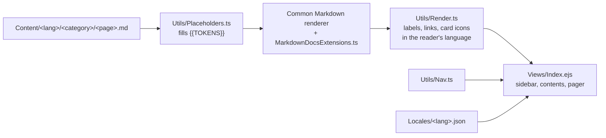
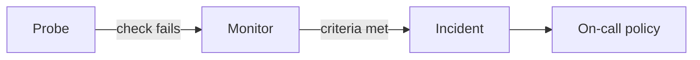

# Writing OneUptime docs

The docs at `/docs` are served by this feature set: Markdown pages in
`Content/<language>/<category>/<page>.md`, rendered on the server with the
components described below, inside the views in `Views/`.



## Adding a page

1. Write `Content/en/<category>/<page>.md`. The first line is the title
   (`# Title`); it is shown in the page header, so the body starts at the
   second line.
2. List it in `Utils/Nav.ts`, in the group (and so the section) a reader would
   look for it in. The page is served at `/docs/<lang>/<category>/<page>`; a
   page that is not in the nav is a 404.
3. Add the link's title to `navLinks` in every file in `Locales/` — English in
   `en.json`, translated in the others. `npm run i18n:validate` checks that
   every locale has every key.
4. Translate the page into every language in `Content/` (see
   [Translating](#translating)).
5. Run the docs tests (see [Checking your work](#checking-your-work)).

URLs never change. The dashboard, the website and search engines link to
them; when a page has to move, keep its file where it is and move its nav
entry, or add a permanent redirect in `Index.ts`. Headings are part of the
address too: other pages and the product link to `#anchors`, which are made
from the heading text. Before renaming a heading, search for its anchor
(`grep -rn "<category>/<page>#" packages`); `DocsLinksResolve` fails on an
English page or a literal product link that names a heading no longer there.

## What a page looks like

Every page answers, in this order: what is this, why would I use it, how do I
set it up, how does it behave, and what next. Not every page needs every
part, but the order holds.

```markdown
# Website Monitor

One or two sentences: what it is and what it is for.

:::cards
- [Create the monitor](#create-a-website-monitor): Five steps in the dashboard.
- [Criteria](#monitoring-criteria): Decide when the site counts as down.
:::

## How it works

A diagram when there is a flow, a lifecycle or more than two moving parts.

## Before you begin

What the reader needs first: a role, an API key, an agent, a plan.

## Create a website monitor

:::steps
### Open Monitors
...
### Pick Website
...
:::

## Reference

Tables of fields, defaults and limits.

## Troubleshooting

:::details The monitor says offline but the site is up
...
:::

## Next steps

:::cards
- [Incidents](/docs/incidents/index): What happens when it goes down.
:::
```

## Components

The components are Markdown, so a page still reads well as plain text — the
`/docs/as-markdown/...` endpoints and `llms-full.txt` serve the source as it
is written. They are implemented in
`Common/Server/Types/MarkdownDocsExtensions.ts`; the docs-only post-processing
(translated labels, card icons, links in the reader's language) is in
`Utils/Render.ts`.

A container opens with `:::name` and closes with a `:::` line. Containers
nest, and a `:::` line inside a fenced code block does not close anything. A
container that is never closed, or has a name not listed here, stays plain
text — and fails the content tests.

### Steps

A numbered procedure. Every heading inside starts a step; the heading keeps
its anchor and is listed under "On this page".

```markdown
:::steps
### Install the agent
Run the installer on the host.

### Check it reports
Open **Infrastructure → Hosts**.
:::
```

Without headings, a plain numbered list inside `:::steps` is drawn the same
way.

### Tabs

Alternatives the reader picks one of: an install method, a language, an
operating system. The choice is applied to every tab set on the page with the
same label and remembered for the next page, so use the same label for the
same thing everywhere (`Docker Compose`, `Kubernetes`, `Node.js`, `Python`,
`Linux`, `macOS`, `Windows`).

````markdown
:::tabs
@tab Docker Compose
```bash
docker compose up -d
```
@tab Kubernetes
```bash
helm install oneuptime oneuptime/oneuptime
```
:::
````

Do not put headings inside tabs: only one panel is visible, but every heading
would be listed under "On this page".

### Cards

A grid of links: section overviews and "Next steps". Each list item is a
card; its first link is the card's title and target, and the text after it
(after an optional `:` or `—`) is the description. The icon is the icon of
the sidebar group the link points into.

```markdown
:::cards
- [Status Pages](/docs/status-pages/index): Tell customers what is happening.
- [On-Call Schedules](/docs/on-call/schedules): Decide who is paged.
:::
```

### Callouts

Use GitHub's alert syntax. The marker is the same in every language, and the
label is shown in the reader's language.

```markdown
> [!NOTE]
> Useful context the reader might otherwise miss.

> [!TIP]
> A better way to do something.

> [!IMPORTANT]
> Something the reader must do for this to work.

> [!WARNING]
> Something that can go wrong, and how to avoid it.

> [!CAUTION]
> Something destructive or irreversible.
```

A callout with a title of its own is a container:

```markdown
:::warning Back up first
Upgrading migrates the database in place.
:::
```

### Collapsible sections

For troubleshooting entries, FAQs and long reference material most readers do
not need.

```markdown
:::details Why is the monitor offline when the site is up?
The probe could not resolve the host...
:::
```

### Diagrams

Fenced `mermaid` blocks are drawn with [Mermaid](https://mermaid.js.org) in
the reader's theme. Draw one when the page describes a flow, a lifecycle, an
architecture or more than two moving parts — not as decoration. A title
becomes the caption.

````markdown

````

- The article column is narrow (about 46rem). Lay out anything longer than
  a chain of four or five nodes top to bottom (`flowchart TB`), grouping
  side-by-side parts in a `subgraph` with `direction LR`; a wide `LR` chart
  scrolls sideways.
- Quote labels that contain punctuation: `A["Probe (US East)"]`.
- Use `flowchart` for flows and architecture, `sequenceDiagram` for requests
  between systems, `stateDiagram-v2` for lifecycles.
- Keep node ids in English and translate only the labels.
- Every diagram in every language is parsed by the tests; one that does not
  parse fails them.

### Code

Always declare the language — it picks the highlighting and the label, and a
fence without one is shown as plain text. A title names the file:

````markdown
```yaml title="values.yaml"
oneuptime:
  host: status.example.com
```
````

## Style

- **Lead with the task.** The first paragraph says what the page helps the
  reader do. Then a diagram or the steps, then the reference.
- **Write steps as steps.** One action per step, in the order the reader
  does them, each naming the screen and the button exactly as the dashboard
  shows them, in bold: **Monitors → Create Monitor**.
- **Short paragraphs.** Two to four sentences. Break long explanations with
  headings, lists, tables or a diagram.
- **Tables for reference.** Fields, defaults, limits and permissions go in a
  table, not a paragraph.
- **Say what happens.** After an action, tell the reader what they should see,
  so they know it worked.
- **Link, do not repeat.** Explain a concept once, on its own page, and link
  to it.
- **End with next steps.** A `:::cards` block of two to four pages a reader
  goes to from here.
- **Be exact.** Every claim about the product — a default, a limit, a menu
  name, a permission — is checked against the code. Many pages have tests
  that read the product's own sources (`Tests/FeatureSet/Docs/`) and fail when
  the page and the product disagree.

## Translating

Every page exists in every language in `Content/` (`da`, `de`, `es`, `fa`,
`fr`, `hi`, `it`, `ja`, `ko`, `nl`, `no`, `pt`, `ru`, `sv`, `zh-CN`, `zh-TW`). A
page with no translation is served in English.

- Translate the prose, headings, table text, tab labels, card descriptions,
  callout bodies and Mermaid labels.
- Keep as written: code, commands, file names, URLs, environment variables,
  API fields, `{{PLACEHOLDERS}}`, the callout markers (`[!NOTE]`), component
  names (`:::steps`, `@tab`) and Mermaid node ids and keywords.
- Name dashboard screens and buttons exactly as the dashboard shows them in
  that language — the strings are in
  `../Dashboard/src/Locales/<language>.json`. Several tests check this.
- In-page links (`#anchor`) point at the translated heading: anchors are made
  from the heading text, so a translated heading has a translated anchor.
  Copy the English links as they are, then let
  `npm run docs:localize-anchors -- --apply --lang <code> --page <category/page>`
  point them at the translated headings. It pairs each English heading with
  the one in the same place in the translation, so it only maps a page whose
  translation keeps the English page's shape (the same headings at the same
  levels, with the same code samples under them); a link into a page whose
  translation is out of date is reported and left alone until that page is
  translated again. Without `--apply` it only reports.
- Links to other pages stay `/docs/<category>/<page>`; the reader is kept in
  their language automatically.
- Persian (`fa`) is written right to left; code and diagrams stay left to
  right on their own.

## Checking your work

```bash
# Every docs test: content, translations, diagrams, rendering and the views.
cd packages/App && npx jest Tests/FeatureSet/Docs

# In-page anchors in every language.
npm run docs:check-anchors

# Anchors in translations that still name English headings (add -- --apply).
npm run docs:localize-anchors

# Every locale file has every key.
npm run i18n:validate
```

### The content rules

`DocsContentIntegrity` and `DocsTranslations` hold every page, in every
language, to the rules in `Tests/FeatureSet/Docs/DocsContentRules.ts`:

- the nav and the files agree, and each page has one title, on its first
  line;
- components are written so the renderer draws them, and nothing is left on
  the page as raw `:::`, `@tab` or `[!NOTE]`;
- links land on a page in the nav and on a heading it has (never the title on
  line 1, which has no anchor), images and files under `/docs/static/` exist,
  no link is relative, and no two headings of a page share an anchor;
- code samples are closed, and in English they name their language; English
  headings never skip a level, and Getting Started links into every nav group;
- every English page is translated, and each translation keeps its English
  page's shape: the same heading levels, code languages, components (with
  their tabs and steps), callouts, `{{PLACEHOLDERS}}`, linked pages and
  images.

So a change to an English page's shape (a section, a code sample, a
component, a link to another page) is made in its translations in the same
change.

The pages that broke a rule when these tests were added are listed, with the
languages they broke it in, in `Tests/FeatureSet/Docs/DocsKnownFailures.ts`.
That list only shrinks:

- When you rewrite or translate a page, delete its block. The suites fail on
  every entry that passes now, and say what to delete:
  `monitor/website-monitor passes "sameShape" in de now: delete "de" ...`.
- Never add an entry. A page that breaks a rule it kept fails the suites with
  its line and what is wrong: fix the page.

### Translation suites

Each group of pages has a suite that holds its translations to the English
pages, such as `Tests/FeatureSet/Docs/TelemetryDocsTranslations.test.ts`. A
new suite imports its checks from
`Tests/FeatureSet/Docs/DocsTranslationChecks.ts` (`strayMarkers`, `prose`,
`boldSpans`, `tableShape` and the rest) instead of copying them, and reads a
rendered page's text with `stripHtmlTags` from
`Tests/FeatureSet/Docs/DocsHtmlText.ts`, never with a tag-stripping regular
expression of its own: one pass of `/<[^>]*>/g` is what code scanning
reports as incomplete sanitization. `DocsTagStripGuard` fails on a copy.
